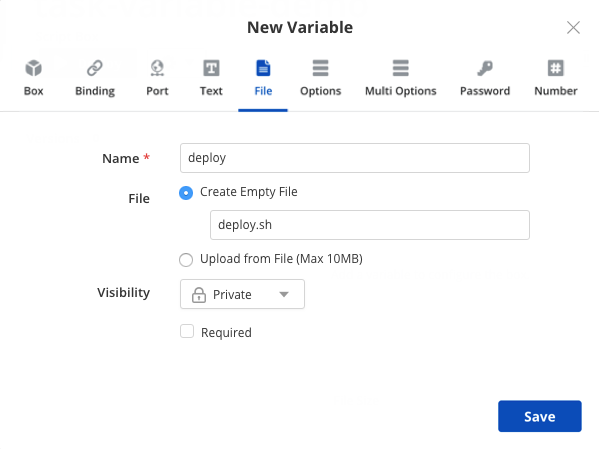
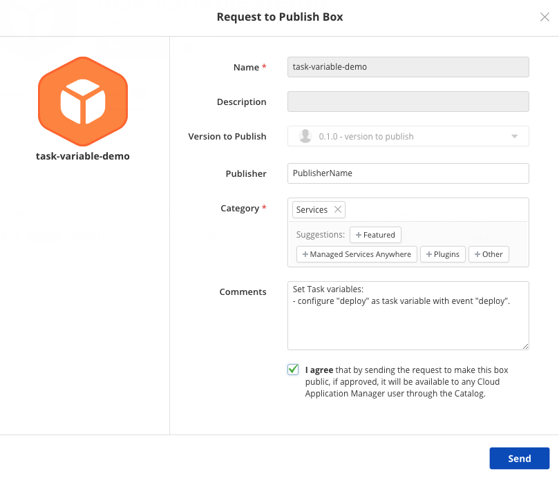
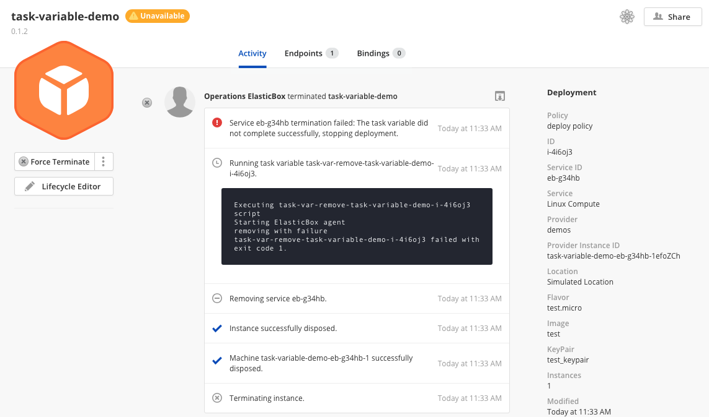

{{{ "title": "Running Code outside an Instance with Task Variables",
"date": "26-04-2018",
"author": "",
"attachments": [],
"contentIsHTML": false
}}}

The event scripts are run, by definition, on the instance they belong to. You may have a need, though, to run some code outside the instance's operating system, either because the code must run before the instance has been provisioned or because it has already been terminated. In these cases you may use **task variables**.

This features is available for boxes that have been [published in the catalog](../Tutorials/publish-script-box.md). 

### Basics

Task variables define code and an associated event. When a box with a task variable is deployed, CAM will run this code within the instance's lifecyle, at a moment indicated by the task variable's event:

* `deploy`: as the first step after you click *Deploy*, before any provisioning is run on the provider; it runs once per instance.
* `post_deploy`: as soon as a machine is powers up and appears in CAM; this may ocurr during deployment, when the instance powers up after a shutdown event (initiated from CAM or from the cloud provider console), or when an instance appears during an autoscaling up event.
* `teardown`: whenever a machine shuts down; this may ocurr during a shutdown event, when an instace terminates during an autoscale down event, or during a terminate event.
* `remove`: as the last step once the instance has been terminated on the provider; it runs once per instance.

Both `deploy` and `remove` are associated with the instance lifetime *end to end*, whereas `post_deploy` and `teardown` are associated with the lifetime of each machine. This is specially useful for instances with multiple machines (as defined in a deployment policy box) or for instances with autoscaling where machines may appear and dissapear automatically.

Although not run within the instance itself, task variables behave similarly to event scripts:

* Jinja templating [syntax](syntax-for-variables.md) is available, so you may access variables from within the script.
* `elasticbox set` and `elasticbox config` [commands](cloud-application-manager-commands.md) are available.
* When using box composition, task variables of child boxes are run first during `deploy` and `post_deploy` events, whereas they are run last during `teardown` and `remove` events.
* A failure during a task variable execution will result in an unavailable state. A failure may be triggered from within the script with an exit code different from 0 or may occur if the script took too long to complete and was forcibly stopped.
* Scripts should be idempotent, same as event scripts, in case they run multiple times due to an instance error.
* Output from the script will appear in the instance activity log.
* There may be only one task variable of each event per box (so up to four task variables per box, one per event). You can add multiple File variables, but at most one per event will be converted to Task variable during the verification process (more on this below).


### Languages

The environment supports bash, python and nodejs script. By default, however, all scripts should start as shell scripts. You may then embed code in other languages and execute it from within the shell script.

### Availability and visibility

Task variables are only available for public, versioned, verified boxes. Because of this verification process, there is no Task Variable option in the code section of a box: you should create a File variable and then send a publish request. This request must mention which File variables should be converted into Task variables and under which task event they will run. The variables will be marked as *private* and will not appear in the lifecycle editor. 

### Example

This example will guide you through the steps of creating a box, adding a script, publishing it with the script as a task variable and running it.

* First, create a [script box](../Core Concepts/boxes.md) as you would normally do.
* Go to the **Code** tab, click on New, then click on the **File** tab.
* Enter a descriptive name for the variable and click on *Create Empty File**. You may enter a file name with the `sh` extension, although it's not strictly necessary.

* The variable will appear on the list. Click on the file name and an editor will appear.

* Enter the code you want to run. It should start with the `#!/bin/bash` sentence. After that, you may use bash, nodejs or python. You may embed code as *HEREDOCs* and then run them. Other box variables are accessible via Jinja [syntax](syntax-for-variables.md). For example, the code below prints the value of *variable1*. Once ready, save the code.


**The code used in the example is listed here for reference.**
```
#!/bin/bash

echo "printing from bash"

pythonfile=/tmp/pythontest.py
nodefile=/tmp/nodetest.js

cat <<PYTHON> $pythonfile
#!/usr/bin/python
print("printing from python")

PYTHON

chmod +x $pythonfile
$pythonfile

cat <<NODE> $nodefile
console.log('printing from node the value of variable1: \{{ variable1 }}')

NODE

node $nodefile

elasticbox set variable1 value_set_from_task

```

* Move to the **Versions** tab, then click on the **New** button. Add a description and click on Save.

* The version you just added will appear in the list. Click the gear button on the right end of the row, then click on **Publish Box**.

* Enter the details of the box as you want them to appear on the catalog. Specify the File variables you want to convert into Task variables.

* Your box will undergo a verification process and, if approved, will eventually be published and appear in the catalog. You wil be notified of the results of the review. When you access the box, a green checkmark will appear close to the version you published.

* After that, the script box can be deployed from the catalog with a deployment policy as you would normally do. The task variables are not visible during deployment and cannot be altered. Please note that only the versioned, published box will run the scripts as task variables. If you try to run the box draft, it will be deployed normally, but the code in the file variables will not be executed.

* Once you click Deploy, the instance will be created and you will be transferred to the Instance Activity page. Each deploy task variable will appear on its own activity step where the output from the script will be printed. Once all task variables have completed successfully, a new VM will be provisioned in the provider and all event scripts will run as usual.

* If the script sets a variable value during the task variable execution, those values will be accessible by the event scripts. Note that the task variables are not accessible in the [Lifecycle Editor](../Core Concepts/lifecycle-editor.md).

* When you terminate the instance, task variables for the *remove* event will be run *after* the instance has been stopped and deleted from the provider.

### Script failures

The exit code of the task variables affects the state of the instance as the event scripts do: any value different from 0 will put the instance in *unavailable* state:

- If this occurs during the `deploy` operation, no VM will be provisioned and the **Retry Deploy** action will be available.
- An error that occurs in the `post_deploy` operation will leave the instance as *unavailable*. If this ocurred during the initial deployment, the **Retry Deploy** action will be available. If it ocurred during an autoscaling operation or power on, you will need to reconfigure or reinstall.
- If this occurs during the `teardown` operation, the VM will be in unavailable state and you will need to **Reconfigure** or **Force Terminate**.
- If this occurs during the `terminate` operation, the VM will be deleted, but the instance will appear as *unavailable*. At that point you may either **Force Terminate** the instance, triggering the task variables, or **Delete** it, removing the instance from the workspace without running the task variables again. 



Task variables may also fail if the script does not terminate in a timely fashion: the current runtime limit is 30 seconds. If that occurs, the script will be forcibly killed and the message *Task variable took too long, terminating...* will appear in the log.


