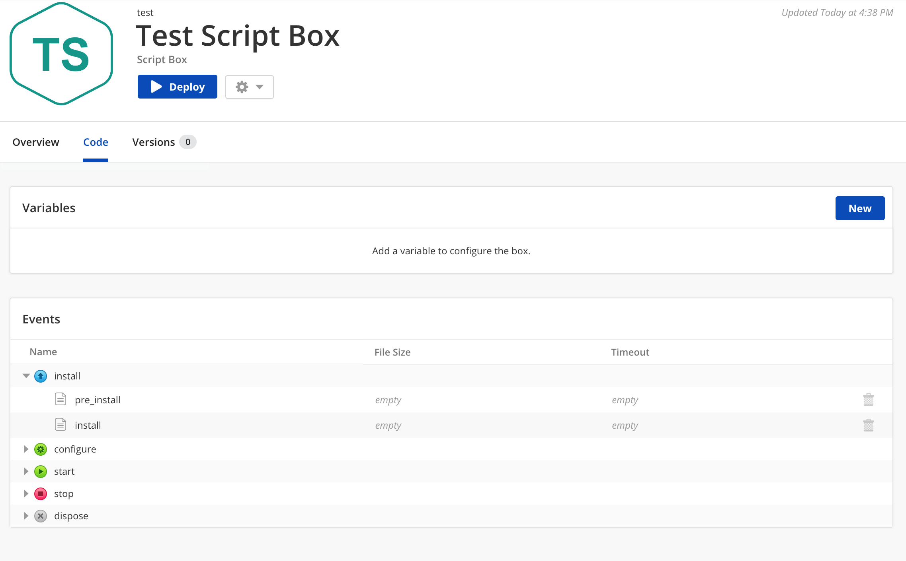
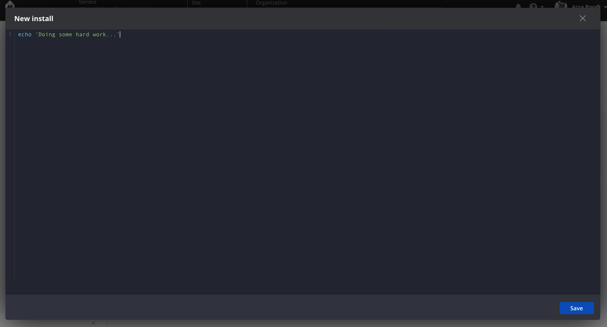
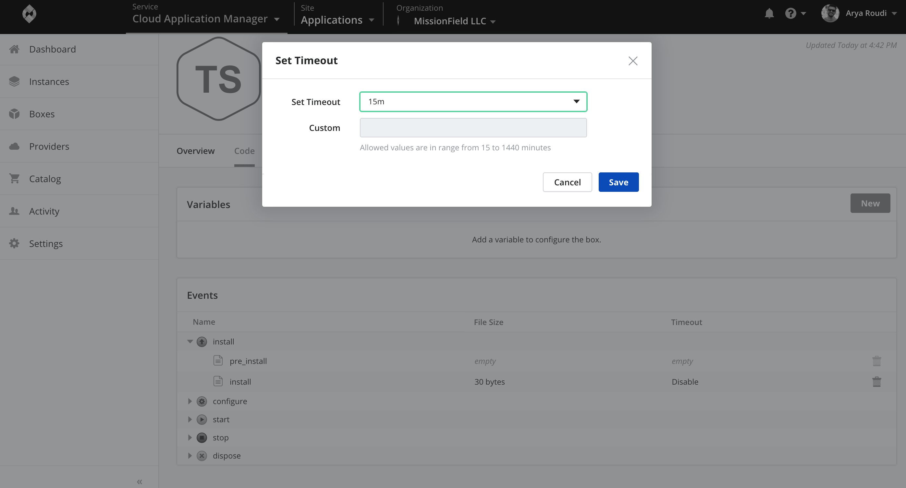
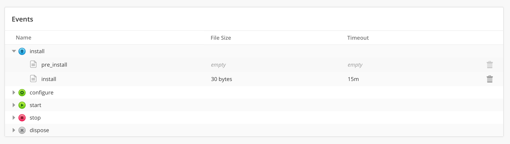
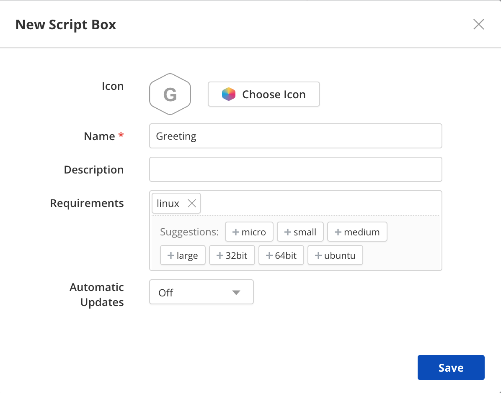
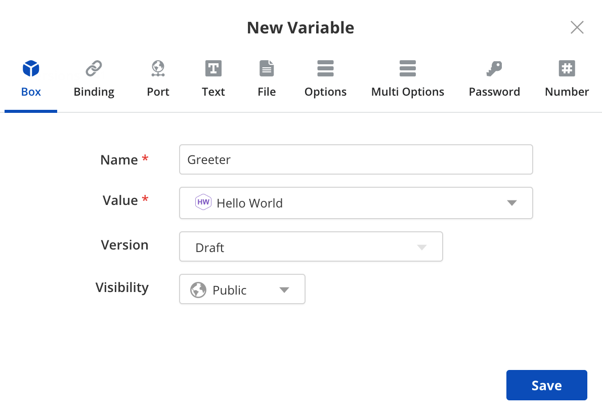
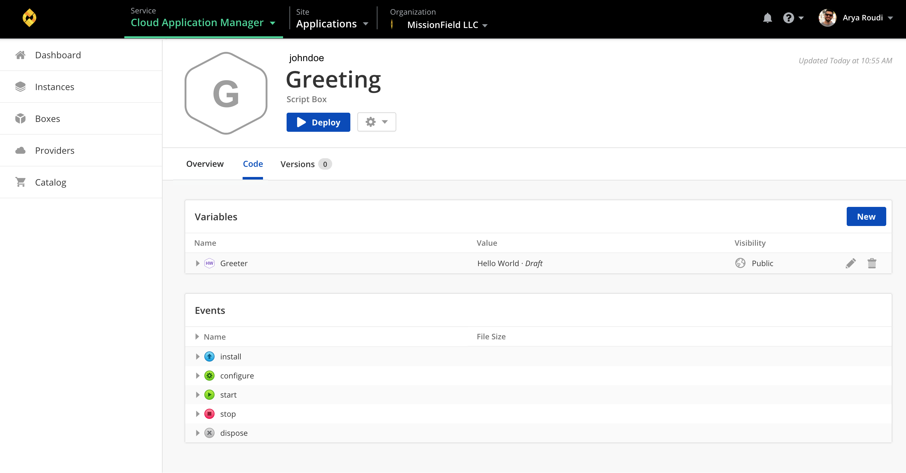
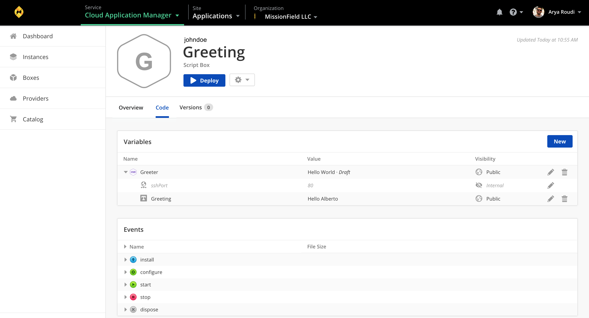

{{{
"title": "Script Boxes",
"date": "07-02-2019",
"author": "Julio Castanar and Oscar Hafner",
"keywords": ["cam","alm","boxes", "box", "script box", "child box", "overrriden variable"],
"attachments": [],
"sticky": true,
"contentIsHTML": false
}}}

**In this article:**

* [Overview](#overview)
* [Audience](#audience)
* [Prerequisites](#prerequisites)
* [Creating Your First Script Box](#creating-your-first-script-box)
* [Attach script-events to Script Box](#attach-script-events-to-script-box)
* [Adding Child Script Boxes](#adding-child-script-boxes)
* [Contacting Cloud Application Manager Support](#contacting-cloud-application-manager-support)

### Overview

This article is meant to assist Cloud Application Manager customers who want to [create and manage boxes](../Core Concepts/boxes.md).

It explains how to use the Script box. The Script box is the type you most commonly use to define deployments. It accepts commands in Bash, PowerShell, Salt, Ansible, Chef, or Puppet. Cloud Application Manager provides Chef and Puppet public boxes to install and run recipes or manifests locally.

### Audience

Cloud Application Manager Users using Application Lifecycle Management (ALM) features.

### Prerequisites

* Access to [Applications site](https://cam.ctl.io/#/boxes) (Application Lifecycle Management module) of Cloud Application Manager as an authorized user.

* A provider already configured in Cloud Application Manager. See [administering providers](../Administering Your Organization/admin-overview.md#Providers).

### Creating Your First Script Box

On the Boxes page, click **New** > **Script**. Enter a name, optionally a description and other [metadata](../Core Concepts/boxes.md#box-metadata).

Save to continue. Configure the deployment using [events](start-stop-and-upgrade-boxes.md) and [variables](parameterizing-boxes-with-variables.md).

When ready to test the configuration, click **Deploy**. Under the Deployment Box, search or select a deployment policy. Policies whose claims match the script box requirements will appear here.

Can not find the one you need? Then click on **Create a new deployment policy box**.

The easiest way to understand script boxes is to build one. Follow this tutorial to build a simple box that says [Hello World](../Getting Started/getting-started-with-hello-world.md).

### Attach script-events to Script Box

Script boxes allow you to include scripts attached to the different lifecycle events (install, configure, start, stop, dispose). These scripts can be edited using UI editor. You can use any scripting language you prefer, as long as it is supported by the underlying instance you deploy the box to.

you have finished editing and have saved your script, you can specify a custom timeout value in minutes for the script execution. Once you reach this value, it will trigger the abort action of the script execution. You can specify a timeout value for any script to add to the box.

Once defined, the timeout values will be propagated to all instances deployed through this box. Values in the instance can be later modified through the Lifecycle editor without affecting the box used to deploy it.

### Adding Child Script Boxes

Let’s build on top of the [Hello World](../Getting Started/getting-started-with-hello-world.md) box as an example. To set up full-scale application deployments, you need to stitch components or micro components together. You do that by stacking child boxes within a parent. In this example, we’ll stack the Hello World box within another box.

Create a new Script box and call it Greeting. Tag that it needs Linux. To learn more, see requirements and auto updates under [Box Basics](../Core Concepts/boxes.md).

Now, in the code section, add a new variable of type **Box**. This allows the greeting box to consume the services of another. Click **New** in the variable section and add a box variable as shown. Set the variable name to GREETER and for the value, select the **Hello World** box.

Now that Hello World is nested in the Greeting box, we can replace Hello World box variables with values we want. To do this, expand the GREETER variable and edit (click the pencil icon) the GREETING sub variable.

Edit this to say hello to someone else.

We have overwritten the original value of the GREETING variable from the Hello World box. To go back to its original value, we can click the trash can icon at the right of the pencil icon.

**Note:** You can quickly tell which variables values are overridden because they change from italicized to regular text.

See what we did? We consumed a box configuration and changed deployment values of the child box within the context of the parent. Remember that the original child box definition of Hello World, in this case, is not affected. When you deploy the Greeting box in this example, it also deploys the Hello World box in the same instance.

### Contacting Cloud Application Manager Support

We’re sorry you’re having an issue in [Cloud Application Manager](https://www.ctl.io/cloud-application-manager/). Please review the [troubleshooting tips](../Troubleshooting/troubleshooting-tips.md), or contact [Cloud Application Manager support](mailto:incident@CenturyLink.com) with details and screenshots where possible.

For issues related to API calls, send the request body along with details related to the issue.

In the case of a box error, share the box in the workspace that your organization and Cloud Application Manager can access and attach the logs.

* Linux: SSH and locate the log at /var/log/elasticbox/elasticbox-agent.log
* Windows: RDP into the instance to locate the log at \ProgramData\ElasticBox\Logs\elasticbox-agent.log
