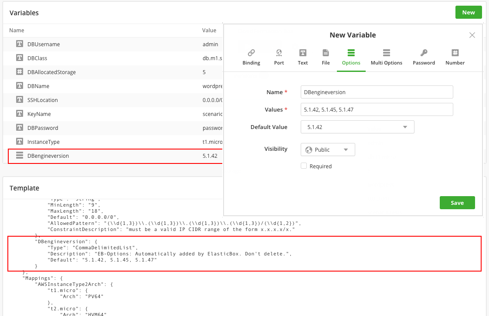
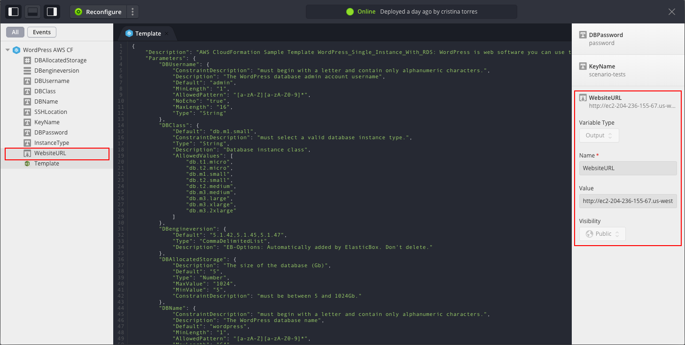
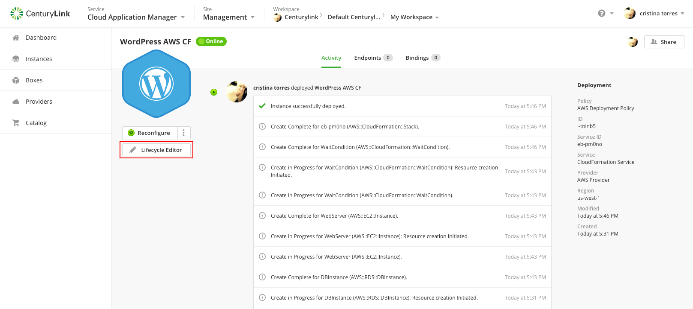
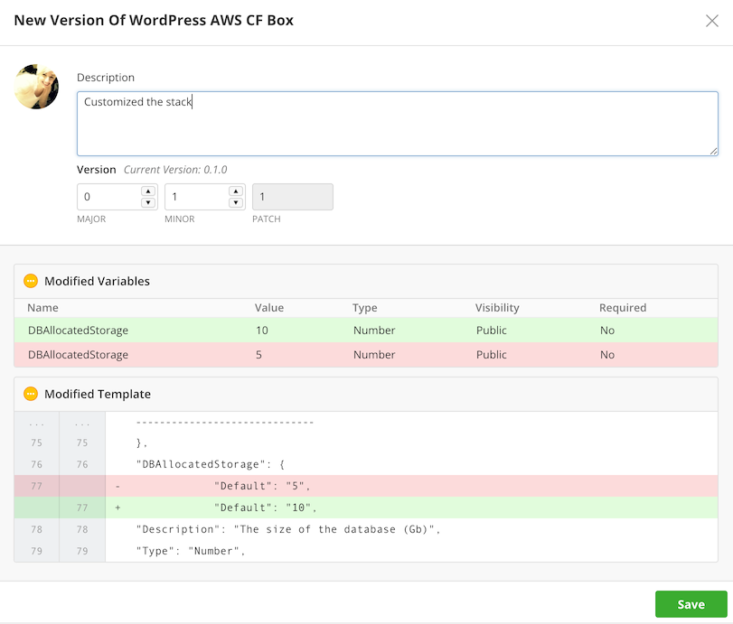
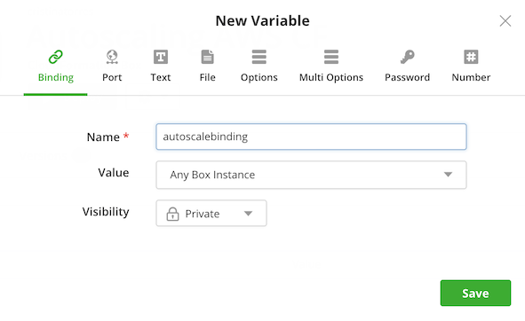
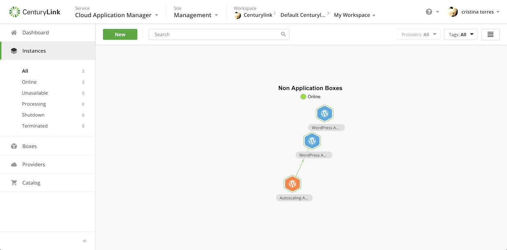
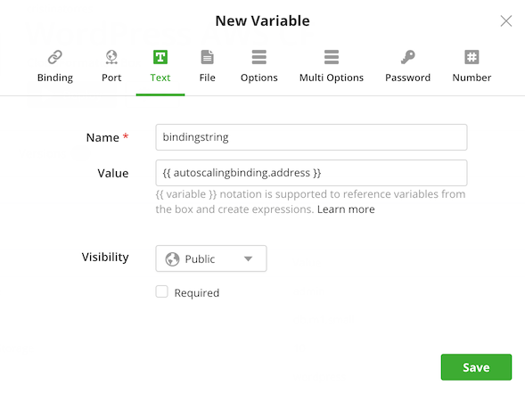
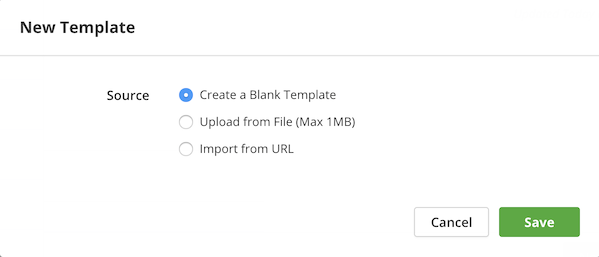
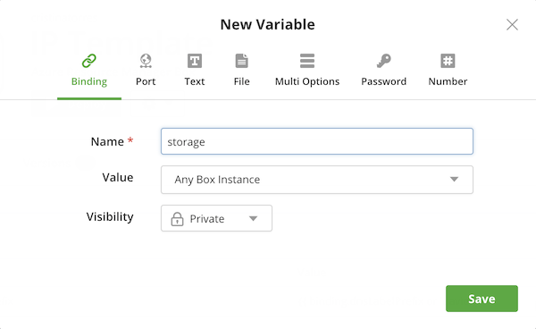

{{{ "title": "Template Boxes",
"date": "09-01-2016",
"author": "",
"attachments": [],
"contentIsHTML": false
}}}

* Deploy Using CloudFormation Templates
* Deploy Using Azure Resource Manager Templates
* Deploy Using Terraform Templates

### Deploy Using CloudFormation Templates

The Cloud Application Manager CloudFormation box type runs on the [AWS CloudFormation service](https://docs.aws.amazon.com/AWSCloudFormation/latest/UserGuide/Welcome.html).

The Cloud Application Manager enables the deployment and management of AWS services using an API.

So why use the Cloud Application Manager to launch services directly in Amazon?

Cloud Application Manager allows customers to standardize enterprise services across multiple cloud and infrastructure environments. By using cloud native templates, IT organizations can build a catalog of applications and services that users can consume on-demand. Not only can it manage services across multiple providers but also multiple subscriptions by using the abstraction between applications and infrastructure (e.g. deployment policies).

It supports all CloudFormation templates available from AWS. Leverage services such as EC2, Elastic Block Store, Simple Notification Service, Elastic Load Balancing and Auto Scaling, RDS, S3, DynamoDB, Elastic IPs, and much more.

Cloud Application Manager supports all CloudFormation templates available from AWS. Leverage services such as EC2, Elastic Block Store, Simple Notification Service, Elastic Load Balancing and Auto Scaling, RDS, S3, DynamoDB, Elastic IPs, and much more.

**In this article:**

* Create a CloudFormation Template and Launch a Stack
* Update a CloudFormation stack in real-time
* Connect to other CloudFormation boxes over bindings

### Create a CloudFormation Template and Launch a Stack

The CloudFormation box consists mainly of a template where you describe all the AWS resources you need to run your application. Cloud Application Manager parses the template and automatically shows input parameters under a section called Variables. This enables you to customize a template easily.

We use a sample Wordpress template to show how to create and launch a CloudFormation template in Cloud Application Manager.

**Step 1. Create the template**

1. [Log in](https://www.ctl.io/cloud-application-manager/) to Cloud Application Manager.

2. Click **Boxes > New > Template > CloudFormation Template**. Give the box a meaningful name to identify it in the box service catalog. Specify other [metadata](../Core Concepts/boxes.md).

     

3. In the box, select **New** in Template, under Code tab. In this walkthrough, we import a [sample WordPress template](https://s3.amazonaws.com/cloudformation-templates-us-east-1/WordPress_Single_Instance_With_RDS.template) from a URL. When we save, contents from the URL are ported over.

    

    Besides URL, you have a couple of other options to create a template:

    * **Blank Template**. Develop one from scratch. When you save, you have a blank template you can start authoring.
    * **File**. Upload an existing template. When you save, the contents of the file are available in the template. You can upload one up to 1MB in size.

    **Note:** When you import from a file or a URL, make sure its content is formatted in JSON and follows the CloudFormation template conventions.

**Step 2. Author the template**

1. Start with a [sample AWS CloudFormation template](https://aws.amazon.com/cloudformation/aws-cloudformation-templates/) and click the pencil to modify. Here we use the sample WordPress template.

     

	 **Note:** CloudFormation templates have their own taxonomy you must follow. Although a template typically has several sections, only Resources is required. For information and examples on how to declare each section, see [Template Anatomy](https://docs.aws.amazon.com/AWSCloudFormation/latest/UserGuide/template-anatomy.html) and [Template Reference](https://docs.aws.amazon.com/AWSCloudFormation/latest/UserGuide/template-reference.html).

2. Customize input parameters. Although optional, if you have them in the template, they’re automatically shown under Variables. You can customize several parameters as in this example.

     

	 You can customize further by adding parameters under Variables. In this example, we added an Options variable to set the database engine version at deploy time. When we save the variable, notice how it’s automatically added as a parameter to the template in the correct JSON format.

	 

	 Variables in CloudFormation boxes:

    * The template accepts only String, Number, or CommaDelimitedList types. So any variables you add to the box are converted to one of these types. Text, file, password, URL, and email variables are treated as string parameters. Number and port variables are treated as number parameters.

    * Bindings have a special use and are explained later in this walkthrough.

    * Variables imported from a template are always required at deploy time even if you don’t flag them as such in the box. Since they must contain values at launch time, you can set a default value when creating them or supply them at deploy time.

    * At this time, [box type variables](parameterizing-boxes-with-variables.md) are not supported.

    * The file variable is a useful way to include a script that you want to execute in your stack. When you add a file, Cloud Application Manager stores it on a secure server and declares the file variable as a parameter with a URL value in the parameters section of the template. To execute the file, you can add a script in the user data section of the template. Or depending on your resource type, reference it from the resource properties section. One example for using a file is to store it in the S3 bucket that you launch as part of the stack.

**Note:** As you’re authoring, it’s important to check that the template is valid. While Cloud Application Manager validates the correctness of the JSON format and the template syntax correctness, we can’t know whether resources specified are available in your AWS account or whether property values of a resource are valid. For that level of checking, it’s best to test launch the CloudFormation box instance from Cloud Application Manager and refine the template in real-time.

**Step 3. Launch the CloudFormation stack**

1. On the box page, click **Deploy**.

2. For Deployment Policy, select an AWS CloudFormation Deployment Policy added in Cloud Application Manager to indicate the location and the availability zone to launch the stack.

    

3. Optionally, add tags for bindings, [auto schedule the instance](../Deploying Anywhere/deploying-managing-instances.md), and set [auto updates](../Core Concepts/boxes.md).

4. Under Variables, set values for each parameter based on the **AllowedValues** property in the template parameters section.

5. Click **Deploy** to launch the stack.

    **Note:** When launched successfully, website URL is available in the instance lifecycle editor. Click **Lifecycle Editor** on the instance page and look under WebsiteURL.

	

### Update a CloudFormation Stack in Real-Time

Once live, you can continue to make changes to your CloudFormation template from the instance lifecycle editor and test in real-time. Follow these steps.

**Steps**

1. [Log in](//www.ctl.io/cloud-application-manager/) to Cloud Application Manager.

2. Click Instances and select the CloudFormation instance you want to update. In this example, we’ll select the WordPress instance launched earlier.

3. On the instance page, click **Lifecycle Editor**.

    

4. Update the template and test launch the stack. You can change any section of the template or rewrite it entirely. When ready to update the stack in AWS, click **Reconfigure**. In this example, we increased the RDS database size by changing the value of the DBAllocatedStorage parameter.

    

5. (Optional) Push updates back to the CloudFormation box. When you’re satisfied changing and testing the template in the instance, you can push it back to the CloudFormation box as a version. To do this, click **New** under Versions tabs. This allows you or others in the future to choose a version that best suits your deployment.

    

### Connect to Other CloudFormation Boxes over Bindings

Large CloudFormation deployments are challenging to manage in a single template. To simplify, break the template into smaller, manageable CloudFormation boxes and connect them with [bindings](managing-multi-tier-applications.md). Then use [text expressions](parameterizing-boxes-with-variables.md) to call the bindings. When you do, they’re added to the parameter section of the template. At deploy time, the CloudFormation service calls the binding to connect and pass values between boxes.

To illustrate, we create a second CloudFormation box to scale the WordPress blog instance automatically when past its load limit. In the following steps, we add a binding and call it to connect the WordPress box to the autoscaling box.

**Steps**

1. Create a CloudFormation box using the [AWS autoscaling template](https://s3-us-west-2.amazonaws.com/cloudformation-templates-us-west-2/AutoScalingMultiAZWithNotifications.template) and deploy it.

    

2. Go to the WordPress box and add a binding to the Autoscaling box.

	 

3. When the WordPress box is deployed, the autoscalebinding variable must be matched with the Autoscaling Instance.

    

4. The relationship created by the binding is showed in the grid view.

    

If some value of the binding is used in the WordPress box configuration, a text expression variable type must be created.

Under Variables, click **New** and select the text expression variable type. Enter this connection string: `\{{ autoscalebinding.address }}`

The expression can contain any string value or variables from templates. It can also contain system variables like instance, username, addresses. In general, follow this syntax: `\{{ binding_name.variable_name }}`

### Deploy Using Azure Resource Manager Templates

The Cloud Application Manager Azure Resource Manager Template box allows you to run any Azure service on Cloud Application Manager. This allows you to use the power of Cloud Application Manager (instance history, Lifecycle Editor, bindings, box versioning) combined with any service supported by Azure Resource Manager.

To learn more about:

How to write ARM Templates [see](https://docs.microsoft.com/en-us/azure/azure-resource-manager/resource-group-authoring-templates).

The many services available in Azure take a look at the official documentation [here](https://docs.microsoft.com/en-us/azure/azure-resource-manager/resource-manager-supported-services).

In this article:

* Create an Azure Resource Manager Template and Launch a Stack
* Update an Azure Resource Manager Stack in Real-Time
* Connect to Other Azure Resource Manager Boxes over Bindings

### Create an Azure Resource Manager Template and Launch a Stack

The Azure Resource Manager Template box consists mainly of a template where you describe all the AWS resources you need to run your application. Cloud Application Manager parses the template and automatically shows input parameters under a section called Variables. This enables you to customize a template easily.

We use a sample Wordpress template to show how to create and launch a Azure Resource Manager template in Cloud Application Manager.

**Step 1. Create the template**

1. [Log in](https://www.ctl.io/cloud-application-manager/) to Cloud Application Manager.

2. Click **Boxes > New > Template > Azure Resource Manager Template**. Give the box a meaningful name to identify it in the box service catalog. Specify other [metadata](../Core Concepts/boxes.md).

     

3. In the box, select **New** in Template, under Code tab. In this walkthrough, we import a [sample WordPress template](https://s3.amazonaws.com/cloudformation-templates-us-east-1/WordPress_Single_Instance_With_RDS.template) from a URL. When we save, contents from the URL are ported over.

    

    Besides URL, you have a couple of other options to create a template:

    * **Blank Template**. Develop one from scratch. When you save, you have a blank template you can start authoring.
    * **File**. Upload an existing template. When you save, the contents of the file are available in the template. You can upload one up to 1MB in size.

    **Note:** When you import from a file or a URL, make sure its content is formatted in JSON and follows the Azure Resource Manager template conventions.

**Step 2. Author the template**

1. Start with a [sample Azure Resource Manager template](https://github.com/Azure/azure-quickstart-templates/) and click the pencil to modify.

     

     **Note**: For more information on creating templates, please refer to the official [documentation](https://docs.microsoft.com/en-us/azure/azure-resource-manager/resource-group-authoring-templates).

2. Customize parameters. Although optional, if you have them in the template, they’re automatically shown under Variables. You can customize several parameters as in this example.

     

     Variables in Azure Resource Manager boxes:

    * Bindings have a special use and are explained later in this walkthrough.

    * Variables imported from a template are always required at deploy time even if you don’t flag them as such in the box. Since they must contain values at launch time, you can set a default value when creating them or supply them at deploy time.

    * The text variable can be parametrized through Jinja, for example to use binding information. See more documentation about this [here](syntax-for-variables.md).

    * At this time, [box type variables](parameterizing-boxes-with-variables.md) are not supported.

    * The file variable is a useful way to include a script that you want to execute in your stack. When you add a file, Cloud Application Manager stores it on a secure server and declares the file variable as a parameter with a URL value in the parameters section of the template. To execute the file, you can add a script in the user data section of the template. Or depending on your resource type, reference it from the resource properties section. One example for using a file is to store it in the S3 bucket that you launch as part of the stack.

**Note:** As you’re authoring, it’s important to check that the template is valid. While Cloud Application Manager validates the correctness of the JSON format and the template syntax correctness, we can’t know whether resources specified are available in your AWS account or whether property values of a resource are valid. For that level of checking, it’s best to test launch the Azure Resource Manager box instance from Cloud Application Manager and refine the template in real-time.

**Step 3. Launch the Azure Resource Manager stack**

1. On the box page, click **Deploy**.

2. For Deployment Policy, select an ARM Deployment Policy Box added in Cloud Application Manager to indicate the location and the availability zone to launch the stack.

    

3. Optionally, add tags for bindings, [auto schedule the instance](../Deploying Anywhere/deploying-managing-instances.md), and set [auto updates](../Core Concepts/boxes.md).

4. Under Variables, set values for each parameter based on the **AllowedValues** property in the template parameters section.

5. Click **Deploy** to launch the stack.

    **Note:** When launched successfully, website URL is available in the instance lifecycle editor. Click **Lifecycle Editor** on the instance page and look under WebsiteURL.

    

### Update an Azure Resource Manager Stack in Real-Time

In the LCE, you can update the template and variables to change your current deployment.

Cloud Application Manager will check the different resources and update the ones that need it in your instance Resource Group to match your new template.

Please, check with Azure documentation to know which live updates are allowed and which resources will be destroyed and redeployed.

### Connect to Other Azure Resource Manager Boxes over Bindings

Large Azure Resource Manager deployments are challenging to manage in a single template. To simplify, break the template into smaller, manageable ARM boxes and connect them with [bindings](managing-multi-tier-applications.md). Then use [text expressions](parameterizing-boxes-with-variables.md) to call the bindings. When you do, they’re added to the parameter section of the template. At deploy time, the Azure Resource Manager service calls the binding to connect and pass values between boxes.

To illustrate, we create a second Azure Resource Manager box to scale the WordPress blog instance automatically when past its load limit. In the following steps, we add a binding and call it to connect the WordPress box to the autoscaling box.

**Steps**

1. Go to an Azure Resource Manager box.

2. Add a binding to the Azure Resource Manager box.

     

### Deploy Using Terraform Templates

The Cloud Application Manager Terraform Template box allows to apply any Terraform configuration files on Amazon Web Services, Microsoft Azure, Google Cloud Platform and CenturyLink Cloud using Cloud Application Manager.

This allows you to use the power of Cloud Application Manager (instance history, Lifecycle Editor, bindings, box versioning) combined with any service supported by Terraform.

To learn more about:

* Terraform configurations [see](https://www.terraform.io/docs/configuration/index.html).

In this article:

* Create a Terraform Template and apply configuration
* Update a Terraform configuration in Real-Time
* Connect to Other Cloud Application Manager Boxes over Bindings

### Create a Terraform Template and apply configuration

The Terraform Template box consists mainly of a template list where you describe all the cloud resources you need to run your application. Cloud Application Manager parses the templates and automatically shows input parameters under a section called Variables. This enables you to customize a template easily.

We use a sample Basic Two-Tier Architecture in Google Cloud with Terraform templates to show how to create and launch a Terraform box template in Cloud Application Manager.

**Step 1. Create the template**

1. [Log in](https://www.ctl.io/cloud-application-manager/) to Cloud Application Manager.

2. Click **Boxes > New > Template > Terraform Template**. Give the box a meaningful name to identify it in the box service catalog. Specify other [metadata](../Core Concepts/boxes.md).

     

3. In the box, select **New** in Templates, under Code tab.

    

    * **Blank Template**. Develop one from scratch. When you save, you have a blank template you can start authoring. Configuration files with extensions `.tf`, `.tf.json` and `.auto.tfvars` are allowed.
    * **File**. Upload an existing template. When you save, the contents of the file are available in the template. You can upload one up to 1MB in size.

    * **Import from URL**. Upload an existing template. When you save, the contents of the file are available in the template. You can upload one up to 1MB in size.
    It's also supported specify a GitHub public repository URL to import all the Terraform configuration files in the repository in only one step.

    **Note:** When you import from a file or a URL, make sure its content is formatted in Terraform format (HCL or JSON syntax) and follows the Terraform template conventions.

    In this walkthrough, we import a [sample Basic Two-Tier Architecture in Google Cloud templates](https://github.com/terraform-providers/terraform-provider-google/tree/2.0.0/examples/two-tier) from a GitHub repository URL. When we save, all the Terraform configurations from the repository URL are ported over.

**Step 2. Author the template**

1. Start importing [sample Basic Two-Tier Architecture in Google Cloud templates](https://github.com/terraform-providers/terraform-provider-google/tree/2.0.0/examples/two-tier) and click the pencil of some Terraform files to modify.

     

     **Note**: For more information on creating Terraform configuration templates, please refer to the official [documentation](https://www.terraform.io/docs/configuration/index.html).

2. Customize parameters. Although optional, if you have them in the template, they’re automatically shown under Variables. You can customize several parameters as in this example.

    

     **Variables in Terraform boxes**:

    * Bindings have a special use and are explained later in this walkthrough.

    * Variables imported from a template are always required at deploy time even if you don’t flag them as such in the box. Since they must contain values at launch time, you can set a default value when creating them or supply them at deploy time.

    * The text variables can be parametrized through Jinja, for example, to use binding information. See more documentation about this [here](syntax-for-variables.md).

    * Terraform local modules are supported adding [box type variables](parameterizing-boxes-with-variables.md) to the Terraform Box.
    Box variables added to your Terraform box will be automatically available on your template as Local modules named as the variable name.
     Once a Tarreform box 
    is added as a variable, it will be available on your templates. Cloud Application Manager will add to the Terraform environmnet, on deployment time, the Terraform `module` section so you don't need to add it in your files. Anyway you could reference it on your `outputs` for example:
        * `value = "${module.TWO_TIER_MODULE.pool_public_ip}"`

        

    * The file variable is a useful way to include a script that you want to use to provision your machines, or keys for your resources. When you add a file variable, Cloud Application Manager stores it on a secure server and it will add the file to the Terraform environment. The file variable will contain the file path in the Terraform environment so it could be used in your configuration files. Examples:

        * `ssh-keys = "root:${file("${var.public_key_file}")}"`
        * `source = "${var.install_script}"`

    * Deployment policy info as variables. When a Terraform box is deployed on Google or Amazon provider, the location selected on the Policy box is available as Terraform variables to be used in templates:

        * Variables available on Google: `${var.provider_google_region}` and `${var.provider_google_zone}`
        * Variables available on Amazon: `${var.provider_aws_region}`

**Note:** As you’re authoring, it’s important to check that the template is valid. While Cloud Application Manager validates the correctness of format and the template syntax correctness, we can’t know whether resources specified are available in the provider used or whether property values of a resource are valid. For that level of checking, it’s best to test launch the Terraform box instance from Cloud Application Manager and refine the template in real-time.

### Update a Terraform configuration in Real-Time

Once live, you can continue to make changes to your Terraform configuration templates from the instance lifecycle editor and test in real-time. Follow these steps.

**Steps**

1. [Log in](//www.ctl.io/cloud-application-manager/) to Cloud Application Manager.

2. Click Instances and select the Terraform instance you want to update.

3. On the instance page, click **Lifecycle Editor**.

4. Update the template configuration files and apply configurations. You can change any section of the Terraform template files or rewrite it entirely. When ready to apply the configuration with Terraform, click **Reconfigure**.

5. (Optional) Push updates back to the Terraform box. When you’re satisfied changing and testing the template files in the instance, you can push it back to the Terraform box as a version. To do this, click **New** under Versions tabs. This allows you or others in the future to choose a version that best suits your deployment.

### Contacting Cloud Application Manager Support

We’re sorry you’re having an issue in [Cloud Application Manager](https://www.ctl.io/cloud-application-manager/). Please review the [troubleshooting tips](../Troubleshooting/troubleshooting-tips.md), or contact [Cloud Application Manager support](mailto:incident@CenturyLink.com) with details and screenshots where possible.

For issues related to API calls, send the request body along with details related to the issue.

In the case of a box error, share the box in the workspace that your organization and Cloud Application Manager can access and attach the logs.
* Linux: SSH and locate the log at /var/log/elasticbox/elasticbox-agent.log
* Windows: RDP into the instance to locate the log at \ProgramData\ElasticBox\Logs\elasticbox-agent.log

