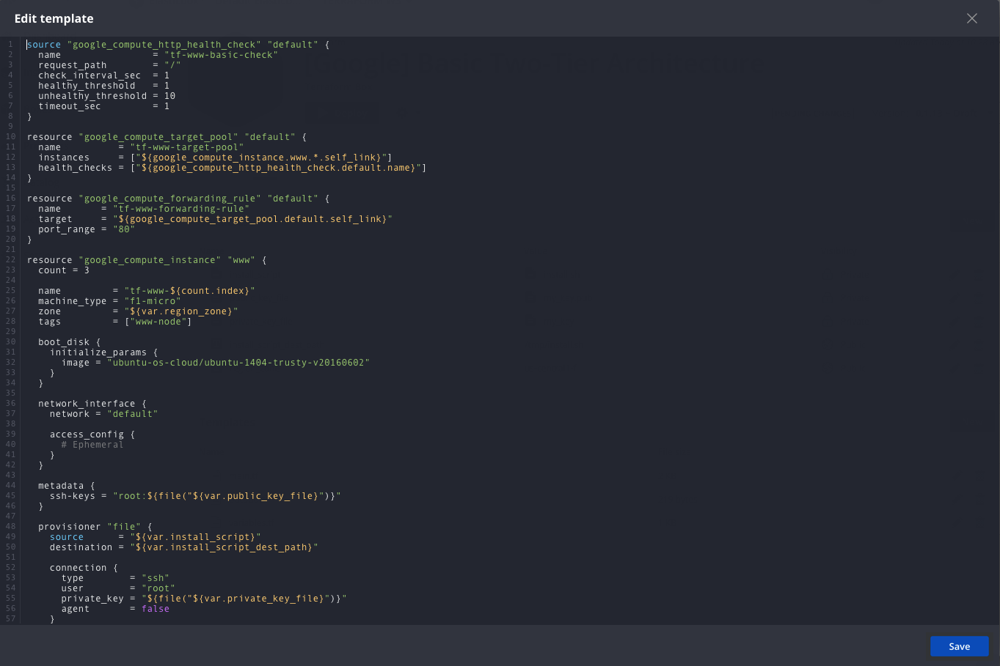
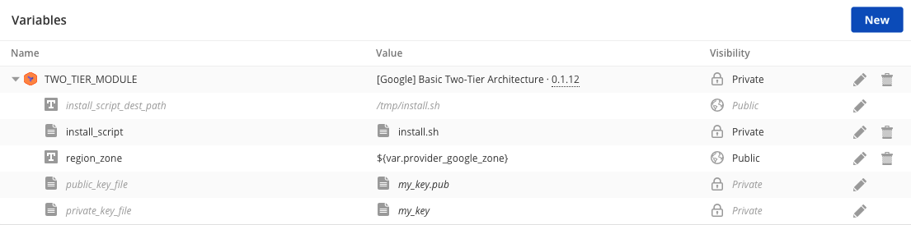

{{{ "title": "Terraform Template Boxes",
"date": "12-21-2018",
"author": "Cristina Torres, Amalia Garcia de Mirasierra",
"attachments": [],
"contentIsHTML": false,
"keywords": ["terraform", "template box", "cloud application manager", "cam", "alm", "application lifecycle management"]
}}}
**In this article:**

* [Overview](#Overview)
* [Audience](#Audience)
* [Prerequisites](#Prerequisites)
* [Create a Terraform Template and apply configuration](#Create-a-Terraform-Template-and-apply-configuration)
* [Update a Terraform configuration in Real-Time](#Update-a-Terraform-configuration-in-Real-Time)
* [Contacting Cloud Application Manager Support](#Contacting-Cloud-Application-Manager-Support)
* [Getting General Support](#Getting-General-Support)

### Overview

This article is meant to assist users of Cloud Application Manager willing to use Cloud Application Manager template boxes to create or edit **Terraform version 0.11** templates.

### Audience

All users of Cloud Application Manager who wants to define and use Terraform Template Boxes.

### Prerequisites

* An active *Cloud Application Manager* account
* Having configured a provider of either one of these types:
  - [AWS](../Deploying Anywhere/using-your-aws-account.md)
  - [Microsoft Azure](../Deploying Anywhere/using-microsoft-azure.md)
  - [Google Cloud](../Deploying Anywhere/using-google-cloud.md)
  - [CenturyLink Cloud](../Deploying Anywhere/using-centurylink-cloud.md)
  - [CenturyLink Private Cloud on VMware Cloud Foundation](../Deploying Anywhere/using-private-cloud-on-vmware-cloud-foundation.md)
  - [VMware vCenter/vSphere](../Deploying Anywhere/using-the-vmware-vcenter-private-datacenter.md)
  - [VMware vCloud Director](../Deploying Anywhere/orchestrating-vcloud-air-vcloud-director-deployments.md)

### Create a Terraform Template and apply configuration

The Terraform Template box consists mainly on a list of template files where you describe all the cloud resources you need to run your application. Cloud Application Manager parses the templates and automatically shows input parameters under a section called Variables. This enables you to customize a template easily.

We use a sample Basic Two-Tier Architecture in Google Cloud with Terraform templates to show how to create and launch a Terraform box template in Cloud Application Manager.

Cloud Application Manager currently supports Terraform configuration **version 0.11**.

**Step 1. Create the template**

1. [Log in](https://www.ctl.io/cloud-application-manager/) to Cloud Application Manager.

2. Click **Boxes > New > Template > Terraform Template**. Give the box a meaningful name to identify it in the box service catalog. Specify other [metadata](../Core Concepts/boxes.md).

     

3. In the box, select **New** in Templates, under Code tab.

    

    * **Blank Template**. Develop one from scratch. When you save, you have a blank template you can start authoring. Configuration files with extensions `.tf`, `.tf.json` and `.auto.tfvars` are allowed.
    * **File**. Upload an existing template. When you save, the contents of the file are available in the template. You can upload one up to 1MB in size.

    * **Import from URL**. Upload an existing template. When you save, the contents of the file are available in the template. You can upload one up to 1MB in size.
    It's also supported specify a GitHub public repository URL to import all the Terraform configuration files located into the repository in a single step.

    **Note:** When you import from a file or a URL, make sure its content is formatted in Terraform format (HCL or JSON syntax) and follows the Terraform template conventions.

    In this walkthrough, we import a [sample Basic Two-Tier Architecture in Google Cloud templates](https://github.com/terraform-providers/terraform-provider-google/tree/2.0.0/examples/two-tier) from a GitHub repository URL. When we save, all the Terraform configuration files from the repository URL are ported over.

**Step 2. Author the template**

1. Start importing [sample Basic Two-Tier Architecture in Google Cloud templates](https://github.com/terraform-providers/terraform-provider-google/tree/2.0.0/examples/two-tier) and click the pencil of some Terraform files to modify.

     

     **Note**: For more information on creating Terraform configuration templates, please refer to the official [documentation](https://www.terraform.io/docs/configuration/index.html).

2. Customize parameters. Although optional, if you have them in the template, they’re automatically shown under Variables. You can customize several parameters as in this example.

    

     **Variables in Terraform boxes**:

    * Bindings have a special use and are explained later in this walkthrough.

    * Variables imported from a template are always required at deploy time even if you don’t flag them as such in the box. Since they must contain values at launch time, you can set a default value when creating them or supply them at deploy time.

    * The text variables can be parametrized through Jinja, for example, to use binding information. See more documentation about this [here](syntax-for-variables.md).

    * Terraform local modules are supported adding [box type variables](parameterizing-boxes-with-variables.md) to the Terraform Box.
    Box variables added to your Terraform box will be automatically available on your template as Local modules named as the variable name.
     Once a Tarreform box
    is added as a variable, it will be available on your templates. Cloud Application Manager will add to the Terraform environmnet, on deployment time, the Terraform `module` section so you don't need to add it in your files. Anyway you could reference it on your `outputs` for example:
        * `value = "${module.TWO_TIER_MODULE.pool_public_ip}"`

        

    * The file variable is a useful way to include a script that you want to use to provision your machines, or keys for your resources. When you add a file variable, Cloud Application Manager stores it on a secure server and it will add the file to the Terraform environment. The file variable will contain the file path in the Terraform environment so it could be used in your configuration files. Examples:

        * `ssh-keys = "root:${file("${var.public_key_file}")}"`
        * `source = "${var.install_script}"`

    * Deployment policy configuration as variables: When a Terraform box is deployed on Google or Amazon provider, the location selected on the Policy box is available as Terraform variables to be used in templates:

        * Variables available on Google: `${var.provider_google_region}` and `${var.provider_google_zone}`
        * Variables available on Amazon: `${var.provider_aws_region}`

**Note:** As you’re authoring, it’s important to check that the template is valid. While Cloud Application Manager validates the correctness of format and the template syntax correctness, we can’t know whether resources specified are available in the provider used or whether property values of a resource are valid. For that level of checking, it’s best to test launch the Terraform box instance from Cloud Application Manager and refine the template in real-time.

### Update a Terraform configuration in Real-Time

Once live, you can continue to make changes to your Terraform configuration templates from the instance lifecycle editor and test in real-time. Follow these steps.

**Steps**

1. [Log in](//www.ctl.io/cloud-application-manager/) to Cloud Application Manager.

2. Click Instances and select the Terraform instance you want to update.

3. On the instance page, click **Lifecycle Editor**.

4. Update the template configuration files and apply configurations. You can change any section of the Terraform template files or rewrite it entirely. When ready to apply the configuration with Terraform, click **Reconfigure**.

5. (Optional) Push updates back to the Terraform box. When you’re satisfied changing and testing the template files in the instance, you can push it back to the Terraform box as a version. To do this, click **New** under Versions tabs. This allows you or others in the future to choose a version that best suits your deployment.

### Contacting Cloud Application Manager Support

We’re sorry you’re having an issue in [Cloud Application Manager](https://www.ctl.io/cloud-application-manager/). Please review the [troubleshooting tips](../Troubleshooting/troubleshooting-tips.md), or contact [Cloud Application Manager support](mailto:incident@CenturyLink.com) with details and screenshots where possible.

For issues related to API calls, send the request body along with details related to the issue.

In the case of a box error, share the box in the workspace that your organization and Cloud Application Manager can access and attach the logs.
* Linux: SSH and locate the log at /var/log/elasticbox/elasticbox-agent.log
* Windows: RDP into the instance to locate the log at \ProgramData\ElasticBox\Logs\elasticbox-agent.log

### Getting General Support

Customers can contact the CenturyLink Global Operations Support center (support desk) directly for getting help with Cloud Application Manager as well as any other supported product that they’ve subscribed to.  Below are three ways to get help.

#### Contact:

1. **Phone:** 888-638-6771

2. **Email:** incident@centurylink.com

3. **Create Ticket in Cloud Application Manager:** Directly within the platform, users can “Create Ticket” by clicking on the “?” symbol in upper right corner near the users log-in profile icon.  This takes users directly to the Managed Servicers Portal where they can open, track and review status of issues that have been raised with the support desk.  Additionally, this is how a TAM can be engaged as well.

#### Instructions:

1. Provide your name
2. Cloud Application Manager account name
3. A brief description of your request or issue for case recording purposes

The support desk will escalate the information to the Primary TAM and transfer the call if desired.
