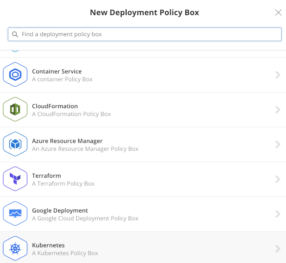
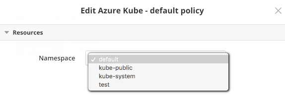
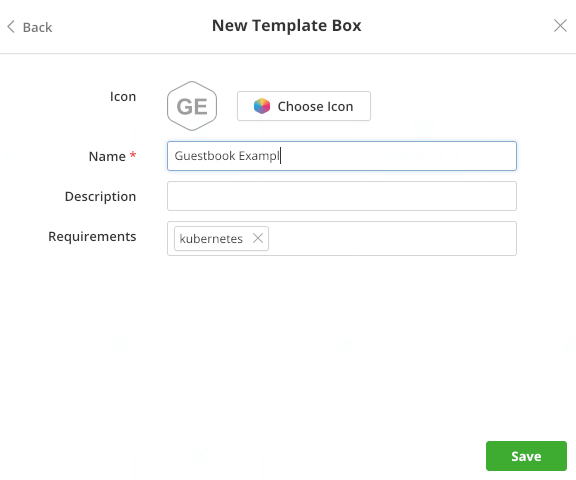
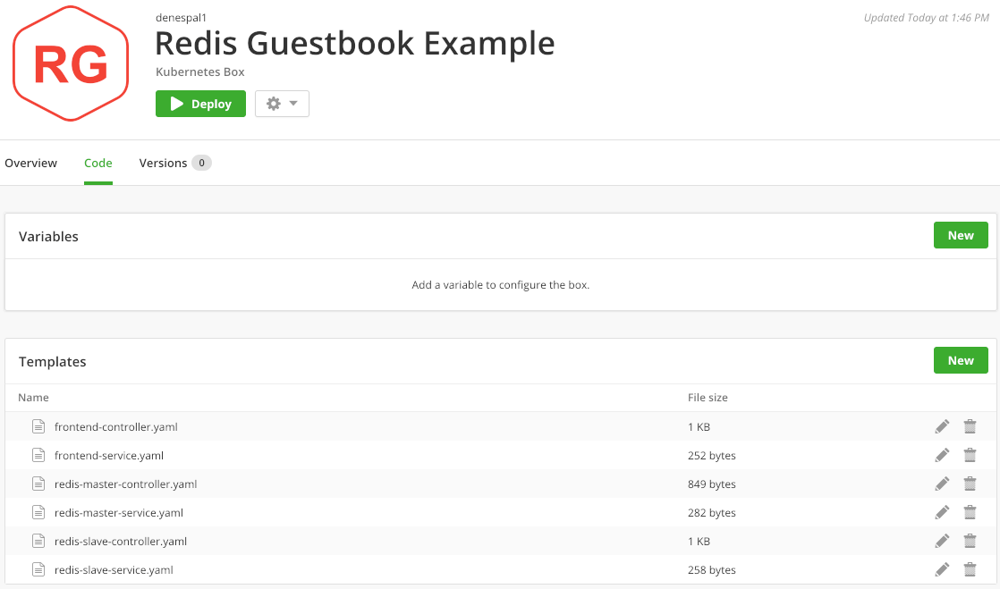
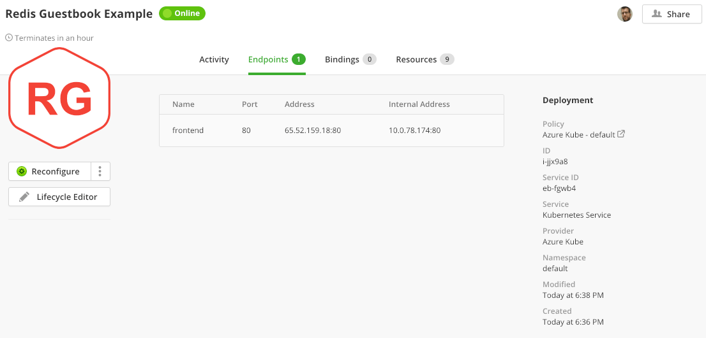
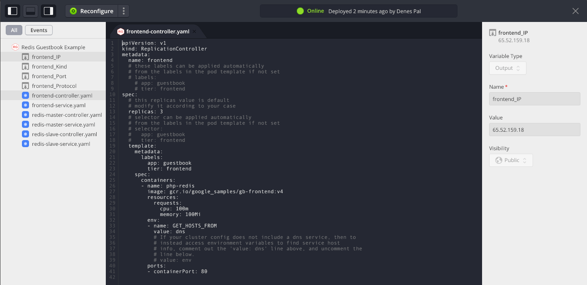
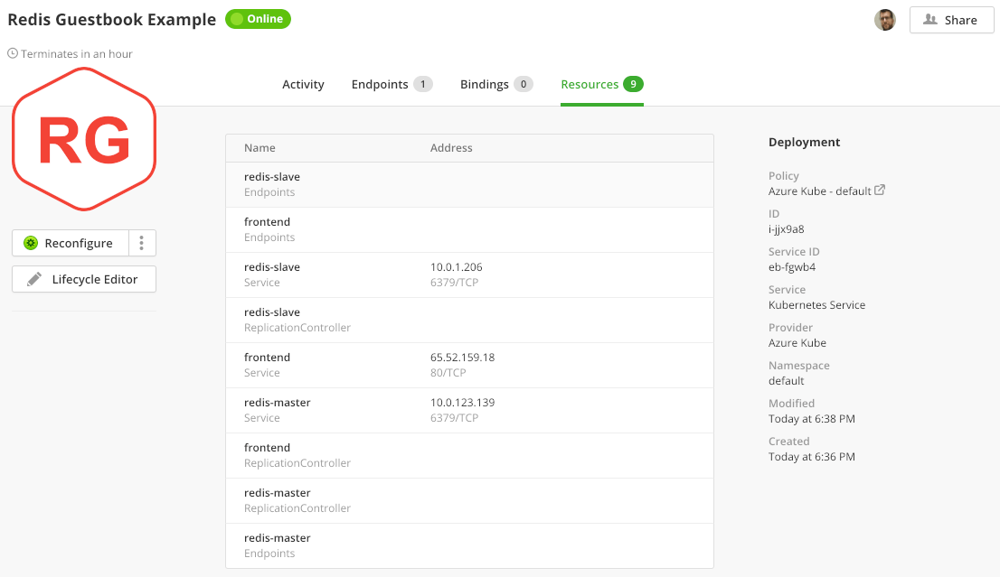
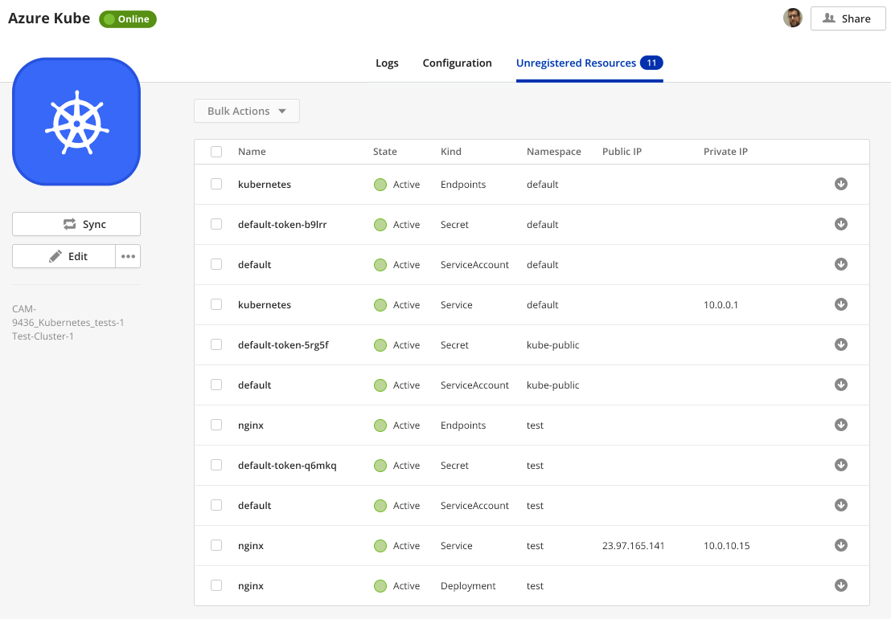

{{{ "title": "Using Kubernetes",
"date": "01-02-2019",
"author": "Dénes Pál",
"attachments": [],
"contentIsHTML": false,
"keywords": ["kubernetes", "k8s", "deployment", "template box", "cloud application manager", "deployment templates", "Cloud Application Manager", "alm", "application lifecycle management", "alm"]
}}}

**In this article:**

- [Overview](#overview)
- [Audience](#audience)
- [Prerequisites](#prerequisites)
- [Getting started with Kubernetes on Cloud Application Manager](#getting-started-with-kubernetes-on-cloud-application-manager)
- [Deployment Policies for Kubernetes](#deployment-policies-for-kubernetes)
- [Create a Template Box](#create-a-template-box)
- [Deploying Kubernetes Template Boxes](#deploying-kubernetes-template-boxes)
- [Endpoints](#endpoints)
- [Output Variables](#output-variables)
- [List of Deployed Resources](#list-of-deployed-resources)
- [Discovering and Registering Existing Resources](#discovering-and-registering-existing-resources)
- [Getting General Support](#getting-general-support)

### Overview

With the Kubernetes provider of Cloud Application Manager you can create and manage any Kubernetes resource, using Template Boxes with declarative YAML templates.

### Audience

All Cloud Application Manager users intended to use a Kubernetes provider.

### Prerequisites

- An active Cloud Application Manager account
- A Provider of type Kubernetes already configured (See instructions on [how to set up a Kubernetes provider](../Deploying Anywhere/kubernetes.md))

### Getting started with Kubernetes on Cloud Application Manager

This article is a second part of a series, and requires that a Kubernetes provider is already set up with Cloud Application Manager. Detailed instructions on how to set up a Kubernetes provider can be found [in the first part of this article](../Deploying Anywhere/kubernetes.md).

### Deployment Policies for Kubernetes

Kubernetes Deployment policies are bound to a **Namespace**. A deployment to Kubernetes is limited to a single namespace, which is defined in the selected Deployment Policy.

When Cloud Application Manager first synchronizes the Kubernetes provider, it creates a sample Deployment Policy Box pointing to the *default* namespace, or if unavailable, to *kube-public* or else the first available namespace.


You can create additional deployment policies either by cloning the sample one, or by navigating to ***Boxes -> New -> Deployment Policy*** and selecting ***Kubernetes*** as type.



You can change the namespace associated with a Deployment Policy by editing the Policy on the *Code* tab of the Policy Box.



### Create a Template Box

Go to ***Boxes -> New -> Template*** and select ***Kubernetes*** as type.


Fill the parameters as usual. Mind that if you define any *Requirements* in the template box, you also need to list those in a Deployment Policy Box as *Claims* in order to be able to deploy the Template using that Policy.



A Kubernetes Template Box can have multiple template files, currently only in YAML format, but Cloud Application Manager also supports **Jinja syntax with YAML**. You can change the order of template files by dragging and dropping with the mouse, or long-pressing and dragging on a touch-screen device. At least one template file is required to deploy a Kubernetes Template Box.



In YAML it is valid to define multiple documents in a single file, separated by a line with three dashes only, as shown in this snippet below:

```
...
            memory: 100Mi
        ports:
        - containerPort: 80
---
apiVersion: v1
kind: Service
metadata:
  name: frontend-\{{ service }}
  namespace: \{{ namespace }}
...
```

Kubernetes templates shall not include a hard-coded *namespace* property in their metadata. Since the namespace is determined and forced by the Deployment Policy Box used to deploy the Instance, the deployment will fail if the template requests a namespace different from the one set with the Policy. The namespace set in the Deployment Policy can be referred with the `namespace` variable.

If you want to deploy the same Template Box multiple times with the same Deployment Policy (and hence into the same namespace), in order to avoid name collisions, you need to **include the value of Cloud Application Manager Service ID** in the name of the deployed resources, and perhaps in the labels and selectors as well. Use YAML syntax to paste the *Service ID* into templates, as shown below:

```
apiVersion: v1
kind: Service
metadata:
  name: frontend-\{{ service }}
  namespace: \{{ namespace }}
...
```

The following Jinja variables are always available in templates:

| Variable | Description |
| --- | --- |
| `environment` | Name of the Instance |
| `instance` | Instance ID |
| `namespace` | The current Namespace from Deployment Policy |
| `service` | Service ID |
| `tags` | List of Tags |
| `workspace` | Workspace or Owner of the Instance |


The ***New Template*** dialog offers you the following options:

- Create a blank template by specifying its filename (please follow `*.yaml` convention)
- Upload a YAML template file from disk
- Download a YAML template from remote URL
- Import YAML templates from a file or a directory on GitHub


If the URL is a GitHub repository, the files from that directory are automatically imported, as long as the filename ends with `.yaml` 

There are some sample templates to test Kubernetes deployments in [this GitHub repository](https://github.com/DenesPal/cam-examples/tree/master/templates/kubernetes).

If there is already a template file with that name, it won't get overwritten, but duplicate names will block adding new templates, so one of them has to be deleted first in order to continue.

### Deploying Kubernetes Template Boxes

When **Deploying** a Template Box, you need to select a suitable Kubernetes Deployment Policy, with matching *claims* to the *requirements* defined in your Template Box.


On deployment, Cloud Application Manager is going to parse the templates, first by executing Jinja instructions and variable substitutions, then parsing the YAML documents as resources. For every resource defined in the templates, Cloud Application Manager adds some labels and annotations, then submit them one-by-one to the Kubernetes cluster to create new resources, or to update an existing ones. If a resource already exists, Cloud Application Manager generates a patch against the previous known version of the template (stored as an annotation on the Kubernetes resource), or against the current specification of the resource read from the Kubernetes cluster. (In some cases, the later approach could fail: if the resource was created or modified outside of Cloud Application Manager, for example.)


### Endpoints

Cloud Application Manager scans through deployed resources, looking for *loadBalancer* property in their statuses, and collects *ingress* IP addresses or hostnames, and populate the ***Endpoints*** tab with them.



Endpoints are collected after deploying or reconfiguring an Instance.

### Output Variables

There is no way to define output variables in Kubernetes templates, but Cloud Application Manager will create some output variables from the endpoints found with the deployment, like ***name*_Address**, ***name*_Kind**, ***name*_Port** and ***name*_Protocol**.

You can see the output variables of any deployed Instance in the ***Lifecycle Editor***.



### List of Deployed Resources

The resources that have been created with the deployment are shown in the ***Resources*** tab of the Instance details page. List of resources is cleared when the instance is terminated.



Resources are collected after deploying or reconfiguring an Instance.

### Discovering and Registering Existing Resources

Resources already existing on the cluster are discovered when synchronizing the Kubernetes provider and are shown on the ***Unregistered Resources*** tab of the provider, and also on the Instances page as Unregistered.



You can **import** an unregistered resource by clicking the arrow symbol in the rightmost column of the table.


When registering a resource, Cloud Application Manager creates an Instance Box for the resource, and populates it with a template representing the current schema of the resource on the cluster. It also updates the resource in the cluster with annotations and labels.


Once the resource is imported as an Instance, it can be reconfigured or terminated as normal. If any ingress address belongs to the resource, it is listed on the *Endpoints* tab and also exposed as output variable.


### Getting General Support

Customers can contact the Lumen Global Operations Support center (support desk) directly for getting help with Cloud Application Manager as well as any other supported product that they’ve subscribed to.  Below are three ways to get help.

#### Contact:

1. **Phone:** 888-638-6771

2. **Email:** incident@centurylink.com

3. **Create Ticket in Cloud Application Manager:** Directly within the platform, users can “Create Ticket” by clicking on the “?” symbol in upper right corner near the users log-in profile icon.  This takes users directly to the Managed Servicers Portal where they can open, track and review status of issues that have been raised with the support desk.  Additionally, this is how a TAM can be engaged as well.

#### Instructions:

1. Provide your name
2. Cloud Application Manager account name
3. A brief description of your request or issue for case recording purposes

The support desk will escalate the information to the Primary TAM and transfer the call if desired.
