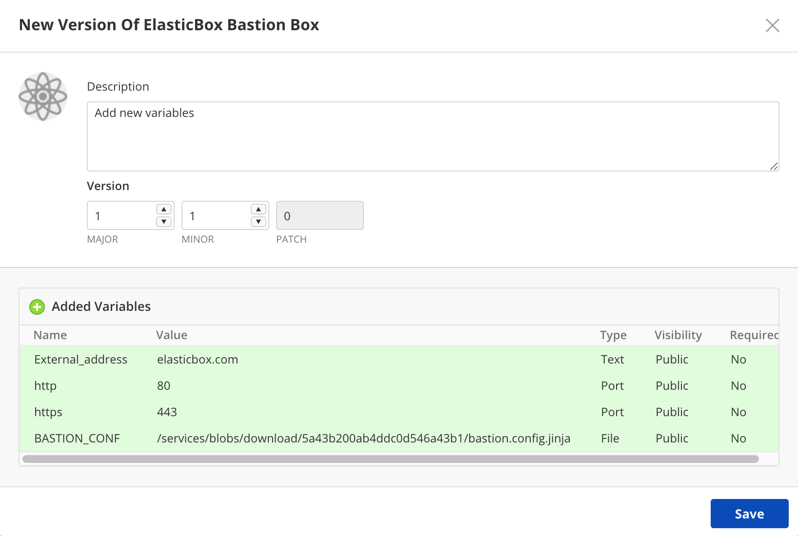
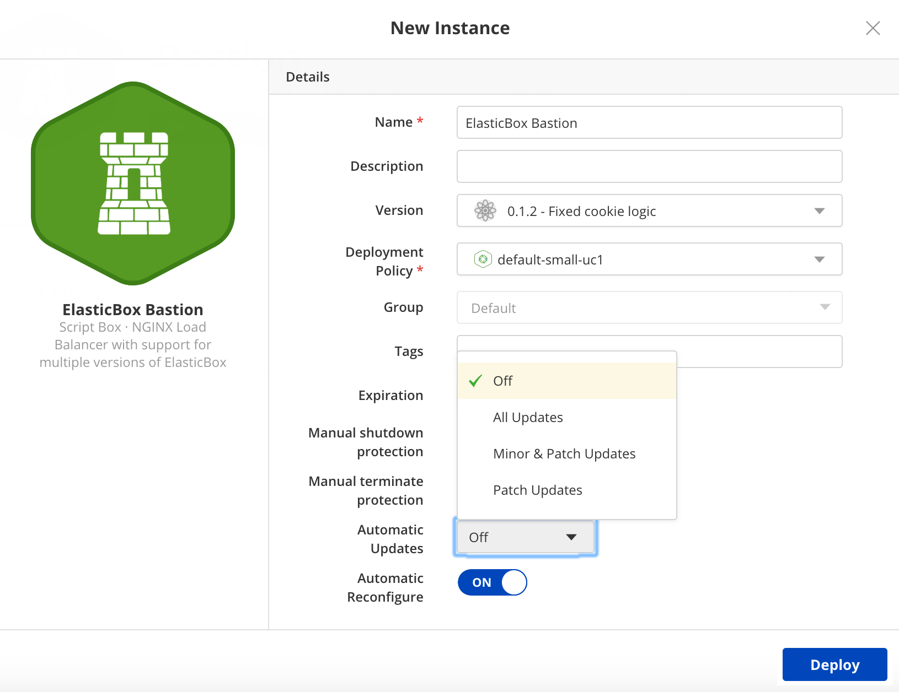
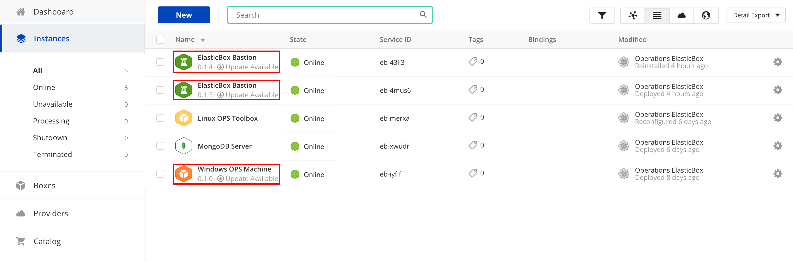
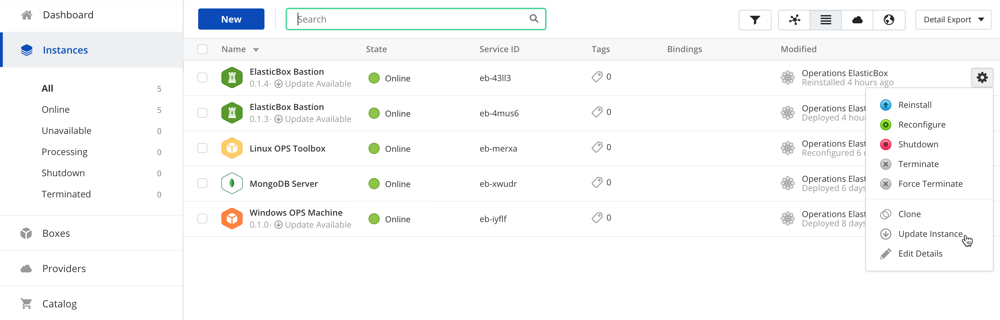
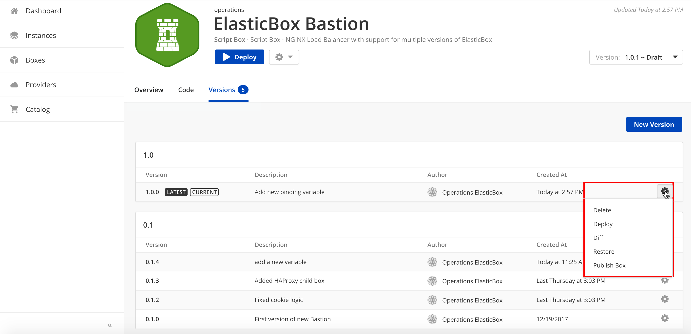
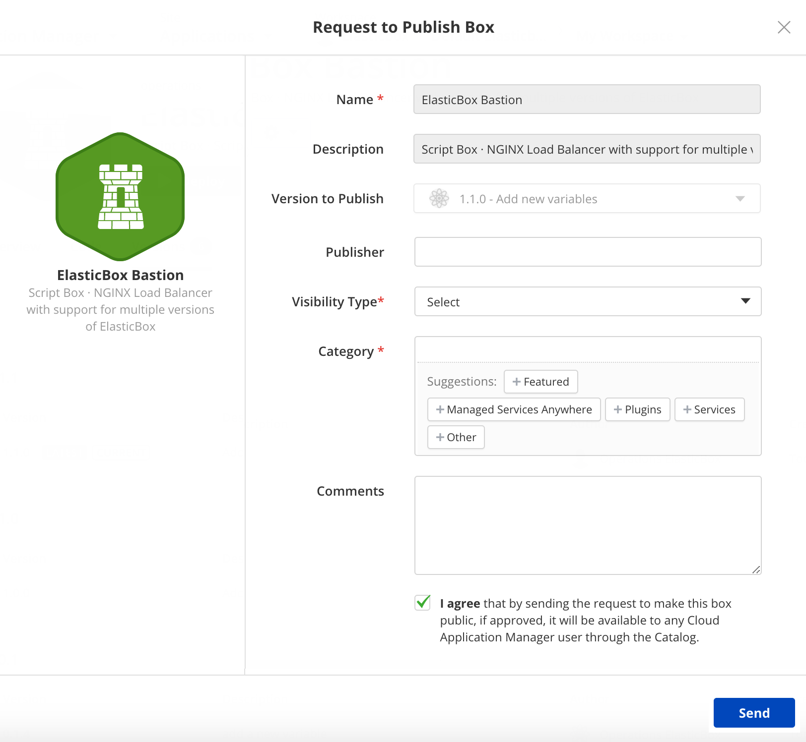

{{{
"title": "Version Control and Auto-Updates",
"date": "05-22-2019",
"author": "Guillermo Sánchez and Sergio Quintana",
"attachments": [],
"keywords": ["cam", "cloud application manager", "version control", "version", "auto-updates", "update"],
"sticky": true,
"contentIsHTML": false
}}}

**In this article:**

* [Overview](#overview)
* [Audience](#audience)
* [Prerequisites](#prerequisites)
* [Introduction](#introduction)
* [Versioning a Box](#versioning-a-box)
* [Version Semantics](#version-semantics)
* [Updating Instances Automatically or Manually](#updating-instances-automatically-or-manually)
* [Managing box versions](#managing-box-versions)
* [Contacting Cloud Application Manager Support](#contacting-cloud-application-manager-support)

### Overview

This article intends to serve as a guide for explaining box versioning in Cloud Application Manager as well as giving an overview of the auto-updates feature.

### Audience

Cloud Application Manager users.

### Prerequisites

An active Cloud Application Manager account.

### Introduction

In large-scale, complex deployments where tens or hundreds of distributed applications run from a single box configuration, a way of managing changes to box configurations and handling those updates to running instances is needed. Versioning and auto-updates can help with that.

### Versioning a Box

A box must be versioned to push its updates, either manually or automatically, to live instances deployed from it. To create a version, navigate to the box and click the **Versions** tab.

Click **New Version** and save with an appropriate version number.

* Use **Major** to indicate deeper changes. For example, you may alter the box configuration with different child boxes, variables or a binding.
* Use **Minor** to indicate small changes. For example, instead of using apt-get you now install and compile software from a Git repo.
* Use **Patch** to indicate simple changes like, for example, fixing a typo.

### Version Semantics

Major, minor, and patch follow semantic versioning standards. Cloud Application Manager does not check for the quality or correctness of changes between versions. It’s up to the box composer to test changes be they minor, patch, or major. Versioning semantics helps others consuming the box decide the level of updates they are comfortable pushing to their instances.

#### Draft, current, latest

* Latest is the highest version number of a box. When you deploy from Instances page, you always get the latest version.
* Draft indicates changes not yet saved to the box. When you deploy from the box page, you typically deploy the draft version.
* Current refers to a specific restored version of the box. If you want to restore a box version you have to do it from the **Versions** tab. Select the gear icon and click on **Restore**.

### Updating Instances Automatically or Manually

When launching an instance, choose the level of auto-update you’re comfortable applying. Go with **All Updates** if you are not concerned about big or small configuration changes. Otherwise, choose **Minor and Patch Updates** or **Patch Updates**, which make sure the configuration remains unchanged, for the most part.

When a new version of the box is created, instances which are eligible for automatic update (if the type of version created matches the auto-update policy chosen at deployment time) will be updated with the new version of the box, and a reinstall action will be automatically triggered to apply the new version changes.

**Note:** This option is available for versioned boxes only.

Don't worry if you don’t set instances to auto-update. A visual cue on the Instances page reminds you when changes are available from the related box.

You can always manually update from Instances page. Select the instance and under the Bulk Actions or the gear icon of the instance, click **Update Instance**.

From here, you can update the instance with a specific version. An update always triggers a [reinstall operation](../Deploying Anywhere/deploying-managing-instances.md).

**Note:** When deploying a box from Instances page, you consume the latest configuration of the parent and child boxes unless you chose a specific version for the child boxes. To deploy a different version of the parent box, launch it from the box page. From the **Versions** tab > gear icon, click **Deploy** on a selected version.

### Managing box versions

Box versions can be managed in different ways. To see these options, go to **Versions** tab in the box details page and click the gear icon.

1. **Delete**: You can delete the selected box version. Please be aware that clicking on this option deletes the version without a warning popup.
2. **Deploy**: You can deploy the selected box version.
3. **Diff**: You can see the updates made to each box version from the **Versions** tab. Select the gear icon and click on **Diff**.

    

4. **Restore**: You can restore your box to its previous version. The version you are working on now will become the current version.
5. **Publish box**: This option changes the privacy settings of the box, making it public after being published. To execute this change filling a request form is necessary. Please note that only those fields marked with an asterisk are mandatory.

    For more information on how to publish a box see this [tutorial](../Tutorials/publish-script-box.md).

### Contacting Cloud Application Manager Support

We’re sorry you’re having an issue in [Cloud Application Manager](https://www.ctl.io/cloud-application-manager/). Please review the [troubleshooting tips](../Troubleshooting/troubleshooting-tips.md), or contact [Cloud Application Manager support](mailto:incident@CenturyLink.com) with details and screenshots where possible.

For issues related to API calls, send the request body along with details related to the issue.

In the case of a box error, share the box in the workspace that your organization and Cloud Application Manager can access and attach the logs.

* Linux: SSH and locate the log at /var/log/elasticbox/elasticbox-agent.log
* Windows: RDP into the instance to locate the log at ProgramData/ElasticBox/Logs/elasticbox-agent.log
