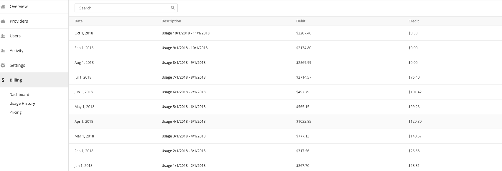

{{{
"title": "Billing menu",
"date": "11-29-2019",
"author": "Guillermo Sanchez",
"attachments": [],
"keywords": ["cam", "cloud application manager", "billing", "usage history"],
"contentIsHTML": false
}}}

### Billing Menu

**In this article:**

* [Overview](#overview)
* [Audience](#audience)
* [Prerequisites](#prerequisites)
* [Billing Dashboard](#billing-dashboard)
* [Billing Usage History](#billing-usage-history)
* [Getting General Support](#getting-general-support)

### Overview

This article is meant to assist users of Cloud Application Manager willing to access Cloud Application Manager billing section to review billing details.

### Audience

All users with Cloud Application Manager organization or cost center administrator access.

### Prerequisites

* Access to Cloud Application Manager, [Management site](https://account.cam.ctl.io/#/billing).
* The user must be an Administrator of the organization or the cost center in Cloud Application Manager.
* The user should be at the organization or the cost center level scope to access the Billing option in the left side menu.

### Billing Dashboard

When you click on **Billing** in the left side menu you will land into a dashboard page, where a bar graph with the billed amount for the previous months will be shown.

* You can change the range of months being shown in the bars graph by selecting a different value in the date filter dropdown.
* You can also select the consumption categories you want to display with the consumption category type filter dropdown.

The bar graph shows the billed amount at the chosen scope. If the scope is cost center, the graph only shows the billed amount associated with this scope. If you are in the organization scope, the graph shows the billed amount for the whole organization.

### Billing Usage History

When you click on **Usage History** option under the **Billing** left menu item, you will be able to review your detailed billing information.

When you enter this page, you can see a list with the previous months billing summary, including the invoice date, the period of usage and the total credit and debit amounts for each month.

The list shows the billing summary at the chosen scope. If the scope is cost center, the list only shows the billing summary associated with this scope. If you are in the organization scope, the list shows the billing summary for the whole organization.

When you click on a line, the details for that month appears on the bottom of the page with the billing details corresponding to your current scope, showing the line-items you may encounter in your invoice, including for example your Application Lifecycle charges, your support charges as well as your discounts.
Each line item on the below table includes additional information such as region (where applicable), quantity, cost and total.

Some items have a dropdown icon at the beginning, meaning that you can click on it to drill down and see further details on that item appearing below.

For more information about the usage history details see [detailed billing report](../Cloud Optimization/partner-cloud-integration-detailed-billing-report.md).

### Pricing

When you click on **Pricing** option under the Billing left menu item, you will be able to see the Cloud Application Manager default pricing of the different Cloud Application Manager products and services, including the billing type and the hourly or monthly price, depending on the type and the setup fee if any is required.

### Getting General Support

Customers can contact the CenturyLink Global Operations Support center (support desk) directly for getting help with Cloud Application Manager as well as any other supported product that they’ve subscribed to.  Below are three ways to get help.

**Contact:**

1. **Phone:** 888-638-6771

2. **Email:** incident@centurylink.com

3. **Create Ticket in Cloud Application Manager:** Directly within the platform, users can “Create Ticket” by clicking on the “?” symbol in upper right corner near the users log-in profile icon.  This takes users directly to the Managed Servicers Portal where they can open, track and review status of issues that have been raised with the support desk.  Additionally, this is how a TAM can be engaged as well.

**Instructions:**

1. Provide your name
2. CAM account name
3. A brief description of your request or issue for case recording purposes

The support desk will escalate the information to the Primary TAM and transfer the call if desired.
