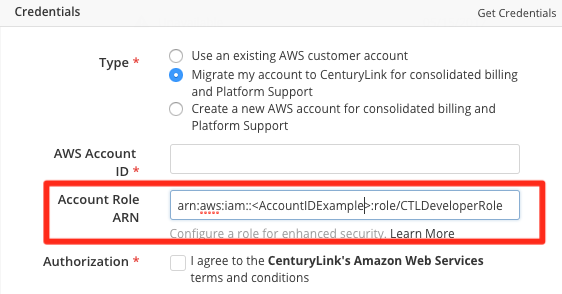
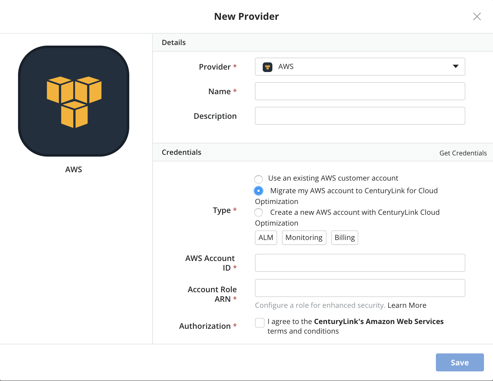
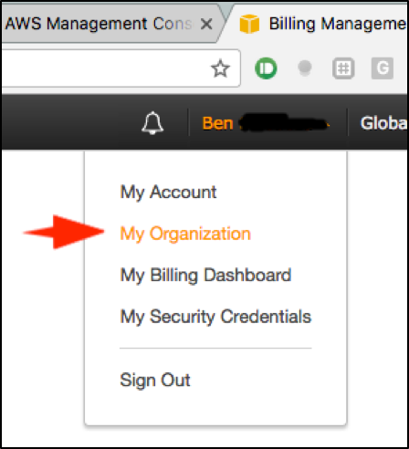
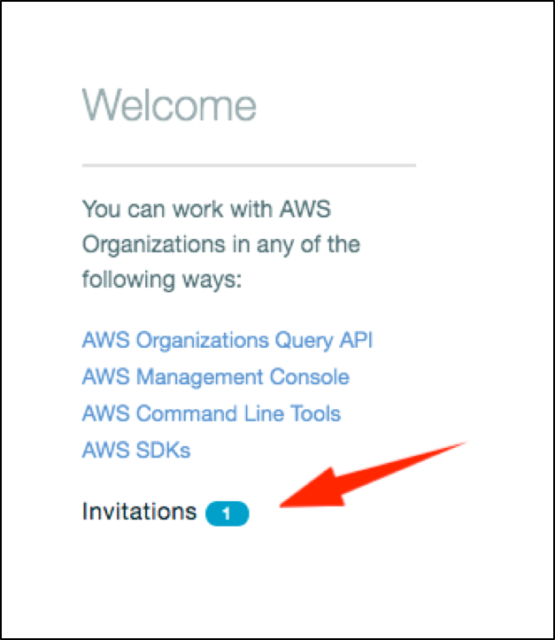
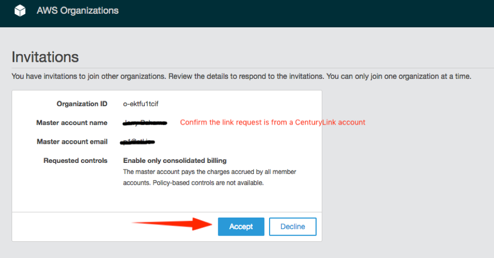
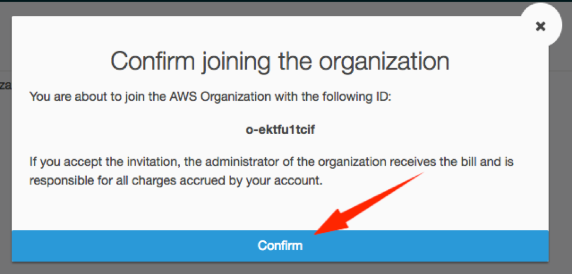
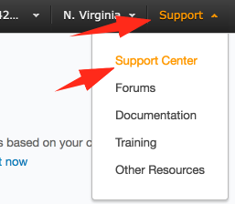
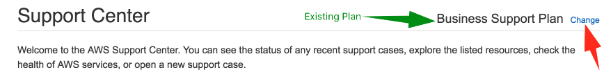

{{{
  "title": "Partner Cloud: Getting Started With An Existing AWS Customer Account",
  "date": "10-21-19",
  "author": "Ben Swoboda",
  "attachments": [],
  "contentIsHTML": false
}}}


### Overview

[Cloud Application Manager's](https://www.ctl.io/cloud-application-manager/) Cloud Integration gives users the ability to benefit from CenturyLink's partnerships with other cloud providers. CenturyLink assumes the billing for these accounts and takes responsibility for platform support. Users may also benefit from Security hardening and potential cost Optimization. To migrate an existing AWS account, customers must gain approval from AWS (Please contact your CenturyLink representative for more details). Customers with existing Accounts which are transferred into CenturyLink's care as a result of an approved account transfer process agreement with AWS also need to consider the permissions they are required to give CenturyLink.  This document covers using Cloud Integration with existing Amazon Web Services accounts.

### Audience

Customers responsible for AWS Accounts which have been approved by Amazon Web Services via the "Consent to Assign" process to perform a transfer of the account into CenturyLink's care. 

**Please Note:** For Amazon Web Services, we are currently limited to serving billable customers who are not resellers (or customers of resellers) with offices within the approved countries in the [Service Guide](https://www.ctl.io/legal/cloud-application-manager/supplemental-terms/). Also, the associated CenturyLink Cloud account cannot be a demo account or internal for CenturyLink employees. If you need special considerations for setting up an account, please email [request@centurylink.com](mailto:request@centurylink.com)..

### Prerequisites

* The customer must already have an AWS account and transfer approval from Amazon Web Services.

* The customer must have reviewed this document to understand the process for transferring an existing Amazon Web Services account.

* The user must be an Administrator of the organization or Cost Center in Cloud Application Manager.

* A working knowledge of how to use [Cloud Application Manager providers](../Core Concepts/providers.md).

* An understanding of the features and benefits of [Partner Cloud Integration](partner-cloud-integration.md)

* For each CenturyLink Cloud account integrated with Amazon Web Services, CenturyLink's AWS Terms and Conditions for the relevant territory must be accepted. These will be presented to any user attempting to create a new "Amazon Web Services" provider in Cloud Application Manager. See our [Service Guide](https://www.ctl.io/legal/cloud-application-manager/supplemental-terms/) for a current list of countries we support.

### Important Information

Charges for AWS billing will appear on invoices from CenturyLink. [More Info on Consolidated Billing](partner-cloud-integration-consolidated-billing.md)

All accounts coming to CenturyLink will be fully hardened. Your CAM organization administrator needs to update the Account Role ARN field.



Below is a table that will help you understand the permissions you will provide to CenturyLink. Below the table are steps to provide the level of access you have decided upon.

  Cloud Integration Option | Benefits | IAM Permissions given to CenturyLink | Automated changes |
  --- | --- | --- | ---
  Full Hardening | All the benefits listed above, plus AWS-recommendations within the account for security, compliance, and support. | Admin | All the automated changes above for the purpose of [support](). Creates IAM Policies and Roles for CenturyLink Operations Staff to give them access to your account. Configures a secure password policy. Sets up an S3 audit bucket for CloudTrail and activates CloudTrail on that bucket, auditing all buckets in the linked account. Sets up the AWS Config service for regular compliance monitoring. Performs the steps [here](../Deploying Anywhere/using-your-aws-account.md), providing standard permissions to Cloud Application Manager and syncs the provider.

More details regarding these roles and permissions are [here](partner-cloud-integration-aws-hardening-permissions.md)

**Consolidated Billing Considerations**

* **Data changes** Integrated accounts have access to use Cloud Application Manager's [Analytics](../Analytics/CloudApplicationManagerAnalyticsUI.md) and [Monitoring](../Monitoring/cammonitoringui.md) tools for usage details that would have been provided by AWS Billing Services such as Cost Explorer and to offer our customers visibility into the status of their environment.
* **Historical Usage Data** Such as that had been used by AWS Cost Explorer - will be lost when accounts migrate under a new Master Payer. CenturyLink recommends Customers download all necessary usage data to a safe repository prior to completing the following steps.
* **Data Access** Customers will not be given access to consolidated data within the CenturyLink-owned Master Payers. Integrated accounts have access to use Cloud Application Manager's [Analytics](../Analytics/CloudApplicationManagerAnalyticsUI.md) tool for usage details.
* **Tagging Changes.** Some features of CAM's Analytics tool rely upon cost allocation tags. Because cost allocation tags are part of the aforementioned AWS billing data, all historical cost allocation tag data is lost when accounts move to Cloud Application Manager. The tags will become inactive, but are not deleted. CenturyLink will need to re-activate them on behalf of Customers but will not know to do so unless contacted.  Please submit a support ticket with a list of the proposed tag keys which you need to have approved. When they are activated it will take up to 24 hours for AWS to begin writing the tags to the billing files. AWS will not retroactively populate data into billing tables, so please submit this ticket as soon as possible. 
* **Reserved Instances (RIs)**
  * RIs urchased prior to transferring to CenturyLink must always stay with the account at which they were purchased.  If the Customer purchased Reserved Instances from a Master Payer they own, they can still use them (see "Deleting Your Organization" below).
  * Customers may contact CenturyLink if they wish to have their Reserved Instance limit increased.
* **Deleting Your Organization.** Customer-owned Master Payers which are part of Organizations must be demoted before they are moved to CenturyLink. If they are to move, it must transition to CenturyLink as a linked account under CenturyLink's Master Payer:
  * [unlink all their member from their Master Payer](http://docs.aws.amazon.com/organizations/latest/userguide/orgs_manage_accounts_remove.html) (TIP: you find that one of the member accounts is “Suspended” you may have to submit a ticket to AWS in order to have it removed from the organization.)
  * [delete their organization in the master](http://docs.aws.amazon.com/organizations/latest/userguide/orgs_manage_org_delete.html),
  * Complete the steps below for all their accounts.
  * Any Reserved Instances held at the once-master-now-linked account still may be  shared with other, customer-owned linked accounts.

**Provider Type Options**
When linking an AWS account to Cloud Application Manager, there are three provider types which are explained here.  See screenshot:


Cloud Application Manager Provider Option | Description | Related Links
--- | --- | ---
 Use an existing AWS customer account | This is not an Optimized account and customer pays Amazon for usage. | [Click here](../Deploying Anywhere/using-your-aws-account.md)
   Migrate my account to CenturyLink for consolidated billing and Platform Support | **This is a Cloud Optimized option.** Provided Amazon has approved agreement, this allows an existing customer account to move under CenturyLink's care. | This page.  Skip to below for the process steps.
  Create a new AWS account for consolidated billing and Platform Support | **This is a Cloud Optimized option.** Initiates the new account creation process, enabling the customer to immediately enter CenturyLink's care without prior approval from AWS. | [Click Here](partner-cloud-integration-aws-new.md)


### Steps


The following steps will walk through how to set up a Cloud Application Manager provider that has been designed to transfer an existing Amazon Web Services Customer account into the scope of CenturyLink's responsibility.

1. Log into Cloud Application Manager.
2. Select the Providers tab
3. Select New
4. Select "Amazon Web Services"

  

5. Provide a name for the provider that identifies it for your purposes

6. Select the "Migrate my account to CenturyLink for consolidated billing and Platform Support" option. (If the user cannot see this option, they are not an organization Administrator.)

  

7. Provide your AWS Account ID in the required field.
8. Log into your AWS Account
9. Navigate to IAM, Click Policies, and Create Your Own Policy with the following Data:

  - Policy Name: CTLDeveloperPolicy

  - Description: Provides necessary access to AWS services and resources so that compliance-related services may be activated and other IAM policies and roles may be set up for CenturyLink Operational Staff.

  - Policy Document:
```
{
    "Version": "2012-10-17",
    "Statement": [
        {
            "Effect": "Allow",
            "Action": "*",
            "Resource": "*"
        }
    ]
}
```

10. Navigate to IAM and Create a New  Role with the following Data:
  - Role for Cross Account access
  - Provide access "between AWS accounts you own,"
  - Provide access to 589942003651. MFA not required.
  - Attach the CTLDeveloperPolicy
  - Role Name: CTLDeveloperRole
  - Description: Provides necessary access to AWS services and resources so that compliance-related services may be activated and other IAM policies and roles may be set up for CenturyLink Operational Staff.

11. When the role is created, click into it and copy the Role ARN.

12. Paste the ARN into the Account Role ARN field of the AWS provider.

13. Enter the newly created ARN into the Account Role ARN field.

14. Accept the Terms and Conditions

15. Accept the invitation. An invitation will be sent to the account from CenturyLink. AWS notifies the root user of the account in two different ways: an email sent to the email address of the root user, and an invitation within the "My Organization" feature of the Customer account. To a accept the invitation, follow these steps afer logging into the account with your root user:

  * Navigate to "My Organization"



  * Click Invitations.



  * Check that the invite is from a CenturyLink account and accept it.



  * Confirm joining the organization.



16. Ensure Enterprise Support.  Standard customers with accounts moving under CenturyLink's care will be required to change their accounts' Support plans. A root user must sign into the account with root account credentials (email address and password) to change a support plan. The cost of the support plan does not appear on your consolidated, CenturyLink bill, but it is required so that CenturyLink may meet our Service Level Objectives and use our automated tools. In addition, Amazon Web Services requires it so that proper prioritization is given to any platform-level issues that may need to be addressed.

  Standard Customers must select Enterprise Support.

  * Navigate to support.


  

  * Navigate to Support Center


  

After your account becomes a member of the CenturyLink-owned AWS organization, consolidated billing will occur immediately. If you selected Full Hardening for your account, you may need to wait a while for our automation to run because it performs a scheduled check for any new, member organizations which have given the appropriate access.


### Contacting Cloud Application Manager Support

If you are experiencing an issue with [Cloud Application Manager](https://www.ctl.io/cloud-application-manager/), please review the [troubleshooting tips](../Troubleshooting/troubleshooting-tips.md), or contact [Cloud Application Manager support](mailto:incident@CenturyLink.com) with details and screenshots where possible.

For issues related to API calls, send the request body along with details related to the issue.

In the case of a box error, share the box in the workspace that your organization and Cloud Application Manager can access and attach the logs.
* Linux: SSH and locate the log at /var/log/elasticbox/elasticbox-agent.log
* Windows: RDP into the instance to locate the log at ProgramDataElasticBoxLogselasticbox-agent.log
