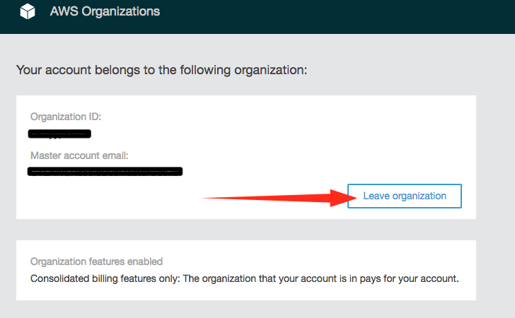

{{{
  "title": "Partner Cloud: AWS Customers Leaving CenturyLink",
  "date": "05-07-2018",
  "author": "Ben Swoboda",
  "attachments": [],
  "contentIsHTML": false
}}}

### Overview

Departing AWS Customers leaving CenturyLink may be interested in understanding the process for gaining root account access, plus removing of non-customer IAM accounts, groups, roles, and federation.


### Audience

AWS Customers of CenturyLink whose contract has ended.

### Prerequisites

*  Pay off all previous invoices

* Contact with your CenturyLink account representative.

* Correct access to your AWS account(s). (See below.)

* Review the [Service Guide](https://www.ctl.io/legal/cloud-application-manager/service-guide/).

* Review the [Cloud Application Manager Supplemental Terms](https://www.ctl.io/legal/cloud-application-manager/supplemental-terms/)

* Understand AWS [organizations](https://docs.aws.amazon.com/organizations/latest/userguide/orgs_introduction.html)


### Important Information

Your departure will be aided by creating a support ticket. Please review the following information to help you create the content of that ticket. Then send in the ticket and contact AWS for the legal process to begin. Three parties must sign: your company, AWS, and CenturyLink. A template for the ticket is below. You do not need to know exactly what date you will be leaving when you create the ticket.

Prior to the expiration of a contract for Cloud Application Manager 1.0, you should schedule time to work with CenturyLink to 1) leave the CenturyLink-governed AWS Organization 2) obtain the root account credentials from CenturyLink. 3) Remove CenturyLink access. The goal is to perform those steps on the day of your departure, but it is reasonable to expect it within two weeks.

Be certain your Accounts Payable team is aware of this transition. Immediately after leaving the CenturyLink organization, all usage on the account is Payable to AWS. If you leave in the middle of the month, you should expect a prorated invoice from both AWS, CenturyLink, and potentially another reseller partner.

### Preparation

**Ticket Information**

You can help determine how to fill in the blanks by reading the rest of this document. We recommend you create this ticket at least two weeks prior to the end of the contract. Please direct the ticket towards the "CAM_CloudIntegration" group.

```
This is a request to meet with my CenturyLink account representative and potentially a member of the Cloud Application Manager Product team.

Goal:
Target Date:
CenturyLink account representative:
Departing AWS AccountIDs:
AWS AccountIDs to which you currently do not have root access:
Secure method of delivering root credentials to you:
Who do you want to handle removing your member accounts from our AWS organization? (CenturyLink or your company):
If your company, identify any AWS Users needing permissions:
Do you wish to continue using CAM for ALM?:
Special Considerations:
```

**Gain Legal Approval**

After you send in the ticket described above, contact AWS for the legal process to begin. Arrangements will be made for three parties to grant permission: your company, AWS, and CenturyLink.

**Prepare payment for accounts with expired credit cards and new accounts created with CenturyLink**

AWS requires all accounts that are no longer part of an AWS Organization to have a valid payment method. You should prepare to have your company credit card on hand for your departure.  

Since you received invoices through CenturyLink you were not required to have a credit card on accounts created with CenturyLink. All those accounts will not be able to leave CenturyLink until an administrator applies a credit card as the [payment method](https://docs.aws.amazon.com/awsaccountbilling/latest/aboutv2/edit-payment-method.html).

**How will you leave the CenturyLink-governed AWS Organization**

If you will be departing CenturyLink's organization to join another AWS organization, we recommend you have the other organization send invitations to you within fifteen days of your target date so that invitation will be queued up and ready when you depart. You can then handle everything at once. If that is not possible, then the most efficient way to schedule it is just to ask a CenturyLink admin to revoke your membership for all your accounts at once.

leaving the CenturyLink-governed AWS Organization will be handled by someone with the appropriate permissions. Either someone with root access to the account or one of your IAM users with the appropriate permissions. (Having one of your IAM users do it will require CenturyLink to change your IAM policy before you depart.)

A CenturyLink administrator can remove membership from your org for all your accounts out at once.

Obtaining the root account credentials must be done with your company's security in mind.  It is best if you coordinate that transition via phone to prevent security gaps. It will first require CenturyLink to remove Multi-Factor Authentication and change the email and password for the root account.


### Transition Activities

**Remove Account Membership**

If you will be joining another AWS Organization, it is recommended you have the invitations from the other organization sent to your accounts prior to departing CenturyLink.

If your users will be handling the process of departing, here is how to do it from the console:

* https://console.aws.amazon.com/organizations/
* Click "Leave Organization"



* If you are then accepting invitations to another organization, you may mimic the steps you performed when your account [became a member](partner-cloud-integration-aws-existing.md) of the CenturyLink-governed AWS Organization after accepting Terms and Conditions.


**Address Your Data Generated by CenturyLink Configuration:**

Data for standard customers accounts has been saved within the accounts. Two Simple Storage Service (S3) buckets have been created by CenturyLink.

 * You may keep the data, archive it, or delete it as you like.
>   * config-bucket-<accountID>
>   * ctlaudit-<accountID>

**Revoke CenturyLink Access**

Performing the following steps will remove any federated access with CenturyLink employees or its tools:

* Several IAM Policies have been created by CenturyLink. Do a search within IAM for "CTL" and all our policies will be presented to you. If you wish to delete one, select one and click "Policy Actions" then Delete. If you wish to keep using CAM for Application Lifecycle Management, then please keep the policy that is described in the associated CAM provider intact. CenturyLink will need to work with you to keep the existing CAM provider, but remove the "Optimization" tags.

* Several IAM Roles have been created. Do a search within IAM for "CTL" and all our policies will be presented to you. If you wish to delete one, select one and click "Policy Actions" then Delete.
