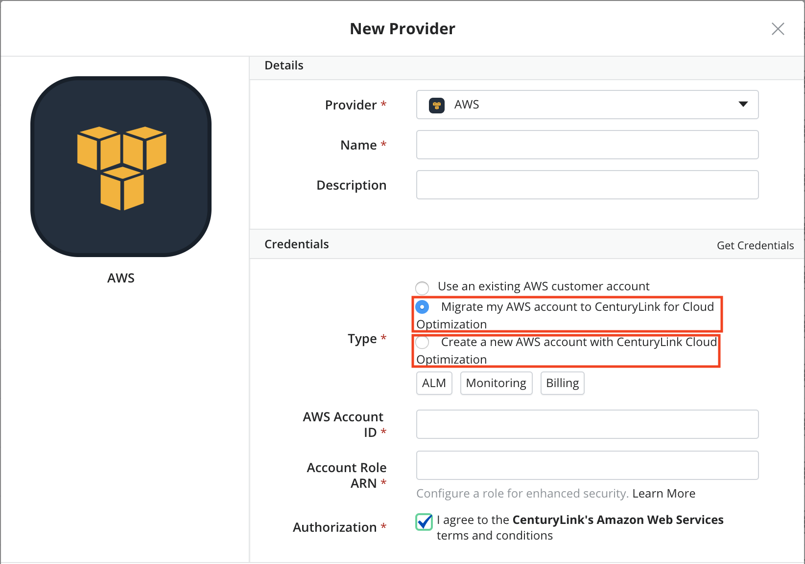
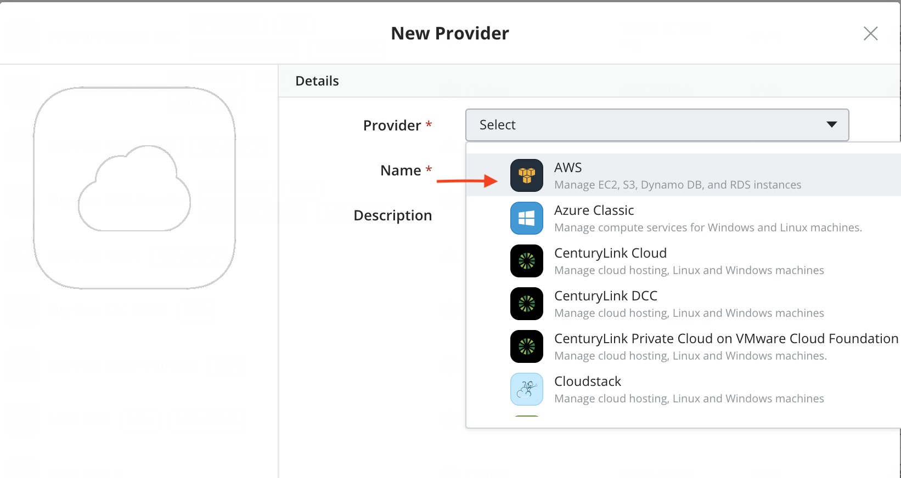
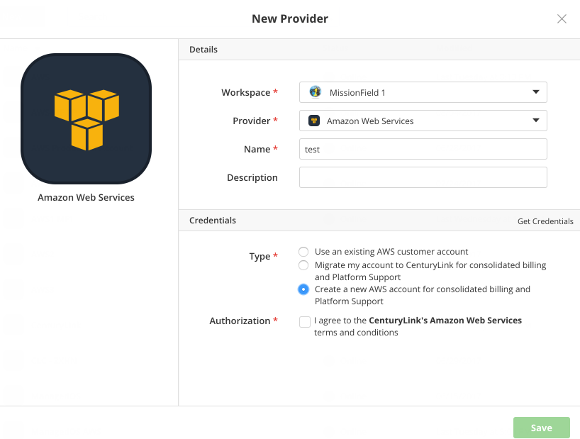
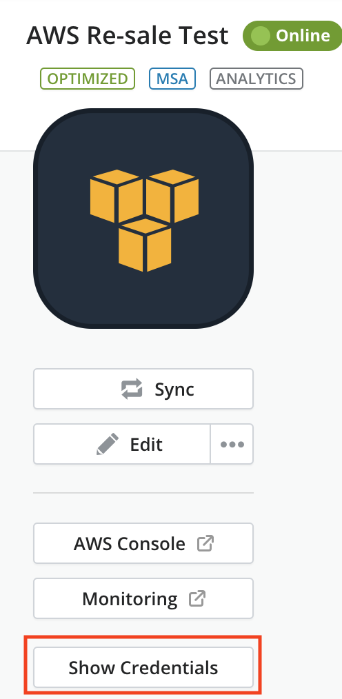
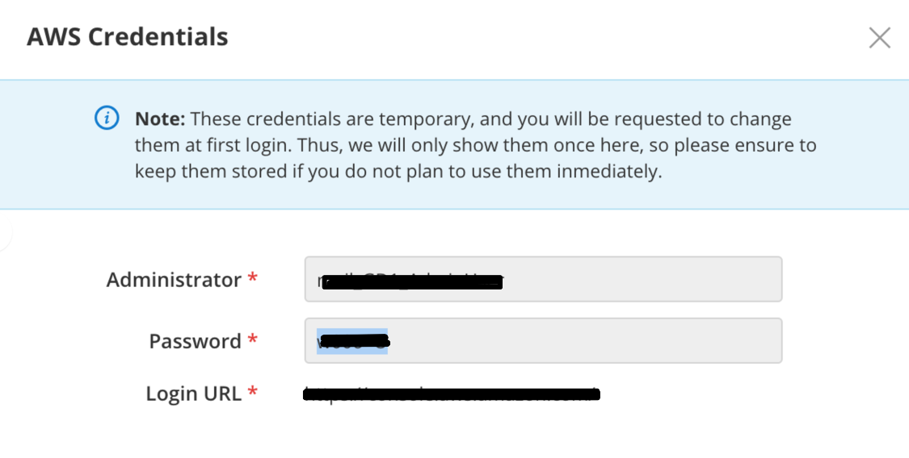

{{{
  "title": "Partner Cloud: Getting Started With A New AWS Customer Account",
  "date": "08-18-17",
  "author": "Ben Swoboda",
  "attachments": [],
  "contentIsHTML": false
}}}

### Overview

Part of [Cloud Application Manager's](https://www.ctl.io/cloud-application-manager/) Cloud Optimization gives users the ability to benefit from CenturyLink's partnerships with other cloud providers. CenturyLink assumes the billing for these accounts and takes responsibility for platform support. Users may also benefit from Security hardening and cost Analytics. This document is about creating new Amazon Web Services with Cloud Optimization.

### Audience

All of our customers are invited to use Cloud Optimization via Cloud Application Manager.

For Amazon Web Services, we are currently limited to serving billable customers who are not resellers (or customers of resellers) with offices within the United States. Also, this offering is not for CenturyLink employees. If you need special considerations for setting up an account, please email [cloudintegration@ctl.io](mailto:cloudintegration@ctl.io).

### Prerequisites

* Access to Cloud Application Manager.

* The user must be an Administrator of the organization in Cloud Application Manager.

* A working knowledge of how to use [Cloud Application Manager providers](../Core Concepts/providers.md).

* An understanding of the features and benefits of [Partner Cloud Integration](partner-cloud-integration.md)

* For each CenturyLink Cloud account integrated with Amazon Web Services, both CenturyLink's AWS Terms and Conditions for the relevant territory must be accepted. These will be presented to any user attempting to create a new "Amazon Web Services" provider in Cloud Application Manager.

### Important Information

Charges for [AWS usage](partner-cloud-integration-consolidated-billing.md) will appear on invoices from CenturyLink.

Cloud Application Manager Provider Option | Description | Related Links
--- | --- | ---
 Use an existing AWS customer account | This is not an Optimized account and customer pays Amazon for usage. | [Click here](../Deploying Anywhere/using-your-aws-account.md)
   Migrate my account to CenturyLink for consolidated billing and Platform Support | **This is a Cloud Optimized option.** Provided Amazon has approved the account transfer, this allows an existing customer account to move under CenturyLink's care. | [Click Here](partner-cloud-integration-aws-existing.md)
  Create a new AWS account for consolidated billing and Platform Support | **This is a Cloud Optimized option.** Initiates the new account creation process, enabling the customer to immediately enter CenturyLink's care without prior approval from AWS. | This page

Any Amazon Web Service offering is available through CenturyLink.

**Considerations**

New AWS Accounts will automatically be Optimized.

* **Data Access** Certain AWS Management Console reports will be restricted because they will not provide accurate representation of pricing, CenturyLink-provided discounts, or managed costs. Optimized accounts have access to use Cloud Application Manager's [Analytics](../Analytics/CloudApplicationManagerAnalyticsUI.md) and [Monitoring](../Monitoring/CTLCloudMonitoringUI.md) tools for usage details that would have been provided by AWS Billing Services such as Cost Explorer and to offer our customers visibility into the status of their environment. Additionally, customers will not be given access to consolidated data within the CenturyLink-owned Master Payers.

* **Reserved Instances**
  * Customers may contact CenturyLink if they wish to have their Reserved Instance limit increased.

### Steps

The following steps will walk through how to set up a new Cloud Application Manager provider that has been designed to create an Amazon Web Services Customer account within the scope of CenturyLink's responsibility.

Videos of these steps can be found [here](https://www.ctl.io/guides/).

1. Log into Cloud Application Manager.
2. Select the Providers tab
3. Select New
4. Select "Amazon Web Services"

5. Provide a name for the provider that identifies it for your purposes

6. Select the "Create a new AWS account with CenturyLink Cloud Optimization" option. (If the user cannot see this option, they are not an organization Administrator.)

  

7. Accept the Terms and Conditions

Please expect at least a few hours before we are able to process your request. In the meantime, the following will be completed:

* Create an new Amazon Web Services Customer account on your behalf
* Link the account to a CenturyLink-owned Master Payer, enabling consolidated billing.
* Configure IAM Roles, Groups, Policies, and users to enable account automation, platform support, cost optimization, best practices, and access for your Administrator
* Set the password policy
* Set up CloudTrail and an associated S3 bucket to log security events,
* Set up AWS Config Service for auditing
* Enable MFA Access

8. Within five minutes, you will now automatically receive temporary credentials to your account right within the provider. Click the  "Show Credentials" button to obtain administrator username, temporary password, and login URL for your account. The password is temporary and you will be requested to change it at first login. You may either log into the account via the URL provided or you may click the "AWS Console Button." *Please Note:*  We do not provide root access per our hardening policy.  [See Hardening Policy](partner-cloud-integration-aws-hardening-permissions.md)

  

  

### Contacting Cloud Application Manager Support

If you are having an issue in [Cloud Application Manager](https://www.ctl.io/cloud-application-manager/), please review the [troubleshooting tips](../Troubleshooting/troubleshooting-tips.md), or contact [Cloud Application Manager support](mailto:incident@CenturyLink.com) with details and screenshots where possible.

For issues related to API calls, send the request body along with details related to the issue.

In the case of a box error, share the box in the workspace that your organization and Cloud Application Manager can access and attach the logs.

* Linux: SSH and locate the log at /var/log/elasticbox/elasticbox-agent.log
* Windows: RDP into the instance to locate the log at ProgramDataElasticBoxLogselasticbox-agent.log

If you would like a complete IAM assessment, please reach out to your assigned CTL representative.
