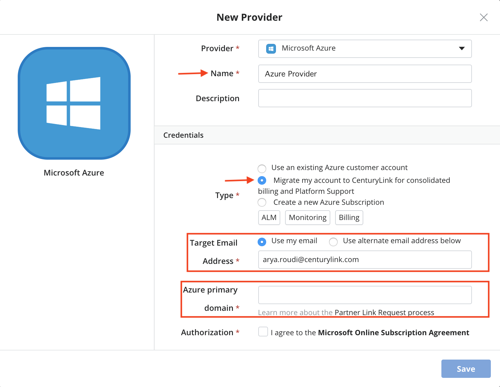

{{{
  "title": "Partner Cloud: Getting Started With An Existing Azure Customer Account",
  "date": "02-20-2019",
  "author": "Benjamin Swoboda",
  "attachments": [],
  "contentIsHTML": false
}}}

### Overview

[Cloud Application Manager](https://www.ctl.io/cloud-application-manager/) offers the Cloud Integration feature, giving users the ability to benefit from CenturyLink's partnerships with other cloud providers. CenturyLink integrates the billing and assumes responsibility for Azure support. This document is specific to Azure.

### Audience

All of our customers are invited to use Cloud Optimization via Cloud Application Manager.

For Azure, we are currently limited to serving billable customers who are not resellers (or customers of resellers) with offices within the United States, the United Kingdom, and Canada. Also, the associated CenturyLink Cloud account cannot be a demo account or internal for CenturyLink employees. If you need special considerations for setting up an account, please email [cloudintegration@ctl.io](mailto:cloudintegration@ctl.io).

### Prerequisites

* Knowledge who your existing Azure Administrator is

* Access to Cloud Application Manager.

* The user must be an Administrator of the organization or Cost Center admin in Cloud Application Manager.

* A working knowledge of how to use [Cloud Application Manager providers](../Core Concepts/providers.md).

* An understanding of the features and benefits of [Partner Cloud Integration](partner-cloud-integration.md)

* For each CenturyLink Cloud account integrated with Azure, both CenturyLink's and Microsoft's Terms and Conditions must be accepted. These will be presented to any user attempting to create a new "Microsoft Azure" provider in Cloud Application Manager. See our [Service Guide](https://www.ctl.io/legal/cloud-application-manager/supplemental-terms/) for a current list of countries we support.

### Important Information

Cloud Application Manager Provider Verbiage | Description | Related Links
--- | --- | ---
Use an existing Azure customer account | This is not an optimized option. Customer pays Microsoft for usage. | [Click here](../../Cloud Application Manager/Deploying Anywhere/using-microsoft-azure.md)
Migrate my account to CenturyLink for consolidated billing and Platform Support | **This is a Cloud Optimized option.** This allows an existing customer account to move under CenturyLink's care. | This document
Create a new Azure customer account | **This is a Cloud Optimized option.** Begins the new account creation automation, enabling the customer to immediately enter CenturyLink's care. | [Click Here](partner-cloud-integration-azure-new.md)

Charges for [Azure usage](partner-cloud-integration-consolidated-billing.md) will appear on invoices from CenturyLink.

### Considerations

* “If you do not have a basic, existing Azure ARM subscription with basic Azure pricing (such as an Enterprise Agreement), the process will require you to work with the CenturyLink Technical Account Manager assigned to you when you order CAM to move any applicable resources from your current subscription to a new one in our care. As you do this, you will lose any pricing you have currently with the Microsoft and you will be billed by CenturyLink according to the terms of your agreement with CenturyLink. Please review [this document](https://docs.microsoft.com/en-us/azure/azure-resource-manager/resource-group-move-resources) to see whether the resources on those subscription(s) can transfer wholly into CenturyLink's care (this is a meta data move only and does not cause any outage).”
* In a CSP environment, it is expected that customers enjoy the benefits of CenturyLink acting as liason to Microsoft and first point of contact for all Azure incidents, billing issues, and requests. Customers who gain access to Cloud Application Manager's support desk and features do so in lieu of certain Azure features which are available, such as help desk and billing consoles.
* [Reserved Instances](partner-cloud-integration-azure-ri.md) are available through CenturyLink.

### Steps

The following steps will walk through how to set up a Cloud Application Manager provider that has been designed to transfer an existing Azure Customer account into the scope of CenturyLink's responsibility.

NOTE: If the customer is already partnered with another provider, they may need to log into portal.office.com and remove the existing partnership. The Azure Admin will need to log in with Azure domain credentials, click "Partner Relationships" and select the existing provider to remove.

  

1. Log into Cloud Application Manager.
2. Select the Management site
3. If you are a Cost Center Admin, change your scope to a correct cost center scope for which you want the provuder to be associated.
4. Click Provider and Select New
5. In the Provider drop-down, select "Microsoft Azure" 

  
6. Provide a name for the provider is in line with the name of the Subscription to ensure you have a quick understanding which provider is associated with a Subscription.
7. Select the "Migrate my account to CenturyLink for consolidated billing and Platform Support" option. (If the user cannot see this option, they are not an organization Administrator.)
  
8. Determine to which email you want the partner request email sent.
9. Enter the primary Azure domain name for your subscription. This allows us to recognize your subscription once it migrates into our care. Typically, this domain is easy to determine. If your username to portal.azure.com is <yourname>@1234.onmicrosoft.com, then your primary domain is "1234.onmicrosoft.com". If you are still not certain, please submit a support ticket to discuss.
10. Accept the Terms and Conditions
11. The user will receive an email shortly with a link that will need to be clicked by the existing Azure Administrator. Once clicked, they will be directed to an Office 365 sign in page. (Please contact Microsoft if you are not clear who this is.)
  
12. The Azure Admin will need to log in with Azure domain credentials. They will be directed to a page where they must accept Terms and Conditions and authorize CenturyLink.

  

12. This is all it takes to move your Azure "Customer" tenant into CenturyLink's care. In some cases, work may need to be done to move your Azure Subscription(s) as well. This may require that your Azure Administrator give Owner access to a CenturyLink-generated user on the Subscription(s). If that is true, CenturyLink representatives will contact you guide you through this Microsoft-approved process.

13. CenturyLink will work with you to enable Cloud Application Manager to work on your behalf.

In the end, the following will have occurred:

* Microsoft will be provided with your account details
* Your Azure Customer account will be migrated under CenturyLink's care
* Your Microsoft Azure Subscription(s) for that Customer account will be migrated under CenturyLink's care
* Moves approved resources under CenturyLink's care for consolidated billing and platform-level support
* Grants Cloud Application Manager the appropriate permissions to work on your behalf

### Contacting Cloud Application Manager Support

If you are experiencing an issue with [Cloud Application Manager](https://www.ctl.io/cloud-application-manager/), please review the [troubleshooting tips](../Troubleshooting/troubleshooting-tips.md), or contact [Cloud Application Manager support](mailto:incident@CenturyLink.com) with details and screenshots where possible.

For issues related to API calls, send the request body along with details related to the issue.

In the case of a box error, share the box in the workspace that your organization and Cloud Application Manager can access and attach the logs.
* Linux: SSH and locate the log at /var/log/elasticbox/elasticbox-agent.log
* Windows: RDP into the instance to locate the log at ProgramDataElasticBoxLogselasticbox-agent.log
