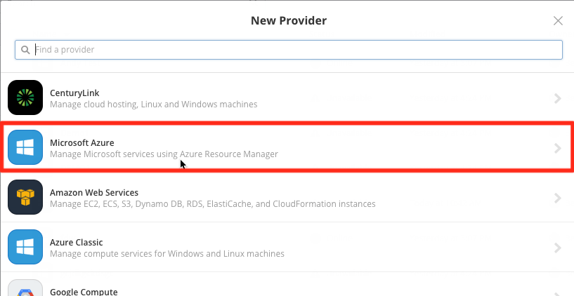
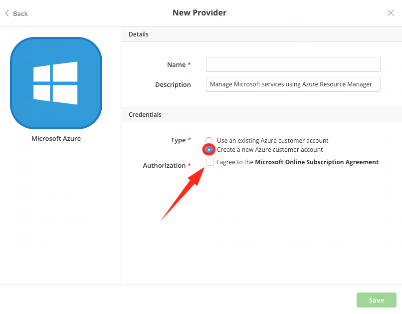

{{{
  "title": "Partner Cloud: Getting Started With A New Azure Customer Account",
  "date": "03-03-17",
  "author": "Ben Swoboda",
  "attachments": [],
  "contentIsHTML": false
}}}

### Overview

[Cloud Application Manager](https://www.ctl.io/cloud-application-manager/) offers the Cloud Integration feature, giving users the ability to benefit from CenturyLink's partnerships with other cloud providers. CenturyLink integrates the billing and assumes responsibility for Azure support. This document is specific to Azure.

### Audience

All of our customers are invited to use Cloud Integration via Cloud Application Manager.

For Azure, we are currently limited to serving billable customers who are not resellers (or customers of resellers) with offices within the United States. Also, the associated CenturyLink Cloud account cannot be a demo account or internal for CenturyLink employees. If you need special considerations for setting up an account, please email [cloudintegration@ctl.io](mailto:cloudintegration@ctl.io).

### Prerequisites

* Access to Cloud Application Manager.

* The user must be an Administrator of the organization in Cloud Application Manager.

* A working knowledge of how to use [Cloud Application Manager providers](../Core Concepts/providers.md).

* An understanding of the features and benefits of [Partner Cloud Integration](./partner-cloud-integration.md)

* For each CenturyLink Cloud account integrated with Azure, both CenturyLink's and Microsoft's Terms and Conditions must be accepted. These will be presented to any user attempting to create a new "Azure Resource Manager" provider in Cloud Application Manager.

### Important Information

Your charges in Azure will appear as a CenturyLink Public Cloud line item, labeled as "**Integrated Azure Services Usage**".

If you have an existing, Azure customer account for which you would like CenturyLink to assume support and billing responsibility, please contact your CenturyLink representative to discuss.

CenturyLink will manage Azure permissions for our customers to ensure we can support all resources provisioned there. The [Azure permissions can be viewed here](./partner-cloud-integration-azure-capabilities.md) to determine what Azure products and services are offered, currently. If there are other resources you would like to allow CenturyLink to support, please email [CloudIntegration-feedback@ctl.io](mailto:cloudintegration@ctl.io) or submit a [service request](./partner-cloud-integration-azure-support.md).

### Steps

The following steps will walk through how to set up a new Cloud Application Manager provider that has been designed to create an Azure Customer account within the scope of CenturyLink's responsibility.

Videos of these steps can be found [here](https://www.ctl.io/guides/).

1. Log into Cloud Application Manager.
2. Select the Providers tab
3. Select New
4. Select "Microsoft Azure"

  

5. Provide a name for the provider that identifies it for your purposes

6. Select the "Create a new Azure customer account" option. (If the user cannot see this option, they are not an organization Administrator.)

  

7. Accept the Terms and Conditions

Please expect at least a two-minute wait while our automated process performs the following:

* Provides Microsoft your account details
* Creates an Azure Customer account on your behalf
* Creates a Microsoft Azure Subscription for that Customer account
* Grants Cloud Application Manager the appropriate permissions to work on your behalf

### Contacting Cloud Application Manager Support

We’re sorry you’re having an issue in [Cloud Application Manager](https://www.ctl.io/cloud-application-manager/). Please review the [troubleshooting tips](../Troubleshooting/troubleshooting-tips.md), or contact [Cloud Application Manager support](mailto:cloudsupport@centurylink.com) with details and screenshots where possible.

For issues related to API calls, send the request body along with details related to the issue.

In the case of a box error, share the box in the workspace that your organization and Cloud Application Manager can access and attach the logs.
* Linux: SSH and locate the log at /var/log/elasticbox/elasticbox-agent.log
* Windows: RDP into the instance to locate the log at ProgramDataElasticBoxLogselasticbox-agent.log
