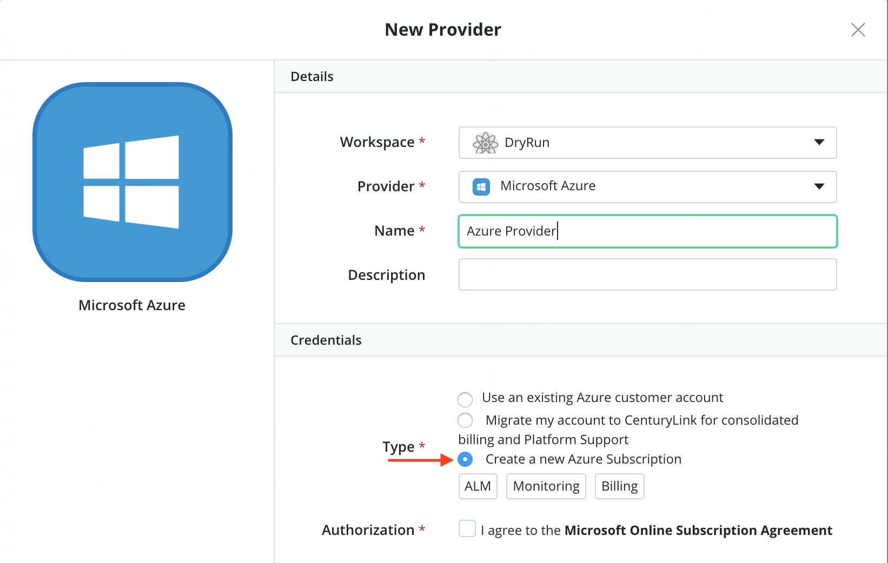

{{{
  "title": "Partner Cloud: Getting Started With A New Azure Customer Account",
  "date": "07-20-18",
  "author": "Kevin Quaintance",
  "attachments": [],
  "contentIsHTML": false
}}}

### Overview

[Cloud Application Manager](https://www.ctl.io/cloud-application-manager/) offers the Cloud Integration feature, giving users the ability to benefit from Lumen's partnerships with other cloud providers. Lumen integrates the billing and assumes responsibility for Azure support. This document is specific to Azure.

multiple Azure subscriptions provides your administrators the ability to easily manage users and resources for multiple Azure projects and departments by placing them in different Azure "Accounts.""

### Audience

All of our customers are invited to use Cloud Optimization via Cloud Application Manager.

For Azure, we are currently limited to serving billable customers who are not resellers (or customers of resellers) with offices within the United States the United Kingdom, and Canada. Also, the associated Lumen Cloud account cannot be a demo account or internal for Lumen employees. If you need special considerations for setting up an account, please email [cloudintegration@ctl.io](mailto:cloudintegration@ctl.io).

### Prerequisites

* Access to Cloud Application Manager.

* The user must be an Administrator of the organization in Cloud Application Manager.

* A working knowledge of how to use [Cloud Application Manager providers](../Core Concepts/providers.md).

* An understanding of the features and benefits of [Partner Cloud Integration](partner-cloud-integration.md)

* For each Lumen Cloud account integrated with Azure, both Lumen's and Microsoft's Terms and Conditions must be accepted. These will be presented to any user attempting to create a new "Microsoft Azure" provider in Cloud Application Manager. See our [Service Guide](https://www.ctl.io/legal/cloud-application-manager/supplemental-terms/) for a current list of countries we support.

### Important Information

Cloud Application Manager Provider Verbiage | Description | Related Links
--- | --- | ---
Use an existing **Microsoft Azure** customer account | This is not an optimized option. Customer pays Amazon for usage. | [Click here](../../Cloud Application Manager/Deploying Anywhere/using-microsoft-azure.md)
Migrate my account to Lumen for consolidated billing and Platform Support | **This is a Cloud Optimized option.** This allows an existing customer account to move under Lumen's care. | [Click Here](partner-cloud-integration-azure-existing.md)
Create a new Azure customer account and Subscription or a new subscription for an existing account | **This is a Cloud Optimized option.** Begins the new account creation automation, enabling the customer to immediately enter Lumen's care. | This document

Charges for [Azure usage](partner-cloud-integration-consolidated-billing.md) will appear on invoices from Lumen.

### Steps

The following steps will walk through how to set up a new Cloud Application Manager provider that has been designed to do one of the following:
* Create a new Azure Customer account and a new Azure subscription  
* If the CAM organization already has an Azure Customer with at least one subscription, create another Azure subscription.

Subscriptions created in the manners above fall within the scope of Lumen's responsibility.

Videos of these steps can be found [here](https://www.ctl.io/guides/).

1. Log into Cloud Application Manager.
2. Select the Providers tab
3. Select New
4. In the Provider drop-down, select "Microsoft Azure"

  

5. Write a name for the provider. The name you type will  become the name for your Subscription in Azure.

6. Select the "Create a new Azure customer Subscription" option. (If the user cannot see this option, they are not an organization Administrator.)

  

7. Accept the Terms and Conditions

Please expect at least a two-minute wait while our automated process performs the following:

* Provides Microsoft your account details
* Creates an Azure Customer account on your behalf
* Creates a Microsoft Azure Subscription for that Customer account
* Grants Cloud Application Manager the appropriate permissions to work on your behalf
* Creates three deployment policies in your organization so that Azure deployments via ALM may occur with fewer work on your part.

**ADMIN Accounts**
For each CAM Customer, administrators of the first, Optimized Azure Subscription will receive Admin credentials and login URL. This can be obtained through the "Show Credentials" button of the Optimized, Azure provider. The admin user will receive the Owner role for that first subscription and *all future subscriptions created via Cloud Application Manager*. If that Cloud Application Manager user also launches other Azure providers, their existing Azure user will also get the Owner role on the new subscriptions. A new Azure user will not be created.

 

### Contacting Cloud Application Manager Support

If you are experiencing an issue with [Cloud Application Manager](https://www.ctl.io/cloud-application-manager/), please review the [troubleshooting tips](../Troubleshooting/troubleshooting-tips.md), or contact [Cloud Application Manager support](mailto:incident@CenturyLink.com) with details and screenshots where possible.

For issues related to API calls, send the request body along with details related to the issue.

In the case of a box error, share the box in the workspace that your organization and Cloud Application Manager can access and attach the logs.
* Linux: SSH and locate the log at /var/log/elasticbox/elasticbox-agent.log
* Windows: RDP into the instance to locate the log at ProgramDataElasticBoxLogselasticbox-agent.log
