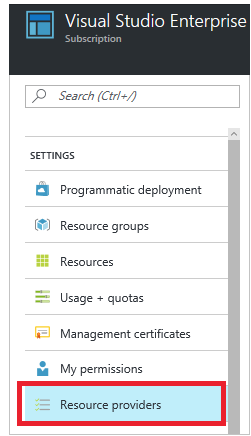

{{{
  "title": "Partner Cloud: Registering Resources",
  "date": "03-03-17",
  "author": "Ben Swoboda",
  "attachments": [],
  "contentIsHTML": false
}}}

### Overview

With Microsoft Azure, you may find that some products which should be immediately deployable are not. Microsoft Azure has a concept of registering for some resources, while others are registered by default. There are even times when you may need to re-register these resources. 
 

### Audience
Users of Microsoft Azure.

### Prerequisites
An active, Microsoft Azure Subscription.

### Important Information
For your subscription, go to Resource Providers. Look at the list of resource providers, and if necessary, select the Re-register link to re-register the resource provider of the type you are trying to deploy.



More information can be found in [Microsoft's site](https://docs.microsoft.com/en-us/azure/azure-resource-manager/resource-manager-supported-services).

### Contacting Cloud Application Manager Support


We’re sorry you’re having an issue in [Cloud Application Manager](https://www.ctl.io/cloud-application-manager/). Please review the [troubleshooting tips](../Troubleshooting/troubleshooting-tips.md), or contact [Cloud Application Manager support](mailto:incident@CenturyLink.com) with details and screenshots where possible.
 
For issues related to API calls, send the request body along with details related to the issue.
 
In the case of a box error, share the box in the workspace that your organization and Cloud Application Manager can access and attach the logs.
* Linux: SSH and locate the log at /var/log/elasticbox/elasticbox-agent.log
* Windows: RDP into the instance to locate the log at ProgramDataElasticBoxLogselasticbox-agent.log
