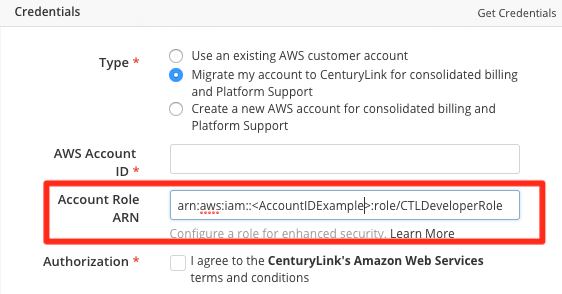
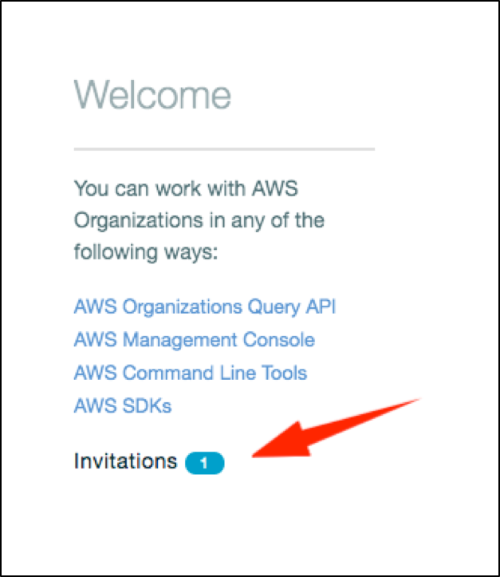

{{{
  "title": "Partner Cloud Integration: Connecting Existing AWS Accounts for Optimization",
  "date": "8-17-2016",
  "author": "Ben Swoboda",
  "attachments": [],
  "contentIsHTML": false
}}}

### Overview

Existing Accounts which are transferred into CenturyLink's care (a result of an approved account transfer process agreement with AWS) need to consider the permissions they are required to give CenturyLink.

### Audience

Customers responsible for AWS Accounts which have been approved by Amazon Web Services to perform a transfer of the account into CenturyLink's care.

### Prerequisites

* The customer must already have an AWS account that has been specifically mentioned in the AWS account transfer process. (Only approved accounts are authorized for this process.)
* The customer must have reviewed the process for transferring an [existing Amazon Web Services account](partner-cloud-integration-aws-existing.md)


### Important Information

All accounts coming to CenturyLink must enable Full Hardening. Your CAM organization administrator needs to update the Account Role ARN field.



Below is a table that will help you understand the permissions you will provide to CenturyLink. Below the table are steps to provide the level of access you have decided upon.

  Cloud Optimization Option | Benefits | IAM Permissions given to CenturyLink | Automated changes |
  --- | --- | --- | ---
  Full Hardening | All the benefits listed above, plus AWS-recommendations within the account for security, compliance, and support. | Admin | All the automated changes above for the purpose of [support](). Creates IAM Policies and Roles for CenturyLink Operations Staff to give them access to your account. Configures a secure password policy. Sets up an S3 audit bucket for CloudTrail and activates CloudTrail on that bucket, auditing all buckets in the linked account. Sets up the AWS Config service for regular compliance monitoring. Performs the steps [here](../Deploying Anywhere/using-your-aws-account.md), providing standard permissions to Cloud Application Manager and syncs the provider.

More details regarding these roles and permissions are [here](partner-cloud-integration-aws-hardening-permissions.md)


### Steps

**Full Hardening**
1. Provide your AWS Account ID in the required field.
2. Log into your AWS Account
3. Navigate to IAM, Click Policies, and Create Your Own Policy with the following Data:

  - Policy Name: CTLDeveloperPolicy

  - Description: Provides necessary access to AWS services and resources so that compliance-related services may be activated and other IAM policies and roles may be set up for CenturyLink Operational Staff.

  - Policy Document:
```
{
    "Version": "2012-10-17",
    "Statement": [
        {
            "Effect": "Allow",
            "Action": "*",
            "Resource": "*"
        }
    ]
}
```

4. Navigate to IAM and Create a New  Role with the following Data:
  - Role for Cross Account access
  - Provide access "between AWS accounts you own,"
  - Provide access to 589942003651. MFA not required.
  - Attach the CTLDeveloperPolicy
  - Role Name: CTLDeveloperRole
  - Description: Provides necessary access to AWS services and resources so that compliance-related services may be activated and other IAM policies and roles may be set up for CenturyLink Operational Staff.

5. When the role is created, click into it and copy the Role ARN.
6. Paste the ARN into the Account Role ARN field of the AWS provider.
7. Accept the invitation. An invitation will be sent to the account from CenturyLink. AWS notifies the root user of the account in two different ways: an email sent to the email address of the root user, and an invitation within the "My Organization" feature of the Customer account. To a accept the invitation, follow these steps afer logging into the account with your root user:

  * Navigate to "My Organization"


  * Click Invitations.



  * Check that the invite is from a CenturyLink account and accept it.


  * Confirm joining the organization.


  The status of the Cloud Application Manager provider will eventually change to "online: because it will should synchronize. Please return to [existing Amazon Web Services account](partner-cloud-integration-aws-existing.md) and continue with the remaining steps.
