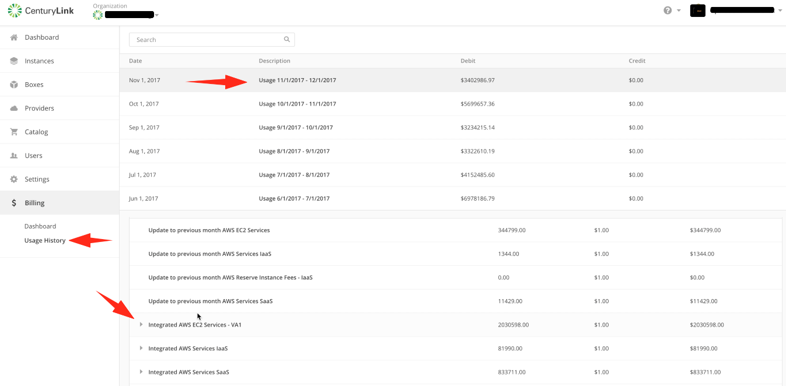
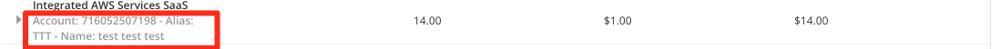
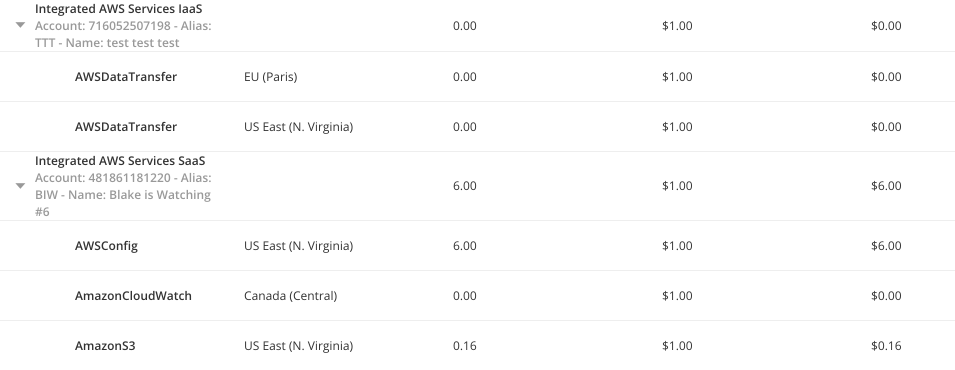
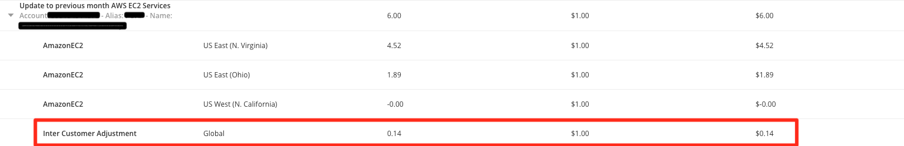

{{{
  "title": "Partner Cloud Integration: Detailed Usage History",
  "date": "06-29-2018",
  "author": "Kevin Quaintance",
  "attachments": [],
  "contentIsHTML": false
}}}

### Overview

Optimizing Accounts allows a Cloud Application Manager user to receive [consolidated bills](partner-cloud-integration-consolidated-billing.md). To get further details for these invoices, users may review the billing history.  Two views are available:  "Centurylink Billing Cycle" is displayed by default and, starting on the 10th of each month, the "Vendor Billing Cycle" view becomes available.

### Audience

All users with Cloud Application Manager organization administrator access.

### Prerequisites

At least one Optimized account.

Cloud Application Manager organization administrator access.

### Important Information

Starting January 1, 2018 data will be available according to the following methods for December 2017 usage, going forward. November reconciliation SKUs (labeled "Update to Previous Month...") which appear on the December invoice will not have any detail. If you need detailed information for those prior months, please submit a support ticket.

To gain access to the information, navigate to the billing history within Cloud Application Manager by switching your context to an organization. Then select "Billing", then "Usage History."

Select a month.

For each line item, you will see to which provider name, provider alias, and account or subscription ID to which it is associated. This line item equates to lines items you would see on your CenturyLink invoice.

You may select a line item and it will provide detail into all the services, by region, that contributed charges to that line item.

 **Inter-Customer Adjustments:** Details of how CenturyLink safeguards customer accounts so they are billed fairly is also represented. If a Reserved Instance is purchased in one account and assigned by Amazon Web Services to a different account, CenturyLink will perform inter-customer adjustments. The RI-purchasing account will be credited and the RI-consuming account will be debited.

 

 **Intra-Organization Adjustments:** Details of how CenturyLink distributes credits which may result from Inter-Customer Adjustments is also represented. It represents pre-invoice adjustments between your accounts. A common use case is when an AWS Customer with a multi-account, AWS Organization structure with a mature RI-purchase model becomes a resale customer of CenturyLink. They often have all (or most) of their RIs purchased in one account. Naturally, they expect them to be consumed by instances in at least one more of their accounts. In the shared pool of CenturyLink customers, RI benefits are shared with all other accounts. CenturyLink's "Inter-Customer Adjustments" debits the RI-consuming account and credits the RI-purchasing account. However, as the owner account of the use case described above often does not have any instances, the line item for that account would be driven to a negative balance, which is not consistent with AWS.

  * When a customer account has "negative totals" for a line item in one account, our logic looks for other accounts in the same CAM org which have positive usage. We can call those accounts "positive line accounts."
  * Without including the credit from RI Cross Customer Adjustments, we determine the "positive total."
  * We determine what percentages of the positive total each positive line account contributed. We can call that the "contributing percentage".
  * For each positive line account, we apply its "contributing percentage to the negative total. This will be its "pro-rated credit."
  * We apply the pro-rated credit to the positive share each positive line account contributed. The result is what is shown on each positive line account's invoice.
    * The accounts that had "negative totals" will show Intra-Organization Adjustments as debits that bring the line's balance to zero.
    * The positive line accounts will show a pro-rated credit as Intra-Organization Adjustments.

**Vendor Billing Cycle** view fulfills the need to reconcile the CenturyLink billing cycle with our vendor billing cycles.  On the 10th of every month, CenturyLink will make a final assessment of the differences between what we put on your last invoice and what our vendor charged us. With that final sliver of data, we can also make a "Vendor Billing Cycle" button appear in Cloud Application Manager's Usage History. When you click it, the data will align with the Vendor's billing cycle. Any line items that start with "Post-Bill Update" have not appeared on a CenturyLink invoice for that month. You will never see "Post Bill Updates" on an invoice. They are only presented in the Cloud Application Manager Usage History. But those same charges will appear as "Update to previous month…" on the next month's invoice.

Example: A customer thinks they may have $5 of EC2 usage from January. On February 1 they receive a CenturyLink invoice totaling $4 from CenturyLink: $3 of usage on a EC2 for January usage and a $1 charge from December usage called "Update to Previous Month's EC2 Services." There is no "Vendor Billing Cycle" Button yet available. On February 10, the customer sees the button in Cloud Application Manager. When they click it, they see the same $3 of usage on a EC2 for January usage plus the $2 Post-Bill Update to EC2 Services.

