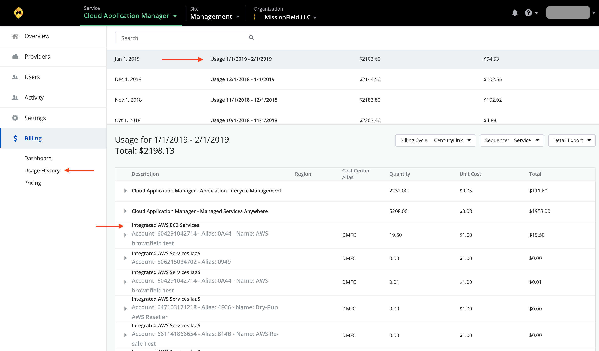
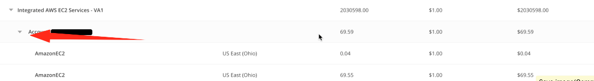

{{{
  "title": "Partner Cloud Integration: Detailed Billing Report",
  "date": "12-30-2017",
  "author": "Ben Swoboda",
  "attachments": [],
  "contentIsHTML": false
}}}

### Overview

Optimizing Accounts allows a Cloud Application Manager user to receive [consolidated bills](partner-cloud-integration-consolidated-billing.md). To get further details for these invoices, users may review the billing history.

### Audience

All users with Cloud Application Manager organization administrator access.

### Prerequisites

At least one Optimized account.

Cloud Application Manager organization administrator access.

### Important Information

Starting January 1, 2018 data will be available according to the following methods for December 2017, going forward. November reconciliation SKUs (labled "Update to Previous Month...") which appear on the December invoice will not have any detail. If you need detailed information for those prior months, please submit a support ticket.

To gain access to the information, navigate to the billing history within Cloud Application Manager by switching your context to an organization. Then select "Billing", then "Usage History."

Select a month.

By clicking the dropdown for the Optimization Line Item, it will explain how each partner account or subscription contributed to that SKU's total.

In addition, if you select the account, those charges can be further broken out by Service and Region.

