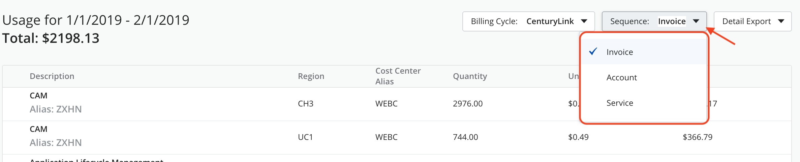
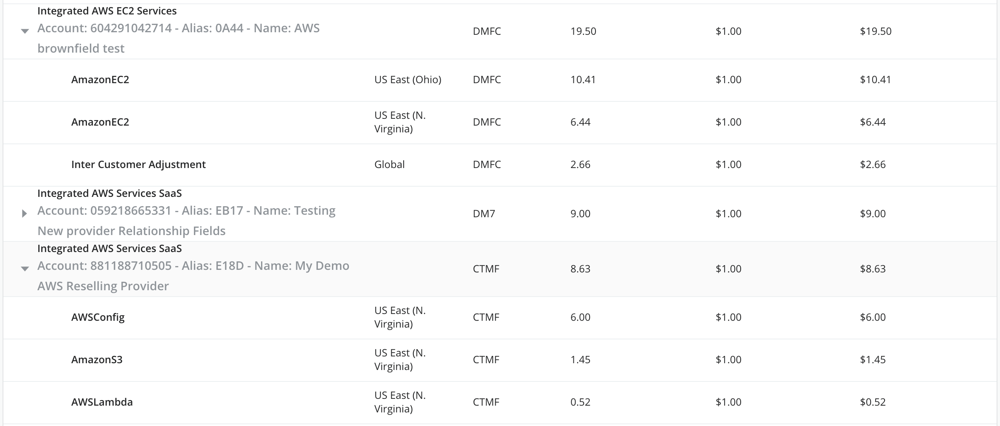
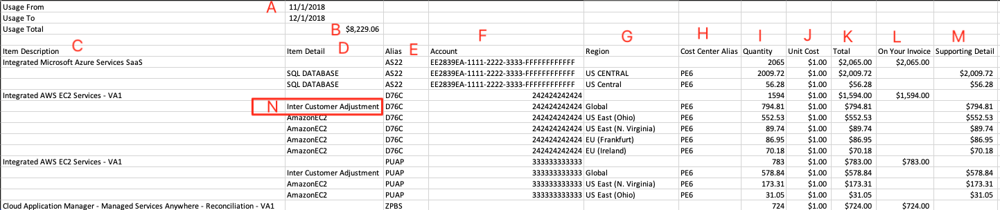

{{{
  "title": "Partner Cloud Integration: Detailed Usage History",
  "date": "12-20-2018",
  "author": "Ben Swoboda",
  "attachments": [],
  "contentIsHTML": false
}}}

### Overview

Usage History is designed primarily for the purpose of explaining your invoice. It contains information for resold services, Managed Services, Platform Advisory Support, Application Lifecycle Management, and any other charges attributable to Cloud Application Manager. There are several goals for Usage History.

* Provide detail similar to what you would expect on an invoice from your cloud vendor if you paid them directly.
* Provide transparency in regards to CenturyLink billing practices.
* Provide an understanding of the differences between CenturyLink's billing cycle and vendor billing cycles.
* Provide some flexibility in how information is presented.

Integrated Accounts allow a Cloud Application Manager user to receive [consolidated bills](partner-cloud-integration-consolidated-billing.md) and therefore review usage within Usage History. 

### Audience

All users with Cloud Application Manager organization administrator access.

### Prerequisites

Cloud Application Manager organization administrator access.

### Important Information

* To gain access to the information, in the top navigation bar change the "Site" to Management.
* Make certain the context is that of your Organization, not a Cost Center or Workspace.
* Select "Billing", then "Usage History."
* Select a month.

For each line item, you will see to which provider name, provider alias, and account or subscription ID to which charges are associated. This line item equates to lines items you would see on your CenturyLink invoice.

**Vendor Billing Cycle:** This view fulfills the need to reconcile the CenturyLink billing cycle with our vendor billing cycles.  On the 10th of every month, CenturyLink will make a final assessment of the differences between what we put on your last invoice and what our vendor charged us. With that final sliver of data, we can also make a "Vendor Billing Cycle" button appear in Cloud Application Manager's Usage History. When you click it, the data will align with the Vendor's billing cycle. Any line items that start with "Post-Bill Update" have not appeared on a CenturyLink invoice for that month. You will never see "Post Bill Updates" on an invoice. They are only presented in the Cloud Application Manager Usage History. But those same charges will appear as "Update to previous month…" on the next month's invoice.

Example: A customer thinks they may have $5 of EC2 usage from January. On February 1 they receive a CenturyLink invoice totaling $4 from CenturyLink: $3 of usage on a EC2 for January usage and a $1 charge from December usage called "Update to Previous Month's EC2 Services." There is no "Vendor Billing Cycle" Button yet available. On February 10, the customer sees the button in Cloud Application Manager. When they click it, they see the same $3 of usage on a EC2 for January usage plus the $2 Post-Bill Update to EC2 Services.

**Sequence:** Three groupings are available: invoice, account, and service. *Invoice* sequences the line items similar to how it is laid out on your CenturyLink Invoice. *Account* groups charges, account by account. regardless of service or invoice. *Service** groups charges by the type of service, regardless of service or invoice.

**Service and Region Details:** You may select a line item drop-down and it will provide detail into all the services, by region, that contributed charges to that line item, according to Centurylink's [consolidated billing](partner-cloud-integration-consolidated-billing.md) policy.

 **Inter-Customer Adjustments:** Details of how CenturyLink safeguards customer accounts so they are billed fairly is also represented. If a Reserved Instance is purchased in one account and assigned by Amazon Web Services to a different account, CenturyLink will perform inter-customer adjustments. The RI-purchasing account will be credited and the RI-consuming account will be debited.

 

 **Intra-Organization Adjustments:** Details of how CenturyLink distributes credits which may result from Inter-Customer Adjustments is also represented. It represents pre-invoice adjustments between your accounts. A common use case is when an AWS Customer with a multi-account, AWS Organization structure with a mature RI-purchase model becomes a resale customer of CenturyLink. They often have all (or most) of their RIs purchased in one account. Naturally, they expect them to be consumed by instances in at least one more of their accounts. In the shared pool of CenturyLink customers, RI benefits are shared with all other accounts. CenturyLink's "Inter-Customer Adjustments" debits the RI-consuming account and credits the RI-purchasing account. However, as the owner account of the use case described above often does not have any instances, the line item for that account would be driven to a negative balance, which is not consistent with AWS.

  * When a customer account has "negative totals" for a line item in one account, our logic looks for other accounts in the same CAM org which have positive usage. We can call those accounts "positive line accounts."
  * Without including the credit from RI Cross Customer Adjustments, we determine the "positive total."
  * We determine what percentages of the positive total each positive line account contributed. We can call that the "contributing percentage".
  * For each positive line account, we apply its "contributing percentage to the negative total. This will be its "pro-rated credit."
  * We apply the pro-rated credit to the positive share each positive line account contributed. The result is what is shown on each positive line account's invoice.
    * The accounts that had "negative totals" will show Intra-Organization Adjustments as debits that bring the line's balance to zero.
    * The positive line accounts will show a pro-rated credit as Intra-Organization Adjustments.

**CSV Export:**

Users may export the following .csv from the top navigation bar.

Letter In Image | Name  | Description  | Notes  
--- | --- | --- | ---
 A  | Usage Dates  | Range of billing cycle selected for the .csv | Only one month at a time is provided, but using multiple exports, one could organize the data in a variety of ways.
 B  | Usage Total  | Total of all CAM-related charges  |   
 C  | Item Description  | The Description of the Cloud Application Manager line item that appear on your invoice.   |   
 D  | Item Detail  | Supporting line items used to explain charges. They roll up under the Item description lines. See "Service and Region Details" above.   |   
 E  | Alias  | CAM-generated unique ID for each provider  | You may use this to group charges however you like.  
 F  | Account  | Where relevant, whatever ID the vendor uses to identify an account associated with the item detail.  |  
 G  | Region  | Where relevant, the region the vendor states is associated with the item detail. |   
 H  | Cost Center Alias  | CAM-generated unique ID for each cost Center  | Useful where a customer has opted for multiple invoices. Each cost center could have its own invoice.  
 I  | Quantity  |  The amount to which the Unit cost is multiplied. | With CAM, units are often pure dollars. |
  J | Unit Cost  | The rate for which units are charged.  |   
 K  | Total  | Quantity multiplied by unit cost  | At the present time, there may be some. See note for M, below.  
 L  | On Your Invoice  | Contains line item totals for which you are charged on your invoice.  |   
 M | Supporting Detail  | Item detail totals that add up to the "On your Invoice" totals.  |  
 N  | Adjustments  | See above. CenturyLink provides visibility into what adjustments are made to ensure fairness of charges.  |   
