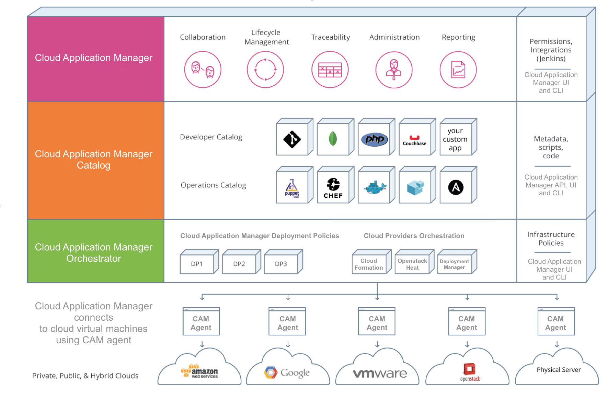

{{{
"title": "Architecture components",
"date": "11-12-2019",
"author": "Diego Sanjuan & Thomas Broadwell",
"attachments": [],
"keywords": ["cam", "cloud application manager", "architecture", "components", "agents", "websockets", "workflow", "services"],
"sticky": true,
"contentIsHTML": false
}}}

**In this article:**

* [Overview](#overview)
* [Audience](#audience)
* [Cloud Application Manager Agents](#cloud-application-manager-agents)
* [Websockets](#websockets)
* [API Services](#api-services)
* [Orchestration Workflow](#orchestration-workflow)
* [Connectivity and required firewall rules](#connectivity-and-required-firewall-rules)
* [Contacting Cloud Application Manager Support](#contacting-cloud-application-manager-support)

### Overview

This article is meant to assist users of Cloud Application Manager to learn about its components and interaction as follows:

* **Cloud Application Manager (CAM) agents** - functions, interactions, installation, and requirements
* **Websockets** - functions, interactions
* **API Services** - functions, interactions
* **Orchestration Workflow** - functions, interactions
* **Connectivity and Required Firewall Rules**

### Audience

All Cloud Application Manager users who want to learn about Cloud Application Manager components' architecture and their connectivity requirements.

### Cloud Application Manager Agents

All communication between Cloud Application Manager (CAM) agents (ALM or Watcher) and the CAM services must utilize the TLS protocol.  Minimum supported version is TLS 1.2.

#### Application Lifecycle Management agent (ALM Agent)

The ALM agent (a.k.a. EB agent) is responsible for executing event scripts in virtual machines deployed using script boxes and return their execution results. The agent also regularly provides information to the CAM backend about the virtual machine to inform user about virtual machine availability.

The ALM Agent is bootstrapped and installed in each virtual machine registered in CAM, making use of diverse execution mechanisms provided by public and private cloud providers. i.e. Cloud Init, Python, .Net, etc. The version of these execution mechanisms must support TLS 1.2 or newer.

The ALM agent is written in Python and it is a pre-requisite in Linux machines. They should have Python version 2.7.x installed to work properly.

Agents require outbound connectivity to [https://cam.ctl.io](https://cam.ctl.io), either directly or through a proxy, to be able to call back and communicate results and request more work to be done on its virtual machine.

Cloud Application Manager agent supports proxy configuration to call back when it's deployed in constrained/secured environments.

#### MSA Monitoring (Watcher Agent)

The Watcher agents are deployed to each CAM registered VM that is under management.  The deployment of the Watcher agent is initiated on any new CAM registered VM running a manageable OS (RHEL 6&7, CentOS 6&7, Ubuntu 14, 16 & 18, Windows 2k08R2, 2k12 and 2k16).  

The Watcher agent executes scripts (checks) on workloads and provides the results to the Monitoring infrastructure within CenturyLink.

The Monitoring infrastructure provides a [repository of checks](https://watcher.ctl.io/docs/check_types/) that may be applicable to agents, stores metric data from checks and processes check results to identify actionable events.

Agents require outbound connectivity to [https://cam.ctl.io](https://cam.ctl.io) and https://\*.watcher.ctl.io to be able to call back and communicate results and request more work to be done on its virtual machine.

Secure, public internet connections are used for the transfer of metric data between the agent and the Monitoring infrastructure via TLS 1.2. Network transactions are initiated by the agent and outbound only.  These transactions are secured in multiple ways:

* Private RSA key is created for each Watcher agent and used for TCP (Layer4) connection to the Monitoring infrastructure message bus
* Username & Passwords are established for each Watcher agent and used for connection to the Monitoring infrastructure message bus
* Encrypted agent signatures are used bi-directionally for Agent submittals to the Monitoring infrastructure and Monitoring Infrastructure responses (Check/Metric configuration updates) to the Watcher agent.
* Server-side access control/permissioning of the Watcher agent deployed to the host (monitored instance)

### Websockets

Cloud Application Manager uses websockets protocol for agent's communication and UI data interchange with Cloud Application Manager backend. They support real time notifications and data updates required by Cloud Application Manager's UI.

### API Services

Cloud Application Manager services provide necessary endpoints which are used by Cloud Application Manager UI when requesting operations and retrieving data items. These endpoints are also used by Cloud Application Manager command line tool [ebcli](../Tutorials/ebcli-tutorial.md) to list, provision and manage the lifecycle of your workloads based on box configuration.

[CAM API REST](https://www.ctl.io/api-docs/cam/)

[MSA API REST](https://monitoring.cam.ctl.io/docs/swagger/)

### Orchestration Workflow

We have asynchronous and persistent long-running workflows which are responsible for all cloud provider provisioning and orchestration to fulfill user requests and provide an updated work plan for CAM agents. It also takes care of the provider's synchronization process and recurrent or scheduled tasks.

### Connectivity and required firewall rules

Allow Incoming traffic to port 443 (https) (OPEN) to your Cloud Application Manager Dedicated Edition (appliance) for UI, API calls and CAM agents requests.

Allow Outgoing traffic on port 443 (https) from the virtual machines' network or VPC so CAM agents are able to communicate with Cloud Application Manager SaaS or onpremises Appliance.

Where MSA is enabled, allow Outgoing traffic on ports 80, 443, 5671 and UDP destination ports 500 and 4500 from the virtual machines network or VPC so Watcher agents are able to communicate with the Monitoring infrastructure within CLC.  See [MSA Networking](https://www.ctl.io/knowledge-base/cloud-application-manager/managed-services/msa-networking/) knowledgebase article for more information on MSA networking and requirements.

MSA enabled environments must also allow intranetwork communication for FTP, SSH, ICMP, HTTP(S), Microsoft AD/SMB, RDP and WinRM HTTP(S) on the virtual machine's network or VPC so that Remote Administration connections may be made by CenturyLink Operations. A secure, reverse tunnel is established between CenturyLink and the MSA enabled environment by which CenturyLink Operations may securely administer customer VMs.  

As features are added, other protocols necessary for the operation of the solution may be required.  It is recommended that unfettered outbound access on the virtual machines' network or VPC be made available to account for these potential changes.

For private cloud providers, take into account that to use some of their offerings, Cloud Application Manager requires more ports to be open for communication with the providers' API and metadata endpoints to request new deployments or retrieve metadata and configuration parameters:

|  PROVIDER     |  PORTS                                                                |
|---------------|-----------------------------------------------------------------------|
| VMWARE vCenter| INCOME ports to be OPEN: 443 ssl, 8085                                |
| OpenStack     | INCOME ports to be OPEN: 443 ssl, 5000, 35357, 8774, 8776, 9292, 8004 |

It is also expected that customers' cloud environments have access to repositories for updating software packages i.e. yum and apt repositories.  

### Contacting Cloud Application Manager Support

We’re sorry you’re having an issue in [Cloud Application Manager](https://www.ctl.io/cloud-application-manager/). Please review the [troubleshooting tips](../Troubleshooting/troubleshooting-tips.md), or contact [Cloud Application Manager support](mailto:cloudsupport@centurylink.com) with details and screenshots where possible.

For issues related to API calls, send the request body along with details related to the issue.

In the case of a box error, share the box in the workspace that your organization and Cloud Application Manager can access and attach the logs.

* Linux: SSH and locate the log at /var/log/elasticbox/elasticbox-agent.log
* Windows: RDP into the instance to locate the log at C:\ProgramData\ElasticBox\Logs\elasticbox-agent.log
