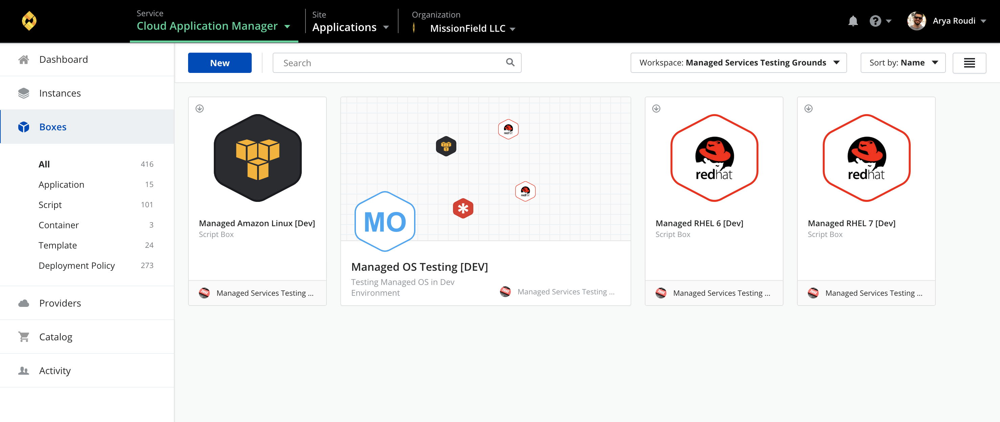
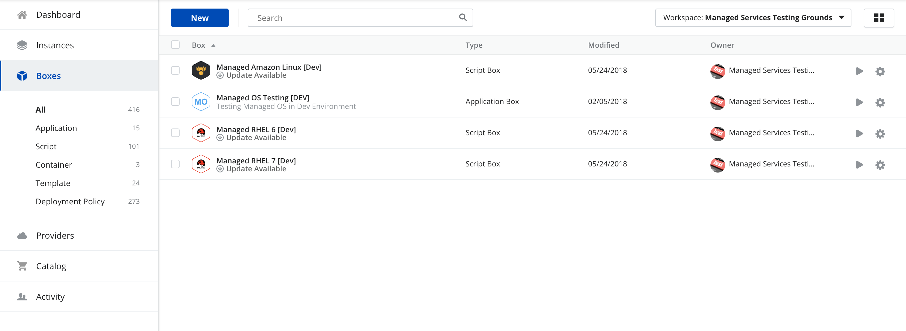

{{{
"title": "Boxes",
"date": "05-20-2019",
"author": "Julio Castanar and Guillermo Sánchez",
"keywords": ["cam","alm","boxes", "box"],
"attachments": [],
"contentIsHTML": false
}}}

**In this article:**

* [Overview](#overview)
* [Audience](#audience)
* [Prerequisites](#prerequisites)
* [Boxes](#boxes)
* [Boxes Page](#boxes-page)
* [New Box](#new-box)
* [Box management](#box-management)
* [Contacting Cloud Application Manager Support](#contacting-cloud-application-manager-support)

### Overview

This article is meant to assist Cloud Application Manager customers who want to create and manage boxes.

### Audience

Cloud Application Manager Users using Application Lifecycle Management (ALM) features.

### Prerequisites

* Access to [Applications site](https://cam.ctl.io/#/boxes) (Application Lifecycle Management module) of Cloud Application Manager as an authorized user of an active Cloud Application Manager account.

### Boxes

Boxes are the templates that store application automation. An instance is a box you install on virtual infrastructure provisioned to a public, private cloud provider, or your own infrastructure. Take a [quick tour](https://www.ctl.io/guides/) to understand the layout of boxes and instances in Cloud Application Manager.

Boxes contain scripts, variables, and metadata to automate processes when instantiated on cloud infrastructure. Stitched together, boxes model complex processes like deploying or upgrading multi-tier enterprise scale applications.

So how do boxes work?. A typical application stack may consist of multiple boxes, each one modeling a step of the application’s install. For example, one might model the install of runtime requirements (such as PHP libraries). Another might model the install of a web server (such as Apache). And a third might model connecting to a source control repository (such as Git), pulling the latest code, and installing it on the virtual server. When stacked and instantiated these three boxes install an application. At the same time, each box is independent, reusable and can be consumed by other applications.

### Boxes Page

When you click on the **Boxes** left side menu the boxes page appears displaying all your available boxes in the current scope. You can display them as **tiles** with some information for each box, or as a **list** with a few columns showing basic information for them. To switch between these views you can click a button on the top-right corner of the page.

The **tiles view** displays a big icon, name, type and the owner of the box. When you hover on a tile, two action buttons appear allowing you to deploy or manage the box. You can short the tiles by name (default), last modified or owner by selecting one of these values in the *Short by* dropdown located on the top-right corner of the page, next to the change view mode button.

The **list view** displays a small icon, name, type, when it was last modified, the owner and the two action buttons for each box. You can order by any column by clickin on its header. If you select any of the boxes in the list, a *Bulk actions* button appears where you can update the selected boxes all at once.

The *gear icon* action button allows you to manage the box by performing additional actions such as share the box, edit its details, clone or delete. These options will be available depending on your access permissions onto the box.

You can also use the *filters* above to narrow down the boxes being displayed by the workspace they belong to or the tags they have associated.

There are several types of boxes to address for your specific automation use case:

* [Application boxes](../Automating Deployments/application-box.md) - Configure several boxes to deploy an application with a single click.
* [Script boxes](../Automating Deployments/script-box.md) - Automate using Bash, PowerShell, Salt, Ansible, Puppet, or Chef.
* [Container boxes](../Automating Deployments/docker-container-service.md) - Automate using container technology like Docker.
* [Template boxes](../Automating Deployments/template-box.md) - Automate using AWS CloudFormation templates, ARM templates or Terraform templates.
* [Deployment Policy boxes](../Automating Deployments/deploymentpolicy-box.md) - Select and share infrastructure resources, networking, and more from a cloud provider.

In the left side menu you can click on any of these types to filter by it on the view.

### New Box

To create a new box, click **New** button in the **Boxes** page. Select a box type to match your automation:

* [Application](../Automating Deployments/application-box.md)
* [Script](../Automating Deployments/script-box.md)
* [Container](../Automating Deployments/docker-container-service.md)
* [Template](../Automating Deployments/template-box.md)
* [Deployment Policy](../Automating Deployments/deploymentpolicy-box.md)

Fill mandatory fields (with an *) and define some basic metadata described below.

#### Box metadata

| Metadata | Box Type | What it Means |
|--------------|--------------|---------------------|
| Name, Description, Icon | All | Give it a name and optionally a description and an icon. |
| Requirements | Script,  Template,  Container | It’s good practice to tag the runtime that the box requires to deploy. Cloud Application Manager auto suggests tags like Linux, Ubuntu, Java and so on. When ready to launch the box, you are presented with deployment policies that match the requirements. These deployment policies provide the right infrastructure or services the box needs to deploy. **Note:** In CloudFormation boxes, the tags help you to look for binding instances. |
| Automatic Updates | Script, Template, Container | Select the level of updates to automatically apply to instances you launch of a box version: + **Off** - It’s turned off by default. + **All Updates** - Applies all changes. + **Minor & Patch Updates** - Applies minor and patch changes to the version deployed. + **Patch Updates** - Applies only the patch changes to the version deployed. |
| Provider | Deployment Policy | Select the cloud provider registered in Cloud Application Manager for which you will carve out infrastructrure resources in the policy. |
| Claims | Deployment Policy | Tag the services and infrastructure that a policy provides like Linux, Ubuntu 12.04, load balancing, and so on for deployments. Add claims so that the boxes with matching requirements can successfully deploy using the right policy. |
| Instance Lifespan | Deployment Policy | Determines how to [schedule instances](../Deploying Anywhere/deploying-managing-instances.md#scheduling-instances) for automatic **expiration** |

### Box management

Once you create a box, you can configure and manage it in this panel: 

#### Box Functions

Box Functions (marked with 1 in the figure) execute several commands for the Box

| Function | Description |
|------------|----------------|
| Deploy | [Launch a new instance](../Deploying Anywhere/deploying-managing-instances.md) of the box draft with this option. This lets you select a specific deployment policy to launch on a cloud provider. |
| Gear Menu | From here, you can edit basic metadata of the box, share or delete it. **Edit Details** - Allows box basic properties edition.  **Clone** - Duplicates current box with same basic configuration. **Share** - Invite team members to [collaborate](workspaces-and-collaboration.md) and improve the configuration or just let them deploy the box. **Delete Box** - Removes current Box |

#### Box Sections

Box Sections (marked with 2 in the figure) display several configurations of the Box

| Section | Description |
|------------|----------------|
| **Overview** | Get detailed information about your box. |
| **Code** | Automate how a piece of software deploys in the virtual environment by parameterizing with [variables](../Automating Deployments/parameterizing-boxes-with-variables.md) and [events](../Automating Deployments/start-stop-and-upgrade-boxes.md). |
| **Versions** | Keep track deployment configuration changes with the help of [versioning](../Automating Deployments/version-control.md). Versions let you consume different configurations of the same box in multiple deployments. From this tab, you can create a new version, see a diff of what changed, or restore a version as the box draft. |

### Contacting Cloud Application Manager Support

We’re sorry you’re having an issue in [Cloud Application Manager](https://www.ctl.io/cloud-application-manager/). Please review the [troubleshooting tips](../Troubleshooting/troubleshooting-tips.md), or contact [Cloud Application Manager support](mailto:incident@CenturyLink.com) with details and screenshots where possible.

For issues related to API calls, send the request body along with details related to the issue.

In the case of a box error, share the box in the workspace that your organization and Cloud Application Manager can access and attach the logs.

* Linux: SSH and locate the log at /var/log/elasticbox/elasticbox-agent.log
* Windows: RDP into the instance to locate the log at \ProgramData\ElasticBox\Logs\elasticbox-agent.log
