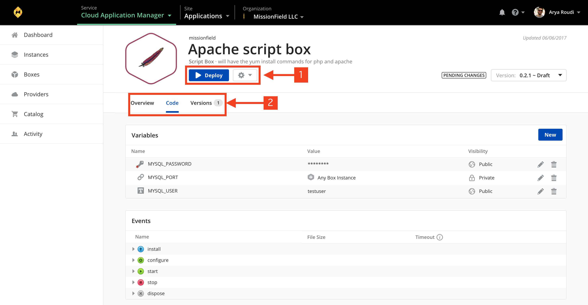

{{{
"title": "Boxes",
"date": "09-01-2016",
"author": "",
"keywords": ["boxes", "box"],
"attachments": [],
"contentIsHTML": false
}}}

### Table of Contents

* [Overview](#overview)
* [Audience](#audience)
* [Prerequisites](#prerequisites)
* [Boxes](#boxes)
* [Understanding Box Basics](#understanding-box-basics)
* [Contacting Cloud Application Manager Support](#contacting-cloud-application-manager-support)

### Overview

This article is meant to assist Cloud Application Manager customers who wants to create and manage boxes.

### Audience

CenturyLink Cloud Users

### Prerequisites

* Access to the CenturyLink Cloud platform as an authorized user.

### Boxes

Boxes are the templates that store application automation. An instance is a box you install on virtual infrastructure provisioned to a public, private cloud provider, or your own infrastructure. Take a [quick tour](//www.ctl.io/guides/) to understand the layout of boxes and instances in Cloud Application Manager.

Boxes contain scripts, variables, and metadata to automate processes when instantiated on cloud infrastructure. Stitched together, boxes model complex processes like deploying or upgrading multi-tier enterprise scale applications.

So how do boxes work? A typical application stack may consist of multiple boxes, each one modeling a step of the application’s install. For example, one might model the install of runtime requirements (such as PHP libraries). Another might model the install of a web server (such as Apache). And a third might model connecting to a source control repository (such as Git), pulling the latest code, and installing it on the virtual server. When stacked and instantiated these three boxes install an application. At the same time, each box is independent, reusable and can be consumed by other applications.

### Understanding Box Basics

**New Box**

To create a new one, click **New**. Select a box type to match your automation:
* [Script](../Automating Deployments/script-box.md) - To automate using Bash, PowerShell, Salt, Ansible, Puppet, or Chef.
* [Deployment Policy](../Automating Deployments/deploymentpolicy-box.md) - To select and share infrastructure resources, networking, and more from a cloud provider.
* [Application](../Automating Deployments/application-box.md) - To configure several boxes to deploy an application with a single click.
* [Template](../Automating Deployments/template-box.md) - To automate using AWS CloudFormation templates or ARM templates.
* [Container](../Automating Deployments/docker-container-service.md) - To automate using container technology like Docker.

Give it a name, optionally a description, and define some basic metadata:

| Metadata | Box Type | What it Means |
|--------------|--------------|---------------------|
| Requirements | Script,  Template,  Container | It’s good practice to tag the runtime that the box requires to deploy. Cloud Application Manager auto suggests tags like Linux, Ubuntu, Java and so on. When ready to launch the box, you are presented with deployment policies that match the requirements. These deployment policies provide the right infrastructure or services the box needs to deploy. **Note:** In CloudFormation boxes, the tags help look instances for bindings. |
| Automatic Updates | Script, Template, Container | Select the level of updates to automatically apply to instances you launch of a box version: + **Off** - It’s turned off by default. + **All Updates** - Applies all changes. + **Minor & Patch Updates** - Applies minor and patch changes to the version deployed. + **Patch Updates** - Applies only the patch changes to the version deployed. |
| Provider | Deployment Policy | Select the cloud provider registered in Cloud Application Manager for which you will carve out infrastructrure resources in the policy. |
| Claims | Deployment Policy | Tag the services and infrastructure that a policy provides like Linux, Ubuntu 12.04, load balancing, and so on for deployments. Add claims so that boxes with matching requirements can successfully deploy using the right policy. |

**Box Sections**

Once you create a box, you can configure and manage it in these sections.

| Section | Description |
|------------|----------------|
| Configuration | Automate how a piece of software deploys in the virtual environment by parameterizing with [variables](../Automating Deployments/parameterizing-boxes-with-variables.md) and [events](../Automating Deployments/start-stop-and-upgrade-boxes.md). |
| Versions | Keep track deployment configuration changes with the help of versioning. Versions let you consume different configurations of the same box in multiple deployments. From this tab, you can create a new version, see a diff of what changed, or restore a version as the box draft. |
| Share | Invite team members to [collaborate](workspaces-and-collaboration.md) and improve the configuration or just let them deploy the box. |
| Deploy | [Launch a new instance](../Deploying Anywhere/deploying-managing-instances.md) of the box draft with this option. This lets you select a specific deployment policy to launch on a cloud provider. |
| Gear Menu | From here, you can edit basic metadata of the box or delete it. |

### Contacting Cloud Application Manager Support

We’re sorry you’re having an issue in [Cloud Application Manager](https://www.ctl.io/cloud-application-manager/). Please review the [troubleshooting tips](../Troubleshooting/troubleshooting-tips.md), or contact [Cloud Application Manager support](mailto:incident@CenturyLink.com) with details and screenshots where possible.

For issues related to API calls, send the request body along with details related to the issue.

In the case of a box error, share the box in the workspace that your organization and Cloud Application Manager can access and attach the logs.
* Linux: SSH and locate the log at /var/log/elasticbox/elasticbox-agent.log
* Windows: RDP into the instance to locate the log at ProgramDataElasticBoxLogselasticbox-agent.log
