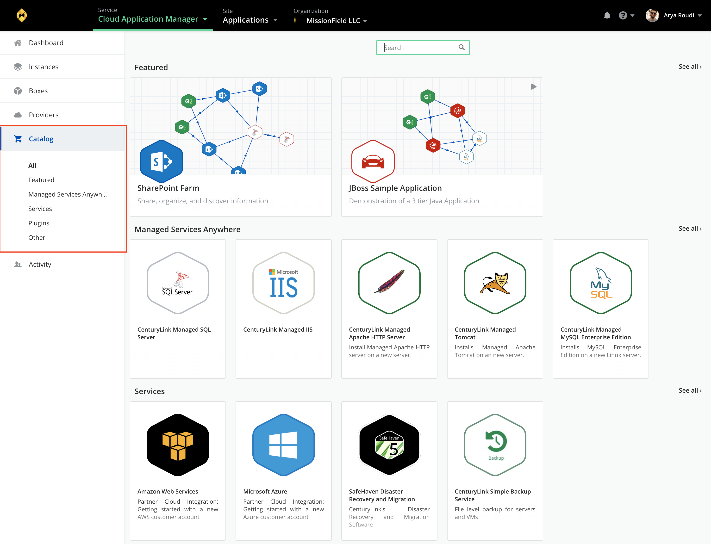
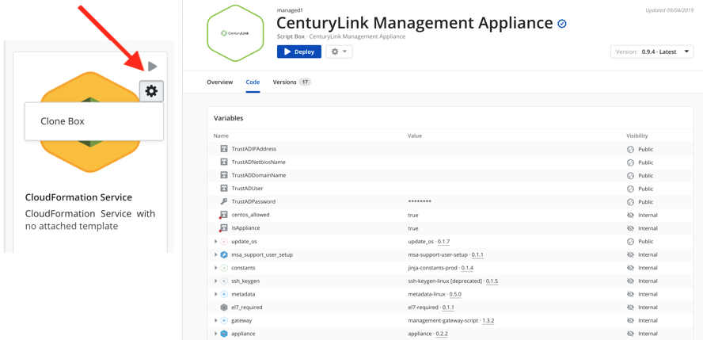

{{{
"title": "Catalog",
"date": "12-28-2018",
"author": "Julio Castanar",
"keywords": ["cam", "catalog", "catalog services", "catalog featured", "catalog plugin", "marketplace", "publish", "public", "private", "script box", "information box"],
"attachments": [],
"contentIsHTML": false
}}}

**In this article:**

* [Overview](#overview)
* [Audience](#audience)
* [Prerequisites](#prerequisites)
* [Catalog](#catalog)
* [Publish and add content to the catalog](#publish-and-add-content-to-the-catalog)
* [Catalog elements usage](#catalog-elements-usage)
* [Contacting Cloud Application Manager Support](#contacting-cloud-application-manager-support)

### Overview

This article is meant to assist Cloud Application Manager customers who wants to review and use the box catalog.  

The Cloud Application Manager catalog is a collection of boxes and services for **public use** by any Cloud Application Manager user. 

### Audience

All Cloud Application Manager users

### Prerequisites

* Access to Cloud Application Manager [Applications site](https://cam.ctl.io/#/dashboard) (Application Lifecycle Management module) as an authorized user of an active Cloud Application Manager organization.

### Catalog

Catalog consists of public boxes and services grouped by categories. 

A publisher creates a box and can made it public requesting publish it and assigning it a category.  
Once supervised and aproved, a box will be shown in public catalog.

These boxes can be script boxes or information boxes.  
Catalog script boxes can be deployed by anyone who needs perform what actions are define for this box.  
Catalog information boxes use to display links to provider subscription or to documentation about how to install and configure a box.

The publisher decides which scripts in a catalog box are public or private. A public script can be taken as an example to watch its code and create our new script boxes.

Catalog page displays all elements added to public catalog. These elements are shown to all Cloud Application Manager users.
You can see all catalog categories or one by one. To show all boxes in one category select it in the left side menu or click on *select all* at the right side for every category line when all categories option is selected.  

The following sections show some categories in Catalog. New categories could be added at any time: 

#### Featured

This category shows relevant elements used in public catalog. 

**Examples**:

SharePoint Farm, JBoss Sample Application, Wordpress, MongoDB Server, etc, ...

#### Managed Services Anywhere

Principally this category groups boxes used to perform services in server machines. Some of them are customized for a better performance in the provider site.

Of special interest is ** CenturyLink Management Appliance ** which is a public box and you can see its code. In a few steps you can deploy an appliance in a region

**Examples**:

CenturyLink Managed SQL Server, CenturyLink Managed IIS, CenturyLink Managed Apache HTTP Server, CenturyLink Managed Tomcat, CenturyLink Management Appliance, Managed Application Windows, etc, ...

#### Plugins

Mainly, in this category you will find information boxes for some applications or scripts that provide utilities and functions to your environment.

**Examples**:

Jenkins CI plugin, Jenkins Kubernetes CI plugin, etc, ...

#### Services

Here are shown boxes from different providers of cloud services. External partners use to offer here their services configuration to be automatized. 

**Examples**:

Amazon Web Services, Microsoft Azure, CenturyLink Simple Backup Service, etc, ...

#### Other

This category includes all the other boxes not included in a specific category.

**Examples**:

Oracle Database Service, Memcached Service

### Publish and add content to the catalog

A user can also [request to publish](../Tutorials/publish-script-box.md) one of his defined boxes to this public catalog, to make it available for all Cloud Application Manager users from all organizations, by sending a Publish box request from a box version. 

This feature can be used as a **marketplace** by Cloud Application Manager customers willing to provide their applications and  services through the Cloud Application Manager catalog to any other customer.

Published box in Catalog can be public (shows its code to other users and cloning it is allowed) or private (scripts code is hidden). A published box can have different versions.

### Catalog elements usage

A catalog element is a **Script Box**, so you can perform the same functions as described in [boxes](boxes.md).  
You can create an instance of this catalog box deploying it. Besides you can share, edit its configuration, clone it (if it has a public scope) and deleted it in the same way as you do with boxes.

Other elements in catalog are **information boxes**. They provide documentation only. Clicking on them show information regarding how to use them and several links to Provider documentation and suscription scripts.

### Contacting Cloud Application Manager Support

We’re sorry you’re having an issue in [Cloud Application Manager](https://www.ctl.io/cloud-application-manager/). Please review the [troubleshooting tips](../Troubleshooting/troubleshooting-tips.md), or contact [Cloud Application Manager support](mailto:incident@CenturyLink.com) with details and screenshots where possible.

For issues related to API calls, send the request body along with details related to the issue.

In the case of a box error, share the box in the workspace that your organization and Cloud Application Manager can access and attach the logs.
* Linux: SSH and locate the log at /var/log/elasticbox/elasticbox-agent.log
* Windows: RDP into the instance to locate the log at \ProgramData\ElasticBox\Logs\elasticbox-agent.log

