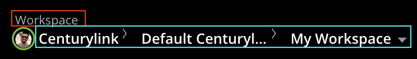
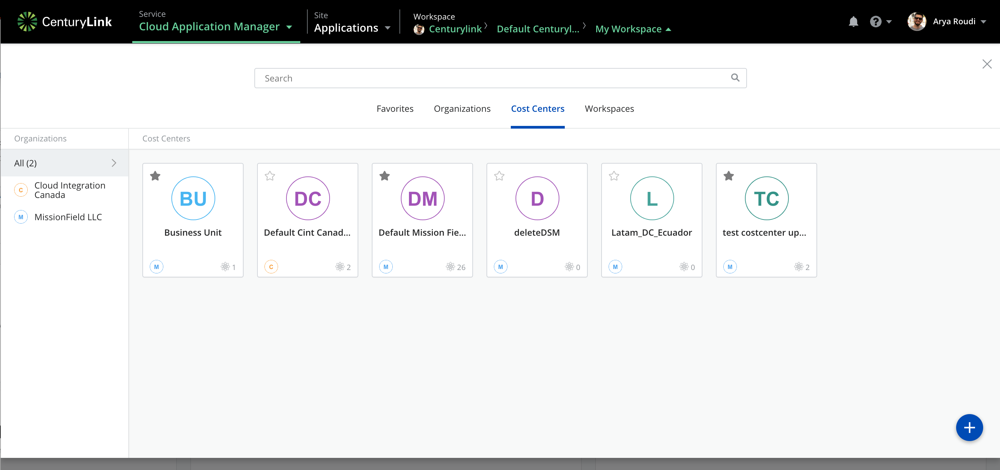
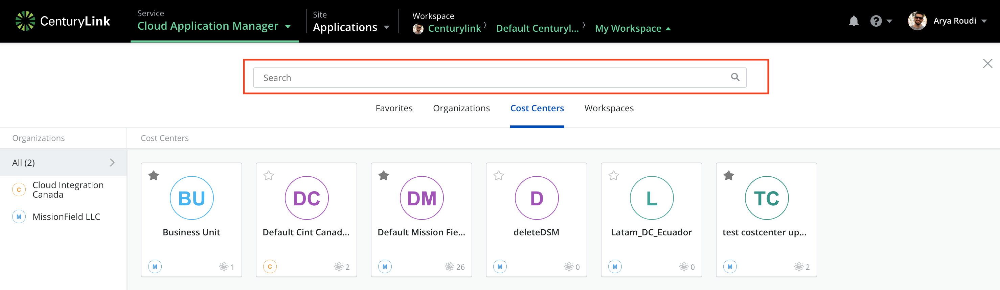
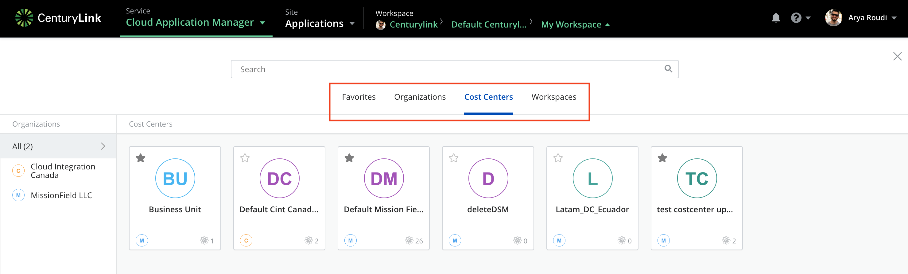
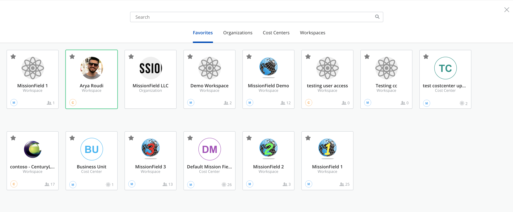

{{{
"title": "Detailing Cloud Application Manager's Context Switcher",
"date": "05-20-2019",
"author": "Sergio Quintana",
"attachments": [],
"keywords": ["cam", "cloud application manager", "workspaces", "organizations", "cost centers", "context switcher", "scope switcher"],
"sticky": true,
"contentIsHTML": false
}}}

**In this article:**

* [Overview](#overview)
* [Audience](#audience)
* [Prerequisites](#prerequisites)
* [Introduction](#introduction)
* [Context Switcher sections](#context-switcher-sections)
* [Creating a new scope](#creating-a-new-scope)
* [Contacting Cloud Application Manager Support](#contacting-cloud-application-manager-support)

### Overview

This article is meant to give a definition of Cloud Application Manager’s Context Switcher and an explanation of its features. Before reading this article, a previous knowledge of [organizations, cost centers and workspaces](workspaces-and-collaboration.md) is recommended.

### Audience

Cloud Application Manager users.

### Prerequisites

An active Cloud Application Manager account.

### Introduction

Context Switcher is a tool located within the Global Navigation bar of Cloud Application Manager, which allows users to change the scope they want to work with, among the available scopes they have access to, whether Organizations, Cost Centers or Workspaces. Once a scope or context is selected through the context switcher, users will see and manage the resources pertaining to that scope and dependant scopes.

It provides at a glance all the necessary information so that users know in which scope they are working at every moment. Thus, this component offers the following data when collapsed:

* **Kind of Scope** (in blue)

* **Scope’s icon/avatar** (in red)

* **Scope’s hierarchy** (in green)

### Context Switcher sections

Clicking on the context switcher will create an overlay with extended information and functionality. It is divided into different tabs, which correspond to scope types (**Organizations**, **Cost Centers** and **Workspaces**), apart from the **Favorites** tab:

#### Search bar

This will let users search for a concrete scope they have access to. It is important to highlight that results will be different depending on which kind of scope the user has selected, so it won’t be possible to find a scope not belonging to the active tab so, for example, when the Organization tab is selected, only organizations are searched.

#### Selection menu

There are several selectable options here depending on user's permissions (organization administrators can see **Organizations** and **Cost Centers** tabs while cost center administrators could only see their associated cost centers), and apart from the different kinds of scopes (Organizations, Cost Centers and Workspaces), there is also a **Favorites** tab, which shows together those scopes (of any kind) marked as favorites by the user.

#### Main view

When a scope type is selected, the main view displays all available scopes of the selected kind for a given user. It is important to comment that all resources are held at workspace level, and due to the hierarchical structure scopes have (an Organization contains Cost Centers, which in turn contain Worskpaces), when a  higher-tier scope is selected, it will allow accessing to all its lower-tier resources.

That said, depending on the kind of selected scope some differences arise:

##### Organizations view

Displays all the organizations the user has access to, and allows him or her to switch between them.

Every organization, as seen in the previous image, has several elements: name and icon of the organization, a star to mark it (or unmark if already marked) as a favorite, and a pencil button (when hovered) to edit its settings.

##### Cost Centers view

This view introduces a left side panel where all the organizations the user has access to are listed, so it can be used as a filter. By default, the *All* option is selected, so every cost center depending on that organizations will be displayed in the main view. Selecting another organization, therefore, will show only its associated cost centers.

As happened with organizations, a cost center will not only display its name and icon, the favorite star and the editing pencil button (when hovered), but also the icon of the organization it belongs to (bottom left) and the number of members it has (bottom right).

##### Workspaces view

The most complete view corresponds to workspaces’ because it includes, apart from an organizations panel, a cost centers panel next to it with the same functionality explained for the last section: to act like a filter. This way only associated workspaces of a given cost center will appear.

It is important to remark that workspaces can be divided into personal and team workspaces.

* **Personal workspaces** are associated to a given user and cannot be created manually. They are the private space for users to hold their own resources.
* **Team workspaces** can be easily created (if the user has proper permissions) and many users can be added to them as members with different access rights. A team workspace serves as a collaborative space where users can share their resources and collaborate on them.

A personal workspace shows its name and user’s avatar, apart from its associated organization and cost center, and the star button to be marked (or unmarked) as a favorite; while a team workspace differs in displaying the team’s icon, as well as the number of members added to that workspace, and and provides the pencil button while hovering over the scope to access the workpsace settings. But, unlike what happened with other scope types there are several kinds of members for a team workspace (Visitor, User, Author and Administrator), being only those holding an Administrator role the ones with edit settings permissions.

##### Favorites view

It displays all the scopes the user has marked as his/her favorites using the star button at the top left of the scopes. As mentioned before, there is no distinction between scope type here, so all of them appear together and can be sorted by dragging and dropping the different elements.

### Creating a new scope

There is a feature that both Workspaces and Cost Centers tabs share: new scopes creation. But it depends on user's permissions. Only an organization administrator can create new cost centers and workspaces, while a cost center administrator could only create new workspaces. So, if permissions apply, clicking the green button on the bottom right part of the screen will open a new window letting the user create a new scope where, in case of cost centers, the name and the organization it belongs to should be filled, apart from giving the option to be marked as a favorite. And it's important to notice that once created, it won't be possible to modify the organization field.

On the other hand, when creating a new team workspace (as previously stated, only team workspaces can be created manually), apart from the name and cost center it belongs to, an icon can be provided, as well as the possibility of being marked as a favorite. Finally, as happened in the previous case, once created, it won't be possible to modify the cost center field.

### Contacting Cloud Application Manager Support

We’re sorry you’re having an issue in [Cloud Application Manager](https://www.ctl.io/cloud-application-manager/). Please review the [troubleshooting tips](../Troubleshooting/troubleshooting-tips.md), or contact [Cloud Application Manager support](mailto:incident@CenturyLink.com) with details and screenshots where possible.

For issues related to API calls, send the request body along with details related to the issue.

In the case of a box error, share the box in the workspace that your organization and Cloud Application Manager can access and attach the logs.

* Linux: SSH and locate the log at /var/log/elasticbox/elasticbox-agent.log
* Windows: RDP into the instance to locate the log at \ProgramData\ElasticBox\Logs\elasticbox-agent.log
