{{{
"title": "Lifecycle Editor",
"date": "03-07-2019",
"author": "Oscar Hafner and CenturyLink",
"attachments": [],
"contentIsHTML": false
}}}

### Lifecycle Editor

The Lifecycle Editor offers a single, unified interface to test and refine your box configurations in live deployments. The editor is powerful because you can reapply box changes and look at how they’re executed immediately on the instance through logs.

**In this article:**

* Launching the Lifecycle Editor
* Modifying a Box Instance
* Re-launching the Instance with Changes
* Viewing instance logs
* Versioning with Push and Pull

### Launching the Lifecycle Editor

Right after you launch an instance, the Lifecycle Editor is available on the instance profile page. To get to it, click an instance from the Instances page as shown.

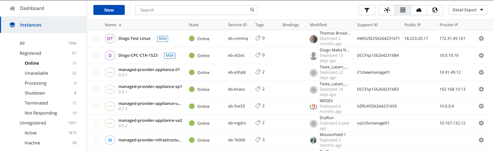

The instance profile page shows the activity feed of the instance during its entire lifecycle and lets you take actions on the instance. Click the Lifecycle Editor to edit and make changes on the running instance.

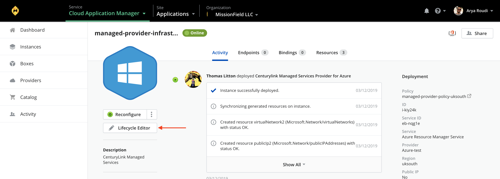

### Modifying a Box Instance

Edit the box configuration of a running instance by modifying its event scripts and variable values or adding new events and variables.

**Changing Events**

[Events](../Automating Deployments/start-stop-and-upgrade-boxes.md) let you control the lifecycle of your application in the virtual infrastructure. Change them to modify how your application behaves.

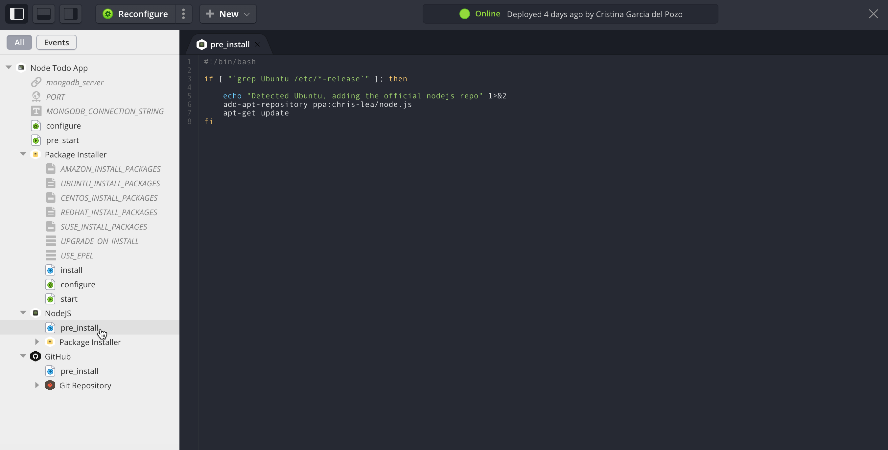

1. To edit an event, traverse the box topology, and select the event. In this example, we selected the pre_install event of the NodeJS box.
2. Make event script changes in the event tab. The tab shows an asterisk to indicate any unsaved changes.
3. When done, click **Save**.

If you make event script changes in the event tab and try to close editor (without pressing the 'Save' button), a confirmation dialog will warn you about the pending changes. If you want to keep the changes press the 'Save' button on the dialog.

**Edit Event Timeout**

You can set up a maximum execution timeout in an event script of the instance in order to control long-lasting executions. Execution timeout can also be defined in [Script boxes](../Automating Deployments/script-box.md).

If a script has an execution timeout,a clock icon will be shown next to the event name.

The action menu allows you to set or modify the timeout value for the instance, without affecting the source box configuration.

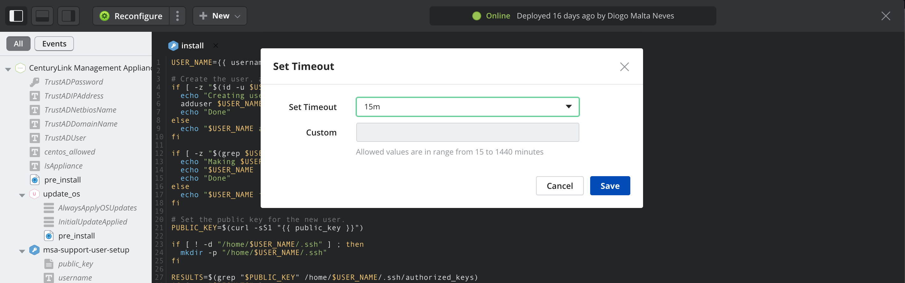

**Changing Variable Values**

You can redeploy an instance with different parameters by changing the [variable](../Automating Deployments/parameterizing-boxes-with-variables.md) values.

* To edit variable values, click on the input box and type or select the new value.

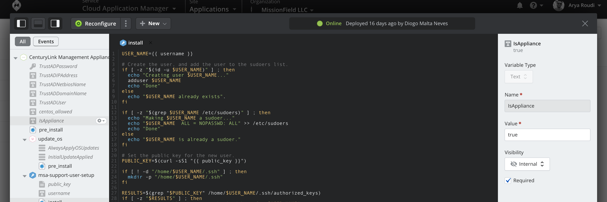

If you make event script changes in the event tab and try to close editor (without pressing the 'Save' button), a confirmation dialog will warn you about the pending changes. If you want to keep the changes press the 'Save' button on the dialog.

* To edit file type variables, click on the pencil icon and make variable script changes in the variable tab. The tab shows an asterisk to indicate any unsaved changes, click **Save** to save any changes made.

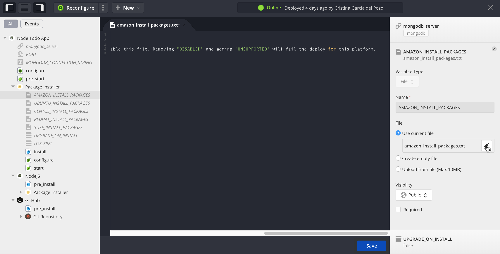

**Changing Binding Variable Values**

When an instance depends on another box or service–like a load balancer, caching, or database service–you can link them together with a [binding](../Automating Deployments/parameterizing-boxes-with-variables.md). In the Lifecycle Editor, you can modify the binding value to select a different instance.

1. To edit the binding variable, delete de tags you want to change.

2. Type the new values, you will see a few suggestions where to choose from, but you can also type your own values. To save the changes click on **Save** button.

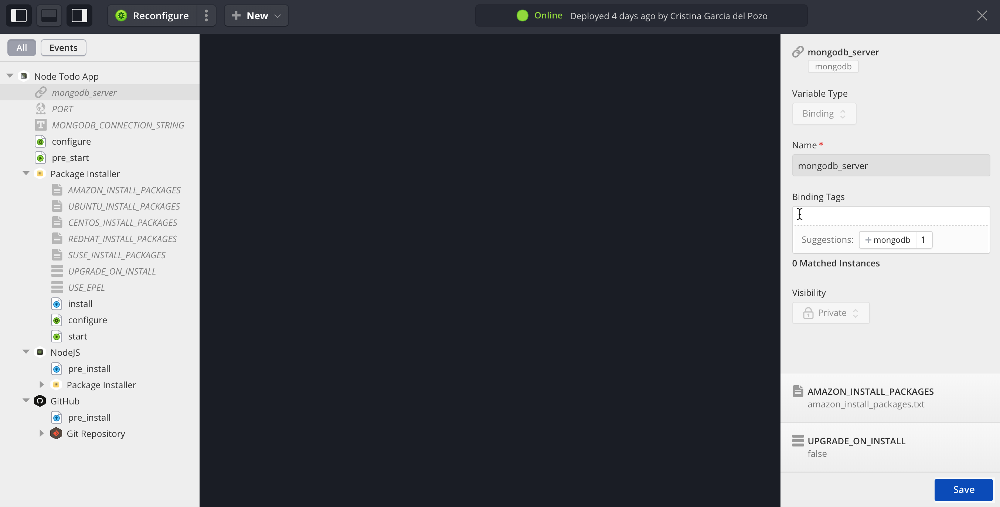

If you make event script changes in the event tab and try to close editor (without pressing the 'Save' button), a confirmation dialog will warn you about the pending changes. If you want to keep the changes press the 'Save' button on the dialog.

**Adding Events or Variables**

You can add new events or variables to the different packages of the box.

If you want to create a new event:

1. Click **New**.
2. Click **New Event**.

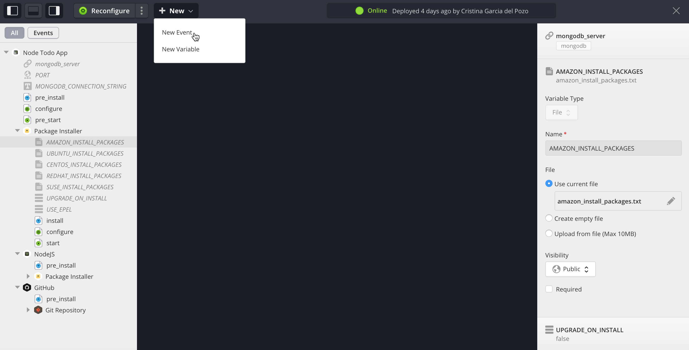

3. Select the parent package.

1. Select the event type.

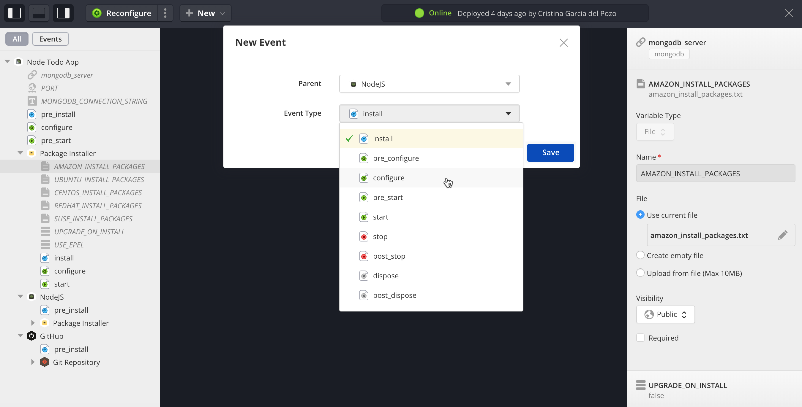

5. Click **Save**.

If you want to create a new variable:

1. Click **New**.
2. Click **New Variable**.

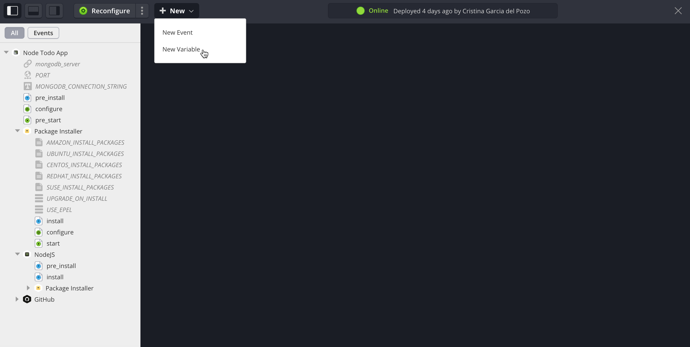

3. Complete all the [variable](../Automating Deployments/parameterizing-boxes-with-variables.md) values.

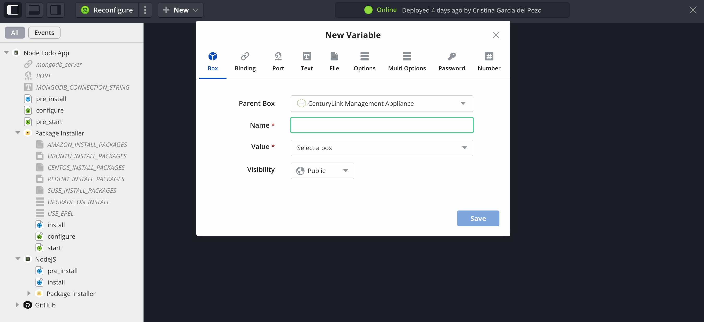

4. Click **Save**.

### Re-Launching the Instance with Changes

Once you’ve saved changes in the lifecycle editor, they are locally stored until you trigger a lifecycle action on the instance. You can re-apply changes to the running instance by triggering an install or configure event, which runs the box event scripts in the virtual infrastructure. To learn about other actions you can take, see [Handling Instance Lifecycle States](../Deploying Anywhere/deploying-managing-instances.md).

In this example, we click **Reinstall** to run install type events in the virtual environment. Install type events include all the install and post install event scripts in the main and nested boxes.

**Note:** When an action is triggered, the instance is in the process of changing state. During this time, it’s in view-only mode and you can’t edit its configuration. But, you can view logs. Once the scripts are executed, you can go back to editing the instance.

### Viewing Instance Logs

The logs panel presents the standard output of event scripts that were executed on the target virtual machine. After making script changes and triggering a lifecycle action on the instance, you can readily see their run output here.

Click **Logs** to monitor the progress on the instance while its being re-installed and reconfigured.

### Versioning with Push and Pull

Changes you make in the Lifecycle Editor are local to the instance and are not propagated back to the box in the catalog. You can however, do a push from the instance back to the box definition. This makes a new version of the box available with these changes in the Versions tab. This is pretty useful for iteratively developing boxes without having to re-deploy from scratch.

Additionally you can also pull a version from the box definition. This is useful if you wish to revert to a different version or want to upgrade an instance to the latest version of a box.

* Push creates a new version of the box in the box catalog based on the changes made in the Lifecycle Editor. This updates both the event scripts of that box as well as the variable contents.
* Pull copies the version you select of the box from the box catalog and brings it onto the box instance. This is useful for either upgrading an instance to a new version of a box or for reverting changes.
* Push to draft updates the changes made to the de draft box.
* Delete button removes the elements selected from the box.

**Note:** Cloud Application Manager provides default boxes that are available to all users. You can use them for your deployments and modify, test the instance configuration in the Lifecycle Editor. However, because everyone accesses these boxes, you can’t push or pull to modify their box definition.

### Contacting Cloud Application Manager Support

We’re sorry you’re having an issue in [Cloud Application Manager](https://www.ctl.io/cloud-application-manager/). Please review the [troubleshooting tips](../Troubleshooting/troubleshooting-tips.md), or contact [Cloud Application Manager support](mailto:incident@CenturyLink.com) with details and screenshots where possible.

For issues related to API calls, send the request body along with details related to the issue.

In the case of a box error, share the box in the workspace that your organization and Cloud Application Manager can access and attach the logs.
* Linux: SSH and locate the log at /var/log/elasticbox/elasticbox-agent.log
* Windows: RDP into the instance to locate the log at ProgramData/ElasticBox/Logs/elasticbox-agent.log
