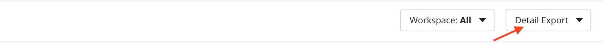
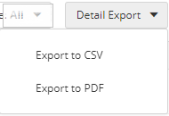

{{{
"title": "Providers",
"date": "08-01-2019",
"author": "Diego Sanjuan, Guillermo Sánchez, Victor Shulman, Zachary McMaster",
"keywords": ["cam", "alm", "providers", "centuryLink-cloud", "clc", "aws", "azure", "google-cloud", "gcp", "cloudstack", "dimension-data", "openstack", "rackspace", "softlayer", "vcloud", "vmware"],
"attachments": [],
"contentIsHTML": false
}}}

**In this article:**

* [Overview](#overview)
* [Audience](#audience)
* [Prerequisites](#prerequisites)
* [Providers](#providers)
* [Providers page](#providers-page)
* [Synchronization process](#synchronization-process)
* [Supported provider types](#supported-provider-types)
* [Exporting the List of Providers](#exporting-the-list-of-providers)
* [Contacting Cloud Application Manager Support](#contacting-cloud-application-manager-support)

### Overview

Providers is part of the basics of Cloud Application Manager. This article is meant to assist Cloud Application Manager customers who are starting using the plataform.

### Audience

All Cloud Application Manager customers.

### Prerequisites

An active Cloud Application Manager account.

### Providers

A provider is a public or private cloud account you register in Cloud Application Manager. Cloud Application Manager interfaces with the provider account’s API to provision and orchestrate deployments automatically. Before you can deploy workloads from Cloud Application Manager, you need to register a provider first.

### Providers page

When you click the **Providers** option in the left side menu you will see the providers list you have access to with some basic information for each provider such as its name, synchronization status, when it was last modified, the account alias and the owner who created it.

You can create new providers by clicking on the **New** button, type something in the search field to look for a provider in the list or filter by the workspace they belong to.

Every provider in the list have a gear icon from which you can synchronize or delete the provider. If you click on any of the providers listed, you will get to its details page, where you can find more information and interact with it.

If you select several providers by clicking on the checkbox on the provider line item (or clicking the checkbox in the header line which will select all), the **Bulk Actions** button dropdown will appear next to the *New* provider button, allowing to sync or delete the selected providers in bulk mode.

### Synchronization process

Cloud Application Manager requires to gather specific information of your cloud providers to be able to provision and orchestrate deployments automatically. The basic synchronization of a provider created from an existing account is a read only process which do not change anything in your cloud account.

After you register a provider, Cloud Application Manager uses API calls to retrieve metadata which describes available infrastructure options, quotas, your custom configuration and images or templates to store it with the purpose of provide such customized options to you when you are creating or editing a deployment policy box.

This metadata includes required infrastructure data as follows:
* Available regions or datacenters
* Available networks and subnetworks
* Allowed connectivity options with public or private ip and firewall rules
* Available autoscalability configuration (i.e. resource limits or alarms)
* Allowed type/size of virtual machines
* Available images or templates to be used at provision time. These are listed in configuration of your provider
* Available public keys to secure provisioned virtual machines
* Available load balancers and target groups
* Unregistered native resources are discovered and displayed in the Instances page with some basic information.
* Unregistered virtual machines and autoscaling groups which are already provisioned in your cloud account in order to allow you to register them if you want to do so. These are listed in Unregistered tab of your provider. Discovery of these unregistered virtual machines can be done atomatically if you selected so in your provider Services tab: [Automatic Discovery of Resources](https://www.ctl.io/knowledge-base/cloud-application-manager/getting-started/register-existing-instance/#discovering-the-unregistered-instances)
* Sub-Accounts this is a CLC only feature, They are displayed on the provider page under the sub-accounts section.  You may register a sub account as a provider in this section.  If you have no sub accounts please sync the provider

You can request Cloud Application Manager to update provider's metadata clicking on Sync button when needed. i.e. after adding new images or firewall rules in your provider account, you need to synchronize your provider in order to select one of newly added resources.

All synchronization process is logged and you can audit it in the **Logs** tab of the provider details page.

In case you are using aditional services like Managed Services Anywhere or Analytics or your provider is optimized the synchronization process will include also some configuration steps which will create required infrastructure and configurations in your account to allow CenturyLink to provide such services.

These required configuration include these steps:
* Access Account
* Configure IAM
* Secure account
* Sync ALM
* Analyze
* Monitoring

All detailed events and any issue detected during synchronization process will be logged and you can audit the logs of the complete process in logs tab of the provider.

### Supported provider types

Cloud Application Manager integrates with many popular clouds. Here is a full list of clouds Cloud Application Manager supports and their availability by Edition:

| Clouds                                                                                                                | Enterprise   (Saas) | Enterprise   (Appliance) |
| --------------------------------------------------------------------------------------------------------------------- | :--------------------: | :-------------------------: |
| [CenturyLink Cloud](../Deploying Anywhere/using-centurylink-cloud.md)                                               | ✓                      | ✓                           |
| [CenturyLink DCC](../Deploying Anywhere/using-dcc.md)                                                               | ✓                      | ✓                           |
| [CenturyLink Private Cloud on VMware Cloud Foundation](../../CenturyLink Private Cloud on VMware Cloud Foundation/General/#1) | ✓                      | ✓                           |
| [Amazon Web Services](../Deploying Anywhere/using-your-aws-account.md)                                              | ✓                      | ✓                           |
| Amazon Web Services GovCloud (Same documentation as [Amazon Web Services](../Deploying Anywhere/using-your-aws-account.md)) | ✓              | ✓                           |
| [CloudStack](../Deploying Anywhere/using-cloudstack.md)                                                             | ✓                      | ✓                           |
| Dimension Data                                                                                                      | ✓                      | ✓                           |
| [Google Cloud](../Deploying Anywhere/using-google-cloud.md)                                                         | ✓                      | ✓                           |
| [Microsoft Azure](../Deploying Anywhere/using-microsoft-azure.md)                                                             | ✓                      | ✓                           |
| [OpenStack Cloud](../Deploying Anywhere/using-openstack-cloud.md)                                                   | ✓                      | ✓                           |
| [Rackspace Cloud](../Deploying Anywhere/using-rackspace-cloud.md)                                                   | ✓                      | ✓                           |
| [SoftLayer](../Deploying Anywhere/using-softlayer.md)                                                               | ✓                      | ✓                           |
| [vCloud Air and vCloud Director](../Deploying Anywhere/orchestrating-vcloud-air-vcloud-director-deployments.md)     | ✓                      | ✓                           |
| [VMware vCenter](../Deploying Anywhere/using-the-vmware-vcenter-private-datacenter.md)                              | ✓                      | ✓                           |

### Exporting the List of Providers

Near the top right of the screen, there is a button: **Detail Export**.

Clicking this button toggles a drop-down menu with two options:
* Export to CSV
* Export to PDF

When one of these options is selected, a file is downloaded to your system and saved based on your browser's settings (by default, in the Downloads folder). The file will be named _providers.csv_ or _providers.pdf_; or, if a file by that name already exists, the name will be modified according to your operating system rules (e.g., _providers (1).csv_).

Please note that **all** providers in the current scope are exported, not necessarily just the ones you see in the list (no applied filters are considered). The current scope is either the currently selected workspace, or the cost center, or the organization selected in the context switcher. For a workspace, all the providers that are shared with the workspace are also included.

All the columns in the providers list will be included in the exported file, along with some additional ones such as _creation time_, _cost center_ and _organization name_.

### Contacting Cloud Application Manager Support

We’re sorry you’re having an issue in [Cloud Application Manager](https://www.ctl.io/cloud-application-manager/). Please review the [troubleshooting tips](../Troubleshooting/troubleshooting-tips.md), or contact [Cloud Application Manager support](mailto:incident@CenturyLink.com) with details and screenshots where possible.

For issues related to API calls, send the request body along with details related to the issue.

In the case of a box error, share the box in the workspace that your organization and Cloud Application Manager can access and attach the logs.

* Linux: SSH and locate the log at /var/log/elasticbox/elasticbox-agent.log
* Windows: RDP into the instance to locate the log at C:\ProgramData\ElasticBox\Logs\elasticbox-agent.log
