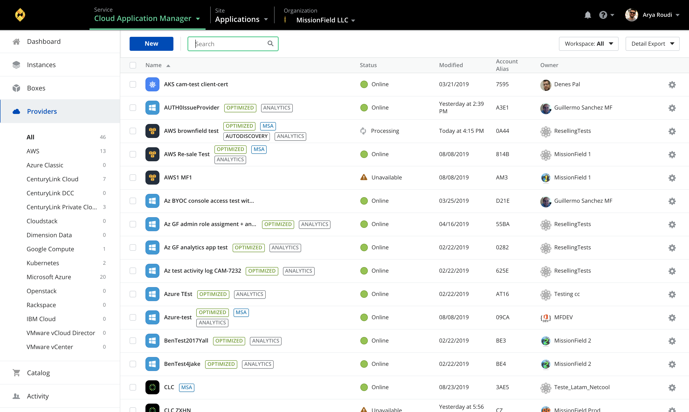

{{{
"title": "Providers",
"date": "05-20-2019",
"author": "Guillermo Sánchez",
"keywords": ["cam", "alm", "providers", "centuryLink-cloud", "clc", "aws", "azure", "google-cloud", "gcp", "cloudstack", "dimension-data", "openstack", "rackspace", "softlayer", "vcloud", "vmware"],
"attachments": [],
"contentIsHTML": false
}}}

**In this article:**

* [Overview](#overview)
* [Audience](#audience)
* [Prerequisites](#prerequisites)
* [Providers](#providers)
* [Providers page](#providers-page)
* [Supported provider types](#supported-provider-types)
* [Contacting Cloud Application Manager Support](#contacting-cloud-application-manager-support)

### Overview

Providers is part of the basics of Cloud Application Manager. This article is meant to assist Cloud Application Manager customers who are starting using the plataform.

### Audience

All Cloud Application Manager customers.

### Prerequisites

An active Cloud Application Manager account.

### Providers

A provider is a public or private cloud account you register in Cloud Application Manager. Cloud Application Manager interfaces with the provider account’s API to provision and orchestrate deployments automatically. Before you can deploy workloads from Cloud Application Manager, you need to register a provider first.

### Providers page

When you click the **Providers** option in the left side menu you will see the providers list you have access to with some basic information for each provider such as its name, synchronization status, when it was last modified, the account alias and the owner who created it.

You can create new providers by clicking on the **New** button, type something in the search field to search for a provider in the list or filter by the workspace they belong to.

Every provider in the list have a gear icon from which you can synchronize or delete the provider. If you click on any of the provider listed, you will get to the provider details page, where you can find more information and interact with it.

If you select several providers by clicking on the check box on the provider line item (or clicking the check box in the header line which will select all), the **Bulk Actions** button dropdown will appear next to the *New* provider button, allowing to sync or delete the selected providers in bulk mode.

### Supported provider types

Cloud Application Manager integrates with many popular clouds. Here is a full list of clouds Cloud Application Manager supports and their availability by Edition:

| Clouds                                                                                                                | Enterprise   (Saas) | Enterprise   (Appliance) |
| --------------------------------------------------------------------------------------------------------------------- | :--------------------: | :-------------------------: |
| [CenturyLink Cloud](../Deploying Anywhere/using-centurylink-cloud.md)                                               | ✓                      | ✓                           |
| [CenturyLink DCC](../Deploying Anywhere/using-dcc.md)                                                               | ✓                      | ✓                           |
| [CenturyLink Private Cloud on VMware Cloud Foundation](https://www.ctl.io/knowledge-base/centurylink-private-cloud-on-vmware-cloud-foundation/) | ✓                      | ✓                           |
| [Amazon Web Services](../Deploying Anywhere/using-your-aws-account.md)                                              | ✓                      | ✓                           |
| Amazon Web Services GovCloud (Same documentation as [Amazon Web Services](../Deploying Anywhere/using-your-aws-account.md)) | ✓              | ✓                           |
| [CloudStack](../Deploying Anywhere/using-cloudstack.md)                                                             | ✓                      | ✓                           |
| Dimension Data                                                                                                      | ✓                      | ✓                           |
| [Google Cloud](../Deploying Anywhere/using-google-cloud.md)                                                         | ✓                      | ✓                           |
| [Microsoft Azure](../Deploying Anywhere/using-azure.md)                                                             | ✓                      | ✓                           |
| [OpenStack Cloud](../Deploying Anywhere/using-openstack-cloud.md)                                                   | ✓                      | ✓                           |
| [Rackspace Cloud](../Deploying Anywhere/using-rackspace-cloud.md)                                                   | ✓                      | ✓                           |
| [SoftLayer](../Deploying Anywhere/using-softlayer.md)                                                               | ✓                      | ✓                           |
| [vCloud Air and vCloud Director](../Deploying Anywhere/orchestrating-vcloud-air-vcloud-director-deployments.md)     | ✓                      | ✓                           |
| [VMware vCenter](../Deploying Anywhere/using-the-vmware-vcenter-private-datacenter.md)                              | ✓                      | ✓                           |

### Contacting Cloud Application Manager Support

We’re sorry you’re having an issue in [Cloud Application Manager](https://www.ctl.io/cloud-application-manager/). Please review the [troubleshooting tips](../Troubleshooting/troubleshooting-tips.md), or contact [Cloud Application Manager support](mailto:incident@CenturyLink.com) with details and screenshots where possible.

For issues related to API calls, send the request body along with details related to the issue.

In the case of a box error, share the box in the workspace that your organization and Cloud Application Manager can access and attach the logs.

* Linux: SSH and locate the log at /var/log/elasticbox/elasticbox-agent.log
* Windows: RDP into the instance to locate the log at ProgramDataElasticBoxLogselasticbox-agent.log
