{{{
"title": "Workspaces, Cost Centers, Organizations and Sharing",
"date": "09-20-2019",
"author": "Sergio Quintana and Guillermo Sanchez",
"attachments": [],
"contentIsHTML": false,
"sticky": true,
"keywords": ["workspaces", "organizations", "cost centers", "context switcher", "sharing", "user levels", "creating", "notifications"]
}}}

**In this article:**

* [Overview](#overview)
* [Audience](#audience)
* [Prerequisites](#prerequisites)
* [Introduction](#introduction)
* [Workspaces](#workspaces)
* [Cost Center](#cost-center)
* [Organizations](#organizations)
* [Switching and Managing Workspaces, Cost Centers and Organizations](#switching-and-managing-workspaces-cost-centers-and-organizations)
* [Sharing Boxes, Instances, and Providers](#sharing-boxes-instances-and-providers)
* [Sharing notifications](#sharing-notifications)
* [Sharing example](#sharing-example)
* [Sharing considerations](#sharing-considerations)
* [Sharing with people or groups across Organizations](#sharing-with-people-or-groups-across-organizations)
* [Getting General Support](#getting-general-support)

### Overview

This article guides Cloud Application Manager customers around the concepts of [Workspaces](#workspaces), [Cost Centers](#cost-center), [Organizations](#organizations), and how to [share](#sharing-boxes-instances-and-providers) them with other users.

### Audience

All Cloud Application Manager users.

### Prerequisites

An active Cloud Application Manager account.

### Introduction

In Cloud Application Manager, boxes let you deliver applications predictably. Sharing enables others to reuse your box configuration or work collaboratively to build better applications.

Cloud Application Manager lets you share three types of assets: boxes, instances, and providers. You decide the level of access that works best when you share. Share with users or with workspaces and give them view or edit access.

In Cloud Application Manager, you can organize users to grant them access to several assets at the same time. Users might be members of Workspaces, Cost Centers and Organizations.

These **contexts** have a hierarchical structure of scope levels in Cloud Application Manager. An **Organization** groups a set of Cost Centers. A **Cost Center** includes  Workspaces and finally, a **Workspace** includes several assets: *Instances, Boxes, and Providers*.

When you first sign in to Cloud Application Manager, you only have a personal workspace called My Workspace. After that you can be invited as member to other Workspaces, Cost Centers or Organizations.

### Workspaces

Workspaces are the most common way to have users collaborating on a set of instances, boxes and providers with certain access permissions.

For a video tutorial and step-by-step instructions for using Workspaces, please see our [Getting Started Guide](https://www.ctl.io/guides/cloud-application-manager/getting-started-workspace-cloud-application-manager/).

#### Context elements

Workspace is the context where three types of assets are included: boxes, instances and providers.

To have instances, boxes or providers available in a workspaces, create them inside it or share them with the workspace with the appropriate level of permission.

#### Members roles. Sharing and collaboration

At the same time, workspaces have members. The members of the workspaces are users or groups of users (for example, LDAP Groups).

Each member can have a level of permission that will allow him to see different assets in the workspace.

The different levels are:

1. **Visitor:**  A visitor member can see instances, boxes and providers, but he cannot edit them. Use this role to monitor share what is happening on a workspace without worrying about the user potentially breaking something.

2. **User:** A user member can see and edit instances, see boxes, but he cannot see providers. He is allowed to deploy instances. Use this role for people who will apply fixes and who need to deploy instances but shouldn’t edit boxes without supervision. For example, developers can use the User rights to deploy testing environments.

3. **Author:** An author member can see and edit instances and boxes, and see providers. He cannot edit a provider but he can author new policy boxes. This is a common role for people who are creating boxes and managing the environment, but shouldn’t be changing the credentials or adding new members.

4. **Administrator:** An administrator member can see and edit instances, boxes and providers. In addition, he can change permission of other members and other settings. He has the highest permissions of all members. Use this for team leaders of the workspace.

#### Workspace permissions in Federated Organizations

If your organization is federated to other organizations, you can share the workspace with other organizations. When you federate a workspace, administrators of the other organization can access the workspace and you can add members of the other organization to the workspace. This is useful to get support from the Cloud Application Manager team support, you can federate a workspace with us to give us access to the assets to diagnose a support ticket.

If you want to use this feature in different ways, please [contact us](mailto:incident@CenturyLink.com).

### Cost Center

A Cost Center is a context used to manage several Workspaces in the same manner.

#### Context elements

* A Cost Center groups a set of Workspaces. 
* All workspaces belong to a Cost Center that is assigned when they are created.

#### Members and permissions

Being a member of a Cost Center allows you to manage all assets of all the workspaces belonging to it as if you were an Administrator of those workspaces.

In addition to that, a Cost Center member can create new and delete workspaces inside the Cost Center.

Users who manage a big team or several project are usually Cost Center administrators. The ability to create workspaces make Cost Center members able to organize the users and assets and keep the big picture of how things are organized.

### Organizations

An Organization is the highest scope level used to manage several Cost Centers and the Workspaces they include.

#### Context elements

* An Organization includes a set of Cost Centers. 
* A default Cost Center is created whenever a new Organization is created in Cloud Application Manager.
* Organization administrators can create as many Cost Center as they want to align with their organization structure.
* All Cost Centers and Workspaces belong to an Organization.

#### Members and permissions

The administrators of an Organization can change many settings that affect the whole organization.  
See more details [here](../Administering Your Organization/admin-overview.md).

#### Organization Federation

You can share a workspace of your Organization with other organization so that your assets are accessible to the administrators of the other organization. In this case, your Organization is federated.

### Switching and Managing Workspaces, Cost Centers and Organizations

You can use the Context Switcher in the top of the screen to access different Workspaces, Cost Centers and Organizations to which you have access.

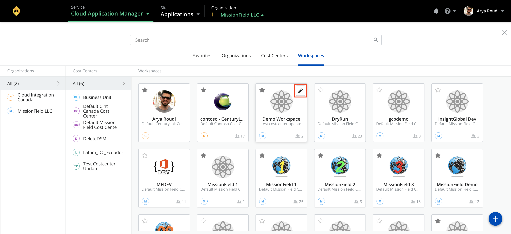

This allows you to filter and search for the right scope to the work you need to do. The *Instances*, *Boxes* and *Providers* available to you will change to reflect the selected scope. For example, if you select a Cost Center, you can see all Instances, Boxes and Providers that are in all Workspaces belonging to that Cost Center.

See more information about [**Context Switcher**](context-switcher.md).

### Sharing Boxes, Instances, and Providers

When you create a box, launch an instance, or add a provider, they are created in the Workspace that you are currently working in, that is, the one you have selected in the Context Switcher. You can control how others use it by giving them view or edit access. Edit access gives users the same level of access as the owner but they cannot delete the asset.

* When you share with a user, the asset will appear in his personal workspace with the permission given.
* When you share with a SAML or LDAP group, all users who belong to that group will be able to access the asset
* If you decide to share with a team workspace, all the users on the workspace with the corresponding permissions will be able to access the asset.

When you share with a Workspace, all workspace members get access according to their role.

A workspace is a shared environment in which members of that workspace can access the same providers, boxes, and instances. Workspaces are contextual. When you switch workspaces you see a whole different group of instances, boxes, and providers, which belong only to that workspace.

In the sharing dialog of a resource, you can do the following:

* Add a new user or workspace to the sharing list
* Remove an existing user or workspace from the sharing list
* Change access permissions from an existing user or workspace

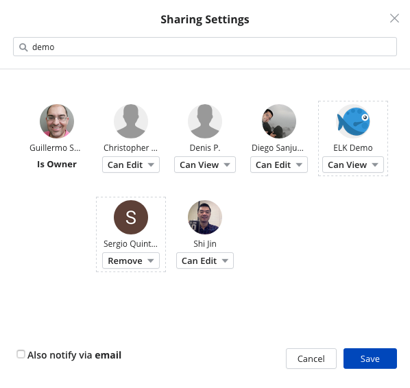

The changes to be applied to the sharing list appear highlighted with a dotted border line, and will be effective once you click on the **Save** button.

### Sharing notifications

A notification badge consisting on a red dot will appear on the UI for those users users that have been added to the sharing list of a resource (i.e. provider, box or instance). The badge includes a number when one or more new resources may be available there. It will appear in several places to make the user aware of the new resource he has access to:

1. When opening the context switcher, the workspaces with newly accessible resources will present the badge, with a number representing the total newly accessible resources

    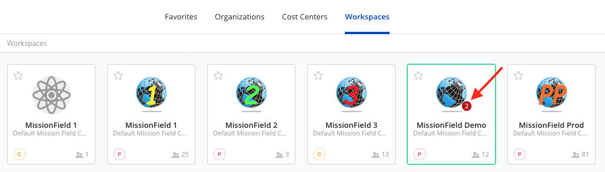

2. When accessing a scope with shared resources, the left side menu will also show the badge in the corresponding type of resources with the number of newly accessible resources of that type

    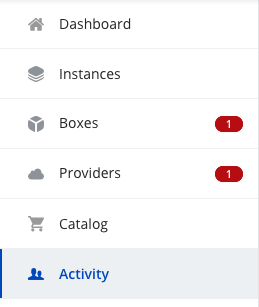

3. When accessing the resource type page by clicking on the corresponding left side menu option, the individual newly accessible resources will display the red dot, either in the list line-item:

    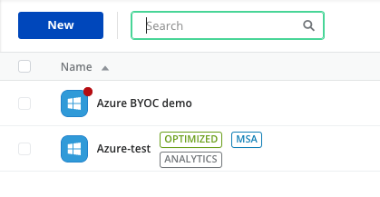

    Or in the tile item:

    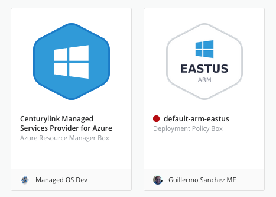

Once you access the resource details page, the badge will be cleared for that resource.

#### Email sharing notifications

When sharing a resourcce, there is also an option in the sharing dialog to also notify via email to the users that have been added to the sharing list of a resource. The email will be sent to individual recipients and to all members of the workspace, if the resource has been shared with a team workspace. If a recipient workspace has more than 30 members, the email notification will not be sent to that member group, and only the UI notification will be provided for them.

#### Clearing all notifications at once

There is also a new bell icon in the top navigation bar that provides an option to clear all notifications at once, so the user will get rid of all UI notifications that he currently has.

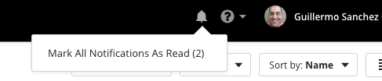

### Sharing example

Say you have a Jenkins box that integrates and stages code for testing. You want to collaborate with other Jenkins experts to make the box configuration highly usable. So you give their workspace edit access. Next, the QA team needs this box to deploy and run tests, so you give their workspace view access. Now the QA team can deploy Jenkins instances, but as you’d expect, they aren’t allowed to change the underlying Jenkins box definition.

**Notice** that providers and policy boxes cannot be shared with workspaces that are not in the same Cost Center. This avoids users outside of one Cost Center to deploy instances that will increase the cost associated with another Cost Center.

#### Sharing with other users

1. From the instance or provider detail page, click **Share**.

    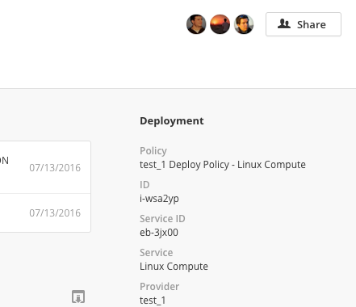

    Or from the box detail page, click on the pencil icon in the collaborators section.

    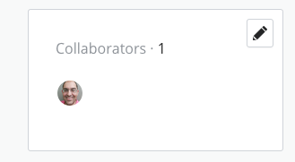

    **NOTE**: You can also access the sharing dialog for boxes through the gear icon dropdown in the boxes list page.

2. In the sharing dialog, start typing the name of the users or workspaces you want to share with and select them.

    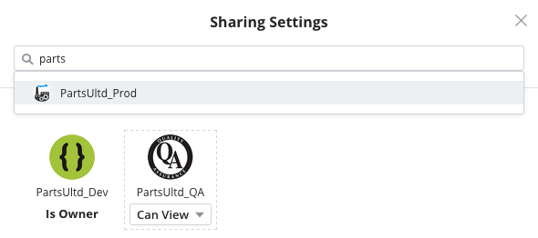

3. For each user or workspace that you added, give view or edit access. They get edit access by default.

    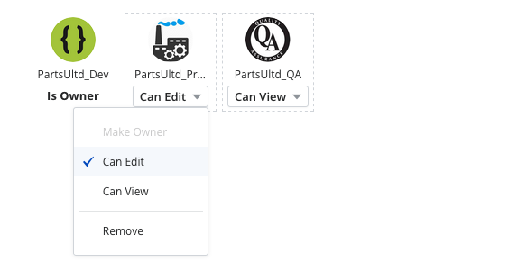

#### Stop Sharing

To discontinue sharing with a user or workspace, open the sharing dialog, and remove them.

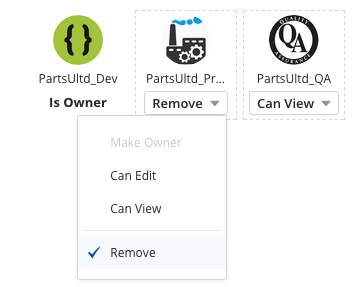

#### Transfer Ownership

Sometimes, because your role in the organization changes, you may want to transfer an asset you own to another user or workspace. To change owners, open the sharing dialog, and make another user or workspace the owner.  

An asset can only have one owner at a time. Only the owner can transfer ownership.

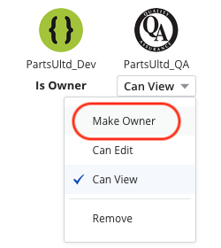

### Sharing considerations

#### Sharing Boxes with the right access mode

When you want others to change your current box configuration or collaborate with you to define a better box, give them **edit access** to it. Give **view access** only when they need to consume your box configuration, but not make changes, like deploying for example.

View only gives them access to versions of the box, not the current state of its configuration (draft), which may or may not be stable. When stable, the scripts and variables are working, version the box and then give view access to those that need it.

In view mode, users automatically get access to all versions of a box, but can’t share with others. They can do the following:

* Access all versions of the box in read-only mode.
* Deploy a box.
* View events and variables.
* Pull a box version into the instance lifecycle editor to update configuration.

#### Sharing Instances

A couple of reasons to share instances is to let others use it or get help with testing or debugging for example. If it’s the latter, you can get help by giving them **edit access** to your instance. That lets them make changes to your instance configuration.

Also you may give **view access** to make an instance available for others to use, say as a binding. For example, although view access to a database instance prevents developers from making changes to the database configuration, they can bind to it and run tests.

#### Sharing Providers

Sharing providers has its benefits. You can give **view access** to company-approved providers and let users deploy to that particular provider. When teams deploy to a shared provider, you can track org-wide usage and compliance cohesively.

If you share a provider with **edit access**, the user will have full access to the provider, allowing him to edit its details, enable/disable services, synchronizing its state, or even accessing the vendor console, if the provider type allows it.

### Sharing with people or groups across Organizations

#### Sharing team workspaces

To share a team workspace with other Organizations, you should be an administrator of the organization, administrator of cost center where the team workspace belongs to, or you should be the administrator of the team workspaces. In this article, we consider that the user is an organization administrator.

In order to share a team workspace across organizations you have to follow the next steps:

1. If the organization you want to share with is not yet visible in the *Organizations* section of the Workspace settings page, you should send a request to [support](mailto:incident@CenturyLink.com) requesting the organization you want to share with to be federated with your own organization.

2. Once the support team federates the organization you want to share with, it should appear in the workspace settings menu. Click on the pencil button in the corresponding workspace tile on the context switcher to access its settings.

    

3. In the Organizations section, you can allow **Share** the team workspace with any organization that is federated with your organization.

    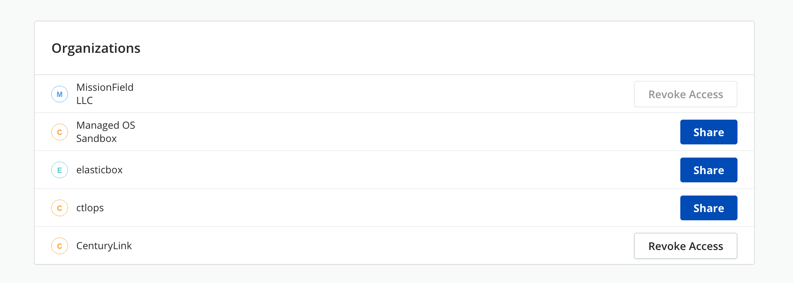

    Click the 'Share' button of the organization where the user or group you want to share with belongs.

    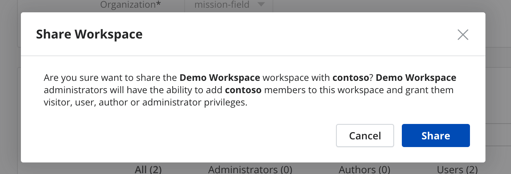

    Click **Share** in the confirmation dialog.

4. Now you can add any user or group from the organization you share with to the **Members** section of the workspace. The users or groups of that organization will appear in the look ahead as any other member of your organization.

    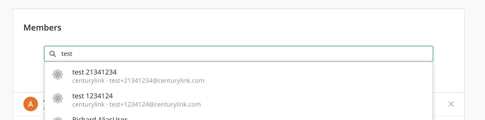

    By default, any member is added with the *User* role, but you can change it to the appropriate role. For more information about roles, please refer to [Workspaces - Sharing and collaboration](#Workspaces)

    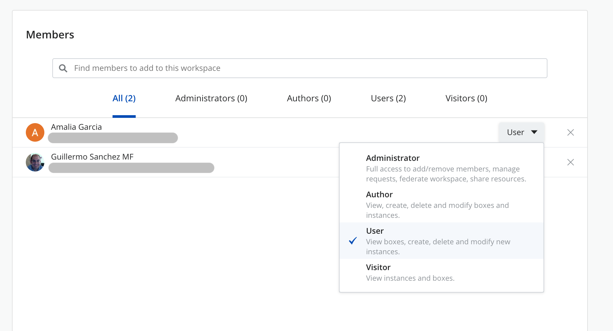

    Please, note that every member on the list has the name of the organization they belong to below the member name, along with its email address.

5. Now the user that has been added can see the team workspace and access it with the corresponding role that has been assigned to him in the workspace.

    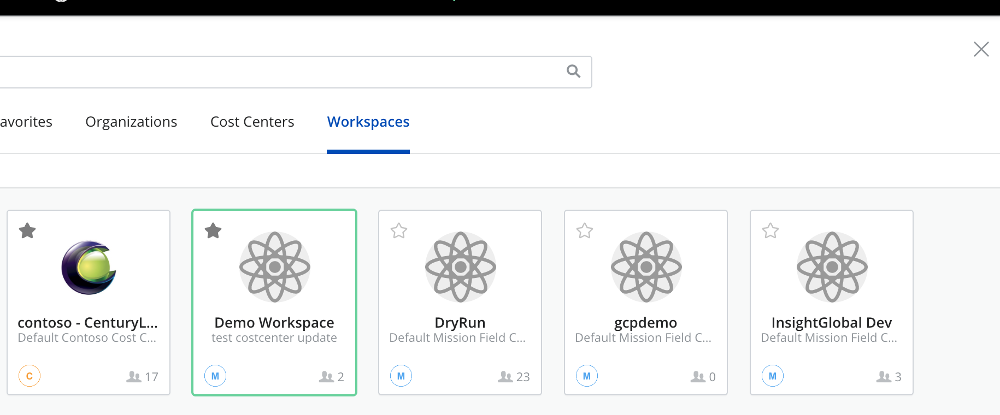

#### A particular user stop sharing team workspaces

To stop sharing a team workspace with other Organizations, you should be an administrator of the organization, administrator of cost center where the team workspace belongs to, or you should be the administrator of the team workspaces. In this article, we consider that the user is an organization administrator.

In order stop sharing a team workspace across organizations you have to follow the next steps:

1. Go to team workspace settings.

2. Remove the user from the member's list.

    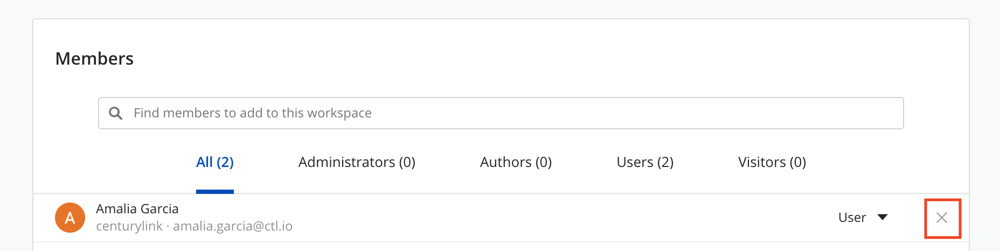

    Click **Remove** in the confirmation dialog.

    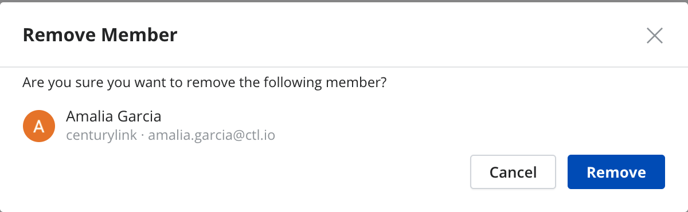

3. From then on, the user will not see the team workspace anymore.

    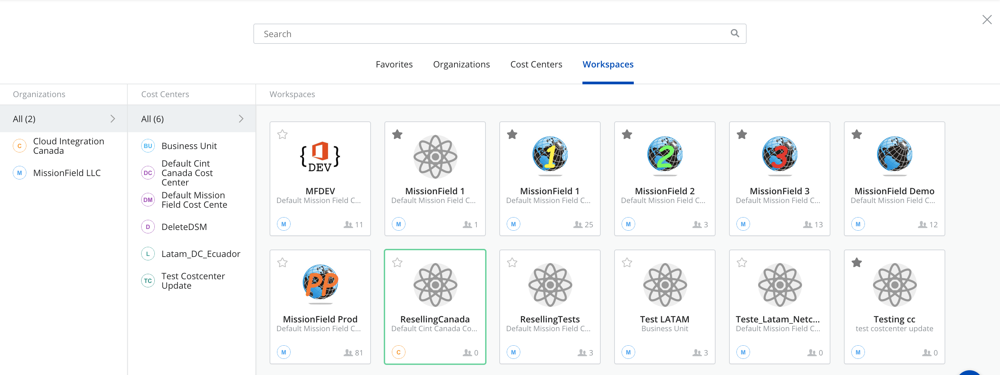

#### Stop sharing team workspaces

To revoke access of sharing a team workspace with other Organizations, you should be an administrator of the organization, administrator of cost center where the team workspace belongs to, or you should be the administrator of team workspaces. In this article, we consider that the user is an organization administrator.

To revoke access to sharing a team workspace you have to follow the next steps:

When you want to revoke access, you have to ensure there are no members from the organization you want to remove access. If there are any, please remove them first by following the above steps. Once there is no members from the organization, just press the '**Revoke Access**' button in the Organizations section of the Workspace settings page.

  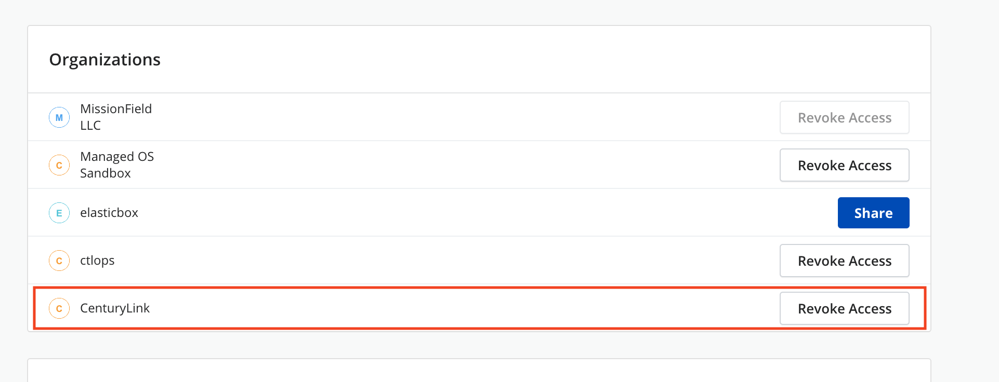

Click **Revoke Access** in the confirmation dialog.

  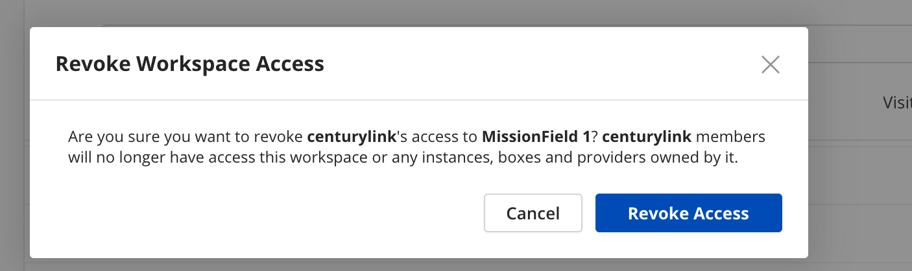

At this moment, no user nor group of that organization will be available to be added as member to the workspace.

### Getting General Support

Customers can contact the CenturyLink Global Operations Support center (support desk) directly for getting help with Cloud Application Manager as well as any other supported product that they’ve subscribed to.  Below are three ways to get help.

#### Contact:

1. **Phone:** 888-638-6771

2. **Email:** incident@centurylink.com

3. **Create Ticket in Cloud Application Manager:** Directly within the platform, users can “Create Ticket” by clicking on the “?” symbol in upper right corner near the users log-in profile icon.  This takes users directly to the Managed Servicers Portal where they can open, track and review status of issues that have been raised with the support desk.  Additionally, this is how a TAM can be engaged as well.

#### Instructions:

1. Provide your name
2. CAM account name
3. A brief description of your request or issue for case recording purposes

The support desk will escalate the information to the Primary TAM and transfer the call if desired.
