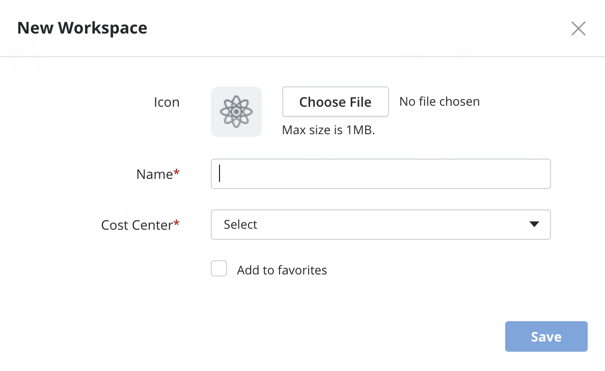

{{{
"title": "Workspaces, Cost Centers, Organizations and Sharing",
"date": "09-01-2016",
"author": "",
"attachments": [],
"contentIsHTML": false,
"sticky": true
}}}

### Workspaces, Cost Centers, Organizations and Sharing
In this article:
* Overview
* Workspaces
* Cost Center
* Organizations
* Favorites
* Switching and Managing Workspaces, Cost Centers and Organizations
* Create Workspace flow
* Create Cost Center flow
* Sharing Boxes, Instances, and Providers

### Overview

In Cloud Application Manager, boxes let you deliver applications predictably. Sharing enables others to reuse your box configuration or work collaboratively to build better applications.

Cloud Application Manager lets you share three types of assets: boxes, instances, and providers. You decide the level of access that works best when you share. Share with users or with workspaces and give them view or edit access.

In Cloud Application Manager, you can organize users to grant them access to several assets at the same time. Users might be members of Workspaces, Cost Centers and Organizations.

When you first sign in to Cloud Application Manager, you only have a personal workspace called My Workspace. After that you can be invited as member to other Workspaces, Cost Centers or Organizations.

### Workspaces

Workspaces are the most common way to have users collaborating on a set of instances, boxes and providers.

To have instances, boxes or providers available in a workspaces, create them inside it or share them with the workspace with the appropriate level of permission.

At the same time, workspaces have members. The members of the workspaces are users or groups of users (for example, LDAP Groups).

Each member can have a level of permission that will allow him to see different assets in the workspace.

The different levels are:

1. **Visitor:**  A visitor member can see instances, boxes and providers, but he cannot edit them. Use this role to monitor share what is happening on a workspace without worrying about the user potentially breaking something.

2. **User:** A user member can see and edit instances, see boxes, but he cannot see providers. He is allowed to deploy instances. Use this role for people who will apply fixes and who need to deploy instances but shouldn’t edit boxes without supervision. For example, developers can user the User rights to deploy testing environments.

3. **Author:** An author member can see and edit instances and boxes, and see providers. He cannot edit a provider but he can author new policy boxes. This is a common role for people who are creating boxes and managing the environment, but shouldn’t be changing the credentials or adding new members.

4. **Administrator:** An administrator member can see and edit instances, boxes and providers. In addition, he can change permission of other members and other settings. He has the highest permissions of all members. Use this for team leaders of the workspace.

If your organization is federated to other organizations, you can share the workspace with other organizations. When you federate a workspace, administrators of the other organization can access the workspace and you can add members of the other organization to the workspace. This is useful to get support from the Cloud Application Manager team support, you can federate a workspace with us to give us access to the assets to diagnose a support ticket.

If you want to use this feature in different ways, please [contact us](mailto:incident@CenturyLink.com).

### Cost Center

All workspaces belong to a Cost Center that is assigned when it’s created.

Being a member of a Cost Center allows you to manage all assets of all the workspaces belonging to it as if you were an Administrator of those workspaces.

In addition to that, a Cost Center member can create new and delete workspaces inside the Cost Center.

Users who manage a big team or several project are usually Cost Center administrators. The ability to create workspaces make Cost Center members able to organize the users and assets and keep the big picture of how things are organized.

### Organizations

All Cost Centers and Workspaces belong to an Organization.

The administrators of an Organization can change many settings that affect the whole organizations. See more details [here](../Administering Your Organization/admin-overview.md).

### Favorites

The Favorites section contains a list of any workspace, cost center or organization that the user added for easier or more convenient access to. To add to this section, simply click the Star icon in the upper left hand corner of any of the aforementioned spaces. The star will become dark grey to indicate that the space has been successfully added. Clicking the Star icon again, which then turns the color to white, will remove the space from the Favorites section.

### Switching and Managing Workspaces, Cost Centers and Organizations

You can use the switcher in the top of the screen to access different Workspaces, Cost Centers and Organizations to which you have access.

This allows you to filter and search for the right scope to the work you need to do. The Instances, Boxes and Providers available to you will change to reflect the selected scope. For example, if you select a Cost Center, you can see all Instances, Boxes and Providers that are in Workspaces belonging to that Cost Center.

**Workspace Switcher - Workspace view**

**Workspace Switcher - Cost Center View**

**Workspace Switcher - Organization view**

**Workspace Switcher - Favorites view**

The switcher also offer the option to create Workspaces and Cost Centers.

### Create Workspace flow

Create workspace flow will ask users to select the Cost Center the workspace belongs to. Once created, the Cost Center cannot be changed.

### Create Cost Center flow

Create Cost Center flow will ask users to select the Organization the Cost Center belongs to. It will usually be only one organization to select. Once created, the Cost Center cannot change Organization.

### Sharing Boxes, Instances, and Providers

**Sharing**

When you create a box, launch an instance, or add a provider, they are created in the Workspace that you have selected in the Workspace Switcher. You can control how others use it by giving them view or edit access. Edit access gives users the same level of access as the owner but they cannot delete the asset.

When you share with a user, the asset will appear in his personal workspace with the permission given.

If you decide to share with a team workspace, all the users on the workspace with the right permissions will be able to access the asset.

When you share with a Workspace, all workspace members get access according to their role.

A workspace is a shared environment in which members of that workspace can access the same providers, boxes, and instances. Workspaces are contextual. When you switch workspaces you see a whole different group of instances, boxes, and providers, which belong only to that workspace.

**Example**

Say you have a Jenkins box that integrates and stages code for testing. You want to collaborate with other Jenkins experts to make the box configuration highly usable. So you give their workspace edit access. Next, the QA team needs this box to deploy and run tests, so you give their workspace view access. Now the QA team can deploy Jenkins instances, but as you’d expect, they aren’t allowed to change the underlying Jenkins box definition.

Notice that providers and policy boxes cannot be shared with workspaces that are not in the same Cost Center.

**Steps**

1. From the box, instance, or provider detail page, click **Share**.

2. In the sharing dialog, type the name of the users or workspaces you want to share with and select them.

3. For each user or workspace that you added, give view or edit access. They get edit access by default.

**Stop Sharing**

To discontinue sharing with a user or workspace, open the sharing dialog, and remove them.

**Transfer Ownership**

Sometimes, because your role in the organization changes, you may want to transfer an asset you own to another user or workspace. To change owners, open the sharing dialog, and make another user or workspace the owner. An asset can only have one owner at a time.

**Sharing Boxes**

When you want others to change your current box configuration or collaborate with you to define a better box, give them edit access to it. Give view access only when they need to consume your box configuration, but not make changes, like deploying for example.

View only gives them access to versions of the box, not the current state of its configuration, which may or may not be stable. When stable, the scripts and variables are working, version the box and then give view access to those that need it.

In view mode, users automatically get access to all versions of a box, but can’t share with others. They can do the following:

* Access all versions of the box in read-only mode.
* Deploy a box.
* View events and variables.
* Pull a box version into the instance lifecycle editor to update configuration.

**Sharing Instances**

A couple of reasons to share instances is to let others use it or get help with testing or debugging for example. If it’s the latter, you can get help by giving them edit access to your instance. That lets them make changes to your instance configuration.

Also you may give view access to make an instance available for others to use, say as a binding. For example, although view access to a database instance prevents developers from making changes to the database configuration, they can bind to it and run tests.

**Sharing Providers**

Sharing providers has its benefits. You can give view access to company-approved providers and let users deploy to that particular provider. When teams deploy to a shared provider, you can track org-wide usage and compliance cohesively. Provider accounts can be shared only in the Enterprise Edition.
