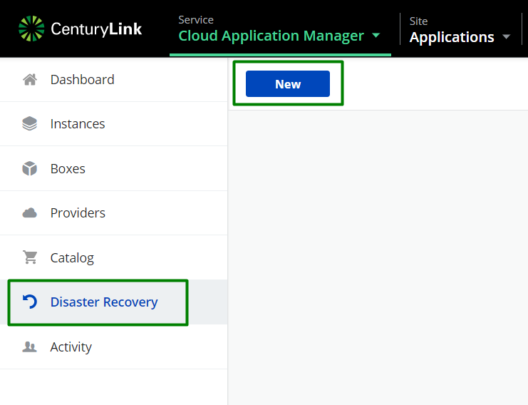
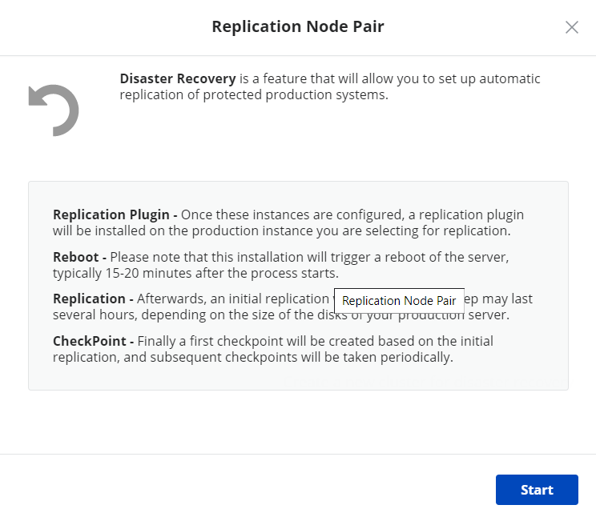
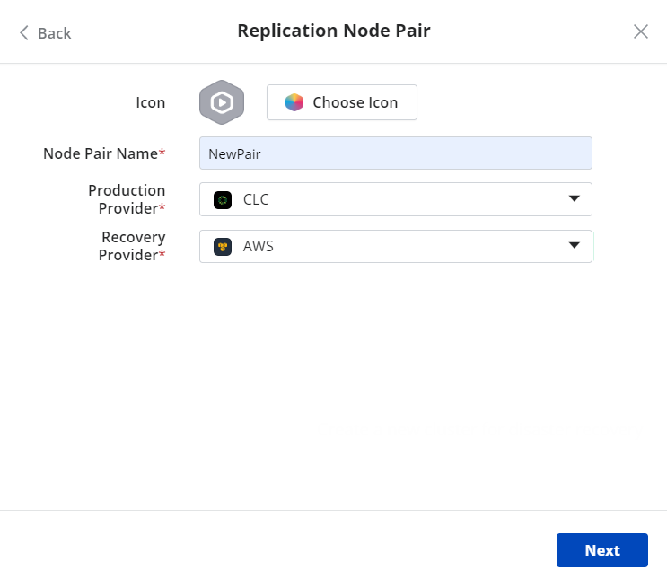
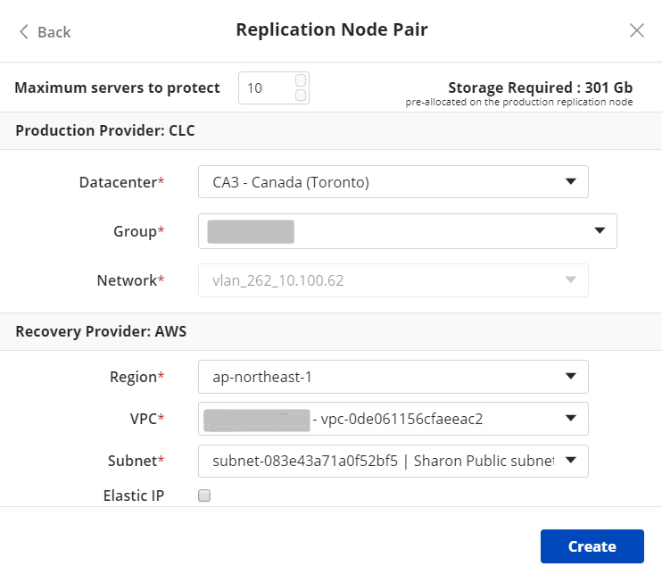

{{{
  "title": "Create Node Pair",
  "date": "09-26-2019",
  "author": "Sharon Wang",
  "attachments": [],
  "contentIsHTML": false
}}}

**In this article:**

* [Overview](#overview)
* [Audience](#audience)
* [Prerequisites](#prerequisites)
* [Create a Node Pair](#create-a-node-pair)

### Overview 

This article is meant to assist users of Cloud Application Manager willing to use Disaster Recovery feature, trying to create new Replication Node Pairs

### Audience

All users of Cloud Application Manager who wants to use Disaster Recovery feature.

### Prerequisites

* An active *Cloud Application Manager* account
* An existing *AWS* account configured in an [*AWS*](../Deploying Anywhere/using-your-aws-account.md) provider.
* Both CLC and AWS providers are registered

 
### Create a Node Pair
1. Click on **Disaster Recovery** on the navigation bar, then click on the button **New** to create a new pair.

2. Click on **Start**
 
3. Fill in the information of the Node Pair:  
 a. Choose an Icon if needed  
 b. Give this Node Pair a name   
 c. Choose Production Provider  
 d. Choose Recovery Provider  
 e. Click on Next  

3. Fill in the detailed information of each Provider:  
 a. Decide the maximum servers to protect  
 b. Choose where to deploy your Prod node 
 c. Choose where to deploy your Recovery node  
 d. Click on Create  

If you have additional questions, please [contact Cloud Application Manager Support](mailto:incident@CenturyLink.com)
