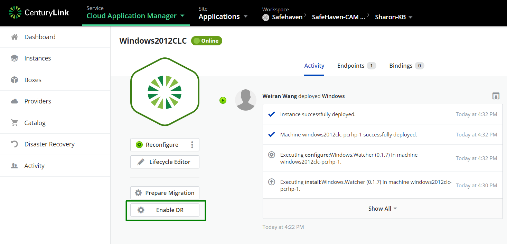

{{{
  "title": "Enable DR",
  "date": "09-26-2019",
  "author": "Sharon Wang",
  "attachments": [],
  "contentIsHTML": false
}}}

**In this article:**

* [Overview](#overview)
* [Audience](#audience)
* [Prerequisites](#prerequisites)
* [Enable DR](#enable-dr)

### Overview 

This article is meant to assist users of Cloud Application Manager willing to use Disaster Recovery feature, trying to enable Disaster Recovery from CAM portal

### Audience 

All users of Cloud Application Manager who wants to use Disaster Recovery feature.

### Prerequisites 

* A production server on CLC 
* An existing node pair

### Enable DR 

1. Navigate to the production windows server, click on **Enable DR**

2. Click on ** Start**

3. Check the box to approve the reboot then click on **Initiate Protection**

3. Fill in the detailed information of each Provider:
 * Decide the maximum servers to protect
 * Choose where to deploy your Prod node
 * Choose where to deploy your Recovery node
 * Click on Create

If you have additional questions, please [contact CLoud Application Manager Support](mailto:incident@CenturyLink.com)
