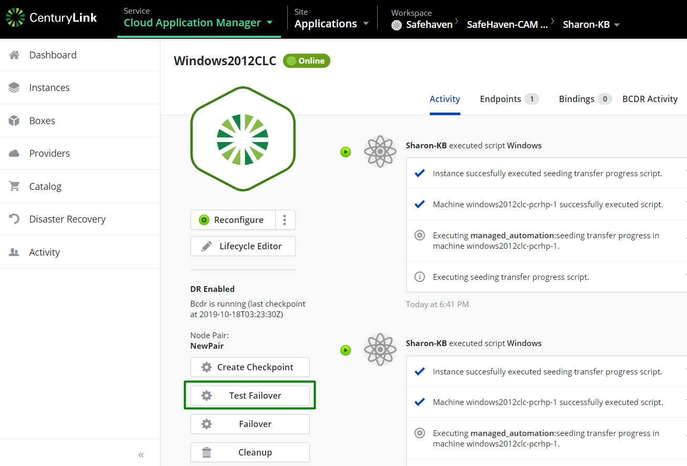

{{{
  "title": "Test Failover Operation",
  "date": "09-26-2019",
  "author": "Sharon Wang",
  "attachments": [],
  "contentIsHTML": false
}}}

**In this article:**

* [Overview](#overview)
* [Audience](#audience)
* [Prerequisites](#prerequisites)
* [Test Failover](#Test-Failover)

### Overview 

This article is meant to assist users of Cloud Application Manager willing to use Disaster Recovery feature, trying to initiate Test Failover Operation

### Audience 

All users of Cloud Application Manager who wants to use Disaster Recovery feature.

### Prerequisites 

* The production server is protected and 100% synced

### Test Failover 
1. Navigate to the production windows server. Make sure BECR is running and you have last checkpoint taken, click on **Test Failover**

3. Fill in the detailed information of Test Failover instance:
 a. Choose a desired checkpoint
 b. Choose the **Instance Type**
 c. Choose the **VPC**
 d. Choose the **subnet**
 e. Click on ** Test Failover**

4. Once the Recovery server is deployed, you will be able to see the Test Failover instance on Instances tab

5. You Can delete the Test Failover clone by simply deleted by Terminating it:

If you have additional questions, please [contact CLoud Application Manager Support](mailto:incident@CenturyLink.com)
