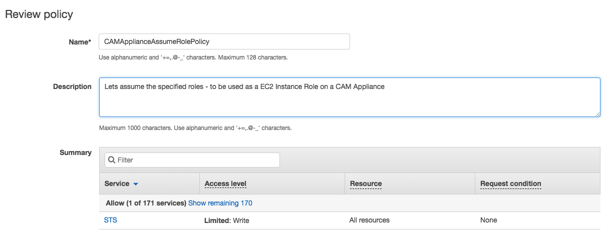
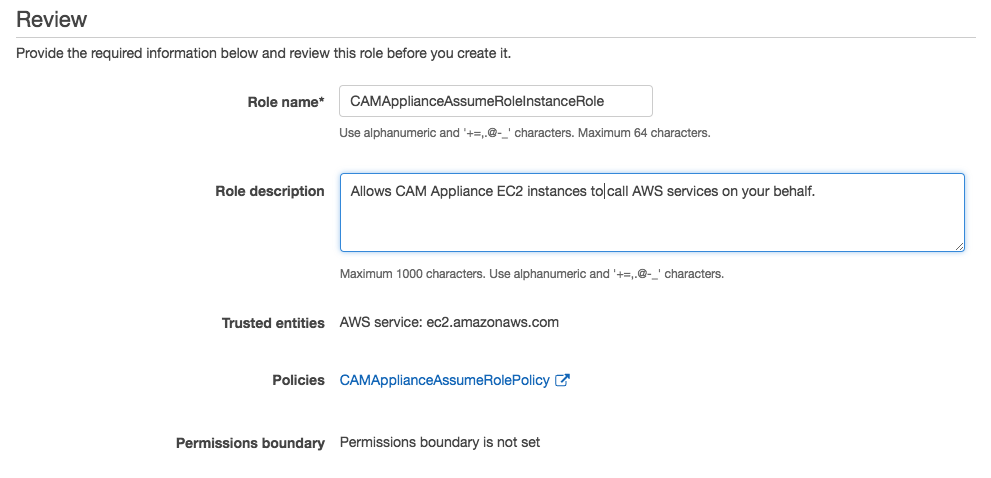
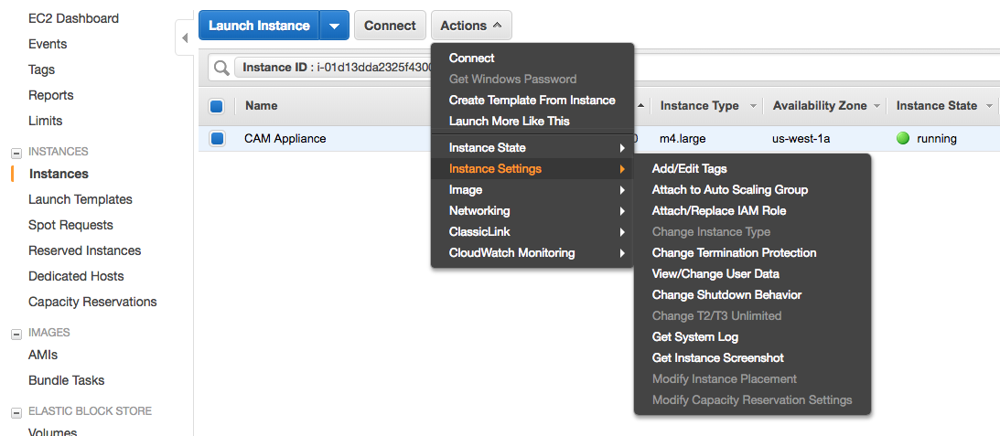
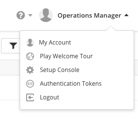
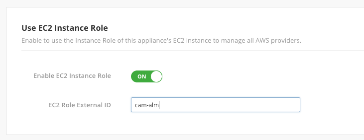
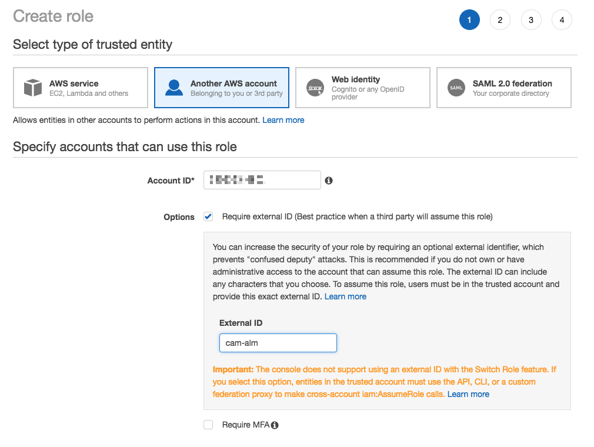
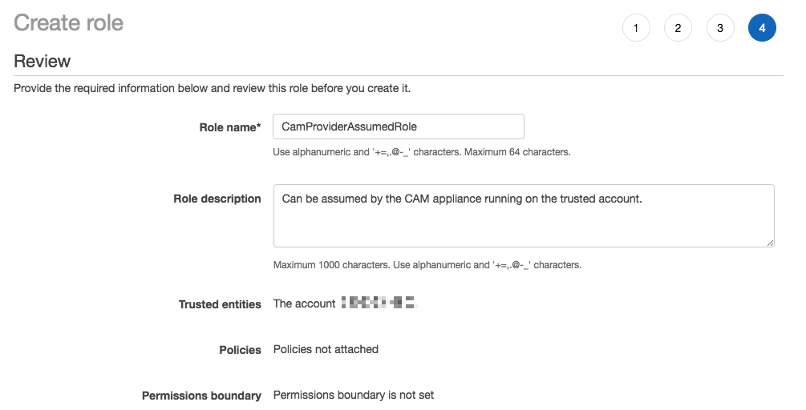
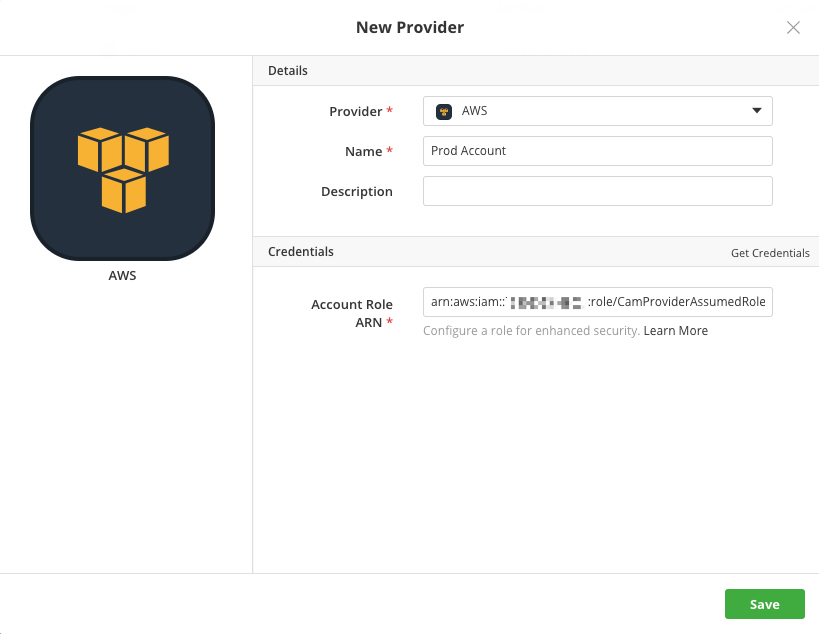

{{{
"title": "Cloud Application Manager Data Center Edition with EC2 Instance Role",
"date": "05-24-2019",
"author": "Roberto Santamaria and Diego Sanjuan",
"keywords": ["aws", "iam", "appliance", "role", "cam"],
"attachments": [],
"contentIsHTML": false
}}}

**In this article:**

* [Overview](#overview)
* [Audience](#audience)
* [Prerequisites](#prerequisites)
* [Additional information](#additional-information)
* [Create the Policy for the EC2 Instance Role](#create-the-policy-for-the-ec2-instance-role)
* [Create the EC2 Instance Role](#create-the-ec2-instance-role)
* [Attach the IAM Role to the Cloud Application Manager Data Center Edition EC2 Instance](#attach-the-iam-role-to-the-cloud-application-manager-data-center-edition-ec2-instance)
* [Enable the EC2 Instace Role on CAM](#enable-the-ec2-instace-role-on-cam)
* [Create a Policy and Role for the managed account](#create-a-policy-and-role-for-the-managed-account)
* [Create a Cloud Application Manager AWS Provider](#create-a-cloud-application-manager-aws-provider)
* [Contacting Cloud Application Manager Support](#contacting-cloud-application-manager-support)


### Overview


This article shows how to leverage an EC2 Instance Role as an authorization mechanism for all AWS API calls from a Cloud Application Manager Data Center Edition (referred to as appliance from now on). EC2 Instance Roles ease credential management and increase security for applications running in EC2 instances. You can learn more about them in [the AWS documentation](https://docs.aws.amazon.com/AWSEC2/latest/UserGuide/iam-roles-for-amazon-ec2.html).


### Audience


All Cloud Application Manager users who wants to deploy workloads into AWS from a Cloud Application Manager appliance running as an EC2 instance.


### Prerequisites


* Your Cloud Application Manager Data Center Edition (appliance) should be properly configured and running. You can refer to the [Cloud Application Manager Data Center Edition documentation](camdce-overview.md).
* You can create IAM Policies and Roles on the account that hosts the Cloud Application Manager appliance and in any other account that will be managed as a CAM Provider.


### Additional information


   * This feature only applies to appliances running as AWS EC2 Instances.
   * Once set, you will only be able to configure new AWS providers using an IAM Role. Providers created previously with key and secret pair will still work using these credentials.
   * Only AWS API communication is affected by this feature. All other provider types (CenturyLink Cloud, Microsoft Azure, VMware vSphere, etc.) will continue to work as expected.


### Create the Policy for the EC2 Instance Role


EC2 Instance Roles are created automatically when you create an IAM Role on the AWS Role. That is not the case for the [AWS CLI or an AWS SDK](https://docs.aws.amazon.com/AWSEC2/latest/UserGuide/iam-roles-for-amazon-ec2.html#ec2-instance-profile), so refer to the proper documentation for the specific commands for instance roles. The rest of the guide assumes the roles are created on the AWS Console.

1. Go to [AWS Services console](https://console.aws.amazon.com) and login into the account that hosts the instance of Cloud Application Manager.

2. Create a custom AWS Policy by going to **Services**, then click **IAM** below **Security, Identity, & Compliance**. Then select **Policies** in the left side menu.


3. Click on **Create policy** button, select **Create your own policy**, then click on the **JSON** tab. You can use the following snippet to allow impersonation on any role:

```
{
    "Version": "2012-10-17",
    "Statement": [
        {
            "Sid": "VisualEditor0",
            "Effect": "Allow",
            "Action": "sts:AssumeRole",
            "Resource": "*"
        }
    ]
}
```

You may restrict the policy even more by adding the roles that the appliance will need to assume. The policy can be modified at a later date if additional roles are required. Please note that if you add a Cloud Application Manager provider with an ARN that is not listed in this policy, Cloud Application Manager will not be able to assume it and will show an error message.

```
{
    "Version": "2012-10-17",
    "Statement": [
        {
            "Sid": "VisualEditor0",
            "Effect": "Allow",
            "Action": "sts:AssumeRole",
            "Resource": [
                "arn:aws:iam::<account_id_1>:role/role_name_1",
                "arn:aws:iam::<account_id_2>:role/role_name_2",
                ...
            ]
        }
    ]
}
```


1. When the policy document is ready, click on **Review policy** and if there are no errors you will be prompted to enter a name and a description. Save the changes clicking on **Create policy** at the bottom of the page.



In this example the policy is named *CAMApplianceAssumeRolePolicy*.


### Create the EC2 Instance Role


1. Once you have created a custom AWS policy go to main left side menu and select **Roles** option. Create an **IAM role** by clicking the create role button, leave the default option as **AWS Service**, then click on **EC2** and **Next: Permissions**.
2. Filter the policy list and select the policy you created on the previous section. Then click **Next: Tags**, tag the role as necessary, and then click **Next: Review**.


3. Add a name and a description, then click **Create Role**.




### Attach the IAM Role to the Cloud Application Manager Data Center Edition EC2 Instance


1. Once the role is created, navigate to the EC2 console via **Services**, **Compute** and **EC2**, and then locate the instance where the Cloud Application Manager appliance runs. You may need to switch to a different region to find it. IAM roles are region-independent, so you can define it once and use it in several regions. The **Attach/Replace IAM Role** is available for both running and stopped instances. Click on it to select the role.



2. Locate the role you created on the previous step, select it and click **Apply**.


**Note:** An Instance Role can be attached to an instance also at deployment time. Therefore, you can also stage the role before deploying the instance of your Cloud Application Manager appliance.


### Enable the EC2 Instace Role on Cloud Application Manager


By default, the Cloud Application Manager appliance does not make use of the EC2 Instance role. Once the role is attached, you need to instruct Cloud Application Manager to use it.

1. Open the Cloud Application Manager interface, then navigate to the top right menu by clicking on your username, and then click **Setup Console**.



2. Scroll down to the **Use EC2 Instance Role** section, then click on the **Enable EC2 Instance Role** toggle.

3. Optionally, enter an *External Id*. This field is an additional security measure by AWS: if you decide to use an *External Id*, all IAM Roles that your Cloud Application Manager appliance will assume have to expect it (this will be configured on the next section).



4. Finally, click on **Save Settings**.

At this point, you can create AWS providers that will use this feature. Let's create a role for one of them.


### Create a Policy and Role for the managed account


The next step involes creating a Policy and Role that will grant access to AWS resources. This role can be located in the same account as instance of Cloud Application Manager appliance or in a separate one.

1. First, create a Policy as specified in the first section of [Using AWS](../Deploying Anywhere/using-your-aws-account.md). This policy limits the available actions on the AWS resources that Cloud Application Manager will be able to perform. Please refer to this Knowledge Base page for updated details on required policy settings.

2. Then create a role that uses that policy: still in the IAM console, click on the **Roles** option in the left menu, then click the **Create role** button, and select the **Another AWS Account** tab. Enter the following information:

   * **Account ID**: *the account that hosts Cloud Application Manager Data Center Edition*
   * **External ID**: *the external id selected on the CAM Setup Console, if any (this field may be empty)*
   * **Require MFA**: Leave unselected




1. Then click on **Next: Permissions** and select the policy that you created on step 1. Proceed to the last next, assign any tags you require, and finally enter a name and a description. In this example the role is named *CamProviderAssumedRole*.



1. Once you create the role, find it on the role list and click on its name. The Role ARN is listed at the top of the screen: *arn:aws:iam::managed_account_id:role/CamProviderAssumedRole*. This is the ARN that should be included in the Policy attached to the EC2 Instance Role (*CAMApplianceAssumeRolePolicy* in the previous sections) and as the Cloud Application Manager Provider credentials in the next section.


### Create a Cloud Application Manager AWS Provider


You are now ready to create a Cloud Application Manager AWS Provider. 

1. Go to the Cloud Application Manager Console, click on **Providers** on the left menu, then click on **New**.
2. Select **AWS** from the dropdown menu, then enter a provider name.
3. Enter the ARN of role *CamProviderAssumedRole* in the **Account Role ARN** field, then click **Save**.



You will be taken to the provider view and the provider will start synchronizing. If the policy of role *CamProviderAssumedRole* restricts some of the actions on the AWS API, error or warning messages will appear on the activity log of this view.


You will need to create additional roles for any additional provider you want to configure in Cloud Application Manager. If you restricted the *CAMApplianceAssumeRolePolicy* to a specific list of resources, you will need to update that one, too.


### Contacting Cloud Application Manager Support


We’re sorry you’re having an issue in [Cloud Application Manager](https://www.ctl.io/cloud-application-manager/). Please review the [troubleshooting tips](../Troubleshooting/troubleshooting-tips.md), or contact [Cloud Application Manager support](mailto:incident@CenturyLink.com) with details and screenshots where possible.

For issues related to API calls, send the request body along with details related to the issue.

In the case of a box error, share the box in the workspace that your organization and Cloud Application Manager can access and attach the logs.
* Linux: SSH and locate the log at /var/log/elasticbox/elasticbox-agent.log
* Windows: RDP into the instance to locate the log at C:\ProgramData\ElasticBox\Logs\elasticbox-agent.log


