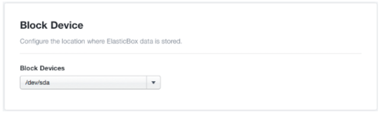

{{{
"title": "Deploy the New Version of Cloud Application Manager Dedicated Edition and Import the Data from the Prior Version",
"date": "05-24-2019",
"author": "Diego Sanjuan",
"keywords": ["cam", "cloud application manager", "Data Center edition", "appliance", "migration", "upgrade", "storage"],
"attachments": [],
"contentIsHTML": false
}}}

**In this article:**

* [Overview](#overview)
* [Audience](#audience)
* [Prerequisites](#prerequisites)
* [Steps](#steps)
* [Contacting Cloud Application Manager Support](#contacting-cloud-application-manager-support)

### Overview

This article shows how to do deploy the New Cloud Application Manager Dedicated Edition (appliance) and import data from a prior version of the appliance.

### Audience

All Cloud Application Manager Dedicated Edition users who wish to upgrade to a new version of the appliance.

### Prerequisites

**Before starting upgrade process you should request an updated OVA by [contacting support](mailto:incident@CenturyLink.com))**

* Your Cloud Application Manager Dedicated Edition (appliance) should be properly deployed and running in your preferred platform. You can refer to the [Cloud Application Manager Dedicated Edition documentation](camd-overview.md).
* You need to have access to HTTPS (443) port of the appliance to access its setup console.

### Steps

For the upgrade process to the new virtual appliance, please follow the steps below to guarantee a smooth completion of the whole process.

1. Shutdown and backup your Cloud Application Manager appliance with your preferred method, i.e., clone.
2. Switch the old appliance device root storage to have its data exported to an external virtual disk.

   **Note**: The virtual appliance, by default, requires 100 GB of virtual disk space. For increased storage capacity and faster performance, attach a new virtual disk to the VM which will act as the primary storage device for the appliance. **Please do this before you initiate the Cloud Application Manager service on the virtual appliance**. See steps a-d:
   * In vSphere vCenter, power off the VM and attach a second virtual disk with more CPU, RAM, and disk space. For more information, see the vCenter 5.0 and vCenter 5.5 help guide.
   * Power on the VM appliance. In the appliance **Setup Console** under **Block Device**, select the second disk as the primary appliance storage.
   
   * When done, click **Save Settings**.
   **Note:** When switching the virtual disk, the appliance will reboot and become unavailable for a few minutes. This is expected as the existing data (appliance settings, logs, database and the most recent saved state) is being copied. **When the virtual appliance is back online, you can start using Cloud Application Manager**.

3. Deploy the new appliance using the new OVA (without powering on) received from support.
4. Shutdown the new appliance if it is powered on.
5. Move/Copy the vhd file of the hard disk previously attached (from Step 2) into the virtual machine’s folder of the new deployed appliance.
6. Attach the moved or copied hard disk to the new appliance.
7. Repeat the process described in Step 2 to the new appliance in order to switch the block storage to the attached virtual hard disk that contains the exported data of the old appliance.
8. Log out and wait for the new appliance to restart. This process will take some time as it needs to migrate the data.
9. Login with the same credentials you used for the old appliance.

In case you experience any issues, [contact support](mailto:incident@CenturyLink.com)). We will walk you through the appliance upgrading process.

### Contacting Cloud Application Manager Support

We’re sorry you’re having an issue in [Cloud Application Manager](https://www.ctl.io/cloud-application-manager/). Please review the [troubleshooting tips](../Troubleshooting/troubleshooting-tips.md), or contact [Cloud Application Manager support](mailto:incident@CenturyLink.com) with details and screenshots where possible.

For issues related to API calls, send the request body along with details related to the issue.

In the case of a box error, share the box in the workspace that your organization and Cloud Application Manager can access and attach the logs.

* Linux: SSH and locate the log at /var/log/elasticbox/elasticbox-agent.log
* Windows: RDP into the instance to locate the log at C:\ProgramData\ElasticBox\Logs\elasticbox-agent.log
