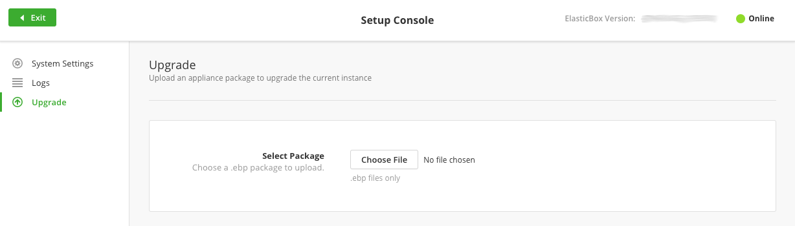

{{{
"title": "Upgrading Cloud Application Manager Dedicated Edition",
"date": "03-25-2020",
"author": "Diego Sanjuan and Guillermo Sanchez",
"keywords": ["cam", "cloud application manager", "Data Center edition", "appliance", "upgrade", "dedicated", "cam-d"],
"attachments": [],
"contentIsHTML": false
}}}

**In this article:**

* [Overview](#overview)
* [Audience](#audience)
* [Prerequisites](#prerequisites)
* [Steps to upgrade the appliance](#steps-to-upgrade-the-appliance)
* [Contacting Cloud Application Manager Support](#contacting-cloud-application-manager-support)

### Overview

This article shows how to upgrade Cloud Application Manager Dedicated Edition (appliance). It’s a pretty simple process, you just need to follow steps described in this article.

### Audience

All Cloud Application Manager Dedicated Edition users who wish to upgrade their appliance to a newer release.

### Prerequisites

* Your Cloud Application Manager Dedicated Edition (appliance) should be properly deployed and running in your preferred platform. You can refer to the [Cloud Application Manager Dedicated Edition documentation](camd-overview.md).
* You need to have access to HTTPS (443) port of the appliance to access its setup console.

### Steps to upgrade the appliance

* **Request a download link from [support](mailto:incident@CenturyLink.com) and download the provided appliance upgrade package**
* Log in to Cloud Application Manager with an admin account.
* From the username drop-down at the top right, click **Setup Console**.
* Under **Upgrade**, click **Choose File** to upload the latest version.
  
**Note:** Within minutes, your appliance should seamlessly upgrade without any downtime.

### Contacting Cloud Application Manager Support

We’re sorry you’re having an issue in [Cloud Application Manager](https://www.ctl.io/cloud-application-manager/). Please review the [troubleshooting tips](../Troubleshooting/troubleshooting-tips.md), or contact [Cloud Application Manager support](mailto:incident@CenturyLink.com) with details and screenshots where possible.

For issues related to API calls, send the request body along with details related to the issue.

In the case of a box error, share the box in the workspace that your organization and Cloud Application Manager can access and attach the logs.

* Linux: SSH and locate the log at /var/log/elasticbox/elasticbox-agent.log
* Windows: RDP into the instance to locate the log at C:\ProgramData\ElasticBox\Logs\elasticbox-agent.log
