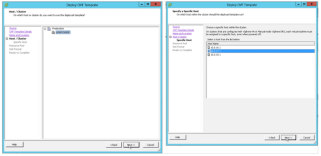
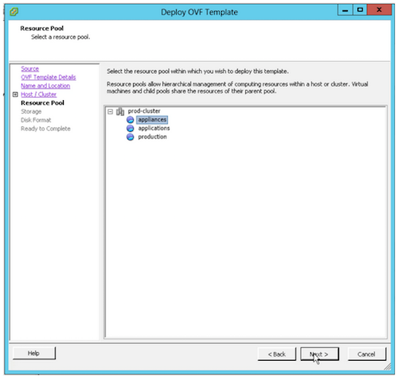
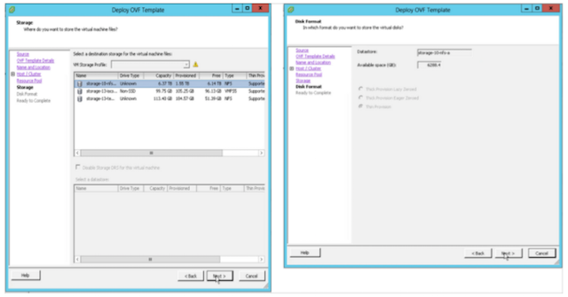
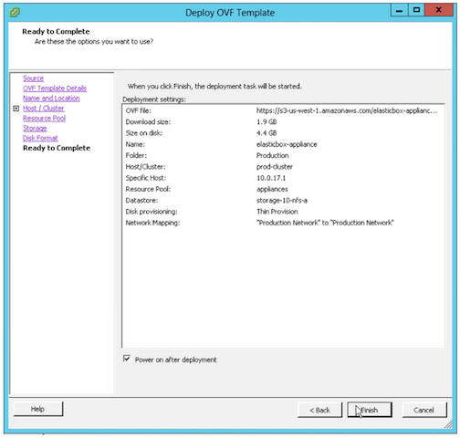
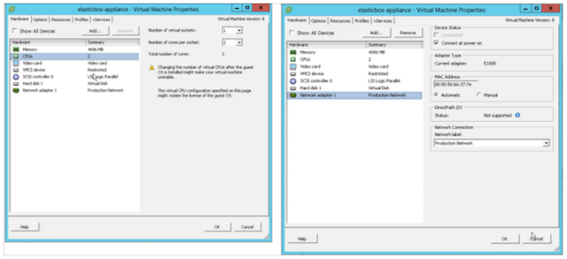

{{{
"title": "Installing the Cloud Application Manager Dedicated Edition in vCenter",
"date": "03-25-2020",
"author": "Diego Sanjuan and Guillermo Sanchez",
"keywords": ["cam", "cloud application manager", "Data Center edition", "appliance", "depoloy", "vcenter", "install", "vsphere", "dedicated", "cam-d"],
"attachments": [],
"contentIsHTML": false
}}}

**In this article:**

* [Overview](#overview)
* [Audience](#audience)
* [Prerequisites](#prerequisites)
* [vCenter Requirements](#vcenter-requirements)
* [Steps](#steps)
* [Connecting the Appliance to the vCenter Network](#connecting-the-appliance-to-the-vcenter-network)
* [Next Steps](#next-steps)
* [Contacting Cloud Application Manager Support](#contacting-cloud-application-manager-support)

### Overview

This article explains that Cloud Application Manager Dedicated Edition (appliance) can run as a virtual appliance in your vCenter private cloud. Here are the requirements, high-level steps to install appliance.

### Audience

All Cloud Application Manager Dedicated Edition users who wants to deploy Cloud Application Manager Dedicated Edition (appliance) using vCenter.

### Prerequisites

* You should have a Data Center with vCenter to be able to deploy appliance using it.
* **If you don’t have internet access in the vCenter, download all the files and import them locally into your vCenter network. If you have access, you can directly import the appliance in the open virtualization format (OVF) and vCenter will download the disk images for you.**

### vCenter Requirements

* Data Center running vSphere vCenter 5.0 or later
* Linux virtual machine template
* 4 CPU cores, 8 GB memory, 100 GB hard drive space

### Steps to deploy the appliance

* Copy the OVF file download URL.
   **Note:** If you don’t have internet access, download all the files and import them locally into your vCenter network.
* In the vCenter vSphere client, click **File > Deploy OVF Template**.
* In the wizard, under Deploy from a file or URL, paste in the URL. Click **Next**.
* (Optional) Edit the name and select the folder where the appliance will live. Click **Next**.
* Select the cluster and a host that will run the appliance. Click **Next**.

  

* Choose a cluster resource pool if available to centrally manage the compute and storage resources for the appliance.

   

* Select the datastore to store the appliance. The datastore virtual disk format is set to Thin. Thin provision conserves disk space and expands as needed. This means the appliance uses the space required now but takes up more space as usage grows.

   

* Review the appliance settings before you deploy. Select **Power on after deployment**. Click **Finish**.

  

### Connecting the Appliance to the vCenter Network

In these steps, you connect the Cloud Application Manager appliance to the vCenter Data Center network and then turn it on.

#### Steps to connect to the network

* In the vSphere Client, right-click the Cloud Application Manager appliance that you just installed.
* Click **Edit Settings > Hardware tab**. The OVF template pre-selects the required processing speed and the network adapter. Make sure they are set as follows:

  

  * **CPUs**. Two CPU virtual sockets to increase parallel processing.
  * **Network adapter**. A valid network to connect the appliance to your Data Center.

* Now start the appliance. Right-click the appliance, click **Power > Power On**.

### Next Steps

* [Configure networking](camd-networking.md)
* [Set up the appliance for use](camd-initialsetup.md)

### Contacting Cloud Application Manager Support

We’re sorry you’re having an issue in [Cloud Application Manager](https://www.ctl.io/cloud-application-manager/). Please review the [troubleshooting tips](../Troubleshooting/troubleshooting-tips.md), or contact [Cloud Application Manager support](mailto:incident@CenturyLink.com) with details and screenshots where possible.

For issues related to API calls, send the request body along with details related to the issue.

In the case of a box error, share the box in the workspace that your organization and Cloud Application Manager can access and attach the logs.

* Linux: SSH and locate the log at /var/log/elasticbox/elasticbox-agent.log
* Windows: RDP into the instance to locate the log at C:\ProgramData\ElasticBox\Logs\elasticbox-agent.log
