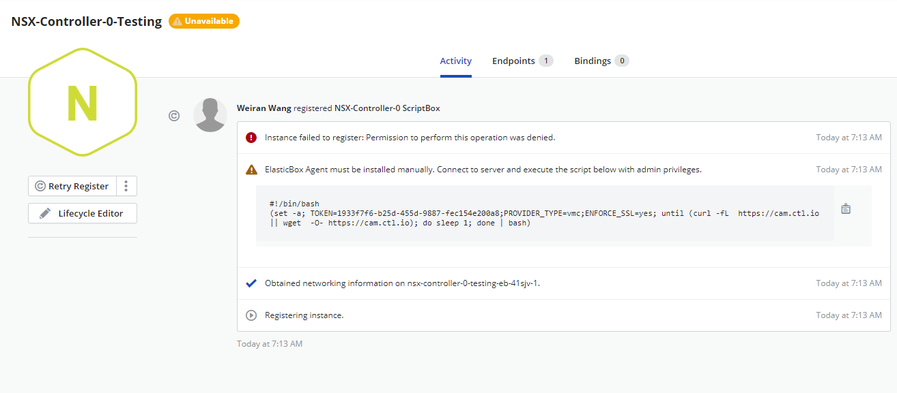

{{{ "title": "Using the CenturyLink Private Cloud with VMC on AWS",
"date": "12-05-2019",
"author": "Sharon Wang",
"keywords": ["cam", "cloud application manager", "vmware", "aws", "vmc", "cpc", "centurylink private cloud"],
"attachments": [],
"contentIsHTML": false
}}}

**In this article:**
* [Overview](#overview)
* [Audience](#audience)
* [Prerequisites](#prerequisites)
* [Required Permissions](#required-permissions)
* [Bootstrapping virtual machine templates with the Cloud Application Manager Agent](#bootstrapping-virtual-machine-templates-with-the-cloud-application-manager-agent)
* [Registering a VMC provider in Cloud Application Manager](#registering-a-vmc-provider-in-cloud-application-manager)
* [Registering Instances to Your VMC Provider](#registering-instances-to-your-vmc-provider)
* [Deploying in Your VMC](#deploying-in-your-vmc)
* [Getting General Support](#getting-general-support)

### Overview

This article is meant to assist users of Cloud Application Manager to configure a CenturyLink Private Cloud with VMC on AWS provider, then deploy or register a virtual machines with it.

### Audience

All users of Cloud Application Manager using CenturyLink Private Cloud with VMC on AWS providers.

### Prerequisites

* An active *Cloud Application Manager* account
* Access and credentials to a **CenturyLink Private Cloud with VMC on AWS**.
* A virtual machine template (Linux or Windows) on the VMC. Virtual machine templates have to be bootstrapped with the Cloud Application Manager Agent.
* If the VMC is behind a firewall, the following ports have to be open on the firewall:
	* 443/TCP incoming to VMC server: for Cloud Application Manager to make API calls on VMC.
	* 443/TCP outgoing: to allow Cloud Application Manager Agents running on the deployed virtual machines to connect back to Cloud Application Manager.

### Required Permissions

A VMC user needs at least the following permissions be able to authenticate, deploy and manage instances through Cloud Application Manager. 
| Assign access for | With privileges |
|-------------------|-----------------|
| Datastore | <li>Allocate space</li><li>Browse datastore</li> |
| Global |	Cancel task |
| Manage custom attributes | Set custom attribute |
| Network |	Assign network |
| Resource | Assign virtual machine to resource pool |
| Scheduled task | <li>Create tasks</li><li>Run task</li> |
| Tasks | <li>Create tasks</li> |
| Virtual machine (Configuration) | <li>Add new disk</li><li>Add or remove device</li><li>Advanced</li><li>Change CPU count</li><li>Change resource</li><li>Memory</li><li>Modify device settings</li><li>Remove disk</li><li>Rename</li><li>Reset guest information</li><li>Set annotation</li><li>Settings</li> |
| Virtual machine (Interaction) | <li>Answer question</li><li>Configure CD media</li><li>Power Off</li><li>Power On</li> |
| Virtual machine (Inventory) | <li>Create from existing</li><li>Create new</li><li>Remove</li> |
| Virtual machine (Provisioning) | <li>Customize</li><li>Deploy template</li><li>Modify customization specification</li><li>Read customization specifications</li> |

### Bootstrapping virtual machine templates with the Cloud Application Manager Agent

VMC templates need elasticbox-init to allow the Cloud Application Manager agent to execute box scripts at deploy time.

#### Linux

Follow these steps to install elasticbox-init on a Linux template.


1. Log in to the VMC client and open the Linux virtual machine.

2. SSH into the virtual machine.

3. [Install the VMware tools.](https://www.vmware.com/support/ws55/doc/ws_newguest_tools_linux.html)

4. Run this command with root privileges to install elasticbox-init:

   ```
	 curl -L https://cam.ctl.io/agent/linux/vsphere/template_customization_script.sh | sudo bash
   ```

   * **Note:** If running Cloud Application Manager as an appliance, replace cam.ctl.io with the appliance hostname or IP address.

#### Windows

Follow these steps to run a script that creates a scheduled task on a Windows Server 2012 template. When you deploy, Cloud Application Manager clones this template and installs the agent using the scheduled task.

1. Log in to the Windows Server 2012 virtual machine template using remote desktop protocol (RDP).

2. [Install the VMware tools](https://kb.vmware.com/selfservice/microsites/search.do?language=en_US&cmd=displayKC&externalId=1018377).

3. [Download the scheduled task script.](https://cam.ctl.io/agent/windows/vsphere/template_customization_script.ps1)

   * **Note:** If running Cloud Application Manager as an appliance, replace cam.ctl.io with the appliance hostname or IP address.

4. Right-click the script and click **Run PowerShell**.

### Registering a CenturyLink Private Cloud with VMC on AWS provider in Cloud Application Manager

In order to deploy to a VMC on AWS, you must first provide information to connect. 

**Steps**

1. In Cloud Application Manager, click **Providers** > **New Provider**.

2. Select **CenturyLink Private Cloud with VMC on AWS**.

3. Enter the endpoint URL for the VMC server and a username, password to the VMC API.
   * **Note:** The endpoint URL can be a hostname or an IP address, and has to be prefixed with **https://**. Be sure to use https and not http.

   

### Registering Instances to Your VMC Provider

You can also register you exsiting instances to CAM portal. First click on **Unregistered Instances** Tab, here you can see all the exsting instances in you VMC that you can import into your CAM portal.

Simply select one server and click on the down arrow button on the right side.


Name instance to be registered and click on **Register**


Connect to server and execute the script below with admin privileges.


After running the script you should be able to see the instance has been registered successfully.

### Deploying in Your VMC

You can deploy new instances to your VMC provider from CAM portal, for detailed steps, please check [Using the vmware vCenter Private Datacenter.md](../using-the-vmware-vcenter-private-datacenter.md) 

### Getting General Support

Customers can contact the CenturyLink Global Operations Support center (support desk) directly for getting help with Cloud Application Manager as well as any other supported product that they’ve subscribed to.  Below are three ways to get help.

#### Contact:

1. **Phone:** 888-638-6771

2. **Email:** incident@centurylink.com

3. **Create Ticket in Cloud Application Manager:** Directly within the platform, users can “Create Ticket” by clicking on the “?” symbol in upper right corner near the users log-in profile icon.  This takes users directly to the Managed Servicers Portal where they can open, track and review status of issues that have been raised with the support desk.  Additionally, this is how a TAM can be engaged as well.

#### Instructions:

1. Provide your name
2. Cloud Application Manager account name
3. A brief description of your request or issue for case recording purposes

The support desk will escalate the information to the Primary TAM and transfer the call if desired.
