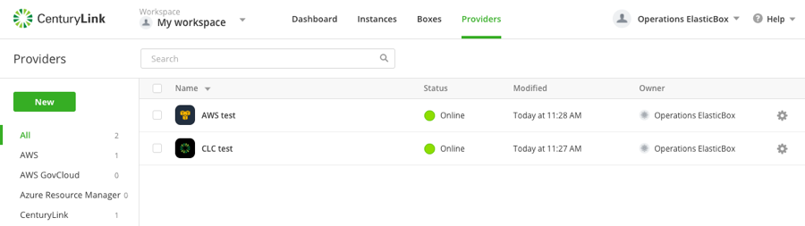

{{{
"title": "Deleting Existing ARM Templates for Microsoft Azure",
"date": "02-20-2017",
"author": "Thomas Broadwell",
"attachments": [],
"contentIsHTML": false
}}}

<iframe width="560" height="315" src="https://player.vimeo.com/video/204210210" frameborder="0" allowfullscreen></iframe>

This video will show you how to delete a template instance in an existing Azure CSP Customer account.

### Introduction

[Cloud Application Manager](https://www.ctl.io/cloud-application-manager/) is a scalable platform for deploying enterprise mission-critical applications across any cloud infrastructure &ndash; private, public or hosted. It provides interactive visualization to automate application provisioning, including configuration, deployment, scaling, updating and migration of applications in real-time. Cloud Application Manager manages both traditional and cloud-native applications provisioned on bare metal and virtual machines across any type of infrastructure.

### Log Into Cloud Application Manager

To get started with Cloud Application Manager, sign up for an account and register your cloud service (Lumen, AWS or Azure, for example) as a provider.

### Instances

After you log-in into Cloud Application Manager, click the **Instances** tab on the top toolbar.

Select the instance you want to terminate.

### Terminate Instance

Click the **Bulk Options** tab and click **Force Terminate**.

You can see how Cloud Application Manager seamlessly works to terminate the instance you created with an ARM template.

Once the termination process is complete, the activity page of the instance will be updated to reflect it's termination.

### Checking Termination

If you try to ssh to the instance, you will no longer be able to access it because it was instantly deleted.

See this [video](https://www.ctl.io/guides/cloud-application-manager/using-arm-templates-cloud-application-manager/)for information on setting up and using ARM templates.

### Contacting Cloud Application Manager Support

We’re sorry you’re having an issue in [Cloud Application Manager](https://www.ctl.io/cloud-application-manager/). Please review the [troubleshooting tips](../Troubleshooting/troubleshooting-tips.md), or contact [Cloud Application Manager support](mailto:incident@CenturyLink.com) with details and screenshots where possible.

For issues related to API calls, send the request body along with details related to the issue.

In the case of a box error, share the box in the workspace that your organization and Cloud Application Manager can access and attach the logs.
* Linux: SSH and locate the log at /var/log/elasticbox/elasticbox-agent.log
* Windows: RDP into the instance to locate the log at ProgramDataElasticBoxLogselasticbox-agent.log
