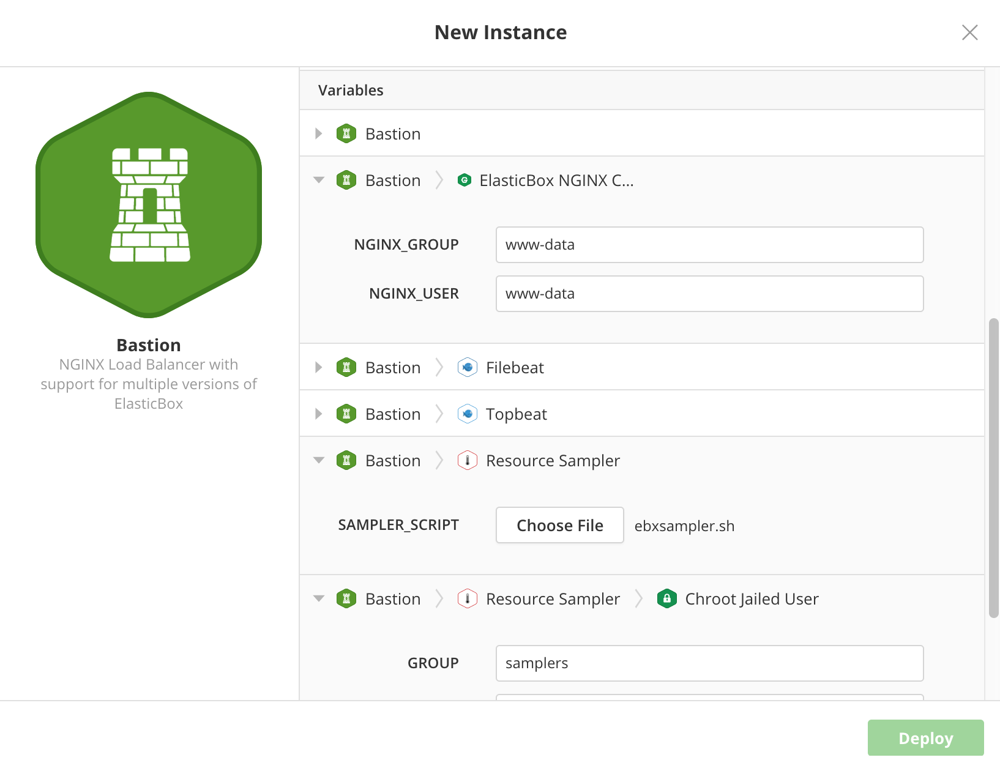

{{{ "title": "Deploying and Managing Instances",
"date": "03-17-2020",
"author": "Yongjie Liang and Guillermo Sánchez",
"keywords": ["cam", "instances", "lifecycle", "deploy", "deployment-policy", "instance-protection", "shutdown-protection", "terminate-protection", "bulk-actions", "lifecycle-states", "export"],
"attachments": [],
"sticky": true,
"contentIsHTML": false
}}}

**In this article:**

* [Overview](#overview)
* [Audience](#audience)
* [Prerequisites](#prerequisites)
* [Instances page](#instances-page)
* [Deploying a New Instance](#deploying-a-new-instance)
* [Scheduling Instances](#scheduling-instances)
* [Protecting Instance Shutdown or Termination](#protecting-instance-shutdown-or-termination)
* [Instance protection on registered instances](#instance-protection-on-registered-instances)
* [Instance protection on AWS instances](#instance-protection-on-aws-instances)
* [Instance protection on Google Cloud Platform instances](#instance-protection-on-google-cloud-platform-instances)
* [Deploying Instances without Lifecycle Management](#deploying-instances-without-lifecycle-management)
* [Handling Instance Lifecycle States](#handling-instance-lifecycle-states)
* [Managing multiple instances with bulk actions](#managing-multiple-instances-with-bulk-actions)
* [Exporting the List of Instances](#exporting-the-list-of-instances)
* [Contacting Cloud Application Manager Support](#contacting-cloud-application-manager-support)

### Overview

This article is meant to assist Cloud Application Manager customers in the management of their instances.

### Audience

Cloud Application Manager customers.

### Prerequisites

* An active Cloud Application Manager account.
* A provider already configured and synchronized

### Instances page

The Instances left side menu option of the Applications site allows you to see at a glance a view of all instances you have access to through your configured providers in your current scope.

The left side menu of [Applications site](https://cam.ctl.io/#/instances) shows you at a glance a view of all instances you have access to through your configured providers.

There are three different submenu options under Instances:

* **All**: shows all type of instances, either registered or unregistered.

* **Registered**: shows only registered instances, which are the ones deployed through or imported into Cloud Application Manager. In these instances, you can do lifecycle management by executing lifecycle events or using the lifecycle editor to change variables, event scripts or box versions of the instance. You can also select a specific state among the available ones (Online, Unavailable, Processing, Not Responding, Unknown, Shutdown, Terminated) to show only the instance in the selected state.

* **Unregistered**: shows only unregistered instances, which are the ones accessible into all the defined providers that were not deployed through Cloud Application Manager. They are discovered in the synchronization event of a provider and are classified by Type and Subtype.
  * Type: One of Compute, Network, Database, Storage or Other
  * Subtype: this is the instance class, specific to each provider type. For example, for AWS type providers we can see VPC or Application Load Balancers (for Network type instances), and S3 or Elastic Block Storages (for Storage type instances) and for an Azure provider we could see Virtual Networks or Application Gateways (in Network type instances) and Queue or BLOB (in Storage type instances). You can check the [full list of Microsoft Azure resources being displayed here](../../Cloud Application Manager/Deploying Anywhere/using-microsoft-azure.md#azure-native-resources) and [full list of Lumen Cloud resources being displayed here](../../Cloud Application Manager/Deploying Anywhere/using-centurylink-cloud.md#lumen-cloud-native-resources).

  You can also select a specific state among the available ones (Active, Inactive) to show only the instance in the selected state.

The Instances page displays on the top of the page a new button, a search field  and a filters and instance view buttons. The search field allows you to find any instance looking for most of the instance fields such as name, instance-id, service-id, public or private IP address, support_id, hostname, owner or last user who acted on the instance.

Below this components you can find the corresponding list or graph of instances, depending on the view type that is selected.

In the instances list, any Compute type unregistered instance can be registered (imported) into Cloud Application Manager to enable lifecycle management on it (an icon button allowing it will appear at the end of its row), so it will be shown from them on as a registered instance in the corresponding views. The Unregistered Instances tab in the provider details page remains unchanged showing only compute registerable instances. If you want to bulk register (import) several instances from the same provider, use this feature from there instead, where bulk register is also available as a bulk action.

#### Instance states

* **Online**: last lifecycle operation succeeded and the instance is up and running.
* **Unavailable**: last lifecycle operation has failed, see instance logs for more details. The instance may not be accessible.
* **Processing**: when a lifecycle operation is being executed. The instance is not ready yet.
* **Not Responding**: the Cloud Application Manager instance agent has not contacted back for at least 10 minutes. The instance may have been changed from outside of Cloud Application Manager, and could be stopped, deleted or just the agent is not running.
* **Unknown**: Cloud Application Manager cannot determinate the state of the instance. The instance has several machines and someones are in the Not Responding state and some others in any other state.
* **Shutdown**: the instance is shut down and cannot be used. The instance can be restarted at any time.
* **Terminated**: the instance has been removed from the underlying provider and it is no longer available. Cloud Application Manager keep the instance data and its logs, that will be removed if you *delete* the instance.

#### Instance view types

In the top right corner of the Instances page there are several icons to select the type of view that is being shown:

These icons are respectively:

* **Topology view**: shows a graph with the instances type and its relationships (bindings)
* **List view** (default): shows a list view of all instances
* **Provider view**: shows a list view of all instances grouped by provider
* **Map view**: shows a world map view of all instances grouped by location

#### Instance view filters

There is a filter icon button next to the view types icon that makes visible all available filters for the view:

These filters are dynamically filled with the valid values, are hidden if there are no values in the current view and also allow multiple selections in values to be shown. The available filters are:

* **Cost Center**: Filter by cost centers responsible for instances. This filter is only available if you are at the Organization level scope.
* **Workspace**: filter by any accessible workspace containing instances
* **Providers**: filter by available provider types or providers
* **Types**: filter by available types or subtypes
* **Location**: filter by available location, including Global
* **Tags**: filter by defined tags in instances
* **Service Types**: filter by available service types (i.e., Linux Compute, Windows Compute, Azure Resource Manager Service, CloudFormation Service, etc.)

Some of the filters, such as Providers and types, have two level of filtering (i.e., provider type and provider), allowing a mixed selection of levels. For example, you can select AWS provider type to show all AWS providers instances, and a specific Microsoft Azure provider to also show this provider instances in the same view.

### Deploying a New Instance

An instance is an instantiated version of a box launched to provider’s virtual infrastructure or your own. Follow these steps to launch one.

#### Steps

1. Click **Instances** > **New**
2. Select a box. You can search and look through the tabs.

    

     * **Boxes**. Shows boxes you created in your workspace.
     * **Explore**. Shows default boxes available to all Cloud Application Manager users. These include service boxes such as Linux Compute, Windows Compute; includes AWS services like MySQL Database, Oracle Database, DynamoDB, PostgreSQL Database, and S3 bucket; and includes the Azure Microsoft SQL Database service. You can directly launch an instance to these database services. While you can’t modify those boxes, you can combine them with other boxes to build multi-tiered applications.

    **Note:** Don’t find a box you’re looking for? Check if you’re in the right workspace. Remember that you may not have access if the box is no longer shared with you.

3. In the New Instance dialog, specify the instance name and deployment policy.

   **Name.** Give a name to recognize the instance.

   **Deployment Policy.** Select a previously created deployment policy or create a new one. For details, see [Creating a Deployment Policy](../Automating Deployments/deploymentpolicy-box.md).

4. In the New Instance dialog, pass deployment parameters under **Variables**. Before launching, you can override and provide fresh values.

    

     * Listed here are all the **variables** defined in the main box as well as those within nested boxes or box type variables.
     * **Required variables** are marked with an asterisk. To see all variables including optional ones, click Show More.
     * When a variable is required, you must specify its value to launch an instance of the box. If optional, you can launch without giving values, and do it later in the [lifecycle editor](../Core Concepts/lifecycle-editor.md).
     * [Binding type variables](../Automating Deployments/parameterizing-boxes-with-variables.md) are also listed here. Depending on how it’s defined in the box, you can select as its value any instance or that of a specific box type deploying or active in the workspace.

### Scheduling Instances

Save on compute and hosting costs by scheduling instances at launch time. Rather than remember to turn off a machine manually, schedule it to stop automatically at your convenience. When launching, you can schedule an instance to shut down or terminate at a given UTC time.

We notify you of instances about to expire in 24 hours by email at around 12 AM UTC. From the email, you can navigate to the instance page and change the schedule if you like. If you don’t get this email, check your email spam filters or check if [outbound SMTP is enabled](../Dedicated Edition/camd-initialsetup.md) in the setup console of the Cloud Application Manager appliance.

Follow these steps to schedule an instance.

#### Steps to schedule an instance

1. From the Instances page, click **New**.
2. Select a box you want to deploy.
3. In the New Instance dialog, select the **Shutdown** or **Terminate** operation from the **Expiration** drop-down.  
  Select **Always on** if you don’t want to schedule anything. Shutdown powers off the instance while Terminate deletes the instance on the provider’s side.

    

4. For the selected operation, set a predefined or custom UTC schedule.

    

5. When done, click **Deploy**.

**Note:** Even if you don’t schedule an instance at the time of deploying, you can do so later. Once online, you can go to an instance page and in **Edit Details**, set the schedule.

Besides the user interface, you can automatically schedule instances using the instances API with a [POST or PUT](https://www.ctl.io/api-docs/cam/#application-lifecycle-management-instances-api) request.

### Protecting Instance Shutdown or Termination

Avoid accidental operations on particular instances. *Instance Protection Flag* allows to protect an instance for manual **shutdown** or **termination**. The instance will still be affected by *scheduled termination or shutdown* configured values if any.

*Instance Protection feature* prevents the user to perform shutdown/terminate operations on API/UI level, also affecting at **provider level** if implements this feature.

*Instance Protection feature* can be set at **Deployment Policy Level** or **Instance Deployment Level**.

Follow these steps to enable instance protection on any **deployment policy** box:

1. From the boxes page, click **New**
2. Select **Deployment Policy**

    

3. In the New or Edit Deployment Policy Box dialog, enable the **Manual Shutdown Protection** or **Manual Terminate Protection** toggle under **expiration** dropdown.
4. When done, click **Save**

**Note:** Instances deployed through this box will inherit the protection configuration flags

Follow these steps to protect an instance at **deployment** time:

#### Steps to protect an instance

1. From the instances page, click **New**.
2. Select a box you want to deploy.
3. Select a deployment policy box from availables in policy dropdown.
4. In the New Instance dialog, enable the **Manual Shutdown Protection** or **Manual Terminate Protection** toggles under **Expiration** dropdown.

    

5. When done, click **Deploy**

**Note:** If policy box used for deployment has **Manual Shutdown Protection** or **Manual Terminate Protection** enabled, it will be inherited by the current instance preventing the user to disable them.

### Instance protection on registered instances

Some providers allows to enable Instance Protection. CAM Instance Registering track these configurations in order to configure internally when instances are imported.
If provider implements Instance Protection, Register Instance wizard will show Protection Flags Status acording with provider protection setup.

### Instance protection on AWS instances

#### Instances deployed on AWS

Instances deployed in AWS will sync CAM **Manual Terminate Protection** with DisableApiTermination flag in EC2 instances. Changes done from CAM will be reflected in AWS Instance Properties. Changes done from AWS Console, won't be reflected in CAM.

**Note:** *ec2:ModifyInstanceAttribute* permission must be enabled in order to modify Instance Flag

#### AWS Unregistered Instances

Instances imported from AWS will inherit DisableApiTermination flag into **Manual Terminate Protection** flag. Flag status is provided when provider is syncronized, so changes are not reflected in CAM until **Sync** operation has been done.

### Instance protection on Google Cloud Platform instances

#### Instances deployed on Google Cloud Platform

Instances deployed in Google Cloud Platform (GCP) will sync Cloud Application Manager's **Manual Terminate Protection** toggle with DeletionProtection flag in GCP instances. Changes done from Cloud Application Manager (CAM) will be reflected in GCP Instance Properties. Changes done from GCP Console, won't be reflected in CAM.

**Note:** *compute.instances.create* permission or one of the roles *compute.admin* or *compute.instanceAdmin.v1* must be enabled in order to modify Instance Flag

#### GCP Unregistered Instances

Instances imported from GCP will inherit DeletionProtection flag into **Manual Terminate Protection** toggle in Cloud Application Manager. Flag status is obtained when the provider is syncronized, so the changes performed in GCP Console are not reflected in Cloud Application Manager until **Sync** operation has been done.

### Deploying Instances without Lifecycle Management

*Exclude Lifecycle Management* feature can be enabled on virtual machine deployment policy boxes (with single or multiple machines) to deploy instances without Lifecycle Management support. This means that the Cloud Application Manager agent will not be installed. This feature is not supported for deployment policy boxes with auto-scaling feature enabled.

Follow these steps to *Exclude Lifecycle Management* on a existing deployment policy box:

1. In a existing Deployment Policy Box, under Code tab, edit the Policy by clicking on the pencil icon.
2. In the Edit Deployment Policy Box dialog, enable the **Exclude Lifecycle Management** toggle.

    

3. When done, click **Save**

#### Enabling Lifecycle Management

When an instance has been deployed with *Exclude Lifecycle Management* option set, it's possible to enable Lifecycle Management installing the Cloud Application Manager agent on all the instance machines.

Follow these steps to *Enable Lifecycle Management* on an existing instance:

1. In a existing Instance, under the action list dropdown, select *Enable Lifecycle Management* option.

    

2. In the Enable Lifecycle Management dialog enter the credentials and proxy configuration if needed, and click **Enable**

    

3. The Cloud Application Manager agent will then be installed on all instances machines and the full lifecycle capabilites will be available on the instance.

### Handling Instance Lifecycle States

Instance actions (on the instances page or the lifecycle editor) trigger deployment-related event scripts from your box. Take these actions to start, stop, terminate an instance, and even perform upgrades or make changes to your live instance.

Some actions are available only after the instance changes state. For example, you can’t forcibly terminate an instance until you’ve terminated it first.

Go to the Admin Console to [manage several instances](../Administering Your Organization/manage-assets-monitor-usage.md) spread across users and workspaces in your organization.

  

#### Reconfigure

This executes the configure events from the box.

#### Reinstall

This re-runs the install scripts from your boxes onto the existing virtual infrastructure. This is useful if you made changes to your scripts within this instance, say to upgrade the instance to a new box version. A reconfigure automatically follows the reinstall.

#### Power On

This virtually powers on your instance. It’s useful in case you’ve shut the instance down. After powering on, the configure and start scripts from the box execute.

#### Shut Down

This runs the stop scripts from your box instance and cleanly shuts down the OS. It’s useful if your instance does not need to be up 24/7. As some cloud providers only charge for running instances, this can save money.

#### Abort

If the instance is running an event script, then this action aborts the event script being executed and leaves the instance in an unavailable state. This allows the user to recover the control of an instance stuck in a script execution not returning the control to Cloud Application Manager and fix the issue before retrying to run the event script.

#### Terminate

This executes the dispose scripts from your box instance and then deletes the virtual infrastructure. You can’t revert the action and since you can lose data, be sure that you want to perform this action in the first place.

#### Force Terminate

If a Terminate fails for some reason (maybe a broken dispose script), then this forcibly deletes the virtual infrastructure. It will not execute the dispose scripts. You can’t revert the action and since you can lose data, be sure that you want to perform this action. If you previously terminated or deleted an instance from the provider’s side, the instance may linger in Force Terminate in Cloud Application Manager. Give it a couple of minutes then try to force-terminate again.

#### Force Online

Allow users with "Admin" role to reset the state of an instance in case it went into the "unavailable" state when the last attempted operation was Reconfigure or Reinstall.

#### Disconnect

This operation is available for instances registered into a [Compute Instances](./using-compute-instances.md) provider. It will execute the *dispose* event and related scripts if available, remove the agent from the machine and remove the instance from Cloud Application Manager. The machine running state will not be affected, but it will be no longer available in Cloud Application Manager. Note that for Windows machines, the service will be stopped but not removed automatically.

#### Force disconnect

This operation is available for instances registered into a [Compute Instances](./using-compute-instances.md) provider. It will only remove the agent from the machine and remove the instance from Cloud Application Manager, not executing the *dispose* event. Even if the removal of the agent fails, the instance will be deleted from Cloud Application Manager. The machine running state will not be affected, but it will be no longer available in Cloud Application Manager. Note that for Windows machines, the service will be stopped but not removed automatically. The **Force disconnect** operation can also be applied to instances in the process of being registered, if it has not been completed yet.

#### Delete

Click the delete icon after you Terminate or Force Terminate an instance. Until then, the box instance page and logs are retained in the Cloud Application Manager database. However, delete completely removes the box instance page.

#### Clone

This creates a new instance with the selected instance’s settings, but you can modify all of them before launch the new deployment.

#### Update Instance

This lets you modify the box version; you can select one of the other box versions. After choosing the new version, the instance is going to be reinstalled.

#### Edit Details

This shows the instance’s details that you can modify. These details are: icon, name, description, tags, expiration, updates (available for box versions only) and automatic reconfigure.

### Managing multiple instances with bulk actions

Many of the instance actions can be applied in bulk to several instances at once.

The **Bulk Actions** button dropdown appears next to the *New* instance button once you select any instance in the list and, depending on your selection, the common actions allowed in all selected instances will be available in the dropdown. For example, if you select a few instances, all in *Online* state, you will have all the applicable lifecycle actions available (**Reinstall**, **Reconfigure**, **Shutdown**, **Terminate**, **Force Terminate**) and any other additional option such as *Update Instance*; but if you also include an *Unavailable* instance in your selection among the *Online* ones, the only available lifecycle option will be **Force Terminate**.

### Exporting the List of Instances

Near the top right of the screen, there is a button: **Detail Export**.

Clicking this button toggles a drop-down menu with two options:

* Export to CSV
* Export to PDF

When one of these options is selected, a file is downloaded to your system and saved based on your browser's settings (by default, in the Downloads folder). The file will be named _instances.csv_ or _instances.pdf_; or, if a file by that name already exists, the name will be modified according to your operating system rules (e.g., _instances (1).csv_).

Please note that **all** instances in the current scope are exported, not necessarily just the ones you see in the list (no applied filters are considered). The current scope is either the currently selected workspace, or the cost center, or the organization selected in the context switcher. For a workspace, all the instances that are shared with the workspace are also included.

All the columns in the instances list will be included in the exported file, along with some additional ones such as _instance id_, _service type_, _hostname_, _creation time_ and _organization name_.

### Contacting Cloud Application Manager Support

We’re sorry you’re having an issue in [Cloud Application Manager](https://www.ctl.io/cloud-application-manager/). Please review the [troubleshooting tips](../Troubleshooting/troubleshooting-tips.md), or contact [Cloud Application Manager support](mailto:incident@CenturyLink.com) with details and screenshots where possible.

For issues related to API calls, send the request body along with details related to the issue.

In the case of a box error, share the box in the workspace that your organization and Cloud Application Manager can access and attach the logs.

* Linux: SSH and locate the log at /var/log/elasticbox/elasticbox-agent.log
* Windows: RDP into the instance to locate the log at /ProgramData/ElasticBox/Logs/elasticbox-agent.log
