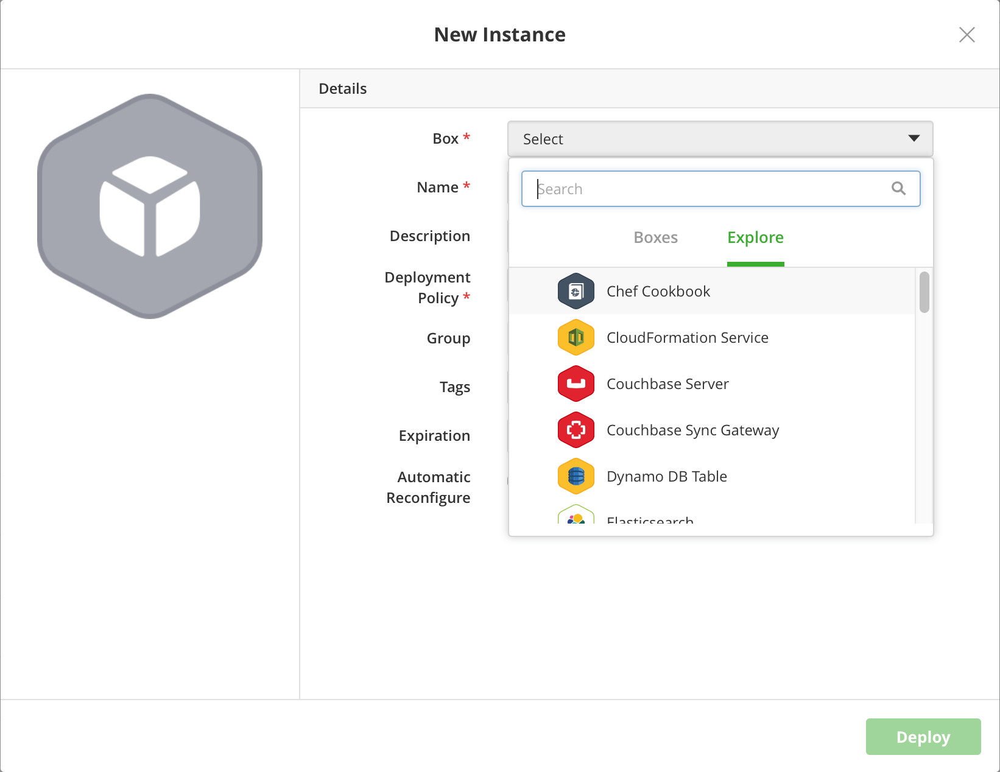

{{{ "title": "Deploying and Managing Instances",
"date": "09-01-2016",
"author": "",
"attachments": [],
"contentIsHTML": false
}}}

### Deploying and Managing Instances

**In this article:**

* Deploying a new instance
* Creating a deployment policy
* Scheduling Instances
* Handling instance lifecycle states

### Deploying a New Instance

An instance is an instantiated version of a box launched to provider’s virtual infrastructure or your own. Follow these steps to launch one.

**Steps**
1. Click **Instances** > **New**
2. Select a box. You can search and look through the tabs.

  

* **Boxes**. Shows boxes you created in your workspace.
* **Explore**. Shows default boxes available to all Cloud Application Manager users. These include service boxes such as Linux Compute, Windows Compute; includes AWS services like MySQL Database, Oracle Database, DynamoDB, PostgreSQL Database, and S3 bucket; and includes the Azure Microsoft SQL Database service. You can directly launch an instance to these database services. While you can’t modify those boxes, you can combine them with other boxes to build multi-tiered applications.

  **Note:** Don’t find a box you’re looking for? Check if you’re in the right workspace. Remember that you may not have access if the box is no longer shared with you.

3. In the New Instance dialog, specify the instance name and deployment policy.

   **Name.** Give a name to recognize the instance.

   **Deployment Policy.** Select a previously created deployment policy or create a new one. For details, see Creating a Deployment Policy.

4. In the New Instance dialog, pass deployment parameters under **Variables**. Before launching, you can override and provide fresh values.

  

  * Listed here are all the variables defined in the main box as well as those within nested boxes or box type variables.
  * Required variables are marked with an asterisk. To see all variables including optional ones, click Show More.
  * When a variable is required, you must specify its value to launch an instance of the box. If optional, you can launch without giving values, and do it later in the [lifecycle editor](../Core Concepts/lifecycle-editor.md).
  * [Binding type variables](../Automating Deployments/parameterizing-boxes-with-variables.md) are also listed here. Depending on how it’s defined in the box, you can select as its value any instance or that of a specific box type deploying or active in the workspace.

### Creating a Deployment Policy

A deployment policy defines settings for your infrastructure that are applied at deployment time. These settings include the cloud provider that will host the deployed boxes, how the virtual infrastructure will be sized, and where it will be placed.

**Steps**

1. In the New Instance dialog, click **Create a new deployment policy box**.

  

2. Select a deployment policy box.

  

3. Configure the deployment policy settings for the box you selected from the catalog.

  

4. Click **Save**.

    Settings in the deployment profile vary by the provider you deploy to. For provider specific deployment settings, see these articles:
    * [Using CenturyLink Cloud](using-centurylink-cloud.md)
    * [Using Google Cloud](using-google-cloud.md)
    * [Using Your AWS Account](using-your-aws-account.md)
    * [Using the vSphere Private Datacenter](using-the-vmware-vcenter-private-datacenter.md)
    * [Using Your OpenStack Cloud](using-openstack-cloud.md)
    * [Using CloudStack](using-cloudstack.md)
    * [Using Azure](using-azure.md)

    **Note:** If you’re deploying to public cloud providers like AWS or Google Compute, you’ll most likely be charged by the cloud provider for the virtual infrastructure you provision. Familiarize yourself with their pricing model as Cloud Application Manager assumes no responsibility for costs incurred.

### Scheduling Instances

Save on compute and hosting costs by scheduling instances at launch time. Rather than remember to turn off a machine manually, schedule it to stop automatically at your convenience. When launching, you can schedule an instance to shut down or terminate at a given UTC time.

We notify you of instances about to expire in 24 hours by email at around 12 AM UTC. From the email, you can navigate to the instance page and change the schedule if you like. If you don’t get this email, check your email spam filters or check if [SMTP outbound is on](../Appliance/appliance-initialsetup.md) in the setup console for the Cloud Application Manager appliance.

Follow these steps to schedule an instance.

**Steps**
1. From the Instances page, click **New**.
2. Select a box you want to deploy.
3. In the New Instance dialog, select the **Shutdown** or **Terminate** operation from the **Expiration** drop-down.
Select **Always on** if you don’t want to schedule anything. Shutdown powers off the instance while Terminate deletes the instance on the provider’s side.

  

4. For the selected operation, set a predefined or custom UTC schedule.

  

5. When done, click **Deploy**.

    **Note:** Even if you don’t schedule an instance at the time of deploying, you can do so later. Once online, you can go to an instance page and in **Edit Details**, set the schedule.

    Besides the user interface, you can automatically schedule instances using the instances API with a [POST or PUT](https://www.ctl.io/api-docs/cam/#application-lifecycle-management-instances-api) request.

### Handling Instance Lifecycle States

Instance actions (on the instances page or the lifecycle editor) trigger deployment related event scripts from your box. Take these actions to start, stop, terminate an instance, and even perform upgrades or make changes to your live instance.

Some actions are available only after the instance changes state. For example, you can’t forcibly terminate an instance until you’ve terminated it first.

Go to the Admin Console to [manage several instances](../Administering Your Organization/manage-assets-monitor-usage.md) spread across users and workspaces in your organization.

  

**Reconfigure**

This executes the configure events from the box.

**Reinstall**

This re-runs the install scripts from your boxes onto the existing virtual infrastructure. This is useful if you made changes to your scripts within this instance, say to upgrade the instance to a new box version. A reconfigure automatically follows the reinstall.

**Power On**

This virtually powers on your instance. It’s useful in case you’ve shut the instance down. After powering on, the configure and start scripts from the box execute.

**Shut Down**

This runs the stop scripts from your box instance and cleanly shuts down the OS. It’s useful if your instance does not need to be up 24/7. As some cloud providers only charge for running instances, this can save money.

**Terminate**

This executes the dispose scripts from your box instance and then deletes the virtual infrastructure. You can’t revert the action and since you can lose data, be sure that you want to perform this action in the first place.

**Force Terminate**

If a Terminate fails for some reason (maybe a broken dispose script) then this forcibly deletes the virtual infrastructure. If you previously terminated or deleted an instance from the provider’s side, the instance may linger in Force Terminate in Cloud Application Manager. Give it a couple of minutes then try to force-terminate again.

**Delete**

Click the delete icon after you Terminate or Force Terminate an instance. Until then, the box instance page and logs are retained in the Cloud Application Manager database. But delete completely removes the box instance page.

**Clone**

This creates a new instance with selected instance’s settings, but you can modify all of them before launch the new deployment.

**Update Instance**

This lets you modify the box version, you can select one of the others box versions. After choose the new version, the instance is going to be reinstalled.

**Edit Details**

This shows the instance’s details that you can modify. These details are: icon, name, description, tags, expiration, updates (available for box versions only) and automatic reconfigure.

### Contacting Cloud Application Manager Support

We’re sorry you’re having an issue in [Cloud Application Manager](https://www.ctl.io/cloud-application-manager/). Please review the [troubleshooting tips](../Troubleshooting/troubleshooting-tips.md), or contact [Cloud Application Manager support](mailto:incident@CenturyLink.com) with details and screenshots where possible.

For issues related to API calls, send the request body along with details related to the issue.

In the case of a box error, share the box in the workspace that your organization and Cloud Application Manager can access and attach the logs.
* Linux: SSH and locate the log at /var/log/elasticbox/elasticbox-agent.log
* Windows: RDP into the instance to locate the log at /ProgramData/ElasticBox/Logs/elasticbox-agent.log
