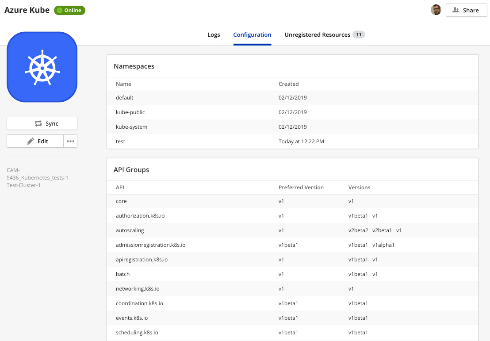
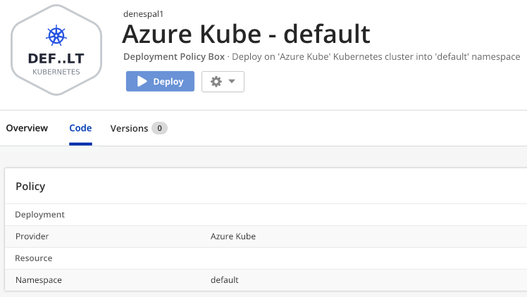

{{{ "title": "Using Kubernetes",
"date": "01-02-2019",
"author": "Dénes Pál",
"attachments": [],
"contentIsHTML": false,
"keywords": ["kubernetes", "k8s", "deployment", "template box", "cloud application manager", "deployment templates", "Cloud Application Manager", "alm", "application lifecycle management", "alm"]
}}}

**In this article:**

- [Overview](#overview)
- [Audience](#audience)
- [Prerequisites](#prerequisites)
- [Getting started with Kubernetes on Cloud Application Manager](#getting-started-with-kubernetes-on-cloud-application-manager)
- [Create a Template Box](#create-a-template-box)
- [Deploying Kubernetes Template Boxes](#deploying-kubernetes-template-boxes)
- [Endpoints](#endpoints)
- [Output Variables](#output-variables)
- [List of Deployed Resources](#list-of-deployed-resources)
- [Discovering and Registering Resources](#discovering-and-registering-resources)
- [Getting General Support](#getting-general-support)

### Overview

With the Cloud Application Manager Kubernetes provider, you can create and manage any Kubernetes resources, using declarative YAML configuration files into a template box.

### Audience

All Cloud Application Manager users intended to use Kubernetes clusters.

### Prerequisites

- An active Cloud Application Manager account
- Access to a Kubernetes cluster

### Getting started with Kubernetes on Cloud Application Manager

The implementation of Kubernetes in Cloud Application Manager was done in a way that it shall work with any modern Kubernetes cluster, having a recent version of Kubernetes installed. This includes the mayor cloud providers, like Amazon, Azure and Google.
Cloud Application Manager is capable of discovering the APIs and versions supported by the configured Kubernetes cluster....

#### Create or Refresh Provider

Users need to first setup their Kubernetes Cluster in Cloud Application Manager.

Go to ***Providers -> New Provider*** dialog and select *Kubernetes* from the list of available providers. If this provider type is not available, please contact your organization administrator.


Specify the provider name and description and fill in the cluster-specific values.


***API Server Address*** can be an IP address or a fully qualified domain name. It is going to be automatically prefixed with `https://` by default. In the unlikely case that your cluster would not support SSL, prefix the server address with `http://` instead.

Users need to provide one or more of the following: ***Client Certificate*** and ***Client Key***, or ***Username*** and ***Password***. Certificate and key can be uploaded either as PEM files by clicking on the button and selecting a local file, or as a Base-64 encoded strings by pasting from clipboard.

*IAM* authentication available in various cloud providers is not supported at this time, so your Kubernetes cluster needs to have either certificate-based or password-based authentication configured.

Once you save the provider details, it is created and Cloud Application Manager starts to synchronize with the Kubernetes cluster with the given parameters.


##### Getting the certificate and key for a Google Kubernetes cluster

Execute the following commands in Cloud Shell:

```Shell
gcloud config set container/use_client_certificate True
gcloud container clusters list
gcloud container clusters get-credentials cam-9436-denes-pal-1 --zone=us-central1-a
grep -- -data ~/.kube/config
```

And enable legacy authentication for the Kubernetes cluster on Google Cloud web console.

##### Getting the certificate and key for a Azure Kubernetes cluster

Open Cloud Shell in the Azure web console and execute the following commands:

```Shell
az aks get-credentials --resource-group INSERT_RESOURCE_GROUP_NAME_HERE --name INSERT_CLUSTER_NAME_HERE
grep -- -data ~/.kube/config
```

#### On Synchronization

When synchronizing with Kubernetes provider, Cloud Application Manager starts to discover the API on the cluster.

- Checks for supported API groups, versions, preferred versions
- Queries each API and each supported version for a list of supported resource types
- Gets a list of available namespaces
- Creates a Deployment Policy Box with *default* or the first available namespace
- Downloads a list of all existing resources and displays them under *unregistered instances* to offer them for registration



#### Deployment Policies for Kubernetes

When Cloud Application Manager first synchronizes the provider it creates a sample Deployment Policy Box pointing to the *default* workspace, *kube-public* or else the first available namespace.



You can create additional deployment policies either by cloning the sample one or by navigating to ***Boxes -> New -> Deployment Policy*** and selecting *Kubernetes*.


Kubernetes Deployment policies are bound to a **Namespace**. When using a Deployment Policy, deployments can only happen into the namespace that the policy has selected. You can change the namespace associated with a Deployment Policy by editing the Policy on the *Code* tab of the Policy Box.


### Create a Template Box

Go to ***Boxes -> New -> Template*** and select *Kubernetes* as type.


Fill the parameters as usual. Please, note that if you define any *Requirements* in the template box, you also need to list those in a Deployment Policy as *Claims* in order to be able to deploy the Template Box using that Policy.


A Kubernetes Template Box can have multiple template files, currently only in YAML format, but Cloud Application Manager also supports **Jinja syntax with YAML**. You can change the order of template files by dragging and dropping with the mouse, or long-pressing and dragging on a touch-screen device. At least one template file is required to deploy a Kubernetes Template Box.


It is also valid to have multiple resources defined in a single template file, separated by a line of three dashes, like in the snippet below:

```Yaml
...
            memory: 100Mi
        ports:
        - containerPort: 80
---
apiVersion: v1
kind: Service
metadata:
  name: frontend
...
```

If you want to deploy the same Template Box into the same namespace multiple times, you need to **include Cloud Application Manager Service ID** in the name of the deployed resources, to avoid name collisions, like:

```Yaml
apiVersion: v1
kind: Service
metadata:
  name: frontend-\{{ service}}
...
```

The ***New Template*** dialog offers you the following options:

- Create a blank template by specifying its filename (please follow ** *.yaml** convention)
- Upload a template file from disk
- Download a template from remote URL
- Import templates from a GitHub repository


If the URL is a GitHub repository, the files from that directory are automatically imported, as long as the filename indicates a valid template type. If a template file with the same name already exists, it won't get overwritten, but duplicate names will block the deployment, so you need to delete old version template file beforehand.

### Deploying Kubernetes Template Boxes

When **Deploying** a Template Box, you need to select a suitable Kubernetes Deployment Policy with claims matching all your template box requirements.


On deployment, Cloud Application Manager is going to parse the templates, first by executing Jinja instructions and variable substitutions, then parsing the YAML documents as resources. For every resource defined in the templates, Cloud Application Manager adds some labels and annotate them with Service ID, then submitting them one-by-one to the Kubernetes cluster, to create new resources, or update existing ones. If a resource already exists, Cloud Application Manager generates a patch against the previous version of the template (stored as an annotation on the Kubernetes resource), or the existing specification read from the Kubernetes cluster. (In some cases, the later approach could fail: for ex. if the resource was created or modified outside of Cloud Application Manager.)


### Endpoints

Cloud Application Manager collects a list of Ingresses from deployed resources having *loadBalancer* node in their statuses and lists them on the *Endpoints* tab.


Endpoints are collected on deployment, and at reconfiguration of the instance.

### Output Variables

There is no way to define custom output variables in Kubernetes templates, but Cloud Application Manager will automatically create output variables from the available Endpoints, like ***name*_IP**, ***name*_Kind**, ***name*_Port** and ***name*_Protocol**.

You can see the output variables of any deployed Instance in the ***Lifecycle Editor***.


### List of Deployed Resources

The resources that have been created by the deployment are shown in the *Resources* tab of the Instance details page and will be deleted when the instance is terminated.


Resources are collected right after deployment, or when reconfigured the instance.

### Discovering and Registering Resources

Existing resources on the cluster are discovered at synchronization time, and listed on the ***Unregistered Resources*** tab of the provider, and on the Instances page as Unregistered.


You can **import** an unregistered resource by clicking on the arrow symbol in the rightmost column of the table.


When registering a resource, Cloud Application Manager creates an Instance for the resource, and populates it with a template representing the current state of the resource on the cluster. It also slightly modifies the resource by adding necessary annotations and labels.


Once the resource is imported into an Instance, it can be reconfigured and terminated. If any Endpoint IP belongs to the resource, it is listed on the *Endpoints* tab and exposed as output variable.


### Getting General Support

Customers can contact the CenturyLink Global Operations Support center (support desk) directly for getting help with Cloud Application Manager as well as any other supported product that they’ve subscribed to.  Below are three ways to get help.

#### Contact:

1. **Phone:** 888-638-6771

2. **Email:** incident@centurylink.com

3. **Create Ticket in Cloud Application Manager:** Directly within the platform, users can “Create Ticket” by clicking on the “?” symbol in upper right corner near the users log-in profile icon.  This takes users directly to the Managed Servicers Portal where they can open, track and review status of issues that have been raised with the support desk.  Additionally, this is how a TAM can be engaged as well.

#### Instructions:

1. Provide your name
2. Cloud Application Manager account name
3. A brief description of your request or issue for case recording purposes

The support desk will escalate the information to the Primary TAM and transfer the call if desired.
