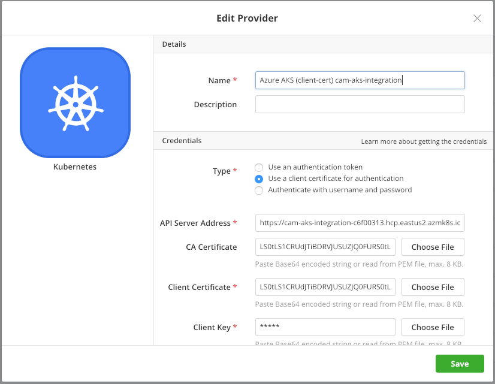

{{{ "title": "Setting up a Kubernetes provider",
"date": "01-02-2019",
"author": "Dénes Pál",
"attachments": [],
"keywords": ["kubernetes", "k8s", "setup", "configuration", "cloud application manager", "provider", "Cloud Application Manager"],
"sticky": true,
"contentIsHTML": false
}}}

**In this article:**

- [Overview](#overview)
- [Audience](#audience)
- [Prerequisites](#prerequisites)
- [Getting started with Kubernetes on Cloud Application Manager](#getting-started-with-kubernetes-on-cloud-application-manager)
- [Configuring kubectl](#configuring-kubectl)
- [Create a Service Account in Kubernetes](#create-a-service-account-in-kubernetes)
- [Create a Provider](#create-a-provider)
- [Deploying to Kubernetes](#deploying-to-kubernetes)
- [Getting General Support](#getting-general-support)

### Overview

With the Kubernetes provider of Cloud Application Manager you can create and manage any Kubernetes resource, using Template Boxes with declarative YAML templates.

This article explains how to set up a Kubernetes provider, as well as how to create a service account in the Kubernetes cluster to use with Cloud Application Manager.

For how to create Kubernetes Policies, Template Boxes and Deployments, please visit the [second part of this article](../Automating Deployments/using-kubernetes.md).

### Audience

Cloud Application Manager users intended to set up a Kubernetes provider.

### Prerequisites

- An active Cloud Application Manager account
- Access with *cluster-admin* privileges to a Kubernetes cluster

### Getting started with Kubernetes on Cloud Application Manager

The implementation of Kubernetes in Cloud Application Manager was done in a way that it shall work with any modern Kubernetes cluster, having a recent version of Kubernetes installed. This includes the mayor cloud providers, like EKS on Amazon AWS, AKS on Microsoft Azure and GKS on Google Cloud. Cloud Application Manager is capable of discovering APIs supported by the Kubernetes cluster, their versions, and supported resource types.

It is recommended to create a separate *service account* for Cloud Application Manager to interact with the Kubernetes cluster. This process requires a *kubectl* environment installed and configured.

There is an [excellent guide](https://kubernetes.io/docs/tasks/tools/install-kubectl/) on how to **install kubectl**.

#### Minimum cluster size on Google GKS

It is recommended to use at lease two `n1-standard-1` (1 vCPU, 3.75 GB memory) nodes for a GKS cluster. Giving too little compute resources would lead to the GKS engine failing to schedule vital Kubernetes components. Cloud Application Manager is only able to synchronize with a healthy Kubernetes cluster.

### Configuring kubectl

#### Configuring kubectl for Amazon EKS

You must have [AWS Command Line Interface](https://aws.amazon.com/cli/) already installed. Execute the following command in the shell to configure *kubectl* with the credentials of the EKS cluster:
(replace *\$REGION* and *\$CLUSTER_NAME* accordingly)

```
aws eks --region $REGIION update-kubeconfig --name $CLUSTER_NAME
```

#### Configuring kubectl for Azure AKS

Open a *Cloud Shell* on [Microsoft Azure Portal](https://portal.azure.com/) and execute the following command:
(replacing *\$RESOURCE_GROUP_NAME* and *\$CLUSTER_NAME* accordingly)

```
az aks get-credentials --resource-group $RESOURCE_GROUP_NAME --name $CLUSTER_NAME
```

Alternatively, you can select *Kubernetes Service* on Azure Portal, select the cluster, and navigate to the *Overview* page, and under *View Kubernetes Dashboard* click *View Connection Steps*, copy step 3 and execute in the Cloud Shell.

#### Configuring kubectl for Google GKS

Open *Cloud Shell* and execute the following commands:
(replacing *\$CLUSTER_NAME* and *\$ZONE* accordingly)

```
gcloud container clusters list
gcloud container clusters get-credentials $CLUSTER_NAME --zone $ZONE
```

### Create a Service Account in Kubernetes

The following steps are the same for any kind of Kubernetes clusters, and requires that *kubectl* is already configured with the credentials of the cluster.

Execute the following command snippets **in the same shell and in order**, (as they rely on a state stored in shell variables). It is safe to execute the commands multiple times, however *kubectl create* prints an error if the resource already exists.

To check if *kubectl* is properly configured, execute:

```
kubectl config current-context
kubectl cluster-info
```

Create a service account for Cloud Application Manager:

```
namespace="kube-system" account="cam.ctl.io"
kubectl --namespace "$namespace" create serviceaccount "$account"
```

Grant *cluster-admin* roles across the whole cluster to the recently created service account:

```
kubectl create clusterrolebinding "$account:cluster-admin" --clusterrole cluster-admin --serviceaccount "$namespace:$account"
```

Retrieve and display the credentials:

```
api_url=`kubectl cluster-info | sed -En 's/.*Kubernetes master.*(https?:[[:print:]]+).*/\1/p'`
secret=`kubectl --namespace "$namespace" get serviceaccount "$account" -o jsonpath="{.secrets[0].name}"`
token=`kubectl --namespace "$namespace" get secret "$secret" -o jsonpath="{.data.token}" | base64 --decode`
ca_crt=`kubectl --namespace "$namespace" get secret "$secret" -o jsonpath="{.data['ca\.crt']}"`
printf "\nAPI address:\t$api_url\n\nAuthentication Token:\n$token\n\nCA-Certificate:\n$ca_crt\n\n"
```

To test the token of the service account:

```
curl --insecure -H "Authorization: Bearer $token" "$api_url/api/v1/namespaces/$namespace" && echo '' || echo 'FAILURE'
```

If the token of the service account works properly, the above command should print a *namespace* resource similar to this:

```
{
  "kind": "Namespace",
  "apiVersion": "v1",
  "metadata": {
    "name": "kube-system",
    "selfLink": "/api/v1/namespaces/kube-system",
    "uid": "3affafce-...",
    "resourceVersion": "52",
    "creationTimestamp": "2019-03-04T17:09:11Z",
    "annotations": { ... }
  },
  "spec": {
    "finalizers": ["kubernetes"]
  },
  "status": {
    "phase": "Active"
  }
}
```

### Create a Provider

In order to deploy into a Kubernetes cluster with Cloud Application Manager, a Kubernetes provider has to be configured first.

Go to ***Providers -> New Provider*** dialog and select ***Kubernetes*** from the list of available providers. If this provider type is not available, please contact your organization administrator.


Specify the provider name and description and fill in the cluster-specific credentials.



***API Server Address*** can be an IP address or a fully qualified domain name. It is going to be prefixed with `https://` by default. In an unlikely scenario when the cluster does not support SSL, you need to prefix the address with `http://` instead. **Mind that** in case of `http://` the authentication token and password will travel the wire unencrypted.

It is recommended to provide the ***CA Certificate*** of the cluster, otherwise it may not validate with the public Certificate Authorities, and cause an SSL connection error.

Users need to provide one or more of the following credentials: ***Token*** or ***Client Certificate*** and ***Client Key*** or ***Username*** and ***Password***. (Token and username-password pair are mutually exclusive.)

The certificates and the key can be uploaded either as PEM files by clicking on the button and selecting a local file, or as a Base-64 encoded string pasted from the clipboard.

Once you save the contents of the dialog box, a Provider is created, and Cloud Application Manager starts to synchronize with the Kubernetes cluster.


#### On Synchronization

When synchronizing with the Kubernetes provider, Cloud Application Manager starts an API discovery on the cluster:

- Checks for supported API groups, versions, and preferred version
- Queries each API with each supported version for a list of resource types supported
- Gets a list of available namespaces
- Creates a sample Deployment Policy Box, bound to namespace *default* namespace, or to the first available namespace
- Queries all APIs for a list of existing namespaced Kubernetes resources, to display as *unregistered instances*, and to offer them for registration


### Deploying to Kubernetes

Deployment Policies, Templates and the actual Deployment process are detailed in [the second part of this article](../Automating Deployments/using-kubernetes.md).

### Getting General Support

Customers can contact the Lumen Global Operations Support center (support desk) directly for getting help with Cloud Application Manager as well as any other supported product that they’ve subscribed to.  Below are three ways to get help.

#### Contact:

1. **Phone:** 888-638-6771

2. **Email:** incident@centurylink.com

3. **Create Ticket in Cloud Application Manager:** Directly within the platform, users can “Create Ticket” by clicking on the “?” symbol in upper right corner near the users log-in profile icon.  This takes users directly to the Managed Servicers Portal where they can open, track and review status of issues that have been raised with the support desk.  Additionally, this is how a TAM can be engaged as well.

#### Instructions:

1. Provide your name
2. Cloud Application Manager account name
3. A brief description of your request or issue for case recording purposes

The support desk will escalate the information to the Primary TAM and transfer the call if desired.
