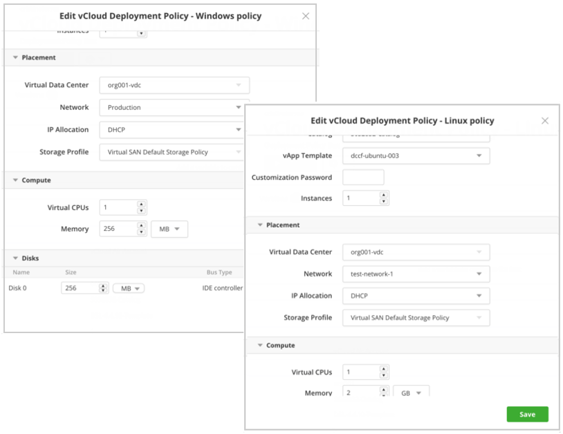

{{{ "title": "Orchestrating vCloud Air and vCloud Director Deployments",
"date": "01-15-2019",
"author": "Julio Castanar",
"keywords": ["cam","vcloud","vcloud air", "vcloud director", "add to vcloud", "deploy to vcloud", "resource names"],
"attachments": [],
"contentIsHTML": false
}}}

Do you use vCloud Air as the VMware public cloud or vCloud Director as your VMware private cloud? Connect them in Cloud Application Manager for complete workload automation. Once you define the automation of your workloads in Cloud Application Manager, you can launch them to other clouds as well as VMware. vCloud Air and vCloud Director are available in Cloud Application Manager through the vCloud Director provider, which supports vCloud Director API version 5.1 and above.

**In this article:**

* [Pre-Requisites](#pre-requisites)
* [Connect vCloud Air or vCloud Director in Cloud Application Manager](#connect-vcloud-air-or-vcloud-director-in-cloud-application-manager)
* [Deploy to vCloud Air or vCloud Director](#deploy-to-vcloud-air-or-vcloud-director)
* [Naming vCloud resources](#naming-vcloud-resources)
* [Contacting Cloud Application Manager Support](#contacting-cloud-application-manager-support)

## Pre-Requisites

To orchestrate vCloud Air and vCloud Director deployments through Cloud Application Manager, you need the following setup:

* [Install VMware tools](https://pubs.vmware.com/vcd-51/index.jsp?topic=%2Fcom.vmware.vcloud.users.doc_51%2FGUID-9BB72070-65E9-4458-84C3-05D8247C7343.html) on vApp templates in the catalog. This doesn’t apply to public vApp templates, which already have them.
* Enable [outbound Internet connectivity](https://kb.vmware.com/selfservice/microsites/search.do?language=en_US&cmd=displayKC&externalId=2053464) for vCloud Air or vCloud Director

## Connect vCloud Air or vCloud Director in Cloud Application Manager

Follow these steps to add a provider in Cloud Application Manager that integrates with your virtual data center in vCloud Air public cloud or vCloud Director private cloud. Each provider connects to the virtual data center in that specific location.

### Add a provider in vCloud

1. In Cloud Application Manager, on the Providers page, click **New Provider**.

2. Select **VMware vCloud Director** and enter the credentials as given.

    

* **URL**

   * **vCloud Director**. Enter the URL to access the vCloud Director portal.

   * **vCloud Air**. Enter the login URL followed by the compute API endpoint in this format, `<vCloud_air_login_URL>/api/compute`.

    **Example:** https://us-california-1-3.vchs.vmware.com/api/compute/

* **Organization**. Enter the organization name or GUID.
	* For vCloud Air, select the virtual data center to see the org name in the URL as in this example: `?orgName=c946391d-a811-40c5-b39e-df8bf2b88917`.
	* For vCloud Director, enter system if the user is a global administrator.

* **Username**. Enter the username to log in to vCloud Air or to the vCloud Director portal.
* **Password**. Enter the password for the vCloud Air or vCloud Director portal.

## Deploy to vCloud Air or vCloud Director

Create a [deployment policy](../Automating Deployments/deploymentpolicy-box.md) to encapsulate parameters required to deploy Linux or Windows vApps through the vCloud Air or vCloud Director provider in Cloud Application Manager. At deploy time, Cloud Application Manager auto provisions vApps, one template per VM, and orchestrates workload automation on them.

**Note:** Auto provisioning may fail if you specify virtual CPUs, memory, and virtual disk capacity that exceeds the limit in your virtual data center.



Edit the deployment policy to set the following parameters for deploying to vCloud Air or vCloud Director.

* **Resource**

    | Option | Description |
    |--------|-------------|
    | Organization | Select the organization in vCloud Air or vCloud Director. The organization is a virtual container for vApp templates, vApps, media images, and disks. |
    | Catalog |	Select the catalog that contains the vApp template for deployment. The catalog stores vApp templates and media files. Select from shared, private, and public catalogs that your organization can access. |
    | vApp Template | Select a vApp template from the catalog. VMs imported as OVFs then uploaded as templates are also listed. |
    | Customization Password | Optionally, provide a custom VM administrator password. If you leave this empty, the default administrator password from the template applies.|
    | Instances | Specify the number of instances to spawn from the same template. |

* **Placement**

    | Option | Description |
    |--------|-------------|
    | Virtual Data Center |	Select the virtual data center from vCloud Air or vCloud Director. |
    | Network |	Select the network for the virtual data center. |
    | IP Allocation | Assign IP addresses to the VM from the network attached to the virtual data center.<li>**DHCP.** Select this option to get an IP address dynamically where the network gateway acts as a DHCP router.</li><li>**Static IP Pool.** Select this option to get an IP address from a range of IP addresses configured for the network.</li><li>**Static Manual.** If you select this option, Cloud Application Manager finds the next available IP address from the virtual data center network and requests vCloud Air or vCloud Director to assign it to the VM.</li> |
    | Storage Profile | Choose a [storage option](http://vcloud.vmware.com/service-offering/block-storage) for vCloud Air.<li>**Standard.** Persistent block storage for occasional or event driven data access.</li><li>**SSD-Accelerated.** Higher performance block storage.</li> |

* **Compute**

    | Option | Description |
    |--------|-------------|
    | Virtual CPUs | Specify the number of CPUs. See the [VMware docs](http://pubs.vmware.com/vca/index.jsp?topic=%2Fcom.vmware.vca.od.ug.doc%2FGUID-6180A0A5-E390-449D-8FD6-CD8601554EAE.html) for vCloud Air VM CPU limit. |
    | Memory | Specify the virtual RAM in GB. See the [VMware docs](http://pubs.vmware.com/vca/index.jsp?topic=%2Fcom.vmware.vca.od.ug.doc%2FGUID-6180A0A5-E390-449D-8FD6-CD8601554EAE.html) for vCloud Air VM RAM limit. |

* **Disks**

    | Option | Description |
    |--------|-------------|
    | Disk | Specify the storage capacity in GB. See the [VMware docs](http://pubs.vmware.com/vca/index.jsp?topic=%2Fcom.vmware.vca.od.ug.doc%2FGUID-6180A0A5-E390-449D-8FD6-CD8601554EAE.html) for vCloud Air VM storage limit. Adding disk storage capacity is supported. |

## Naming vCloud resources

When creating an instance, an automatic name is generated and used for VApps, VMs and Hostname, all with the same generated name. This way you can identify unregistered instances.

This name generated has maximum length of 15 characters (max allowed in windows hostnames), and it's composed by this values:

```
InstanceName-ServiceId-InstanceNumber
```

In the Policy Box it's possible specify you want more that one instance. An example is “jdedepl-i8oq0-1”.  


Once created this name, **modifying the vApp name is not supported**, because it could affect to the instance operations. However, it's possible to change manually this name on VMs and Hostnames.  
In case want to rename a VM/Hostname, it would be needed to do the following steps:

- From CAM launch a ShutDown operation and wait it to finish.
- From vCloud Console, go to the VM Properties and change the VM name and/or Hostname.
- From CAM launch a PowerOn operation and wait it to finish.

## Contacting Cloud Application Manager Support

We’re sorry you’re having an issue in [Cloud Application Manager](https://www.ctl.io/cloud-application-manager/). Please review the [troubleshooting tips](../Troubleshooting/troubleshooting-tips.md), or contact [Cloud Application Manager support](mailto:incident@CenturyLink.com) with details and screenshots where possible.

For issues related to API calls, send the request body along with details related to the issue.

In the case of a box error, share the box in the workspace that your organization and Cloud Application Manager can access and attach the logs.
* Linux: SSH and locate the log at /var/log/elasticbox/elasticbox-agent.log
* Windows: RDP into the instance to locate the log at \ProgramData\ElasticBox\Logs\elasticbox-agent.log
