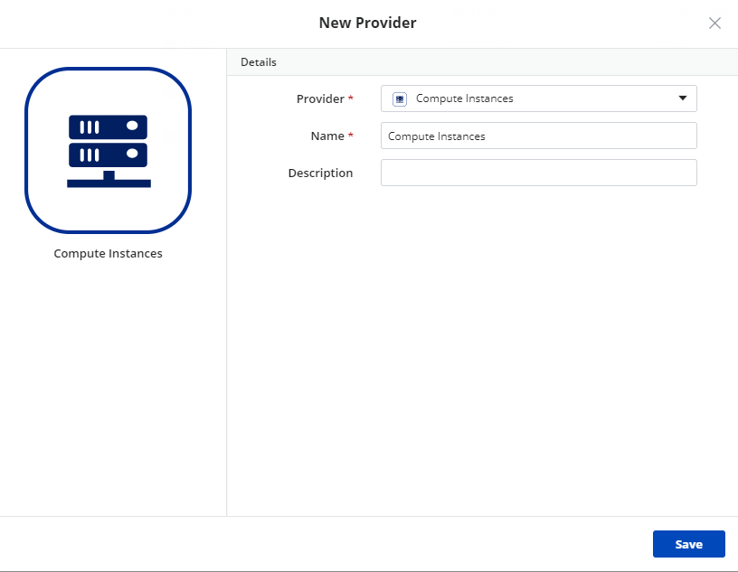
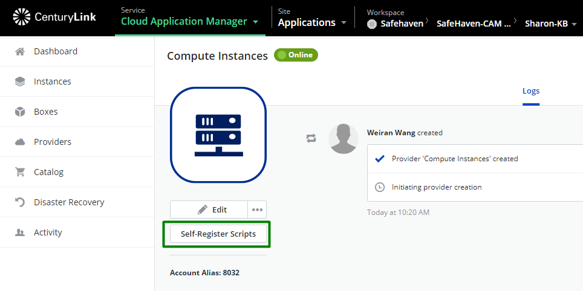
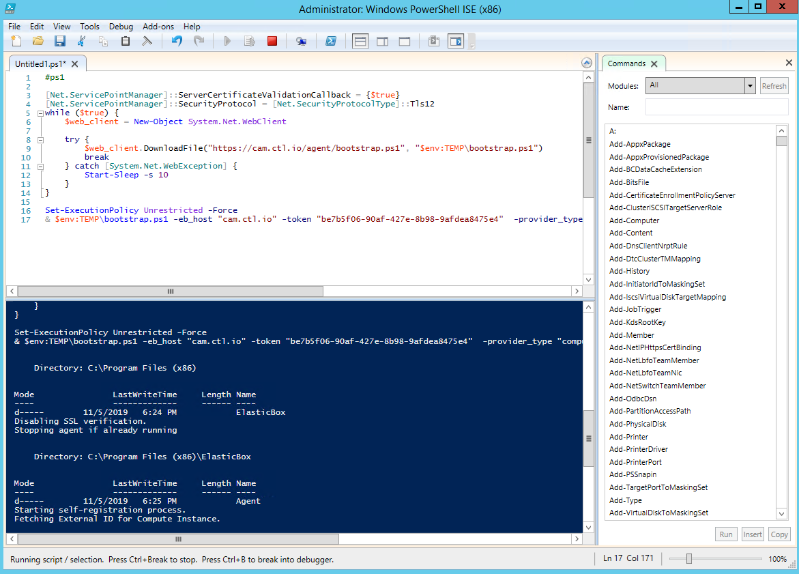
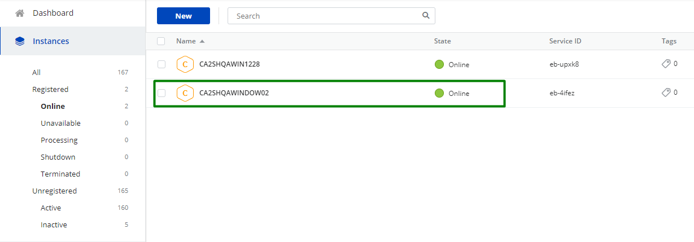
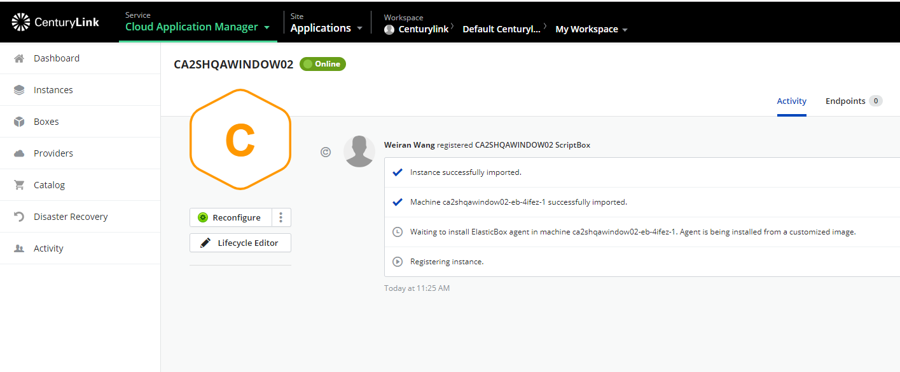

"date": "11-05-2019",
"author": "Sharon Wang",
"attachments": [],
"contentIsHTML": false
}}}

**In this article:**

* [Overview](#overview)
* [Audience](#audience)
* [Prerequisites](#prerequisites)
* [Create a Provider](#create-a-provider)
* [Register a Server](#register-a-server)
* [Contacting Cloud Application Manager Support](#contacting-cloud-application-manager-support)

### Overview 

This article is meant to assist users of Cloud Application Manager trying to register their stand-alone/physical machines to CAM. You can bring your own infrastructure to Cloud Application Manager by installing the Cloud Application Manager agent and register it to Compute Instances Provider. This will enable lifecycle of the instance through Cloud Application Manager like with any other natively-deployed instance.

### Audience

All users of Cloud Application Manager who wants to register their stand-alone machines to Compute Instances Provider.

### Prerequisites

* An active **Cloud Application Manager** account
* Any infrastructure capable of running Cloud Application Manager Agent.

### Create a Provider

Select **Compute Instances** from the Provider list and give it a name, then click on **Save**

**Note**: Unlike other provider types, this one does not require any synchronization process and it does not support deployment policies either, since there is no direct deployment support on it.

### Register a Server
You can launch boxes on any infrastructure by running the Cloud Application Manager agent. The agent is required to execute box variables and scripts and run lifecycle operations. Once the provider is created, users can register VMs or physical machines to this Provider by clicking **Self-Register Scripts**

There are 2 scripts for Windows and Linux OS. In this article, we use Windows server as an example:

Copy the script and run on the Windows server we have on CLC to trigger the self-register process:

Once the script is completed, you can see the server registered:

To learn more about Cloud application manager Self Register Instances, please review the [Self Register Instances](../Getting%20Started/self-register-instances.md)

### Contacting Cloud Application Manager Support

We’re sorry you’re having an issue in [Cloud Application Manager](https://www.ctl.io/cloud-application-manager/). Please review the [troubleshooting tips](../Troubleshooting/troubleshooting-tips.md), or contact [Cloud Application Manager support](mailto:incident@CenturyLink.com) with details and screenshots where possible.

For issues related to API calls, send the request body along with details related to the issue.

In the case of an error registering an instance, share the instance to a workspace that your organization and Cloud Application Manager support group can access and attach the logs.

* Linux: SSH into the instance and locate the log at /var/log/elasticbox/elasticbox-agent.log
* Windows: RDP into the instance to locate the log at \ProgramData\ElasticBox\Logs\elasticbox-agent.log
If you have additional questions, please [contact Cloud Application Manager Support](mailto:incident@CenturyLink.com)
