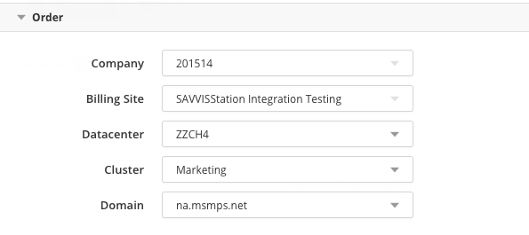
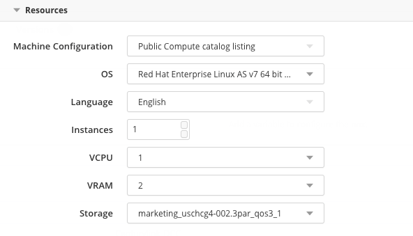
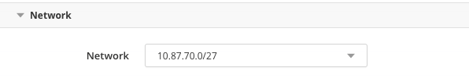
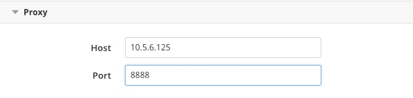

{{{
"title": "Using CenturyLink DCC",
"date": "06-20-2017",
"author": "",
"attachments": [],
"contentIsHTML": false
}}}

### Using CenturyLink DCC

**Creating a provider**

Select CenturyLink DCC from the Provider list and enter a username and password to logon to the CenturyLink DCC Portal.

> The user must have "customer purchase permission" and an associated billing account in CenturyLink DCC to operate in the Cloud Application Manager. 
> If this is not the case, open a ticket [here](https://savvisstation.savvis.com) to get it fixed. 

Once the provider information is saved, Cloud Application Manager starts synchronizing the Provider account. After the synchronization is complete, Cloud Application Manager creates default Deployment Policies with the different deployment options available.

The user account used when creating the Provider is linked to a Company, Billing Site, Clusters, and Domains, etc.

When the synchronization process finishes, the list of Linux and Windows Templates available to deploy on each cluster is available on the provider's "Configuration" tab.

**Editing Policy Boxes on CenturyLink DCC**

In addition to the services list, Cloud Application Manager creates three example Policy Boxes for Linux and Windows. These can be customized any time.

To do this, access the details by selecting "Code", then "Edit", where the following options are available:

##### Order

| Option | Description |
|--------|-------------|
| Company | Select the company of your DDC provider. |
| Billing Site | Select the billing site of your DDC provider. |
| Datacenter | Clusters are grouped in [Datacenters](../../General/CenturyLinkCloud/centurylink-cloud-data-center-locations.md). To select a Cluster, Cloud Application Manager needs to know the Datacenter the Cluster belongs to. |
| Cluster | Select the cluster where you want to deploy. |
| Domain | Select the domain where you want to deploy. |

##### Resource

| Option | Description |
|--------|-------------|
| Machine configuration | Select the profile of the machine. |
| OS | Select from a list of CenturyLink DCC Linux or Windows images. |
| Language | Select the languaje of instance. |
| Instances | Cloud Application Manager can deploy several servers at once, with the restriction that all the operations run on all the instances (start, stop, delete, and script boxes installation). |
| VCPU | Select the number of CPUs. |
| VRAM | Select the amount of memory assigned to the Virtual Machine. |
| Storage | Select the disk group to use. |

##### Network

| Option | Description |
|--------|-------------|
| Network | The net segment where the VM is configured. Please note that the IP address is set automatically. The user must select a segment with available IP addresses. |

##### Proxy

| Option | Description |
|--------|-------------|
| Host | The hostname or domain of the proxy that the agent will use to connect back to Cloud Application Manager, once it has been installed in the deployed instance. |
| Port | The port of the proxy that the agent will use to connect back to Cloud Application Manager, once it has been installed in the deployed instance. |

**Deploying Instances from Deployment Policies**

Virtual machines get deployed on clusters. If Cloud Application Manager doesn't have enough information to deploy a cluster, the cluster will not be available as a deployment option for the Policy Boxes. In that case, Cloud Application Manager displays an alert as follows.

Once the Box deploys, Cloud Application Manager shows the traces of what is happening with the provider. At the end of the process it displays a script that has to be executed manually on the newly created Virtual Machine.

Credentials for the Virtual Machine are sent via email which contains the necessary privileges to install the Cloud Application Manager agent using the script shown above.

> To run this script, the user needs access to the new Virtual Machines. This task, as in the creation of the account, needs to be done by CenturyLink DCC. 

Once this is done, the deployment process is complete.
