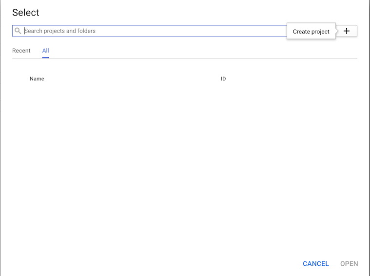
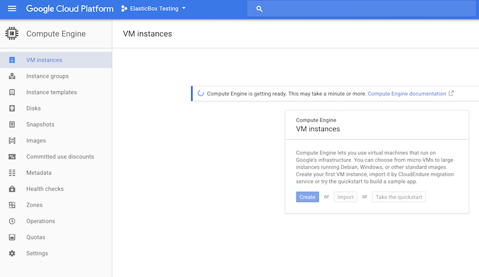
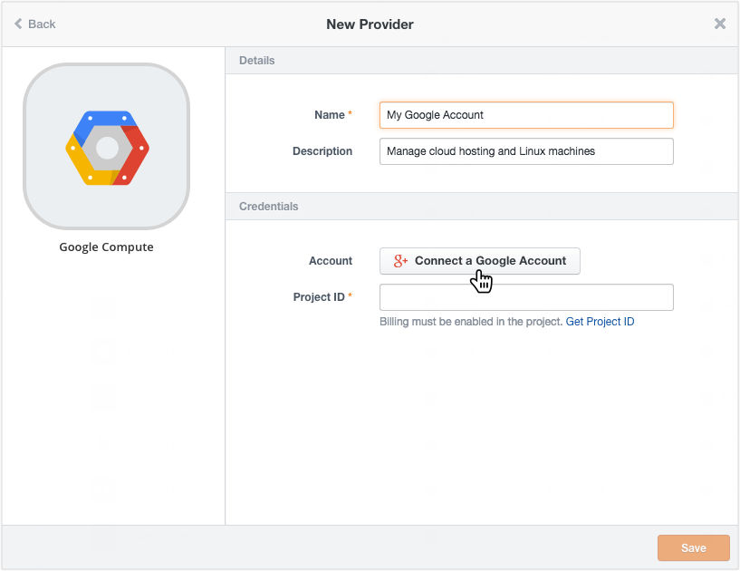
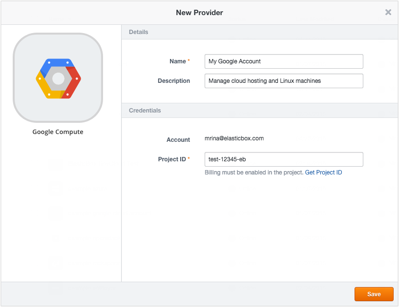
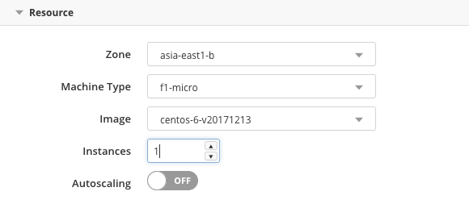
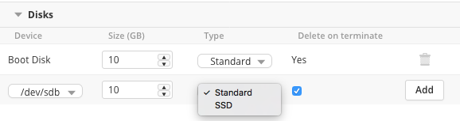

{{{
"title": "Using Google Cloud",
"date": "09-01-2016",
"author": "",
"attachments": [],
"contentIsHTML": false
}}}

### Using Google Cloud

Use Cloud Application Manager to deploy high-performance Linux applications to the Google Cloud Platform. While we automate your application’s runtime in boxes, Google Cloud Platform provides the virtual infrastructure where you can run them.

To get started, create a provider for your Google account in Cloud Application Manager. In a few clicks, you’re automatically connected and can start deploying to a project in Google Cloud.

To deploy, create a deployment profile in Cloud Application Manager where you select your Google provider account and specify resources that you need to launch your application.

Based on the settings, we work with the Google Compute Engine APIs to launch your applications in the default or custom network. We provision instances per your network firewall rules and routes, create ephemeral IP addresses, and persistent root disk resources. We support Compute Engine services for all regions and availability zones with ready-made or custom images from your Google account.

**In this article:**

* Connecting your Google Cloud account
* Deploying in Google Cloud

### Connecting Your Google Cloud Account

Connect your Google account in Cloud Application Manager in a couple of steps.

### Step 1. Associate Google Account in Google Cloud

Associate your Google account in Google Cloud by creating a project, enabling billing, and turning on the Google Compute Engine API. If you’ve already done this, skip to step 2.

**Steps**

1. Sign in to [Google developers console](https://console.developers.google.com/) with your google account.

2. Create a project. Click **Create Project** and give a meaningful name and ID. Copy the project ID, which you’ll shortly need to share in Cloud Application Manager.

  

  

  

3. Add billing. Under Billing & Settings, click **Enable Billing.**

   **Note:** You have to provide credit card details for usage based billing. See Google’s pricing policy for costs incurred to host on the Google Cloud Platform. Cloud Application Manager assumes no responsibility for these costs.

   

   

4. Turn on Google Compute Engine. Under APIS & AUTH > APIs, turn Google Compute Engine to **ON.**

   
   

### Step 2. Connect the Account in Cloud Application Manager

**Steps**

1. Sign in to [Cloud Application Manager](//www.ctl.io/cloud-application-manager/).

2. Click **Providers > Add Provider**.

3. In the dialog, select **Google Compute**.

4. Under Credentials, click **Connect a Google Account**. Via Google OAuth, Cloud Application Manager requests access to your project to view and manage Google Cloud resources on your behalf. Once you accept, you should see your Google account appear in the dialog. For a deeper understanding of how we securely request access, see the [Google help](https://developers.google.com/compute/docs/api/how-tos/authorization).
   
   

5. Copy, paste the Project ID for the project you created in the Google Developers Console and save.
   

We sync with the Google Cloud APIs to register ready-made and custom images available for the account as well as resources like network configurations, firewalls, routes, and more.

### Deploying in Google Cloud

The [deployment policy ](../Automating Deployments/deploymentpolicy-box.md)for Google Cloud abstracts some basic infrastructure options. Choose a Google Cloud deployment policy when launching a box to the cloud. If your admin hasn’t shared a policy, create it for the Google Cloud account in Cloud Application Manager.

**Note:** To consume custom networks, routes, custom firewall rules, and options like non-persistent disks, load balancing, or disk snapshots, configure them directly in the Google Developers Console.

**Deployment**

| Deployment Option | Description |
|-------------------|-------------|
| Provider | This shows the name or GUID of the Google Cloud provider account in Cloud Application Manager. If you don’t have access to the provider account, you see the GUID. |

**Resource**

| Deployment Option | Description |
|-------------------|-------------|
| Zone |	This is the location (ex: us-central1-a) that hosts your instance and where traffic to the instance is served by Google Cloud. It consists of the the region followed by the zone. |
| Machine Type | Google Compute has preset machine sizes for standard, high memory, high CPU, and shared core categories. Each category determines the number of cores, memory, and scratch disk space available to the instance. For details on what type (ex: n1-standard-2) to select, see [Machine Types](https://developers.google.com/compute/docs/machine-types#standard). |
| Image |	This lists the ready-to-use images (ex: debian-7) provided by Google as well as custom images you created to boot your instance. |
| Instances |	Select the number of instances to provision. Multiple instances are launched within the same selected network and firewall. |
| Autoscaling   | Autoscaling is a feature of managed instance groups. The autoscaler will collect information based on the policy, compare it to your desired target utilization, and determine if it needs to perform scaling.|

**Network**

| Deployment Option | Description |
|-------------------|-------------|
| Network |	Select a network to direct traffic in and out of the instance. The default network for the project is automatically selected here. If you added a custom network, you can select it from the drop-down. Note that the network configuration relies on firewall rules and routes you specify for the project. |
| Tags	| Specify tags to control how traffic is handled for the instance. Tags identify the network resources applied to the instance, such as firewall rules and routes. For example, when you select a firewall rule in the deployment profile, its target tag is automatically added to this field. Apart from tags related to firewalls and routes, you can tag the instance with other meaningful labels by simply typing them here Remember that these are different from [metadata tags](../Administering Your Organization/resource-tags.md) that help you track Cloud Application Manager resources consumed by an instance. |
| Firewall Rules | Select the firewall rules to apply. Listed here are the default network firewall rules that allow http, https traffic to the network, its default routes, which specify how to reach the Internet and other instances internally are automatically applied. A firewall rule specifies the IP address range, ports, and protocols through which traffic is allowed to and from the instance. The rule is applied to the instance via tags. |
| Routes | Select routes that dictate how packets of data leaving the instance should reach the destination. If you selected the default instance along with any custom firewall rules you created for the project in Google Cloud. Listed here are only the custom routes you configured for the network through Google Cloud. When you select them, their associated tag is added to the tag field and then applied to the instance at deploy time. |
| Ephemeral IP | Select to assign an external IP address that traffic outside of the network use to communicate with the instance. An ephemeral IP address is assigned to the instance until the instance is terminated. If you leave the option unselected, an external IP address is not assigned to the virtual machine. As a result, outside traffic will not be able to communicate with the instance. For more information, see [Instances and Networks](https://developers.google.com/compute/docs/instances-and-network). |
| IP Forwarding	| By default, Google Cloud checks that packets routed from the instance match source and destination IP addresses. If you don’t want Google to check this, deselect the option. To learn more, see [Networking and Firewalls](https://developers.google.com/compute/docs/networking#canipforward). |

**Proxy**

| Deployment Option | Description |
|-------------------|-------------|
| Host |	The hostname or domain of the proxy that the agent will use to connect back to Cloud Application Manager, once it has been installed in the deployed instance. |
| Port |  The port of the proxy that the agent will use to connect back to Cloud Application Manager, once it has been installed in the deployed instance. |

**Disks**

Boost primary storage for the virtual machine by adding standard persistent root disk resources. They provide bulk storage or sequential I/O with large block sizes.

Specify these options when you add a disk resource:
* **Size:** Specify a size from 10 GB up to 10 TB (10,240 GB). Larger machine types offer higher I/O levels.
* **Delete on Terminate:** Specify whether to delete the root persistent disk once you terminate the instance. By default it is deleted, but you can uncheck the option if you want to preserve it.

**Things to know:**

* Since disks are zone based resources, they are launched in the same zone as the virtual machine. Each disk is attached with a drive name like /dev/sda for example.
* You can attach up to 16 standard persistent root disks with a combined size less than or equal to 10 TB or you can attach one disk 10 TB in size. For each disk that you add, Cloud Application Manager requests Google Cloud to provision and mount an empty persistent disk to the virtual machine.

For more information, see [persistent disks](https://developers.google.com/compute/docs/disks#persistentdisks), [root persistent disks](https://developers.google.com/compute/docs/disks#rootfrompd), and [disk price and performance](https://cloud.google.com/developers/articles/compute-engine-disks-price-performance-and-persistence).

### Contacting Cloud Application Manager Support

We’re sorry you’re having an issue in [Cloud Application Manager](https://www.ctl.io/cloud-application-manager/). Please review the [troubleshooting tips](../Troubleshooting/troubleshooting-tips.md), or contact [Cloud Application Manager support](mailto:incident@CenturyLink.com) with details and screenshots where possible.

For issues related to API calls, send the request body along with details related to the issue.

In the case of a box error, share the box in the workspace that your organization and Cloud Application Manager can access and attach the logs.
* Linux: SSH and locate the log at /var/log/elasticbox/elasticbox-agent.log
* Windows: RDP into the instance to locate the log at ProgramDataElasticBoxLogselasticbox-agent.log
