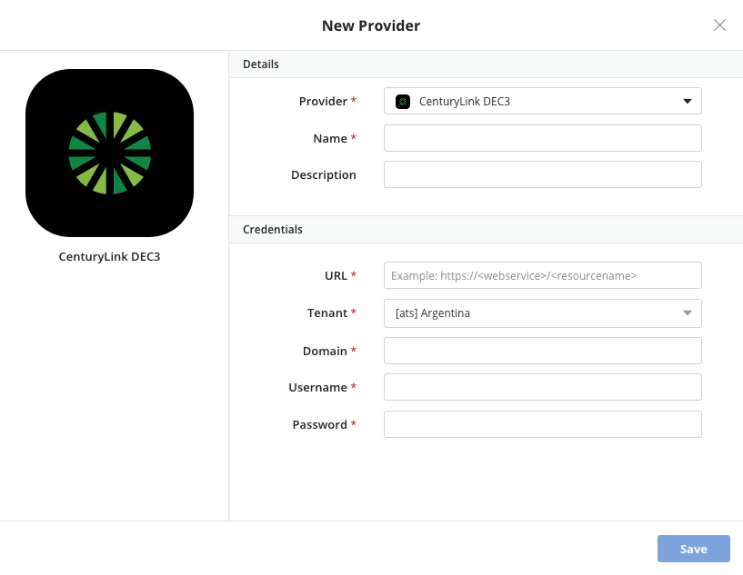
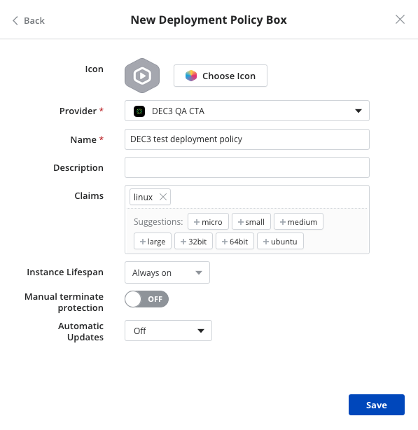
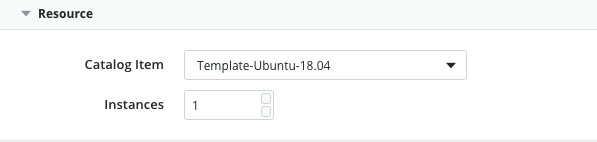
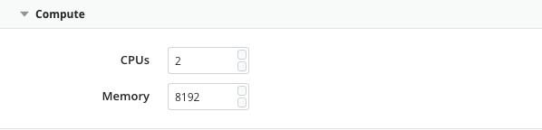
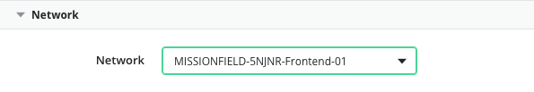
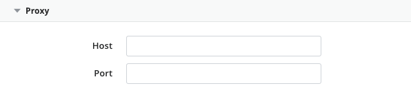
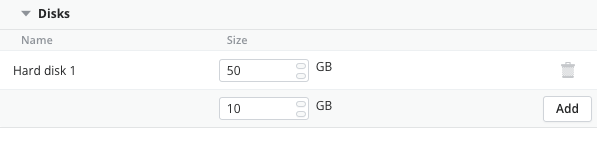
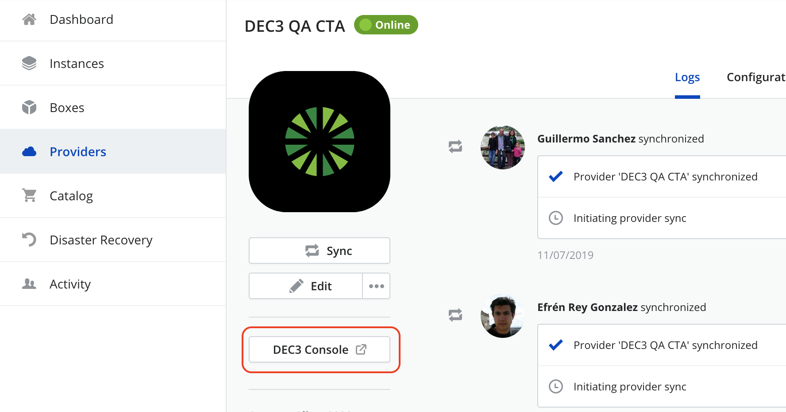
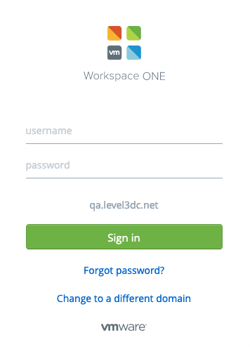

{{{
"title": "Using Lumen DEC3",
"date": "11-20-2019",
"author": "Guillermo Sanchez",
"keywords": ["cam","lumen dec3", "dec iii", "vrealize", "deploy", "provider"],
"attachments": [],
"contentIsHTML": false
}}}

**In this article:**

* [Overview](#overview)
* [Audience](#audience)
* [Prerequisites](#prerequisites)
* [Connect Lumen DEC3 environment in Cloud Application Manager](#connect-lumen-dec3-environment-in-cloud-application-manager)
* [Deploy to Lumen DEC3 from Cloud Application Manager](#deploy-to-lumen-dec3-from-cloud-application-manager)
* [Discovering and Registering Existing instances](#discovering-and-registering-existing-instances)
* [Accessing the DEC3 native console](#accessing-the-dec3-native-console)
* [Contacting Cloud Application Manager Support](#contacting-cloud-application-manager-support)

### Overview

This article is meant to assist users of Cloud Application Manager to learn how to deploy a Lumen DEC 3 Provider, available only in Latin America region.

### Audience

All Cloud Application Manager users who want to deploy workloads into a Lumen DEC 3 Provider.

### Prerequisites

* You must have a Cloud Application Manager Account
* Your base URL, and user credentials for your Lumen DEC 3 subscription

### Connect Lumen DEC3 environment in Cloud Application Manager

Follow these steps to add a provider in Cloud Application Manager that integrates with your Lumen DEC 3 environment. Each provider connects to the virtual data center in that specific location.

#### Add a provider in Lumen DEC3

1. In Cloud Application Manager, on the Providers page, click **New Provider**.

2. Select **Lumen DEC3** and fill in the required fields:

    

   * **URL**. Enter the URL to access the Lumen DEC3 portal
   * **Tenant**. Select the tenant your environment is hosted into.
   * **Domain**. Enter the domain of your environment
   * **Username**. Enter the username to log in to your Lumen DEC3 account.
   * **Password**. Enter the password for your Lumen DEC3 account.

### Deploy to Lumen DEC3 from Cloud Application Manager

Create a [deployment policy](../Automating Deployments/deploymentpolicy-box.md) to encapsulate parameters required to deploy Linux or Windows instances through the Lumen DEC3 provider

At deploy time, Cloud Application Manager auto provisions a vRealize instance and orchestrates workload automation on them.

**Note:** Auto provisioning may fail if you specify virtual CPUs, memory, and virtual disk capacity that exceeds the limit in your virtual data center.

Edit the deployment policy to set the following parameters for deploying to Lumen DEC3.

#### Resource

| Option | Description |
|--------|-------------|
| Catalog Item | Select the template from the catalog to be used for deployment. |
| Instances | Specify the number of instances to spawn from the same template. |

#### Compute

| Option | Description |
|--------|-------------|
| CPUs | Specify the number of CPUs. |
| Memory | Specify the virtual RAM in MB. |

#### Network

| Option | Description |
|--------|-------------|
| Network | Specify the network to deploy to. |

#### Proxy

| Option | Description |
|-------------------|-------------|
| Host | The hostname or domain of the proxy that the agent will use to connect back to Cloud Application Manager, once it has been installed in the deployed instance. |
| Port | The port of the proxy that the agent will use to connect back to Cloud Application Manager, once it has been installed in the deployed instance. |

#### Disks

| Option | Description |
|--------|-------------|
| Disk | Specify the storage capacity in GB. Adding disk storage capacity is supported. |

### Discovering and Registering Existing instances

When you configure your Lumen DEC3 provider in Cloud Application Manager, the synchronization process will discover the existing instances in your account. You will see these instances in the **Unregistered Instances** tab in the provider details page or in the **Unregistered** resources in the instances page.

For more information about the registration process, also known as import instance process, refer to how to [Register an Existing Instance](../Getting Started/register-existing-instance.md)

### Accessing the DEC3 native console

Once your provider is synchronized, you will be able to access the DEC3 native console through the button available in the provider details page:

When you click on the button, a new window or tab will open in your browser with the access page of your DEC3 console:

### Contacting Cloud Application Manager Support

We’re sorry you’re having an issue in [Cloud Application Manager](https://www.ctl.io/cloud-application-manager/). Please review the [troubleshooting tips](../Troubleshooting/troubleshooting-tips.md), or contact [Cloud Application Manager support](mailto:incident@CenturyLink.com) with details and screenshots where possible.

For issues related to API calls, send the request body along with details related to the issue.

In the case of a box error, share the box in the workspace that your organization and Cloud Application Manager can access and attach the logs.

* Linux: SSH and locate the log at /var/log/elasticbox/elasticbox-agent.log
* Windows: RDP into the instance to locate the log at \ProgramData\ElasticBox\Logs\elasticbox-agent.log
