{{{
"title": "Using Microsoft Azure",
"date": "07-31-2018",
"author": "Guillermo Sanchez",
"attachments": [],
"contentIsHTML": false
}}}

### Using Microsoft Azure

**In this article:**

* [Overview](#overview)
* [Before You Begin](#before-you-begin)
* [Registering Your Microsoft Azure Subscription (ARM) in Cloud Application Manager](#registering-your-microsoft-azure-subscription-arm-in-cloud-application-manager)
* [Deploying Instances in Azure](#deploying-instances-in-azure)
* [Registering Existing Instances from your Azure Account](#registering-existing-instances-from-your-azure-account)
* [Shutdown and Terminate Instances in Azure](#shutdown-and-terminate-instances-in-azure)
* [Contacting Cloud Application Manager Support](#contacting-cloud-application-manager-support)

### Overview

There are two different flavors of Azure and Cloud Application Manager has providers for both. This document is in reference to Microsoft Azure.

*Name** | **URL of Portal** | **Name of Related Cloud Application Manager Provider** | **KB article**
--- | --- | --- | ---
Classic Azure | https://manage.windowsazure.com | Classic Azure | [Using Classic Azure](using-azure.md)
Microsoft Azure | https://portal.azure.com | Microsoft Azure  | This document

Each of Cloud Application Manager's Microsoft Azure Providers gives you the option of setting it up either for an existing or a new Azure Customer Account. Existing accounts are your responsibility and will continue to be billed to you by Azure. New Accounts will automatically be generated on your behalf and the credentials pulled into the Provider via [Cloud Optimization](../Cloud Optimization/partner-cloud-integration.md), allowing you to hand off platform-level support and billing to CenturyLink.

If you want to learn how to use the New Account feature, please visit [Partner Cloud: Getting Started With a New Azure Customer](../Cloud Optimization/partner-cloud-integration-azure-new.md). The rest of this article assumes you will be using an existing, Azure Customer Account without any integration with CenturyLink.

If you do have an existing Azure account that you want CenturyLink to manage or support, please contact incident@CenturyLink.com. Please provide the name and domain of your account. Also, please describe any products, services, or resources within your Customer Account that are not currently shown in this list of [permitted products](../Cloud Optimization/partner-cloud-integration-azure-capabilities.md). We likely have already have begun work to enable your products.

### Before You Begin

You need an Microsoft Azure subscription to be able to consume Azure services. Follow these steps to create one.

#### Steps

1. Login to the [Azure portal](https://portal.azure.com/) using your Microsoft Account.
2. Select *Azure Active Directory* in the menu, and then *Properties*
3. Copy and take note of the **Directory ID** for later.  
4. Next select *App registrations*, within the Azure Active Directory panel
5. Create a *New Application Registration* with the following values:
    * Name: **CenturyLink-CAM**
    * Application Type: **Web app / API**
    * Sign-on URL: **https://localhost/logon**
6. Upon saving an **Application ID** will be generated. Copy and take note of this value for later.

7. For allowing the support personnel to access with a temporary user to your account in case they need to troubleshoot any support issue, you need to grant some permissions on the application you just created. To do so, on the application you just created click on **Settings > Required Permissions > Add > Microsoft Graph API** and select the following **Delegated** permissions:
    * Read and write all users' full profiles _(User.ReadWrite.All)_
    * Read and write directory data _(Directory.ReadWrite.All)_

    Then click **Save**.
    Now click on **Add > Windows Azure Active Directory** and select the following **Application** permission:
    * Read and write directory data _(Directory.ReadWrite.All)_

    Then click **Save** and **Grant permissions** to apply them to your application.

8. Navigate to *Subscriptions* panel.
9. In the *Overview* tab an **Subscription ID** is listed.  Copy and take note of this value for later.
10. Select *Access Control (IAM)* and then selecte the *Add* button at the top of screen.  
11. When creating the new role, do so with the following values:
    * Role: **Owner** (If you do not see the Owner role, you will need to talk to your administrator.)
    * Assign Access to: **Azure AD user, group or application**
    * Select: **CenturyLink-CAM**
12. Now select *Resource providers* in your subscription and **Register** the following providers:
    * *Microsoft.Compute*
    * *Microsoft.Network*
    * *Microsoft.Storage*

    For more information, please refer to [Azure help](https://docs.microsoft.com/en-us/azure/azure-resource-manager/resource-manager-supported-services#portal)
13. Return to the *Azure Active Directory* panel, select *App Registrations* then *CenturyLink-CAM* then *Settings* and finally *Keys*.
14. Set a Key with the following values:
    * Description: **CAM-App-Key**
    * Expires: **Never Expires**
15. Upon saving a **Key** value will be generated. Copy and keep the key (aka the **Secret**) value as you won't see it anymore once you navigate away.
16. Input your Microsoft Azure Provider for an existing account as listed below:
    * Subscription ID: **_Azure Subscription ID_**
    * Application ID: **_Application ID_**
    * Secret: **_Key value_**
    * Tenant: **_Active Directory ID_** or **_Domain_**

If you cannot find a specific template that you are looking for in Cloud Application Manager be sure to check out the [Azure github quickstart templates](https://github.com/Azure/azure-quickstart-templates).

### Registering Your Microsoft Azure Subscription (ARM) in Cloud Application Manager

To connect to Microsoft Azure in Cloud Application Manager, you need to follow these steps.

#### Steps

1. In Cloud Application Manager, go to **Providers** > **New Provider** and select **Microsoft Azure**.
   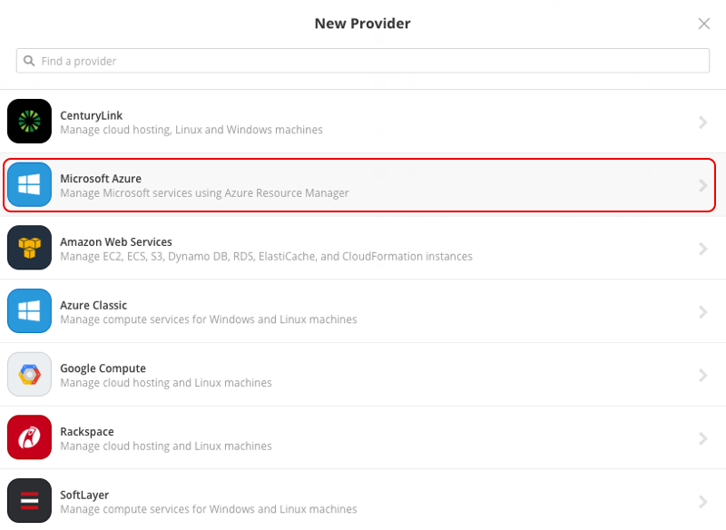

2. Fill the form with Subscription ID, Application ID, Secret and Tenant obtained in previous section and save.
   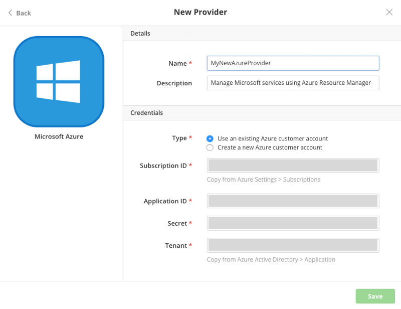

Once pressed the save button our new provider starts to synchronize with our azure account from which you will get the following information:

* VM images of windows family operating systems.
* VM images of operating systems of Linux family.
* Region list which we can deploy the mentioned services as well as the templates of Microsoft Azure.
* List of deployed Virtual Machines that are currently not being managed from Cloud Application Manager.

During synchronization, we can get warnings about locations may be ignored because there are no associated virtual networks to them. This is because Cloud Application Manager does not create virtual networks but requires one in the deployment operation of one virtual machine.

The result of the synchronization process will be the creation of one ARM template box and two policy boxes (Windows and RHEL respectively) in case of exist a virtual network in our account.

Samples and management appliance deployment policy could be installed too.

### Deploying Instances in Azure

You can deploy to the following services in Azure:

* Windows based virtual machines
* Linux based virtual machines
* Microsoft Azure templates

#### Azure OS Images Available to Deploy in Cloud Application Manager

As part of the result of synchronization process you can find a list of available operative systems that you can use in your policy boxes. You can check this list in **Providers** page > **Configuration**.

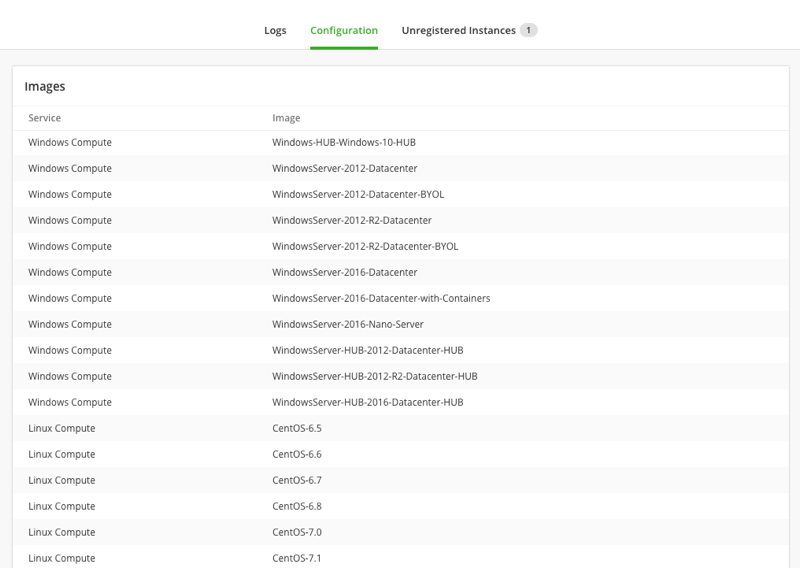

This images are what we show in image list from policy box edition.

In addition, if you don't find the right image in that list, you could add a new image from the Azure Marketplace clicking in the "New" button at the top right corner and defining the following image properties:

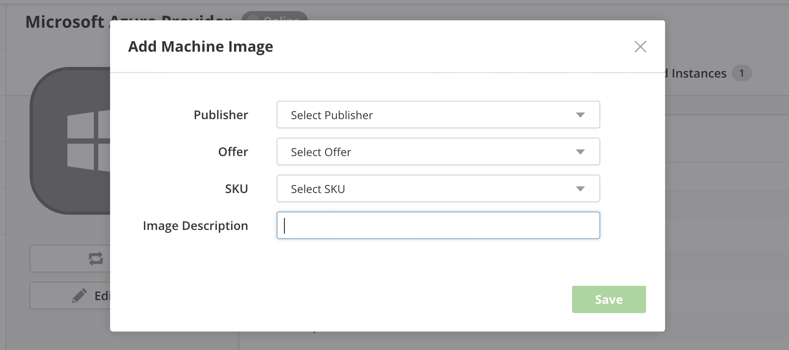

| Option | Description |
|--------|-------------|
| Publisher | The organization that created the image. |
| Offer | A group of related images created by a publisher. |
| SKU | An instance of an offer, such as a major release of a distribution. |
| Image Description | Name of the new image. If blank, a default value is set. |

On the other hand, you could remove it from available images using the "Trash" icon.

#### Microsoft Azure Compute Deployment Options

To deploy a virtual machine with compute services you can edit one of windows or RHEL policy boxes or create a new one. Then you can save your changes and click **Deploy**.

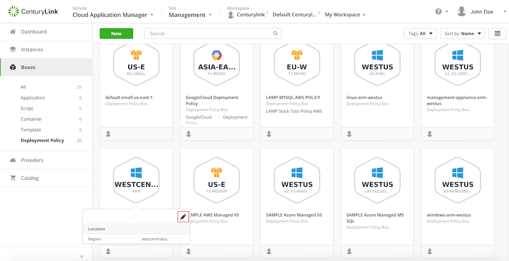

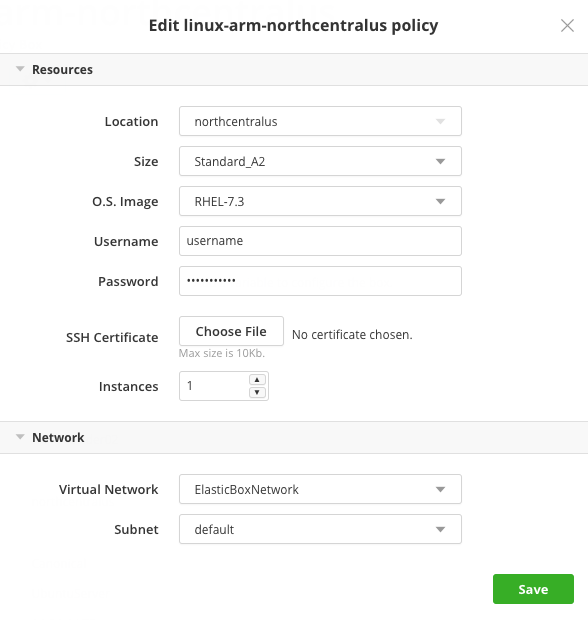

#### Resources

| Option | Description |
|--------|-------------|
| Location | Select the region where you want to deploy the virtual machine. Each location has available its own images, networks and sizes so is the first parameter you have to choose. Only locations with networks available are shown. |
| OS Image | Select the guest OS to run in the worker role instance. Note that Windows 2008 images are not synced at this time because the Cloud Application Manager agent doesn’t work on them. |
| Size | Select a size to set the number of CPU cores, memory, and disk size to store your OS files, process temporary memory, and store application data. For more information, see the [Azure help](https://docs.microsoft.com/en-us/azure/cloud-services/cloud-services-sizes-specs). Note that D-Series sizes use solid-state drive disks. |
| Username | Specify a username to be able to RDP or SSH into the instance directly. |
| Password | Specify a password to be able to RDP or SSH into the instance directly. |
| SSH Certificate | Only in Linux machines you can specify a certificate to access via ssh. |
| Instances | Specify the number of instances to spawn. If you increase it to a value higher than 1, a **High Availability** toggle will appear below that you can enable to use Azure availability sets for high availability support. Note that at this time, we don’t autoscale or load balance instances. To enable that, you have to manually configure these options in [Azure](https://docs.microsoft.com/en-us/azure/cloud-services/cloud-services-how-to-scale-portal) |
| Delegate Management  | Delegate management to CenturyLink.  |

When you increase the number of instances, the High Availability toggle appears:

For more information, see the [Azure help](https://docs.microsoft.com/en-us/azure/virtual-machines/windows/tutorial-availability-sets#availability-set-overview)

#### Network

| Option | Description |
|--------|-------------|
| Virtual Network | Choose the network to deploy to among the list of available networks. |
| Subnet | This subnet is the resource related to  the virtual machine's network interface. Actually a virtual network is not used at deployment time. |
|Security Group | Filter incoming and outgoing traffic for the virtual machine based on a set of rules. Multiple security groups in a zone can be selected for a virtual machine. For more information, see [Security Groups](https://docs.microsoft.com/en-us/azure/virtual-network/security-overview). |
|Public IP Address   | The public IP Address exposes our server to the public internet where other applications can access it.|

#### Disks

| Option | Description |
|--------|-------------|
| Storage Account | Select the Storage Account to use among the existing ones or Automatic (it will create a new one)|
| Local Disk | When **Managed** toggle is ON it will use managed disks |
| Data Disk | Storage size for data in addition to the Local Disk|

If you can't create any policy box on Windows Azure provider probably you have to create a virtual network from Azure portal or you may deploy a new one with a template as we describe in following section. If you choose to use a [new Azure provider optimized by CenturyLink](../Cloud Optimization/partner-cloud-integration-azure-new.md) we will create a default network for you.

#### Microsoft Azure ARM Template Deployment Options

Azure ARM Templates are supported on Cloud Application Manager with Microsoft Azure provider. You can deploy whatever you want with the same syntax you use on Azure APIs and portal. For this purpose you can create a custom deployment policy and deploy it with an ARM Template box together.

#### Steps

1. Create Deployment Policy:
   * Go to **Boxes** > **New** > **Deployment Policy**.
   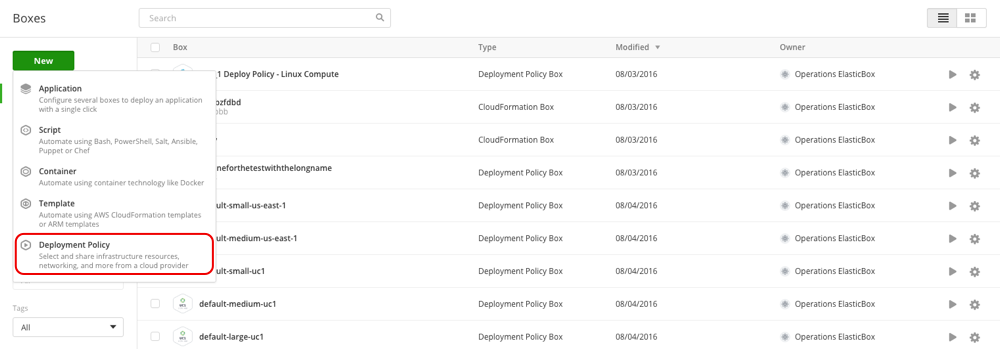
   * **Select Microsoft Azure** on the menu.
   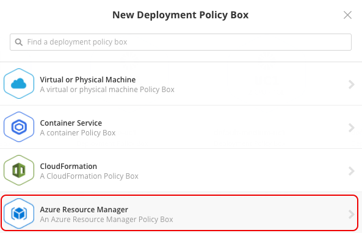
   * Select provider, name and description fields.
   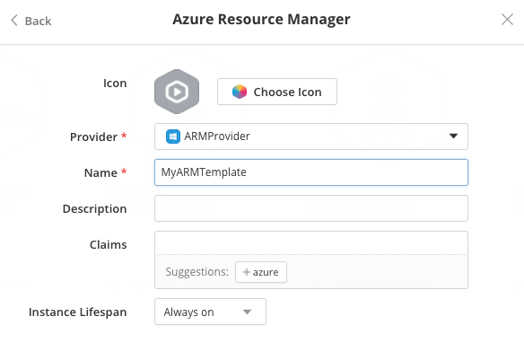
   * Click **Save**.

2. Edit Deployment Policy.
   * Go to **Template** > **Code** and press **Edit**.
   * Put your own template and click **Save**.

3. Deploy Template.
   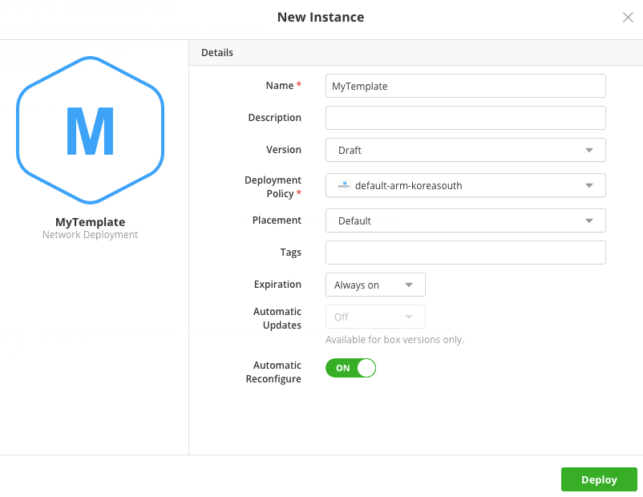
   * From Template click **Deploy**.
   * **Select** one ARM Template Box.
   * Choose a name and description for the new instance.
   * Press **Deploy**.

### Registering Existing Instances from your Azure Account

You can import existing Virtual Machines into you workspace only in one click. The list of available instances you can import come with your Microsoft Azure provider synchronization.

#### Available Instances

As part of the result of synchronization process you can find a list of available virtual machines that already exist in your account but not used yet in Cloud Application Manager. You can import an existing one clicking **Import** button.

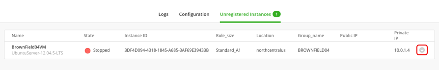

We strongly recommend synchronize your Azure provider before you try to register the virtual machine. This due to such instance may be registered by another user before you try to register it. This way you can avoid this kind of problems.

### Shutdown and Terminate Instances in Azure

#### Shutdown Instance

When a shutdown operation is executed from Cloud Application Manager, the virtual machine is stopped on Azure but not deallocated, in order to maintain the VM configuration and not loose the IP address. This means that the virtual machine will continue billed.

To deallocate a virtual machine stopped, you have to enter on Azure portal and click again on Stop.

#### Terminate Instance

When a terminate operation is executed from Cloud Application Manager, this operation execute the dispose scripts from your box instance and then deletes the virtual infrastructure. You can't revert the action and since you can lose data, be sure you want to perform this action in the first place.

### Contacting Cloud Application Manager Support

We’re sorry you’re having an issue in [Cloud Application Manager](https://www.ctl.io/cloud-application-manager/). Please review the [troubleshooting tips](../Troubleshooting/troubleshooting-tips.md), or contact [Cloud Application Manager support](mailto:incident@CenturyLink.com) with details and screenshots where possible.

For issues related to API calls, send the request body along with details related to the issue.

In the case of a box error, share the box in the workspace that your organization and Cloud Application Manager can access and attach the logs.

* Linux: SSH and locate the log at /var/log/elasticbox/elasticbox-agent.log
* Windows: RDP into the instance to locate the log at ProgramDataElasticBoxLogselasticbox-agent.log
