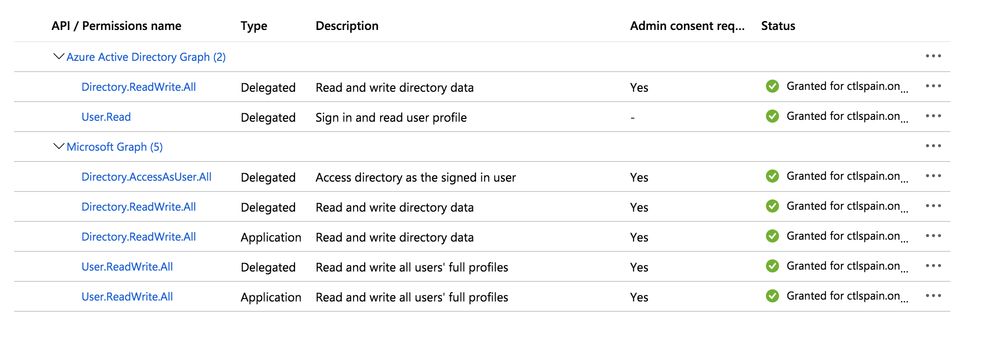

{{{
"title": "Using Microsoft Azure",
"date": "12-18-2019",
"author": "Guillermo Sanchez & Sergio Quintana",
"keywords": ["microsoft", "azure", "arm", "resource manager"],
"attachments": [],
"sticky": true,
"contentIsHTML": false
}}}

**In this article:**

* [Overview](#overview)
* [Audience](#audience)
* [Prerequisites](#prerequisites)
* [Connect your Microsoft Azure Account in Cloud Application Manager](#connect-your-microsoft-azure-account-in-cloud-application-manager)
* [Access to Microsoft Azure Services console with a Microsoft Azure subscription](#access-to-microsoft-azure-services-console-with-a-microsoft-azure-subscription)
* [Microsoft Azure Provider credentials](#microsoft-azure-provider-credentials)
* [Creating a new Microsoft Azure provider in Cloud Application Manager](#creating-a-new-microsoft-azure-provider-in-cloud-application-manager)
* [Enabling services](#enabling-services)
* [Deploying Instances in Azure](#deploying-instances-in-azure)
* [Registering Existing Instances from your Azure Account](#registering-existing-instances-from-your-azure-account)
* [Azure Native Resources](#azure-native-resources)
* [Shutdown and Terminate Instances in Azure](#shutdown-and-terminate-instances-in-azure)
* [Contacting Cloud Application Manager Support](#contacting-cloud-application-manager-support)

### Overview

There are two different flavors of Azure and Cloud Application Manager has providers for both.  
This document is in reference to **Microsoft Azure** or **Azure Resource Manager** deployment model.

**Name** | **URL of Portal** | **Name of Provider** | **KB article**
--- | --- | --- | ---
Classic Azure | <https://manage.windowsazure.com> | Classic Azure | [Using Classic Azure](using-azure.md) (1)
Microsoft Azure | <https://portal.azure.com> | Microsoft Azure  | This document

(1) Please note that Microsoft no longer recommends the usage of the Classic Azure deployment model, which has been superseded by the Resource Manager model. For more information see [this Microsoft article](https://docs.microsoft.com/en-us/azure/azure-resource-manager/resource-manager-deployment-model).

### Audience

All Cloud Application Manager users who want to deploy workloads into Microsoft Azure.

### Prerequisites

* Access to Cloud Application Manager [Management site](https://account.cam.ctl.io/#/providers?type=Microsoft-Azure).
* The user must have an existing Microsoft Azure account or should be an Administrator of the organization in Cloud Application Manager to [create](../Cloud Optimization/partner-cloud-integration-azure-new.md) or [bring](../Cloud Optimization/partner-cloud-integration-azure-existing.md) a Microsoft Azure account to be managed by CenturyLink.

### Connect your Microsoft Azure Account in Cloud Application Manager

Each of Cloud Application Manager's Microsoft Azure Providers gives you the option of setting it up either for an existing or a new Azure Customer Account. Existing accounts are your responsibility and will continue to be billed to you by Azure. New Accounts will automatically be generated on your behalf and the credentials pulled into the Provider via [Cloud Optimization](../Cloud Optimization/partner-cloud-integration.md), allowing you to hand off platform-level support and billing to CenturyLink.

If you want to learn how to use the New Account feature, please visit [Partner Cloud: Getting Started With a New Azure Customer](../Cloud Optimization/partner-cloud-integration-azure-new.md). The rest of this article assumes you will be using an existing, Azure Customer Account without any integration with CenturyLink.

#### Creating your own Azure Subscription

If you want to create your own Azure subscription, follow these steps:

1. Sign in to your [account](https://portal.azure.com/).

2. Open Subscriptions.

3. Click on **Add** subscription.
   

4. You can use the free trial version or select and purchase a payment plan.

   * **Note:** Cloud Application Manager is not responsible for any costs incurred through deploying to Azure. For more information, see [Azure pricing](https://azure.microsoft.com/en-us/pricing/calculator/?scenario=virtual-machines).

### Access to Microsoft Azure Services console with a Microsoft Azure subscription

Login to the [Microsoft Azure portal](https://portal.azure.com/) using your Microsoft Azure Account.

If you already have a Microsoft Azure Provider in your Cloud Application Manager, the CenturyLink support staff can access your subscription by clicking on the **Portal Access** button located in the Microsoft Azure Provider details page.  

**Note**: This button is only available when provider has been sychronized.

Then, if the user has permissions, a temporary credentials dialog will be displayed to allow the user to login in [Microsoft Azure portal](https://portal.azure.com/). Be sure to logout from previous session in this portal first. These temporary user credentials only lasts for one hour, then the user needs to run this process again.

#### Application ID (Client) and Directory ID (Tenant)

Once in Microsoft Azure Portal you can reach different sections using the upper search tool or navigating through menus.

1. Go to *Azure Active Directory* in the left menu, and then *Properties* in the Manage segment of the second menu pane.
2. Copy and take note of the Directory ID field for later. It is known as **Directory (tenant) ID**  
3. Next select *App registrations*, within the Azure Active Directory menu pane
4. Create a *New Application Registration* with the following values:
    * Name: **CenturyLink-CAM**
    * Supported account types: **My organization only**
    * Redirect URL: **web - `https://localhost/logon`**
5. Upon registering a line with this applicattion will be added to list. Click on it and see its details.
6. Copy and take note of **Application (Client) ID** that have been generated.

#### Roles and Permissions

1. For allowing the support personnel to access with a temporary user to your account in case they need to troubleshoot any support issue, you need to grant some permissions on the application you just created.  
To do so, on the details page fo the application you just created, click on API permissions > Add a permission

    

    In Microsoft APIs tab, in the Commonly used Microsoft APIs section, select the **Microsoft Graph**  

    

    Now choose the **Application permissions** type and select in the Directory segment:

       * Read and write directory Data      (Directory.ReadWrite.All)

    

    and the following **Delegated permissions** in the Directory and User segments respectively:

       * Read and write directory data             (Directory.ReadWrite.All)
       * Access directory as the signed in user    (Directory.AccessAsUser.All)
       * Read and write all users' full profiles   (User.ReadWrite.All)

    Finally, click **Add permissions** to apply them to your application.

    

#### PowerShell script for automatic deletion role

In order to allow automatic deletion, you must [add the Company Administrator Role to the App](https://docs.microsoft.com/en-us/powershell/module/msonline/add-msolrolemember?view=azureadps-1.0). To accomplish it, you must execute the next script from a [Windows PowerShell console](https://docs.microsoft.com/en-us/powershell/scripting/getting-started/starting-windows-powershell?view=powershell-6):

    $tenantGuid = 'YOUR-TENANT-ID'
    $user = 'YOUR_USER@YOUR-DOMAIN.onmicrosoft.com'
    $password = 'YOUR PASSWORD'
    $appID = 'YOUR-APP-ID'
    $Creds = New-Object System.Management.Automation.PsCredential($user, (ConvertTo-SecureString $password -AsPlainText -Force))
    Connect-MSOLSERVICE -Credential $Creds
    $msSP = Get-MsolServicePrincipal -AppPrincipalId $appID -TenantID $tenantGuid
    $objectId = $msSP.ObjectId
    Add-MsolRoleMember -RoleName "Company Administrator" -RoleMemberType ServicePrincipal -RoleMemberObjectId $objectId

#### Subscriptions

Navigate to *Subscriptions* panel. Use search tool and introduce "Subscriptions"

1. Select in the Subscriptions list the subscription item for your provider in Cloud Application Manager.
2. In the *Overview* tab, a **Subscription ID** is listed.  Copy and take note of this value for later.

    

3. Select *Access Control (IAM)* tab and then select the *Add* button at the top of screen.  
4. When creating the new role, do so with the following values:
    * Role: **Owner** (If you do not see the Owner role, you will need to talk to your administrator.)
    * Assign Access to: **Azure AD user, group or application**
    * Select: **CenturyLink-CAM**
5. Now select *Resource providers* tab (dowm in the Settings Tabs segment) in your subscription and **Register** the following providers:
    * *Microsoft.Compute*
    * *Microsoft.Network*
    * *Microsoft.Storage*

    For more information about Resource providers, please refer to [Microsoft Azure help](https://docs.microsoft.com/en-us/azure/azure-resource-manager/resource-manager-supported-services#portal)

#### Secret

Return to the *Azure Active Directory* panel, select *App Registrations* then *CenturyLink-CAM* and finally *Certificates & Secrets*.  

1. Add a new client secret
2. Set a Key with the following values:
    * Description: **CAM-App-Key**
    * Expires: **Never**
3. Upon saving a **Client secret** value will be generated. Copy and keep the key (aka the **Secret**) value as you won't see it anymore once you navigate away.

### Microsoft Azure Provider credentials

Input your Microsoft Azure Provider for an existing account as listed below:

* Subscription ID: **_Azure Subscription ID_**
* Application ID: **_Application (Client) ID_**
* Secret: **_Secret Key value_**
* Tenant: **_Active Directory (Tenant) ID_** or **_Domain_**

If you cannot find a specific template that you are looking for in Cloud Application Manager be sure to check out the [Azure github quickstart templates](https://github.com/Azure/azure-quickstart-templates).

### Creating a new Microsoft Azure provider in Cloud Application Manager

Registering Your Microsoft Azure Subscription (ARM) in Cloud Application Manager is performed with next steps:

1. In Cloud Application Manager, go to **Providers** > **New Provider** and select **Microsoft Azure**.

   

2. Fill the form with Subscription ID, Application ID, Secret and Tenant obtained in previous section and save.

   

Once pressed the save button our new provider starts to synchronize with our azure account from which you will get the following information:

* VM images of windows family operating systems.
* VM images of operating systems of Linux family.
* Region list which we can deploy the mentioned services as well as the templates of Microsoft Azure.
* List of deployed Virtual Machines that are currently not being managed from Cloud Application Manager.

During synchronization, we can get warnings about locations may be ignored because there are no associated virtual networks to them. This is because Cloud Application Manager does not create virtual networks but requires one in the deployment operation of one virtual machine.

The result of the synchronization process will be the creation of one ARM template box and two policy boxes (Windows and RHEL respectively) in case of exist a virtual network in our account.

Samples and management appliance deployment policy could be installed too.

### Enabling services

*Services* tab is the right place where services such as [Managed Services Anywhere](../Managed Services/getting-started-with-cam-enable-managed-provider.md), [Automatic Discovery of Resources](../Getting Started/register-existing-instance.md#discovering-the-unregistered-instances) and [Analytics](../analytics/cloudapplicationmanageranalyticsui.md) can be enabled or disabled attending to your needs. Note that the number of active services will be shown next to the tab's name.

### Deploying Instances in Azure

You can deploy to the following services in Azure:

* Windows based virtual machines
* Linux based virtual machines
* Microsoft Azure templates

#### Azure OS Images Available to Deploy in Cloud Application Manager

As part of the result of synchronization process you can find a list of available operative systems that you can use in your policy boxes. You can check this list in **Providers** page > **Configuration**.

This images are what we show in image list from policy box edition.

In addition, if you don't find the right image in that list, you could add a new image from the Azure Marketplace clicking in the "New" button at the top right corner and defining the following image properties:

| Option | Description |
|--------|-------------|
| Publisher | The organization that created the image. |
| Offer | A group of related images created by a publisher. |
| SKU | An instance of an offer, such as a major release of a distribution. |
| Image Description | Name of the new image. If blank, a default value is set. |

On the other hand, you could remove it from available images using the "Trash" icon.

Some publishers require that you accept their own terms and conditions before you deploy their images from Azure Marletplace. These terms may be accepted directly on the Azure portal after a first deployment, so they will appear as already approved if the image is added to CAM after that. The terms apply whether you deploy the image as an individual CAM instance or though an [ARM template](#microsoft-azure-arm-template-deployment-options).

Images with required, not yet accepted legal terms will have an icon and the text *not accepted* next to their description.

To accept the legal terms, click on the icon and review the terms on the dialog (you may need to download a file containing the terms). If you decide to accept the terms, click on the checkbox, then click **Accept**.

Once the legal terms are accepted, a green check will appear next to the image description.

Removing these images does not revert the agreement. If they are later re-added to CAM, they will show the status of the agreement at that point.

#### Microsoft Azure Compute Deployment Options

To deploy a virtual machine with compute services you can edit one of windows or RHEL policy boxes or create a new one. Then you can save your changes and click **Deploy**.

If you can't create any policy box on Windows Azure provider probably you have to create a virtual network from Azure portal or you may deploy a new one with a template as we describe in following section. If you choose to use a [new Azure provider optimized by CenturyLink](../Cloud Optimization/partner-cloud-integration-azure-new.md) we will create a default network for you.

#### Resources

| Option | Description |
|--------|-------------|
| Location | Select the region where you want to deploy the virtual machine. Each location has available its own images, networks and sizes so is the first parameter you have to choose. Only locations with networks available are shown. |
| OS Image | Select the guest OS to run in the worker role instance. Note that Windows 2008 images are not synced at this time because the Cloud Application Manager agent doesn’t work on them. |
| Size | Select a size to set the number of CPU cores, memory, and disk size to store your OS files, process temporary memory, and store application data. For more information, see the [Azure help](https://docs.microsoft.com/en-us/azure/cloud-services/cloud-services-sizes-specs). Note that D-Series sizes use solid-state drive disks. |
| Username | Specify a username to be able to RDP or SSH into the instance directly. |
| Password | Specify a password to be able to RDP or SSH into the instance directly. |
| SSH Certificate | Only in Linux machines you can specify a certificate to access via ssh. |
| Instances | Specify the number of instances to spawn. If you increase it to a value higher than 1, a **High Availability** toggle will appear below that you can enable to use Azure availability sets for high availability support. |
| ScaleSet  | Specify if the instance/s should be created into a ScaleSet resource. When switched on, it will enable auto-scaling and load-balancer sections (see below). It will also create a managed Availability Set.  |
| Delegate Management  | Delegate management to CenturyLink.  |

When you increase the number of instances, and if you have not enable Scale Set, the High Availability toggle appears:

For more information, see the [Azure help](https://docs.microsoft.com/en-us/azure/virtual-machines/windows/tutorial-availability-sets#availability-set-overview)

#### Network

| Option | Description |
|--------|-------------|
| Virtual Network | Choose the network to deploy to among the list of available networks. |
| Subnet | This subnet is the resource related to  the virtual machine's network interface. Actually a virtual network is not used at deployment time. |
|Security Group | Filter incoming and outgoing traffic for the virtual machine based on a set of rules. Multiple security groups in a zone can be selected for a virtual machine.  For more information, see [Security Groups](https://docs.microsoft.com/en-us/azure/virtual-network/security-overview).  This option will not appear if you choose to use a **ScaleSet** feature above, but all restrictions associated with the network and subnet above will be applied.|
|Public IP Address | The public IP Address exposes our server to the public internet where other applications can access it. If loadbalancing is configured, a public IP will be automatically associated with it, so this option will be hidden because there is no need to associate public IPs directly with the instances. |

#### Proxy

| Option | Description |
|-------------------|-------------|
| Host | The hostname or domain of the proxy that the agent will use to connect back to Cloud Application Manager, once it has been installed in the deployed instance. |
| Port |  The port of the proxy that the agent will use to connect back to Cloud Application Manager, once it has been installed in the deployed instance. |

#### Disks

| Option | Description |
|--------|-------------|
| Storage Account | Select the Storage Account to use among the existing ones or Automatic (it will create a new one)|
| Local Disk | When **Managed** toggle is ON it will use managed disks |
| Data Disk | Storage size for data volume in addition to the Local Disk. This option will not appear if you choose to use a **ScaleSet** feature above.|

#### Autoscaling

Once you have enabled the ScaleSet switch, you can switch on Autoscaling feature, in which you can also configure the following options:

| Option | Description |
|--------|-------------|
| Min. Instances | Minimum number of instances |
| Max. Instances | Maximum number of instances |
| Scale Out CPU Threshold | CPU threshold to fire a scale out event |
| Increased by | Number of instances to add when a scale out event occurs |
| Scale In CPU Threshold | CPU threshold to fire a scale in event |
| Decreased by | Number of instances to remove when a scale in event occurs |

The number of instances launched by the autoscaling feature is limited to the maximum number specified under Instances.

#### LoadBalancer

Once you have enabled the ScaleSet switch, you can switch on Loadbalancer feature, in which you can also configure the following options:

| Option | Description |
|--------|-------------|
| New Load Balancer | Create a new load balancer resource |
| Use App Gateway | Use an existing Application Gateway. It must be available in a subnet other than the instance |
| Protocol | TCP or UDP |
| Port | Load balancer port |
| Instance Port | Instance port to redirect to |

When we add a port to the load balancer, apart from the load balancing rule that will be created, it will also configure the necessary probes and NAT rules to be able to access the backend instanctes through the load balancer.

Setting up all these configuration we would deploy a set of instances with their corresponding availability set, autoscaling rules, load balancing, public IP, jump server and healthchecks with just a single click.

#### Microsoft Azure ARM Template Deployment Options

Azure ARM Templates are supported on Cloud Application Manager with Microsoft Azure provider. You can deploy whatever you want with the same syntax you use on Azure APIs and portal. For this purpose you can create a custom deployment policy and deploy it with an ARM Template box together.

#### Steps

1. Create Deployment Policy:
   * Go to **Boxes** > **New** > **Deployment Policy**.
   
   * **Select Microsoft Azure** on the menu.
   
   * Select provider, name and description fields.
   
   * Click **Save**.

2. Edit Deployment Policy.
   * Go to **Template** > **Code** and press **Edit**.
   * Put your own template and click **Save**.

3. Deploy Template.
   
   * From Template click **Deploy**.
   * **Select** one ARM Template Box.
   * Choose a name and description for the new instance.
   * Press **Deploy**.

### Registering Existing Instances from your Azure Account

You can import existing Virtual Machines into you workspace only in one click. The list of available instances you can import come with your Microsoft Azure provider synchronization.

#### Available Instances

As part of the result of synchronization process you can find a list of available virtual machines or scalesets that already exist in your account but not used yet in Cloud Application Manager. You can import an existing one clicking **Import** button.

You should first synchronize your Azure provider before trying to register the virtual machine in order to get the current available instances that can be registered along with their statuses.

### Azure Native Resources

After the synchronization process, you will also find in the Instances page a list of Azure resources that already exist in your account. You can also register virtual machine type instances from here.

These resources can be filtered by the following types and subtypes:

* **Compute**
  * ScaleSet
  * Virtual machine
* **Network**
  * Load balancer
  * Security groups
  * Network interface
  * Virtual networks
  * IP address
  * VPN
  * Application gateway
  * Local gateway
  * Express gateway
* **Storage**
  * File
  * BLOB
  * Table
  * Queue
* **Database**
  * Sql Server
  * Managed Sql Server
  * MySQL
  * PostgreSQL
  * CosmosDB

### Shutdown and Terminate Instances in Azure

#### Shutdown Instance

When a shutdown operation is executed from Cloud Application Manager, the virtual machine is stopped on Azure but not deallocated, in order to maintain the VM configuration and not loose the IP address. This means that the virtual machine will continue billed.

To deallocate a virtual machine stopped, you have to enter on Azure portal and click again on Stop.

#### Terminate Instance

When a terminate operation is executed from Cloud Application Manager, this operation execute the dispose scripts from your box instance and then deletes the virtual infrastructure. You can't revert the action and since you can lose data, be sure you want to perform this action in the first place.

### Contacting Cloud Application Manager Support

We’re sorry you’re having an issue in [Cloud Application Manager](https://www.ctl.io/cloud-application-manager/). Please review the [troubleshooting tips](../Troubleshooting/troubleshooting-tips.md), or contact [Cloud Application Manager support](mailto:incident@CenturyLink.com) with details and screenshots where possible.

For issues related to API calls, send the request body along with details related to the issue.

In the case of a box error, share the box in the workspace that your organization and Cloud Application Manager can access and attach the logs.

* Linux: SSH and locate the log at /var/log/elasticbox/elasticbox-agent.log
* Windows: RDP into the instance to locate the log at /ProgramData/ElasticBox/Logs/elasticbox-agent.log
