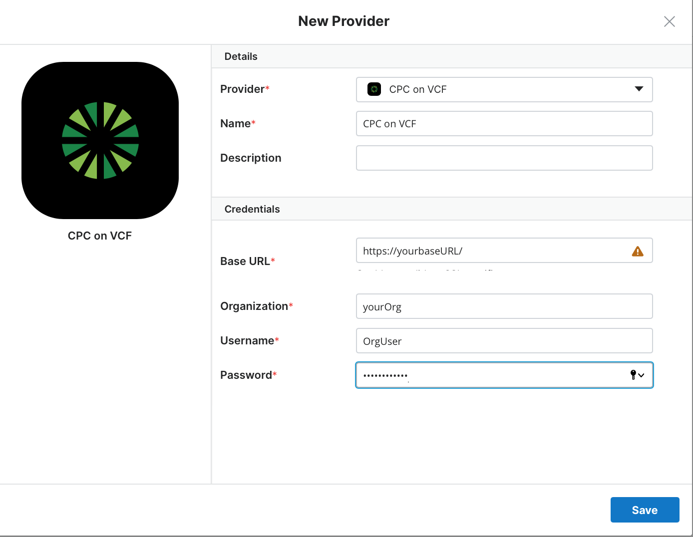
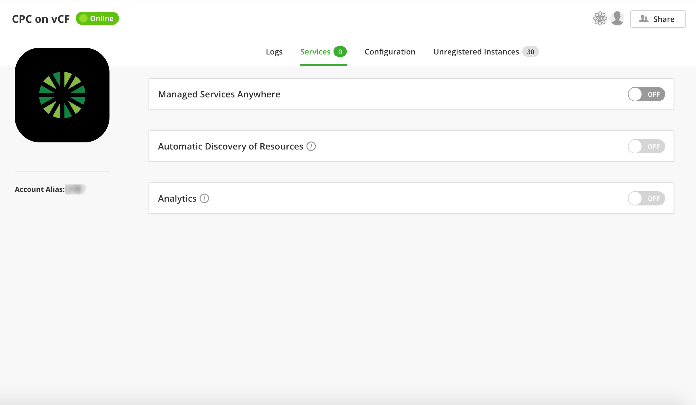
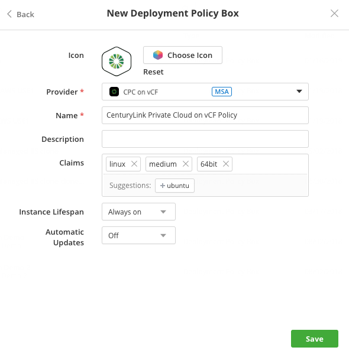
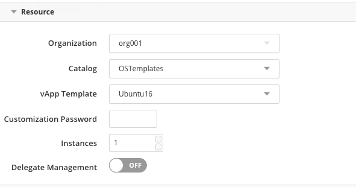
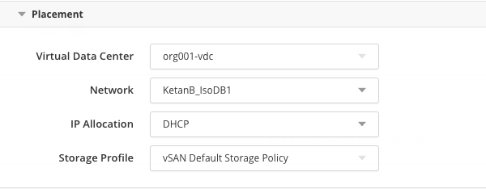
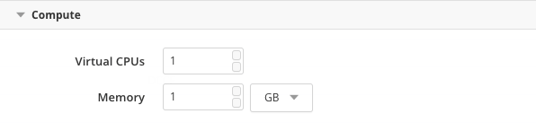
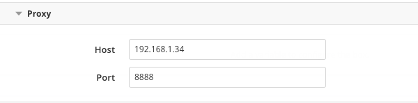
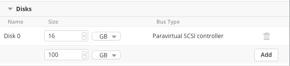

{{{
"title": "Using CenturyLink Private Cloud on VMware Cloud Foundation",
"date": "04-02-2019",
"author": "Julio Castanar & Sergio Quintana",
"keywords": ["cam","centurylink private cloud", "cpc on vcf", "vmware cloud foundation", "deploy", "provider"],
"attachments": [],
"sticky": true,
"contentIsHTML": false
}}}

**In this article:**

* [Overview](#overview)
* [Audience](#audience)
* [Prerequisites](#prerequisites)
* [Register CenturyLink Private Cloud on VMware Cloud Foundation as Provider](#register-centurylink-private-cloud-on-vmware-cloud-foundation-as-provider)
* [Enabling services](#enabling-services)
* [Deploy to CenturyLink Private Cloud from Cloud Application Manager](#deploy-to-centurylink-private-cloud-from-cloud-application-manager)
* [Naming vCloud resources](#naming-vcloud-resources)
* [Contacting Cloud Application Manager Support](#contacting-cloud-application-manager-support)

### Overview

This article is meant to assist users of Cloud Application Manager to learn how to deploy CenturyLink Private Cloud on VMware Cloud Foundation Provider.

### Audience

All Cloud Application Manager users who wants to deploy workloads into CenturyLink Private Cloud on VMware Cloud Foundation Provider.

### Prerequisites

* You must have a Cloud Application Manager Account
* Your base URL, and user credentials for CenturyLink Private Cloud on VMware Cloud Foundation
* [Install VMware tools](https://pubs.vmware.com/vcd-51/index.jsp?topic=%2Fcom.vmware.vcloud.users.doc_51%2FGUID-9BB72070-65E9-4458-84C3-05D8247C7343.html) on vApp templates in the catalog. This doesn’t apply to public vApp templates, which already have them.

### Register CenturyLink Private Cloud on VMware Cloud Foundation as Provider

To enable a Cloud Application Manager Provider for CenturyLink Private Cloud on VMware Cloud Foundation™ see the example [Configure a Provider for Cloud Application Manager](../../CenturyLink Private Cloud on VMware Cloud Foundation/General/cam-provider.md).



### Enabling services

*Services* tab is the right place where services such as [Managed Services Anywhere](../Managed Services/getting-started-with-cam-enable-managed-provider.md), [Automatic Discovery of Resources](../Getting Started/register-existing-instance.md#discovering-the-unregistered-instances) and [Analytics](../analytics/cloudapplicationmanageranalyticsui.md) can be enabled or disabled attending to your needs. Note that the number of active services will be shown next to the tab's name.



### Deploy to CenturyLink Private Cloud from Cloud Application Manager

Create a [deployment policy](../Automating Deployments/deploymentpolicy-box.md) to encapsulate parameters required to deploy Linux or Windows vApps through the CenturyLink Private Cloud on VMware Cloud Foundation provider



At deploy time, Cloud Application Manager auto provisions vApps, one template per VM, and orchestrates workload automation on them.

**Note:** Auto provisioning may fail if you specify virtual CPUs, memory, and virtual disk capacity that exceeds the limit in your virtual data center.

Edit the deployment policy to set the following parameters for deploying to vCloud Foundation.

#### Resource



| Option | Description |
|--------|-------------|
| Organization | Select the organization in CenturyLink Private Cloud. The organization is a virtual container for vApp templates, vApps, media images, and disks. |
| Catalog | Select the catalog that contains the vApp template for deployment. The catalog stores vApp templates and media files. Select from shared, private, and public catalogs that your organization can access. |
| vApp Template | Select a vApp template from the catalog. VMs imported as OVFs then uploaded as templates are also listed. |
| Customization Password | Optionally, provide a custom VM administrator password. If you leave this empty, the default administrator password from the template applies.|
| Instances | Specify the number of instances to spawn from the same template. |

#### Placement



| Option | Description |
|--------|-------------|
| Virtual Data Center | Select the virtual data center from vCloud Foundation. |
| Network | Select the network for the virtual data center. |
| IP Allocation | Assign IP addresses to the VM from the network attached to the virtual data center.<li>**DHCP.** Select this option to get an IP address dynamically where the network gateway acts as a DHCP router.</li><li>**Static IP Pool.** Select this option to get an IP address from a range of IP addresses configured for the network.</li><li>**Static Manual.** If you select this option, Cloud Application Manager finds the next available IP address from the virtual data center network and requests vCloud Foundation to assign it to the VM.</li> |
| Storage Profile | Choose a [storage option](https://docs.vmware.com/en/VMware-Cloud-Foundation/3.5/com.vmware.vcf.ovdeploy.doc_35/GUID-E6C1B2F8-F6CB-4017-A4D1-53103FF9AB84.html) for vCloud Foundation.<li>**Standard.** Persistent block storage for occasional or event driven data access.</li><li>**SSD-Accelerated.** Higher performance block storage.</li> |

#### Compute



| Option | Description |
|--------|-------------|
| Virtual CPUs | Specify the number of CPUs. |
| Memory | Specify the virtual RAM in GB. |

See the [VMware Cloud Foundation](https://docs.vmware.com/en/VMware-Cloud-Foundation/3.5/com.vmware.vcf.ovdeploy.doc_35/GUID-F2DCF1B2-4EF6-444E-80BA-8F529A6D0725.html) documentation.

#### Proxy



| Option | Description |
|-------------------|-------------|
| Host | The hostname or domain of the proxy that the agent will use to connect back to Cloud Application Manager, once it has been installed in the deployed instance. |
| Port |  The port of the proxy that the agent will use to connect back to Cloud Application Manager, once it has been installed in the deployed instance. |

#### Disks



| Option | Description |
|--------|-------------|
| Disk | Specify the storage capacity in GB. Adding disk storage capacity is supported. |

See the [VMware Cloud Foundation](https://docs.vmware.com/en/VMware-Cloud-Foundation/3.5/com.vmware.vcf.ovdeploy.doc_35/GUID-F2DCF1B2-4EF6-444E-80BA-8F529A6D0725.html) documentation.

### Naming vCloud resources

When creating an instance, an automatic name is generated and used for VApps, VMs and Hostname, all with the same generated name. This way you can identify unregistered instances.

The generated name has a maximum length of 15 characters (max allowed in windows hostnames), and it's composed by these values:

```
InstanceName-ServiceId-InstanceNumber
```

In the Policy Box it is possible to specify more than one machine to be deployed, so the instanceNumber is added as a suffix in the name. An example is “jdedepl-i8oq0-1”.  

Once deployed, **modifying the vApp name is not supported**, because it could affect the instance operations through Cloud Application Manager. However, it's possible to change this name manually on VMs and Hostnames.  

In case you want to rename a VM/Hostname, you need to perform the following steps:

* From Cloud Application Manager launch a ShutDown operation and wait it to finish.  
* From vCloud Console, go to the VM Properties and change the VM name and/or Hostname.  
* From Cloud Application Manager launch a PowerOn operation and wait it to finish.  

### Contacting Cloud Application Manager Support

We’re sorry you’re having an issue in [Cloud Application Manager](https://www.ctl.io/cloud-application-manager/). Please review the [troubleshooting tips](../Troubleshooting/troubleshooting-tips.md), or contact [Cloud Application Manager support](mailto:incident@CenturyLink.com) with details and screenshots where possible.

For issues related to API calls, send the request body along with details related to the issue.

In the case of a box error, share the box in the workspace that your organization and Cloud Application Manager can access and attach the logs.

* Linux: SSH and locate the log at /var/log/elasticbox/elasticbox-agent.log
* Windows: RDP into the instance to locate the log at \ProgramData\ElasticBox\Logs\elasticbox-agent.log
