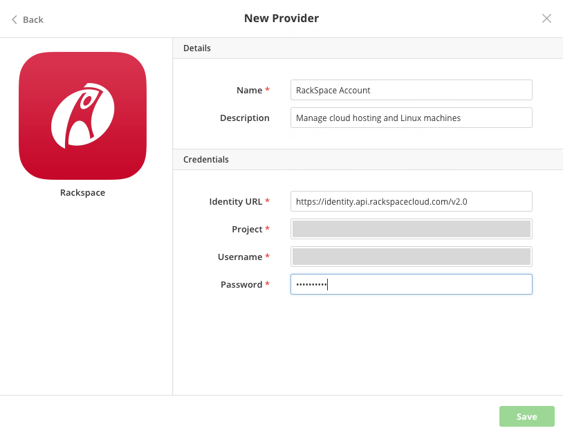

{{{
"title": "Using Rackspace Cloud",
"date": "09-01-2016",
"author": "",
"attachments": [],
"contentIsHTML": false
}}}

### Using Rackspace

If you deploy workloads to [Rackspace Cloud](https://mycloud.rackspace.com/), avoid configuring servers manually and get them running exactly the way you want consistently each time using Cloud Application Manager. You can automatically provision or de-provision and run a sequence of commands and workflows to manage modules and applications remotely from Cloud Application Manager. For more information, learn how [Cloud Application Manager can solve your DevOps use cases](//www.ctl.io/cloud-application-manager/).

In Rackspace Cloud, we manage your workloads on Linux servers, and provision and orchestrate deployments through the open source OpenStack Nova Python client.

**In this article:**
* Register Rackspace Cloud in Cloud Application Manager
* Deploy on Rackspace Cloud from Cloud Application Manager

### Register Rackspace Cloud in Cloud Application Manager

You require an account on [Rackspace Cloud](https://mycloud.rackspace.com/) to allow Cloud Application Manager to execute commands and provision servers on your behalf with your credentials. We send the credentials to the Rackspace Cloud Identity Service to authenticate.

**Steps**
1. In Cloud Application Manager, on the Providers page, click **New Provider**.

2. Select **Rackspace** and enter the credentials as shown.

   

   * **Identity URL** - This the endpoint of the Rackspace Cloud Identity API, which authenticates access and is also the entry point to any other service API.
   * **Project** - Enter the tenant ID available at the top of the username drop-down in the [Rackspace Cloud console](https://mycloud.rackspace.com/).
   * **Username** - Enter the username for a user that has full access to your Rackspace Cloud account. We need it to make API requests as this user.
   * **Password** - Enter the password for the user.

### Deploy on Rackspace Cloud from Cloud Application Manager

Select these deployment options when you [launch a new instance](deploying-managing-instances.md) to spin up a workload on a Linux server in Rackspace Cloud.

**Deployment**

| Option | Description |
|--------|-------------|
| Provider | Select a Rackspace Cloud account registered in Cloud Application Manager. |

**Resource**

| Option | Description |
|--------|-------------|
| Location | Choose a region from the drop-down to place the instance: DFW (Dallas/Fort Worth), IAD (Northern Virginia), SYD (Sydney), or Hong Kong (HKG). |
| Image | Select a desired Linux image to use as the OS on the virtual machine. |
| Flavor | Select the amount of RAM, CPU, and local disk storage. |
| Keypairs | Select an SSH public key you previously uploaded for the selected region in your Rackspace Cloud console. It allows SSH access to the virtual machine. |
|Instances | Specify the number of instances to provision.|

**Network**

| Option | Description |
|--------|-------------|
| Floating IP Pool | Select a pool of floating IP addresses to allow public traffic to your instance, if you added it to your Rackspace Cloud account. |

### Contacting Cloud Application Manager Support

We’re sorry you’re having an issue in [Cloud Application Manager](https://www.ctl.io/cloud-application-manager/). Please review the [troubleshooting tips](../Troubleshooting/troubleshooting-tips.md), or contact [Cloud Application Manager support](mailto:incident@CenturyLink.com) with details and screenshots where possible.

For issues related to API calls, send the request body along with details related to the issue.

In the case of a box error, share the box in the workspace that your organization and Cloud Application Manager can access and attach the logs.
* Linux: SSH and locate the log at /var/log/elasticbox/elasticbox-agent.log
* Windows: RDP into the instance to locate the log at ProgramDataElasticBoxLogselasticbox-agent.log
